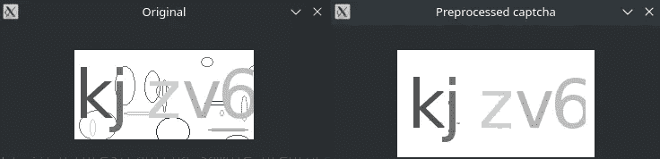
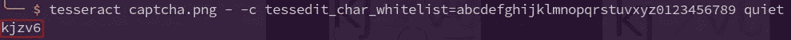
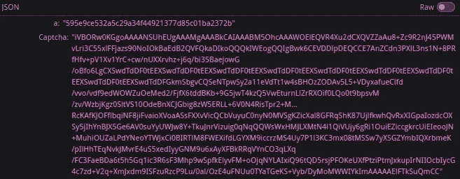
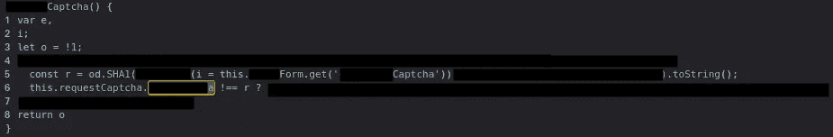

# 如何不在你的网站上添加验证码

> 原文：<https://blog.devgenius.io/how-not-to-add-captcha-to-your-website-b7a358855b3a?source=collection_archive---------16----------------------->

有一次，我不得不通过互联网做一些官僚程序，由于网页很糟糕，我求助于自动化，所以我必须找到一种绕过验证码的方法，在这样做的同时，我发现了几件事，我将在这篇文章中与你分享。

下面的建议看起来很明显，但是如果我没有在一个“企业”应用程序中遇到这些错误，我不会写这篇文章。所以我想这些建议可能最终会对某人有所帮助。

尽管如此，请继续阅读，因为你可能会发现这个帖子很有趣，因为它讨论了计算机视觉、逆向工程、用 Java 处理大文件以及其他主题。

# 不要使用类似于 v1 的验证码

正如你从下面的图片中看到的，我想绕过的验证码非常普通和简单。

要绕过的验证码示例

因此，我首先想到的是使用计算机视觉。然而，事实证明绕过验证码要容易得多，我们将在下一节讨论这一点。现在，让我向你展示计算机视觉是如何帮助我们的。

我首先想到的是:假设字母的厚度为 3，而噪声(随机椭圆)的厚度为 1。因此，如果你移除所有厚度为 1 的图形，你就移除了杂色。

我认为没有 OpenCV 操作符可以做到这一点。然而，我们可以以不同的方式来考虑它:从图像中的每个几何图形的厚度中减去 1，将得到厚度为 2 的字母和厚度为 0 的噪声。因此，本质上，我们有效地消除了噪声。

这个操作确实存在于 OpenCV 中，它被称为[侵蚀](https://docs.opencv.org/3.0-beta/doc/py_tutorials/py_imgproc/py_morphological_ops/py_morphological_ops.html#erosion)。使用它来消除噪声非常简单:

([开口](https://docs.opencv.org/3.0-beta/doc/py_tutorials/py_imgproc/py_morphological_ops/py_morphological_ops.html#opening)是先用侵蚀再用扩张的操作。我们可以只使用腐蚀操作符，但这会导致字母的厚度为 2。膨胀算子使它们的厚度再次为 3)

当使用示例 captcha 作为输入运行脚本时，我们得到以下输出。

原始和预处理的验证码比较

正如你所看到的，图像现在清晰多了，我们可以使用光学字符识别，如[宇宙魔方](https://github.com/tesseract-ocr/tesseract)来提取字符。

不错！我们刚刚发现了一种利用计算机视觉绕过这个简单验证码的方法😝。我们可以从中吸取以下教训:

不要使用类似验证码 v1 的。谷歌关闭这个版本是有原因的。

现在我们将看到实际上没有必要使用计算机视觉。

# 在后端验证验证码响应

为了绕过验证码，我需要知道它的来源。所以，我在 DevTools 中打开了 Network 选项卡，发现了服务器的如下响应。

属性`Captcha`包含 base64 编码的 captcha 图像，属性`a`包含一个十六进制字符串，其用途目前未知。

与此同时，我发现了一个不寻常的行为:验证码输入是反应性的，如果验证码是错误的，它会立即向您显示一条消息。我以为在任何输入更改后都会发送验证验证码的请求，但是当我再次查看 DevTools 中的 Network 选项卡时，我注意到没有新的请求。

这让我认为验证码在我这边是有效的，并且`a`属性与此有关。因此，我查看了源代码(在 Debugger 选项卡的 DevTools 中)并搜索了`a`属性。这是我发现的。

如您所见，在第 5 行获得了来自用户的验证码响应的 SHA1 散列，在第 6 行将它与来自响应的`a`属性进行比较。因此，`a`属性实际上是正确的验证码响应的 SHA1 散列。

因为 SHA1 是一个单向散列，很难还原它以获得正确的验证码响应，所以除了进行暴力攻击，我们别无选择。本质上很简单，我们只需要尝试所有可能的组合。

为了获得所有可能的组合，我们需要知道验证码由 5 个小写字母数字英文字符(总共 36 个字符)组成，并且允许重复(我在看到多个验证码后发现了这些约束)。因此，可能性的总数是 60，466，176 (36⁵)

这看起来有很多可能性，你可能认为尝试每一种可能性几乎是不可能的。但是实际上这样做很简单，不需要花太多时间，正如你将要看到的。

## 暴力攻击

以下代码生成所有可能的 captcha 值，并执行暴力攻击。由于使用了库，代码非常简单。尽管如此，我还是添加了一些 Javadoc 以方便阅读。

方法`generate(Writer)`和`read(Reader): Iterator<Attempt>`只是为了方便**给我**。在我的例子中，从一个大小约为 2.7GB 的文件中读取所有 60，466，176 个哈希和验证码比动态生成它们更方便。

当然，通过流读取 2.7 GB 的文件比读取整个文件并将其保存在列表中要高效得多(这样做可能会抛出 OutOfMemoryError)。

注意一些重要的事情:尽管这是一种暴力攻击，即使应用程序有某种**速率限制，它也是无用的**(分别检查第 60 行和第 52 行`CaptchaCracker`和`ExamplePage`)。如果验证是在后端完成的，这就不是真的。

因此，这里学到的教训是**不在前端验证验证码响应，而是在后端**，如果你这样做，**添加速率限制**以防止暴力攻击。或者干脆用谷歌的 reCAPTCHA 之类的第三方。

# 结论

我认为我在这里给出的建议是显而易见的，没有什么特别的，但是如前所述，如果我没有在一个“企业”应用程序中遇到这些失败，我不会写这篇文章。

最后，我想补充一个奇怪而讽刺的事实:负责这个应用程序的企业只雇佣有资格的专业人员。

也就是说，我除了感谢你阅读这篇文章之外别无选择，一如既往，如果你认为有什么地方错了或者有什么地方可以改进，请告诉我。我喜欢你的反馈。

# 附录 A:用 Selenium 拦截验证码请求响应

该网页的工作方式如下:

1.  用户被要求在表格中输入一些数据
2.  当所有的必填字段都被填充后，一个请求被发送到后端以获取验证码图片和 SHA1 散列(我们在上一节看到的响应)
3.  在成功解决验证码之前，您无法进入下一页

如您所见，captcha 图像和 hash 并不是从一开始就加载的，所以我们需要拦截异步请求的响应。为此，我使用了以下代码。

代码几乎是不言自明的，但它可能有助于澄清在第 45 行，执行将暂停，直到对象在第 80 行排队(这在从服务器收到响应后异步发生)。

我知道这与如何不在网站上添加验证码的建议几乎没有任何关系，但我想把它包括进来，因为它可能会帮助某人，或者可能只是我未来的自己。