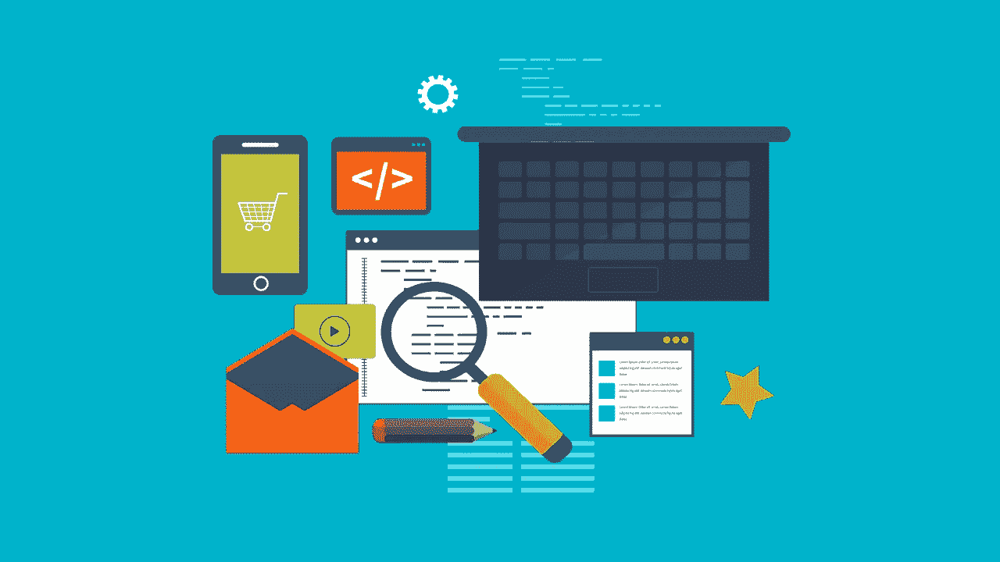

# 如何不学编程

> 原文：<https://blog.devgenius.io/how-not-to-learn-programming-5a9f19515217?source=collection_archive---------9----------------------->

***要避免一套错误，才能让学习有效率。***

自学编程的时候可能会比较难。尤其是当你没有一个可以帮助你的人的时候。在这里，我们将讨论如何在自学的滑坡中导航。

## 1-找到你学习编程的理由

大多数人会说，我们从 python 开始学编程的逻辑吧。主要逻辑将包括:让我们学习如何编程，以便我们可以更深入。如果没有，我们只是学习编程和编程的逻辑。不管怎样，这个逻辑被大多数人使用，它也引起混乱。为了解决这个问题，你必须找到你开始编程的理由，并尽可能深入到最深处。

## 2-学习算法而不是代码本身

但是千万别忘了代码其实是可以给出算法的。尤其是算法可以通过函数来工作。这就是 python 的劣势所在:python 的设计允许很多人方便地学习编程语言，但不是代码。相反，你必须同时学习算法的编程语言将帮助你过渡到其他编程语言。

## 3-深入下去，直到你达到目标

在你决定了为什么要学编程之后，你就要尽可能的往最深处走，去完成你的目标。完成你的目标后，你必须在你的领域设定新的目标，这样你才不会真正落后。因此，这意味着需要学习新的编程语言、框架和更多的依赖项。或者，你可以去另一个对编程有特殊需求领域。

## 不要忘记伟大的程序员也是伟大的数学家和经济学家

你可能听说程序员创造了伟大的东西。但是，他们主要是为其他人创造这些东西。然而，如果你打算通过编程建立一个企业或平台，你的编程知识是不够的。相反，从长远来看，需要强大的数学和经济学知识来建立和维护一个生态系统。因此，你必须仔细设计网络，使你的系统能够自我维持。

## 5-一旦掌握了基础知识，就开始构建应用程序

***这是大多数程序员犯的最大错误之一*** 。我犯了很多同样的错误。大多数人更喜欢学习子主题并在以后构建应用程序。但在大多数情况下，这是行不通的，因为他们没有足够的经验开始。相反，一旦掌握了基础知识，您就可以构建应用程序。但是科学计算中的编程是有区别的，因为这些概念都要从头学起。

*根据你的说法，你会如何学习编程？请在下面的评论区分享你的经历。*