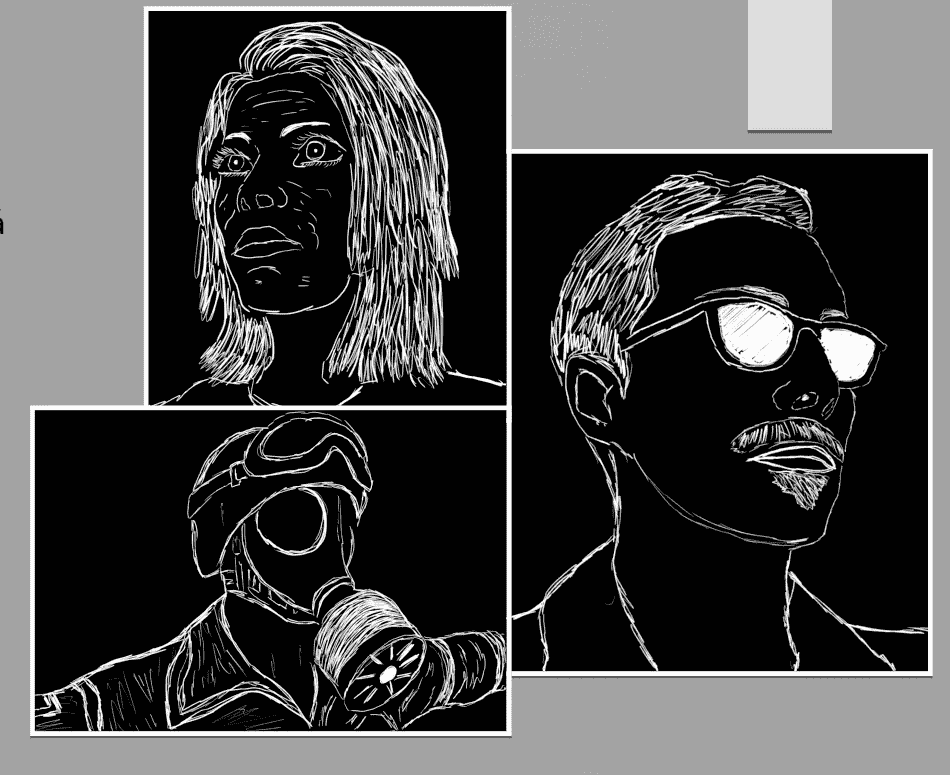

# 如何(不)制作游戏

> 原文：<https://blog.devgenius.io/how-not-to-make-a-game-bc66422cc89f?source=collection_archive---------24----------------------->

这是一个关于我和我朋友的案例研究，我们是如何制作了一个带有音效的 3D 故事游戏并成为高中传奇的。

帕沃尔

在高中的最后一年，每个人都必须做一个自己的期末项目，在这个项目中，他会用到他在高中学到的东西。因为我们是好朋友，我们想一起去国外学习，我们决定一起做我们的毕业设计。我们问我们最喜欢的老师，她是否愿意做我们这个项目的导师，她同意了。

酷，现在当我们知道谁将参与一个项目时，我们也需要知道我们正在构建什么，以及我们将如何完成它。

这个故事的主要支柱是我的朋友做的。他基本上带了一个笔记本到学校，在那里他写下了所有的水平和他们将会是什么。我们决定使用虚幻引擎 4，因为大多数专业游戏都使用这个引擎。此外，UE4 支持用蓝图编程(用块编程——相对于 C++或 C#，它们对初学者来说更容易)。

我们分工合作。他的职责是制作图形、关卡设计和故事的核心。我的工作是让关卡发挥作用，让演员们相互交流，创造对话，并添加音效。

字符设计

游戏由**亚历克斯**(主角)**快乐****焦虑****恐惧****恐惧的仆人**组成。用 Blender 制作角色模型，然后在 UE4 中制作动画。我们的朋友扮演演员的角色。我们使用旧的麦克风和 Audacity 来记录他们的声音，这样我们就可以在游戏中使用他们。

亚历克斯设计公司

幸福设计

恐惧的仆人

第一层

这座城市

为了创建关卡，我们使用了在网上找到或从 UE4 市场获得的免费资源。这个游戏有四个不同的关卡，设计它们花费了我们大约 650-700 个小时的工作。

当他创建关卡的时候，我的职责是确保玩家不会做那些会破坏游戏的蠢事。例如，踩在会引发一场不该发生的对话的触发器上。我用的是阻挡卷，基本上是玩家无法通过的透明块。我会把它放在重要的触发器之前，确保玩家不会踩到它们。

我创建了一个字幕函数，它采用文本和布尔值作为参数，判断句子是由主角说的还是由另一个演员说的。

对于声音效果，我使用了声音提示编辑器——我添加了亚历克斯脚步的声音，恐惧的仆人的咆哮，狼的咆哮，等等。然后我在关卡的背景中加入了音乐。

声音提示编辑器

为了开发人工智能，UE4 有一个叫做行为树的编辑器。我为我所有的人工智能角色使用了 2-3 个基础树，只有很小的不同。举例来说，恐惧的仆人跟随定义的点，他们以可预测的方式移动。另一方面，狼角色的 AI 正在随机选取这些点。

行为树

人工智能

所有的程序都是根据蓝图完成的。我想分享我在游戏开发过程中学到的几点:

*   小心使用你的滴答功能——它会大大降低游戏的性能
*   你必须给玩家一些他应该做什么的提示——使用小工具，箭头，通过故事和对话来显示方向
*   如果你正在制作一个 3D 游戏，当你点击鼠标的时候，你的鼠标应该做一些事情(攻击，互动，跳跃…等等)——如果它只是用来旋转一个角色，玩家会觉得少了一些东西
*   你可以免费制作一个非常好看的游戏，只需要两个人就可以完成
*   如果你和多人一起工作，你应该使用某种源代码控制——通过 USB 共享文件是没有效率的
*   你不能修复所有的错误，只修复最大的错误，尽量减少小错误
*   自学某种技术的最好方法是选择一个项目，自己尝试
*   当你陷入困境时，开始谷歌搜索，在最坏的情况下，问问论坛上的人

在这个项目中还有很多事情要做，但是我已经尽力说出了最重要的一个。我真的很喜欢做这个游戏。这是一次很棒的经历，我学到了很多新东西。我们学会了如何在不知道我们做了什么的人面前展示我们的项目，以及如何在几分钟内告诉他们最重要的几点。

我迫不及待地想参与更多像这样的项目。