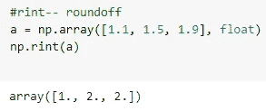
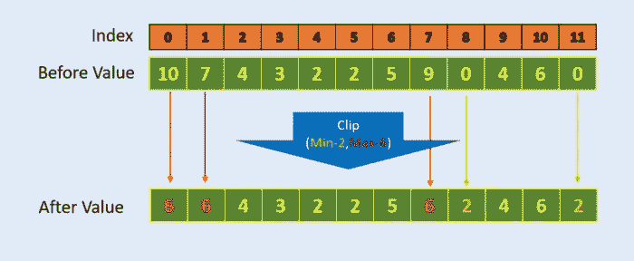

# NumPy 如何节省我们的时间？编程变得简单

> 原文：<https://blog.devgenius.io/how-numpy-saves-our-time-programming-made-easy-1ea211e53094?source=collection_archive---------10----------------------->

python 中的 NumPy 是什么？？很困惑也很愤怒想知道 python 中的 NumPy 到底是做什么的…让我们一起探索一下…

从我们用于数学运算的数字到我们寻找的天气预报，都利用了 **NumPy** 。很有趣，对吧？

图片来自 https://realpython.com/numpy-tutorial/

# NumPy

Numberical python，在数学运算等许多方面作为标准包处理。

如果有 **__name__，Python 理解为 package。py**

# packages 包含 Python 文件和一个名为`__init__` .py 的文件的目录。

**实时示例** —将在播放列表中存储歌曲列表，播放列表在这里作为包播放。

# NumPy 的✦应用

*   *数组上的数学运算*
*   *NumPy 内置了线性代数和随机数生成的函数。*
*   *分析形状尺寸。*

# NumPy 的✦安装:

***安装 NumPy 之前需要检查的两个方法，是 Python 和 PIP，***

检查是否安装了 pip

NumPy 的安装如下

数字安装

NUMPY 中唯一支持的数据结构是数组

# 如何让 NumPy 投入使用？？

**导入 NumPy :** 使用`import`关键字将 NumPy 导入应用程序:

**NumPy 中为什么一定要别名？这样做重要吗？**

**NumPy as np :**

然而，对于对 numpy 函数的大量调用，编写 NumPy 可能会变得很乏味。x 一遍又一遍。

Alias 使我们的任务在任何需要的地方都容易使用 NumPy。只是用 np 赋值 **Numpy**

# 数组-

**相似数据类型的项目集合**。

数组类似于列表

**NumPy ndarray 对象:**

***作为唯一支持 NumPy 的数据结构是数组。要访问数组，我们需要用 ndarray 创建对象。***

ndarray()-表示需要创建数组的维数。

恩达拉雷

获取的数组并打印它

当数组包含单个浮点元素时，它将整个数组转换为浮点元素

由于 string 具有最高优先级，它将整个数组转换为 String。

**其他方式转换成任何其他形式-**

*   从一种形式转换成另一种形式

铅字铸造

*   **类型()-** 弹出数组类型

*   **dtype()-** 给出特定数组的数据类型

*   **ndim-** 获取数组的维数

*   **shape-** 获取数组的当前形状，但也可用于通过给数组分配数组维数来就地改变数组的形状。

形状就是数组中的行和列 **#R，C**

这里 4 表示列表中元素的编号。

*   **重塑()-** 改变形态

整形([R，C])

*   **size-** 统计元素个数。

*   **可变-** 具有变化的能力。

位置 1 为 4，被更改为 20

# 规模

数字尺寸中的称为**轴**。

用简单的方括号( **[** )表示数量

举个例子——一个( **[** 1，2，3，4 **]** 的数组，这里的括号前后只有一个方括号。所以，它表示 **1D 阵。**

**(**[[**1，2，3，4 **]]** )的数组这里的括号前后有两个方括号。所以，它表示 **2D 阵。****

**我们下面看到的例子属于一维数组…**

**让我们来看看更多关于**二维(2D)阵列****

****

**2D 阵列**

****

**阵列的尺寸和形状**

*   ****len() —** 函数返回第一个轴的长度。**

**放在[]内的元素将被视为一个元素。**

****

**在这种情况下，方括号中包含了三个集合**

*   ****in-** 用于测试数组中是否存在值**

****

**它用真或假来表示检查**

****

**类似地，如果元素不是列表，它弹出 False**

****如果数组中有不匹配会发生什么？****

****

**将执行，但带有警告**

**上面的例子执行时，把它当作一个列表，而不把它当作 2D 数组。**

****

**因此，输出将在 1D 数组中**

# **数组切片**

****

**切片变得简单**

****

**将方括号内的第一个集合视为第 0 个位置**

*   ****如果我们需要访问范围或特定元素怎么办？****

****

**第 0 个位置第 0 个元素**

****

**第 0 个位置第 1 个元素**

*   ****获取特定元素****

****

**从数组中检索 8，9**

********

**0:2 表示行范围，1，4 位于第 0 个位置**

**作为切片流[R，C]**

****

**选择范围 2，5，6**

*   ****享受更多功能带来的乐趣****

****

*   ****当我们需要特定行的平均值时？****

****

**找出所有列的平均值，并指定轴**

****

**在垂直轴上寻找平均值**

# **创建数组的另一种方式**

********

**创建数组的另一种方式**

*   ****什么时候我们需要从阵列开始…？？****

****

**从 1 到 10 的元素**

*   ****reshape(R，C)-** 排列任意维度**

********

**整形(R，C)**

****

**当试图用非原始设置进行整形时**

# **NUMPY 数组中的串联**

*   **沿现有轴连接一系列数组。**

********

**串联两个不同的数组**

*   **纵轴串联**

********

**纵轴串联**

*   **在水平轴上串联**

********

**在水平轴上串联**

# **为什么要把数组转换成字符串？？**

*   **何时存储大数组。**
*   **当我们尝试使用字符串函数时。**
*   ****flatten()-** 从更高维度还原为 1D 数组。**
*   **高效地访问数据。**
*   **中性网络。**

****示例** -高维到低维而不丢失数据**

********

**展平()**

****newaxis-** 将 1D 转换为 2D 数组，标注提到的值。**

********

**改为(3，1)**

****

**已更改为(1，3)**

*   ****范围-类似于范围****

********

**我们可以排列阵列**

> *****【开始、停止、步进】*****

****

*   ****单位矩阵-** 确认一个矩阵的逆矩阵，并且始终是一个方阵。**

********

*   ****ones-** 返回具有指定尺寸的一个**

********

**带整数和浮点**

*   ****零-** 用这些值创建指定维数的新数组。**

********

*   ****0 _ like 和 1 _ like-**0 _ like 和 1 _ like 函数创建一个具有相同维数的新数组。**

************

**像某人一样**

*   ****眼睛-** 用对角线上的 1 创建二维数组**

********

**k=0 表示第 0 个位置**

****

**具有相应的位置**

*   ****广播对象** →数组维数不匹配，会重复较小的数组**

********

# **阵列数学**

********

**如果数组大小不匹配，将引发错误:**

********

*   ****sqrt()-** 平方数**

********

*   ****下限-** 给出较低的整数:**

****

*   ****ceil-** 给出上整数:**

****

*   ****rint-** 给出最接近的整数:**

****

*   **NumPy 模块中还包括两个重要的数学常数:**

****

# **数组迭代**

*   **以类似于列表的方式迭代数组是可能的**

****

*   **对于多维数组**

****

*   **多重赋值也可以用于数组迭代:**

****

*   ****拆包-** 估计只需要哪个。**

****

# **基本数组操作**

*   **数组的和与积**

****

**加法和乘法数组**

*   **最小和最大元素的位置— **argmin()和 argmax()****

************

*   ****clip(start，end)** -给定范围如果数组中的元素小于开始，它将用最小值替换。**

********

**这里 6 大于范围，所以在范围内替换**

*   ****unique()** -获取唯一值，不重复值。**

********

*   ****diagonal()** -对于二维数组，可以提取对角线:**

********

*   ****sort()-** 默认按升序排列元素。**

********

# **比较操作**

**在大小相等的数组中按元素比较成员。返回值是布尔值 True / False 的数组:**

********

*   **使用广播可以将数组与单个值进行比较:**

****

*   **any 和 all 运算符可用于确定布尔数组的任何或所有元素是否为真:**

****

*   **where 函数-类似于 if else 语句..如果条件为真，将执行 true，否则终止或执行 else 部分。**

> *****where(boolarray，truearray，false array)*****

********

**当数字/ 0 是无穷大时，变暖就发生了**

****

*   ****非零-** 检查非零值并获取其索引。**

********

*   **检查是否有任何不是数字的元素，如果有，抛出 True。**

****

*   ****infinite()** -检查是否有任何元素是有限的，如果有，则抛出 True。**

****

# **数组选择和操作**

**但是，与列表不同，数组还允许使用其他数组进行选择。**

****

**将检查条件是真还是假**

****

**将显示大于或等于条件的数字。**

*   **除了布尔选择之外，还可以使用整数数组进行选择。这里，整数数组包含要从数组中取出的元素的索引。**

****

*   **对于多维数组，我们必须向选择括号发送多个一维整数数组，每个轴一个。然后，按顺序遍历这些选择数组中的每一个:第一个元素的第一个轴索引取自第一个选择数组的第一个成员，第二个索引取自第二个选择数组的第一个成员，依此类推。**

****

*   ****take-** 一个特殊的函数 **take** 也可用于执行整数数组的选择。这与括号选择的工作方式相同:**

****

*   ****put-** 与 take 函数相反的是 put 函数，它从一个源数组中取值，并将它们放在调用 put 的数组中指定的索引处。**

********

**给你们带来新的乐趣…有问题吗？请在评论区给我留言，我会尽快回复你:)**

****更多博客即将推出！！！****

**让我们在 [Linkedin](https://www.linkedin.com/in/shifana-tasneem-954718172/) 上进行更多的讨论**

**干杯**

**希法娜·塔斯尼姆:**

**资源:**

## **资源:**

** [## NumPy 文档-NumPy 1.23 版手册

### 版本:1.23 下载文档:PDF 版本|文档的历史版本有用链接:安装|…

numpy.org](https://numpy.org/doc/stable/) 

https://www.w3schools.com 的数字

 [## 如何从头开始创建 NumPy 数组？

### 本教程是关于理解 NumPy python 包和从头开始创建 NumPy 数组的。

towardsdatascience.com](https://towardsdatascience.com/how-to-create-numpy-arrays-from-scratch-3e0341f9ffea) 

**图像**

 [## NumPy:shape()函数- w3resource

### 函数的作用是:在不改变数组数据的情况下，给数组一个新的形状。语法:numpy . shape(a…

www.w3resource.com](https://www.w3resource.com/numpy/manipulation/reshape.php)  [## Java 中连接字符串的 4 种方法[示例和性能]

### 当我们想到 Java 中的字符串连接时，我们想到的是+运算符，这是最简单的方法之一…

www.java67.com](https://www.java67.com/2015/05/4-ways-to-concatenate-strings-in-java.html)  [## Python-Java point 中的 numpy.concatenate()

### concatenate()函数是 NumPy 包中的一个函数。这个函数本质上结合了 NumPy 数组…

www.javatpoint.com](https://www.javatpoint.com/numpy-concatenate)  [## Python 中的 numpy . concatenate()| Python 中的 np.concatenate()

### 报告此 ad Numpy concatenate()不是数据库联接。它基本上是垂直堆叠 Numpy 数组或…

www.tutorialsandyou.com](https://www.tutorialsandyou.com/python/numpy-concatenate-in-python-69.html)  [## Python-Java point 中的 numpy.sort

### Python 中的 numpy.sort，包含 numpy 简介、环境设置、n Array、数据类型、数组创建、属性…

www.javatpoint.com](https://www.javatpoint.com/numpy-sort)  [## NumPy: zeros_like()函数- w3resource

### zeros_like()函数用于获取一个由零组成的数组，其形状和类型与给定的数组相同。语法…

www.w3resource.com](https://www.w3resource.com/numpy/array-creation/zeros_like.php)  [## 5 个智能 Python NumPy 函数

### 简洁编程的优雅 NumPy 函数

towardsdatascience.com](https://towardsdatascience.com/5-smart-python-numpy-functions-dfd1072d2cb4)  [## NumPy 矩阵乘法-Java 点

### 矩阵乘法是以两个矩阵为输入，将两个矩阵相乘，生成一个矩阵的运算

www.javatpoint.com](https://www.javatpoint.com/numpy-matrix-multiplication) 

https://www . splash learn . com/math-vocabulary/geometry/dimensions

geekstocode.com**