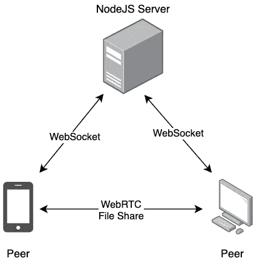
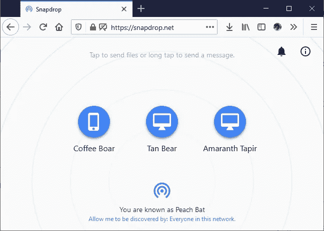

# 一个开发人员如何只用 JavaScript 重现隔空投送

> 原文：<https://blog.devgenius.io/how-one-developer-recreated-airdrop-using-just-javascript-d2d979551c51?source=collection_archive---------2----------------------->

SnapDrop.net

你在 iPhone 或 Mac 上用过隔空投送吗？

好吧，如果你还没有，那么你能想象在手机或笔记本电脑之间通过点击一个按钮无缝共享文件吗？

罗宾·莱纳斯创造的 SnapDrop.net 让你可以在任何装有浏览器的设备之间直接分享文件。不管是在 iPhone 和 Android 之间，还是在平板电脑和 PC 之间。

也不需要上传到云端或者从云端下载。😲

那么*它到底是怎么工作的？*

在一行一行的分析之后，我弄明白了它辉煌的架构。在这篇文章中，我将向你展示它是如何工作的。

# 使用这项新技术

了解这项技术可以让你从那些还没有探索过这项技术的工程师中脱颖而出。

这种令人敬畏的技术是 WebRTC (Web 实时通信),它是几年前才出现的。它的数据通道使 SnapDrop 能够发送字节(甚至音频和视频！)直接从一个对等体到另一个对等体。

(将对等体视为一种设备，就像您的电话或笔记本电脑一样)

但是，如果没有一些帮助，WebRTC 无法连接两个用户。它需要一个信令服务器，换句话说，它需要发现其他对等点，并告诉它如何连接。

# 没有这个，WebRTC 是不可能使用的

网络架构

ICE(Interactive Connectivity Establishment)是一台计算机在没有公共 IP 地址的情况下，如何绘制从互联网到自身的地图。这是因为您的路由器和计算机之间发生了 NAT(网络地址转换)。

一旦地图制作完成，你必须找到某种方法让这两个设备互相共享它们的地图。SnapDrop 通过 NodeJS 服务器实现这一点，NodeJS 服务器使用 WebSockets 在每个对等点之间进行通信，这是另一个很棒的协议。

现在你可能在想，这安全吗？

# 好吧，但是你怎么保护这东西？

默认情况下，WebRTC in transit 会加密其数据。这很酷，但你也可能不想与随机的人共享文件。

SnapDrop 只在两台具有相同 IP 地址的计算机之间共享 ICE，这意味着它们在同一个网络/wifi 上。

它通过为每个 IP 地址创建空间来做到这一点，并通过生成唯一的 id 来区分设备。

你可能不想在公共 WiFi 上使用此应用程序，因为任何人都可以向你发送文件。但是在这个疫情，谁会出去呢？🤷‍♀️

上面的代码片段做出了一个有趣的选择，将对等体存储在服务器类的一个对象中。通常你会期望使用数据库，但这可能是为了简化事情，应用程序可能没有太多的流量。

# 熟悉的用户界面和用户体验

快照图标

风格几乎完全像隔空投送。每台设备都有一个有趣的名称和一个图标，以帮助区分每个对等设备。不仅如此，它还是一个进步的网络应用程序，提供了一些不错的功能，如:

*   感觉像是原生应用
*   通知
*   实时更新

# 设备不支持 WebRTC 怎么办？

到目前为止，大多数设备/浏览器都支持 WebRTC，但如果它们不支持，SnapDrop 还有一个后备方案！在这种情况下，它使用已经建立的 WebSocket 连接来发送文件数据。

但是，这种方法效率较低，安全性较差，因为数据需要先到达服务器，然后才能到达最终目的地。

# 事件驱动的代码风格

代码库完全是事件驱动的。当您希望将服务相互分离并允许在动作发生时进行处理时，可以使用这种风格。

这是对 WebRTC 和 WebSockets 的补充，因为它们也是事件驱动的。当一个消息进来，或者一个新的对等体加入，或者一个文件想要被发送，这就是一个事件。

一开始真的很难理解，因为这不是一个线性过程。这是注册和触发事件的类。

# 自己检查代码

我希望你今天学到了一些东西！如果你想自己探索代码，这里有 github 库。

创建者也很友好地创建了一个 docker compose 文件，这样您就可以自己运行和托管它了。我想知道有多少人在运行他们自己的 SnapDrop 实例？

感谢您的阅读，我会在下一篇中赶上您！