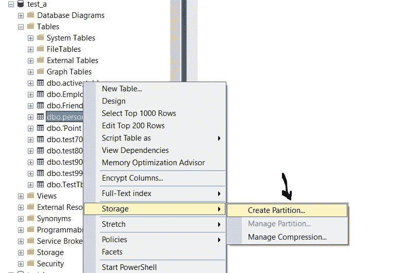
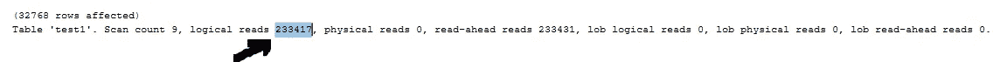
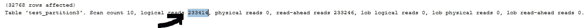
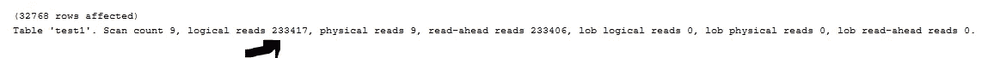
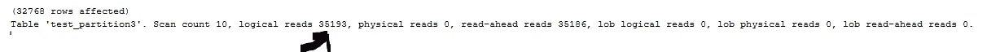

# 分区表如何影响 Sql Server 性能

> 原文：<https://blog.devgenius.io/how-partitioned-table-affect-sql-server-performance-a20f2ca2d568?source=collection_archive---------6----------------------->



在本文中，我试图解释为什么分区表对于性能调优如此重要，尤其是在非常大的表上。

分区是 SQL Server 的一个强大特性，它允许您将一个
大表分成更小、更易于管理的部分。分区可以提高查询性能，降低存储成本，并提高可管理性。在本文中，我们将讨论 SQL Server 中分区的基础知识，包括如何创建和管理分区表。有关分区表的更多[细节](https://learn.microsoft.com/en-us/sql/relational-databases/partitions/create-partitioned-tables-and-indexes?view=sql-server-ver16)。

SQL Server 中有两种主要的分区类型:**水平**和**垂直**。

**水平分区**是一种将一个表分成多个更小的表的技术，称为分区。根据特定的标准或条件，每个分区都包含原始表中**数据**的子集。例如，您可以使用水平分区按日期范围、客户或其他标准来划分表。

要在 SQL Server 中实现水平分区，您可以使用`CREATE PARTITION FUNCTION`和`CREATE PARTITION SCHEME`语句来定义分区和划分数据的标准。然后，您可以在`CREATE TABLE`语句中使用`ON`子句来指定表的分区方案。这将创建一个水平分区表，可以像普通表一样对其进行查询和管理。

**垂直分区**是一种将一个表分成多个更小的表的技术，称为分区。每个分区包含原始表中**列**的子集，而不是行的子集。这允许您将相关的列一起存储在同一个分区中，同时将不相关或不常用的列分隔到不同的分区中。

要在 SQL Server 中实现垂直分区，您可以使用`CREATE TABLE`语句创建多个具有相同模式但具有不同列集的表。然后可以使用`INSERT INTO ... SELECT`语句将数据从原始表移动到分区表中。这将创建垂直分区表，可以像普通表一样对其进行查询和管理。更多关于水平和垂直分区表的信息[链接](https://www.sqlshack.com/database-table-partitioning-sql-server/)

## **创建一个分区表**

在这种情况下，分区函数`myPartitionFunction`被定义为在`int`数据类型上使用范围右分区方案。这意味着数据将根据整数值的范围划分为多个分区，每个范围的上限都包含在内。具体的范围由`VALUES`子句定义，该子句列出了 2006、2007、2008、2009、2010、2011、2012、2013 和 2014 年的值。

分区方案定义了由分区函数创建的分区的物理存储。在这种情况下，分区方案`myPartitionScheme`被定义为使用`myPartitionFunction`分区函数，并将所有分区存储在`PRIMARY`文件组中。

最后，`test_partition`表被创建并定义为在`ModifiedYear`列上使用`myPartitionScheme`分区方案。这意味着`test_partition`表中的数据将根据`myPartitionFunction`分区函数中定义的范围自动划分到分区中。

```
CREATE PARTITION FUNCTION myPartitionFunction (int)  
    AS RANGE RIGHT FOR VALUES (2006,2007,2008,2009,2010,2011,2012,2013,2014);
GO  

CREATE PARTITION SCHEME myPartitionScheme
    AS PARTITION myPartitionFunction
    ALL TO ('PRIMARY') ;  
GO  

create TABLE dbo.test_partition ( [AddressID] int , [AddressLine1] nvarchar(60), [ModifiedYear] int)  
    ON myPartitionScheme (ModifiedYear) ;  
GO
```

下面的脚本将数据插入到`test_partition`表中，然后计算表中的行数。`INSERT`语句从`test`表中选择数据并将其插入到`test_partition`表中。

根据`ModifiedYear`列对`test_partition`表进行分区，根据`ModifiedYear`列中的值将行自动分配到适当的分区。例如，带有`ModifiedYear` 2006 的一行将被插入到 2006-2007 范围的分区中。

```
SELECT count(1)  FROM [AdventureWorks2017].[dbo].[test]
-- 32.768.002

insert into [AdventureWorks2017].[dbo].[test_partition]
SELECT  [AddressID]
      ,[AddressLine1]
      ,[ModifiedYear]
FROM [AdventureWorks2017].[dbo].[test]

SELECT count(1) FROM [AdventureWorks2017].[dbo].[test_partition]
-- 32.768.002
```

## 使用非分区表选择查询

在下面的脚本中，从`test`表中选择`AddressLine1`列为“8157 W. Book”的行。它还启用了`STATISTICS IO`选项，该选项显示了关于查询所执行的数据输入/输出(I/O)的信息。这可以包括执行的逻辑读取和物理读取的次数、读取的数据量以及读取数据所花费的时间。

如果没有分区表，逻辑读取是 233k。

```
set statistics io on 
SELECT [AddressID]
      ,[AddressLine1]
      ,[ModifiedYear]
  FROM [AdventureWorks2017].[dbo].[test] 
  where [AddressLine1] = '8157 W. Book'
```



## 使用分区表选择查询

在下面的脚本中，从`test_partition`表中选择行，其中`AddressLine1`列为“8157 W. Book”。仅返回`AddressLine1`值为‘8157 w . Book’的行。

根据`ModifiedYear`列对`test_partition`表进行分区，查询引擎可以使用这些信息来优化查询。但是没有 **where 子句**选项来为分区表获得更好的性能。这就是为什么分区表和非分区表的结果是一样的。

对于分区表，逻辑读取是 233k。

```
set statistics io on 
SELECT [AddressID]
      ,[AddressLine1]
      ,[ModifiedYear]
  FROM [AdventureWorks2017].[dbo].[test_partition] 
  where [AddressLine1] = '8157 W. Book'
```



## 使用非分区表和 Where 子句选择查询

该语句从`test`表中选择行，其中`AddressLine1`列为“8157 W. Book ”,而`ModifiedYear`列在 2009 年和 2010 年之间。

`SELECT`语句指定要选择的列:`AddressID`、`AddressLine1`和`ModifiedYear`。`WHERE`子句使用两个条件来过滤行。`AddressLine1`列的值必须为“8157 W. Book”，`ModifiedYear`列的值必须在 2009 年和 2010 年之间(含 2009 年和 2010 年)。只有同时满足两个条件的行才会被返回。

`test`表没有分区，查询引擎必须扫描整个表以找到匹配的行。这可能会很昂贵，尤其是当表很大时，并且会对查询的性能产生负面影响。

```
set statistics io on 
SELECT [AddressID]
      ,[AddressLine1]
      ,[ModifiedYear]
  FROM [AdventureWorks2017].[dbo].[test] 
  where [AddressLine1] = '8157 W. Book' and [ModifiedYear] between '2009' and '2010'
```

对于非分区表，逻辑读取是 233k。



## 使用分区表和 Where 子句选择查询

该语句从`test_partition`表中选择行，其中`AddressLine1`列为“8157 W. Book ”,而`ModifiedYear`列在 2009 年和 2010 年之间。

`SELECT`语句指定要选择的列:`AddressID`、`AddressLine1`和`ModifiedYear`。`WHERE`子句使用两个条件来过滤行。`AddressLine1`列的值必须为“8157 W. Book”，`ModifiedYear`列的值必须在 2009 年和 2010 年之间(含 2009 年和 2010 年)。只有同时满足两个条件的行才会被返回。

根据`ModifiedYear`列对`test_partition`表进行分区，查询引擎可以使用这些信息来优化查询。例如，如果已知带有`AddressLine1`‘8157 w . Book’的行的`ModifiedYear`值在 2009-2010 范围内，则查询引擎可以跳过该范围之外的任何分区，只访问相关的分区。与查询未分区表相比，这将提高查询的性能。

```
set statistics io on 
SELECT [AddressID]
      ,[AddressLine1]
      ,[ModifiedYear]
  FROM [AdventureWorks2017].[dbo].[test_partition] 
  where [AddressLine1] = '8157 W. Book' and [ModifiedYear] between '2009' and '2010'
```

对于分区表，逻辑读取是 35k。



**Sql Server 中分区表的优势**

*   改进的查询性能:通过将一个大表分成更小的分区，只需要访问数据子集的查询可以跳过未使用的分区，只访问相关的分区。这可以显著提高这些查询的性能，尤其是对于大型表。
*   改进的数据管理:分区允许您更容易地管理表中的数据。例如，您可以独立地添加、删除或拆分分区，而不必修改整个表。这使得维护表和执行数据维护操作变得更加容易。
*   改进的可伸缩性:分区可以帮助表更容易伸缩。例如，可以随着数据的增长向表中添加更多的分区，或者可以将一个分区拆分成多个更小的分区，以便更均匀地分布数据。这有助于该表在数据量增加的情况下继续良好运行。
*   提高可用性:分区有助于提高表的可用性。例如，如果一个分区由于硬件故障而变得不可用，其他分区仍然可以被访问，从而允许表保持可用于查询。这可以减少停机时间，提高桌子的整体可用性。

**Sql Server 中分区表的缺点**

*   复杂性增加:分区增加了数据库设计的复杂性。您需要仔细设计分区功能和方案，并且需要考虑随着时间的推移如何管理和维护分区。这使得分区表的设计和实现比非分区表更复杂。
*   如果数据没有均匀地分布在分区上，或者分区没有正确地建立索引，那么插入性能可能会比非分区表差。此外，如果分区碎片过多，插入性能可能会很差。
*   存储和维护成本增加:对表进行分区会增加数据库的存储和维护成本。因为每个分区都是单独存储的，所以您可能需要更多的存储空间来容纳这些分区。此外，管理和维护分区可能需要额外的工作和资源。
*   对某些操作的限制:分区会对可以在表上执行的操作类型施加一些限制。例如，某些 DDL 操作(如重命名列或更改其数据类型)可能无法在已分区表上执行。此外，一些查询操作，比如使用`UNION ALL`或`FULL OUTER JOIN`操作符，可能在分区表上不受支持。
*   兼容性问题:分区仅在 SQL Server 的某些版本中可用，并且它可能与某些第三方工具或应用程序不兼容。在数据库中实现分区之前，您可能需要考虑这些兼容性问题。