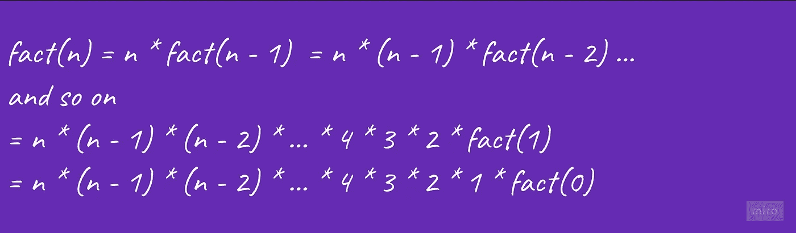

# 递归如何工作—逐步演练

> 原文：<https://blog.devgenius.io/how-recursion-works-step-by-step-walkthrough-8447e7abc9ee?source=collection_archive---------4----------------------->

# 什么是递归:

函数直接或间接调用自身的过程称为递归，相应的函数称为递归函数。使用递归算法，某些问题可以很容易地解决。

换句话说:为了解决一个问题，我们解决一个问题，这个问题是同一个问题的一个更小的实例，然后我们用这个更小实例的解决方案来解决原来的问题。对于递归算法的工作，更小的子问题必须最终到达基本情况。简单地说，任何递归算法都有两个部分:

*   **基本情况:**函数可以立即返回结果的终止条件。这是我们已经知道解决方案的问题的最小版本。
*   **递归结构:**通过更小的子问题的解决方案来设计问题的解决方案，即相同的问题，但输入量更小。对于较小的输入大小，我们继续调用相同的问题，直到达到递归的基本条件。

# 通过寻找 n 阶阶乘理解递归；

非负整数的阶乘是所有小于等于 n 的整数的乘积，例如:5 的阶乘是 1*2*3*4*5 = 120。

## 递归结构:

根据 n 的阶乘的数学定义，我们可以写成:

如果我们计算第 **(n-1)个**阶乘的值，我们可以很容易地计算第 n 个阶乘的值。这意味着我们可以用输入大小的较小问题 **(n-1)来解决输入大小 n 的问题。**换句话说，我们可以用递归的思想来解决这个问题！

假设函数 **fact(n)** 和 **fact(n-1)** 分别返回第**个**和第 **(n-1)个**阶乘的值，那么我们可以写出下面的递归结构:

## 基础案例

在每一个递归解决方案中，都必须有一个终止条件或基本情况，在这里我们的递归将直接给出结果，而不会再次破坏子问题。如果我们观察上面的递归结构，那么我们会发现场景背后的递归调用链如下:

负数的阶乘没有定义，所以 fact(0)是阶乘问题的最小版本，我们的递归将终止并直接返回值。所以 n = 0 是返回值 1 的基本情况。

**第 n 阶乘的递归伪代码**

# 递归是如何在后台工作的？

如果我们画出上述阶乘程序的递归流程，可以发现这样的模式:我们最后调用 fact(0 ),但它首先返回值。类似地，我们首先调用 fact(n ),但是它最后返回值。有没有发现一些**后进先出(LIFO)** 顺序的递归调用和返回值？是的，你答对了！在后台，编译器使用堆栈数据结构来模拟递归并提供正确的输出。我们把这个栈叫做:
**叫栈！**

*   **递归调用顺序:较大问题到较小问题** 事实(n) - >事实(n — 1) - > … - >事实(i) - > … - >事实(1) - >事实(0)
*   **返回值顺序:从小问题到大问题** 事实(0)——>事实(1)——>——>事实(I)——>——>事实(n—1)——>事实(n)

## 递归中调用栈的思想是如何工作的？

*   递归函数的执行信息存储在调用堆栈中。它包含关于执行的细节:函数控制流的当前状态、局部变量和其他内部信息。当从 main()调用任何函数时，内存都在堆栈中分配给它。
*   在递归过程中，当函数为较小的输入大小调用相同的函数时，内存被分配给它，它位于调用堆栈的顶部。
*   被调用函数的内存分配在分配给调用函数的内存之上，并且为每个函数调用创建一个不同的局部变量副本。
*   当达到基本情况时，函数将其值返回给调用它的函数，内存被释放，过程继续。

**计算事实的递归可视化(3)**