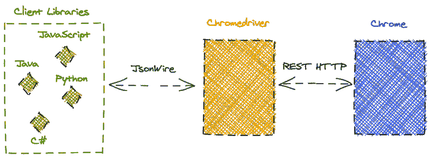

# Selenium 如何工作——高级架构

> 原文：<https://blog.devgenius.io/how-selenium-works-high-level-architecture-8a1793ca9387?source=collection_archive---------34----------------------->


当试图使用一个特定的工具或库时，建立有效的双向关系的最好方式是偷看一眼并看看里面。这就是我们从高层次架构的角度对 Selenium 所做的事情，肯定会带来一些“啊哈”时刻。

[Selenium WebDriver](https://www.selenium.dev/) 无疑仍然是 web 自动化和测试的王者/女王。工具、框架、社区、招聘信息、数百万人与它互动以及生态系统的其余部分都建立在一个始于 2004 年的项目上。这证明，在所有维护它并为它做出贡献的人们的努力下，它在目标上是那么好。

即使介绍的内容非常精简，不管您目前是否在使用 Selenium，了解一下这个工具的架构只会对您有好处。欣赏风景。

# 高层

首先，大多数直接使用 Selenium 的人，*直接表示一个* [*客户端库*](https://www.selenium.dev/documentation/en/selenium_installation/installing_selenium_libraries/) ，正在编写脚本，使用他们最喜欢的语言，描述他们想要在真实浏览器实例上模拟的特定步骤和交互。这可能是从导航到页面，点击元素到提交表单，以及*未经许可删除内容*。

```
WebDriver driver = new ChromeDriver(); driver.get("https://www.selenium.dev/projects/"); // Open this URL in the browser instance WebElement searchElement = driver.findElement(By.name("search")); // Find the hipster search of this website            
searchElement.sendKeys("firefox"); // Fill the input with the search term
```

上面只是一个简单的 Java 代码示例，QA 工程师习惯于为他们的日常工作编写这些代码。您运行这个脚本(*和其余的样板文件*)，您会在 Selenium 网站上看到一个 Chrome 窗口，搜索栏中有“firefox”一词，非常简单。我们使用的完全相同的 API 暴露在不同的语言绑定中，如 JavaScript、Python 和 Ruby。

然而，对于一些人来说，这些命令到达浏览器必须经过的过程和部分，以及它们如何一起操作，是一种模糊的画面。

我们可以从下图开始清除模糊:



有些组件可能看起来很熟悉，有些则不那么熟悉。我们将把它们一个一个地分解，以便把点连接起来，填补你理解 Selenium WebDriver 的任何潜在障碍。

# 组件

# 客户端库

客户端库或称为*语言绑定*，是允许开发人员在他们选择的语言中使用 Selenium 高级 API 的库。在不知道所有细节的情况下，通常“客户机库”所提供的是通过某种传输机制的包装器来与一组固定的端点进行通信。*把它们想象成一层薄薄的东西，大部分时间是把它们从一种语言翻译成另一种语言。_*

[至少对于 WebDriver 的 JavaScript 包装器来说是这样的。](https://github.com/SeleniumHQ/selenium/blob/master/javascript/webdriver/http/http.js)

# JsonWire 协议

正如在 *(1)* 中提到的，客户端库使用一个特定的 HTTP API，就像 [David Burns 说的](https://www.theautomatedtester.co.uk/blog/how-selenium-works-transport/)一样，将它们想要的命令传递给*浏览器驱动程序*，我们稍后会谈到。

为了防止客户库作者和维护者的混乱、痛苦和预期偏差，系统需要定义一种标准化的方式与外界通信。WebDriver 决定尽可能统一地与*浏览器驱动程序*通信，这是对 [JsonWire 协议](https://github.com/SeleniumHQ/selenium/wiki/JsonWireProtocol)的实现，现在你可以想象，它是基于 HTTP 的 JSON。这个 API 端点的规范可以在[这里](https://github.com/SeleniumHQ/selenium/wiki/JsonWireProtocol#command-reference)找到。

要了解这有多简单，这里有一个小例子:

```
/* 
 * Send the command to the session with id=sessionId 
 * to initiate a navigation to the "url" body parameter 
 */POST /session/:sessionId/url 
{
  "url": "https://example.com"}
}
```

从 GitHub 转到 JsonWire 规范页面，您一定注意到了这个过时的警告，但是不要犹豫。这并不意味着这是一个被放弃的项目，或者那里的信息是不相关的，相反，它已经向前迈出了一大步。尽管这一协议被广泛使用，在它背后有着巨大的技术和人力生态系统，它还是成功地成为了 W3C 标准的实际工作草案。

这一事实使得它成为一个官方协议，用户代理的目标是实现和遵守它，以便程序能够远程控制网络浏览器的行为。在我看来，这是 WebDriver 项目的巨大成功和认可。

# 浏览器驱动程序

*浏览器驱动*可以被认为是 WebDriver 架构的“后端”。它充当 JsonWire 协议的终端主机，以我们前面展示的形式接受命令，并以类似的方式用值、错误、统计或协议定义的任何内容进行响应。一方面，它实际上像客户端库的常规独立 HTTP 服务器一样工作。另一方面，它使用自己的 HTTP API 进行通信，发送命令，并在检测其行为时接收来自实际浏览器实例的响应。

在尝试使用 Selenium 时，您可能会想到或者已经注意到，不同的浏览器有特定的驱动程序来实现将从客户端库检索到的命令实际发送到浏览器实例的重要部分。例如支持 Firefox 的 GeckoDriver，支持 Chrome/Chrome 的 ChromeDriver，Opera [的 OperaDriver 等等](https://www.selenium.dev/downloads/#browsersCollapse)。

这些*浏览器驱动*中的每一个都使用自己的方式和实现与实际的浏览器实例进行通信。一些例子:

*   ChromeDriver 使用 [DevTools 协议](https://chromedevtools.github.io/devtools-protocol/)。
*   壁虎驱动程序使用[木偶](https://firefox-source-docs.mozilla.org/testing/marionette/)远程协议。
*   Opera driver(*for Opera>= 26*)基于 ChromeDriver，并做了一些调整[。](https://github.com/operasoftware/operachromiumdriver)

正如你所理解的，一些驱动程序可能不是由维护公司开源的，但是我相信如果你浏览每个驱动程序的页面和文档，你可以找到更多的信息。

# 浏览器

实际的浏览器实例将接收相应浏览器驱动程序的命令，并最终模拟我们一直计划的 web 自动化任务。

# 关闭

在我看来，这就是我们对构成“硒架构”的高层架构组件的近距离观察。当我看着所有演员如何走到一起，以及在每个项目的开发和维护中投入了多少工作和努力时，我希望你和我一样喜欢它。

*十字贴来自:* [*Web 自动化之家*](https://www.thehomeofwebautomation.com/how-selenium-works-architecture/)

*封面图片由* [*彼得 H*](https://pixabay.com/users/Tama66-1032521/?utm_source=link-attribution&utm_medium=referral&utm_campaign=image&utm_content=5146458) *从* [*Pixabay*](https://pixabay.com/?utm_source=link-attribution&utm_medium=referral&utm_campaign=image&utm_content=5146458)