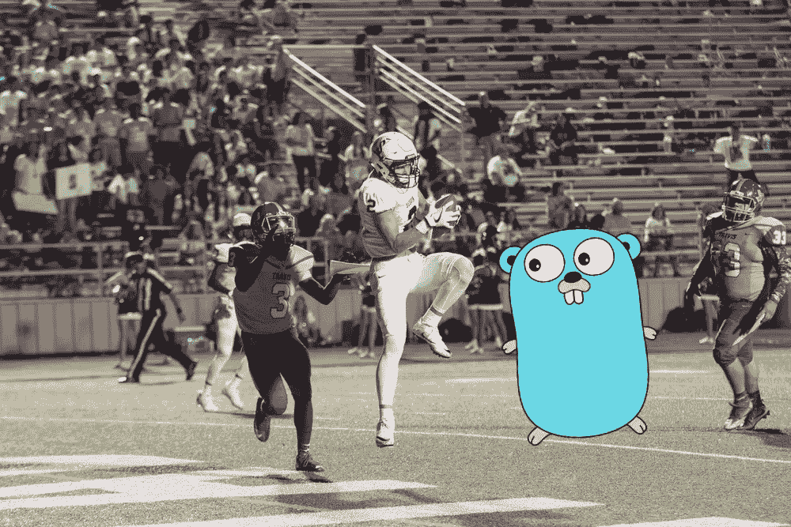

# 在围棋中，你应该如何命名你的接球手？

> 原文：<https://blog.devgenius.io/how-should-you-name-your-receivers-in-go-aec60abd7f67?source=collection_archive---------3----------------------->

照片由[克里斯·摩尔](https://unsplash.com/@chrismoore_)在 [Unsplash](https://unsplash.com/photos/aiI3xtEHK34) 上拍摄。

Golang 中接收者的概念是另一篇文章中的概念，但是你可以在 [Go playground](https://tour.golang.org/methods/1) 中与他们一起玩。在那里，他们提到:

> 方法是带有特殊*接收器*参数的函数。
> 
> 接收者出现在它自己的参数列表中，在关键字`func`和方法名之间。

好的，我们知道一个带有接收方参数的函数叫做方法。不太明显的是，你到底应该怎么称呼这个接收方参数——比如，你该怎么命名这个变量呢？既然这在语言中是很常见的事情，那么这里有什么好的约定呢？

现在，关于这个问题有一些不同的观点，所以这篇文章将讨论我个人根据这个话题的一些具体资源所做的事情。

Golang 的 [Go 代码评审评论](https://github.com/golang/go/wiki/CodeReviewComments)是一个很好的资源。在那里，他们这样说:

> 方法接收方的名称应该是其身份的反映；通常一个或两个字母的缩写就足够了(例如“c”或“cl”代表“客户”)。不要使用通用名称，如“me”、“this”或“self”，这是面向对象语言中赋予方法特殊含义的典型标识符。在 Go 中，方法的接收者只是另一个参数，因此应该相应地命名。这个名字不需要像方法参数那样具有描述性，因为它的作用是显而易见的，并且没有文档目的。它可以很短，因为它会出现在该类型的每个方法的几乎每一行中；熟悉承认简洁。也要保持一致:如果你在一种方法中称接收者为“c ”,不要在另一种方法中称它为“cl”。

实际上，为了提炼这一点，您通常应该避免:

*   我
*   这
*   自己

接收器参数的名字应该取得更具体一点，但是因为它可能会重复出现，所以你不必冗长地命名它。它的类型的一个非常短的缩写是非常普遍的；例如，文档中提到`c`或`cl`可用于类型`Client`。

在上面的围棋游戏中，甚至，类型是`Vertex`，因此接收者的名字是非常简单和简短的缩写`v`。

正如文档中提到的，关键在于一致性。

正如 StackOverflow 网站上的亚当·斯密在回答一个关于这个话题的问题时说的，所有这些都可以归结为“只是惯例——在句法上并不重要。真正的答案是写一堆是一种痛苦。

老实说，他是对的——遵循惯例是让其他人更快更容易地阅读你的代码的好方法，因为他们对惯例更熟悉。让您的工作人员在同一页面上工作是一个很好的方法，可以确保您省去一些因命名不匹配而带来的麻烦，并最终说明为什么这样的事情随着时间的推移会变得重要。

 [## 通过我的推荐链接加入媒体

### 作为一个媒体会员，你的会员费的一部分会给你阅读的作家，你可以完全接触到每一个故事…

tremaineeto.medium.com](https://tremaineeto.medium.com/membership)