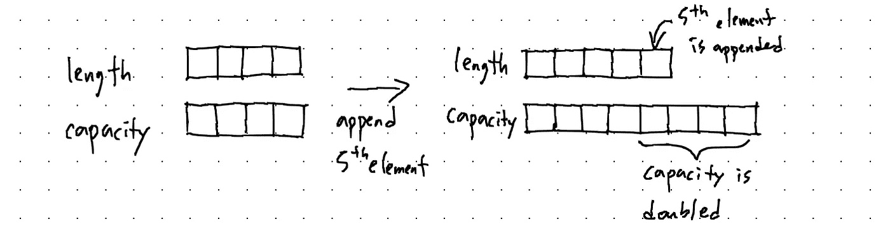
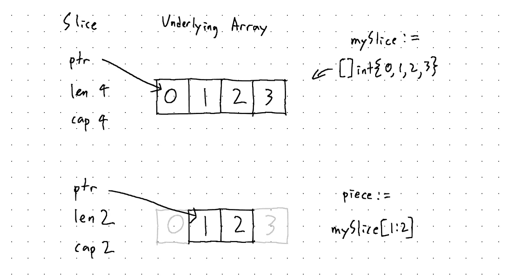

# 围棋中切片的工作原理

> 原文：<https://blog.devgenius.io/how-slices-work-in-go-fbc772514001?source=collection_archive---------13----------------------->

Go 为我们提供了一种使用切片对相似数据进行分组的方法。我想这是一个相当陌生的术语。至少我还没见过 slice 这个术语在其他语言中使用。能够很好地使用切片很重要，但是理解它在幕后是如何工作的也很重要。我认为了解内部运作是乐趣的一半。在这篇文章中，我将解释围棋中切片的工作原理。

# 但是首先，让我们看看数组。

我们从数组开始的原因是切片是使用数组实现的。数组基本上是固定大小的容器。

```
myArray := [3]int{0, 1, 2}
```

您在方括号内指定数组的大小，决定元素的数据类型，并将元素写在花括号内。您也可以让编译器通过这样做来找出数组的长度:

```
myArray := [...]string{"apple", "banana"}
```

如果不指定长度，将改为创建切片。一旦创建了数组，就不能更改其大小。

因此，您已经可以看到数组更加原始，不像 Python 列表那样功能丰富。我来自 Python 背景，就像一个被宠坏的新手 dev，想要找到一些更有用的东西。我立刻开始寻找更强大的东西。

# 看，切片的创造。

切片比数组强大得多，因为它们具有动态特性。简单来说，切片就像橡皮筋。它会根据您的需要不断扩展。如果橡皮筋很硬，不能拉伸，它就不会很有用。

这类似于 C++开发人员可以同时使用数组和向量，但会选择使用向量来实现其动态性。

以下是一些初始化切片的方法。

```
// method 1: use make() and specify type, length, and capacity.
mySlice := make([]int, 4, 4)
// assign values to each index.
mySlice[0] = 0
mySlice[1] = 1
mySlice[2] = 2
mySlice[3] = 3

// method 2: declare a struct literal.
mySlice := []int{0, 1, 2, 3}

// method 3: create an empty slice and append to it
mySlice := []int{}
mySlice = append(mySlice, 0, 1, 2, 3)
```

切片很好，因为您可以在创建后更改它们的大小。当您需要存储未知数量的数据时，这尤其方便。切片还支持切片(duh ),它允许您对给定的切片进行切片。

```
mySlice := []int{0, 1, 2, 3}
piece := mySlice[1:3][1 2]
```

因此，我们已经看到了可用性方面的重大改进。但是当我第一次看到这个的时候，我不禁想知道这是怎么回事。

# 这是如何工作的？这是什么魔法？

所以在表面之下，切片是一个包含指向底层数组的指针的头。如果你看一下 go 的`reflect`包，就可以看到`SliceHeader`的定义:

```
type SliceHeader struct {
    Data uintptr
    Len int
    Cap int
}
```

因此，因为它本质上是一个阵列，所以一个片不能超出其容量。当我们说“扩展切片”时，我们实际上并不是指在现有的基础上增加更多容量。相反，正是这种幕后逻辑允许切片“增长”。

*   它将检查当前长度是否等于容量。
*   如果追加超额容量，将创建两倍于原始存储片容量的新存储片。
*   原始切片将被复制到新切片上。
*   新元素将被附加在末尾。
*   将返回结果切片。



切片也很容易:

*   它将指向*相同的*底层数组中的新位置。
*   长度和容量将被调整。



所以我们现在明白了切片是如何在引擎盖下工作的。很酷，不是吗？

# 结论

您可以将切片视为数组的包装，以赋予它们超能力。在大多数情况下，您应该尝试使用切片而不是数组。然而，当您知道自己在做什么时，数组可能是一个不错的选择。如果您需要一些必须通过值传递，或者被散列或序列化的东西，您应该在切片上使用数组。然而，在大多数情况下，坚持切片是正确的方法。

谢谢你的阅读！你可以在 [Dev 上阅读这篇文章。到](https://dev.to/jpoly1219/how-slices-work-in-go-47nc)和[我的个人网站](https://jpoly1219.github.io)。