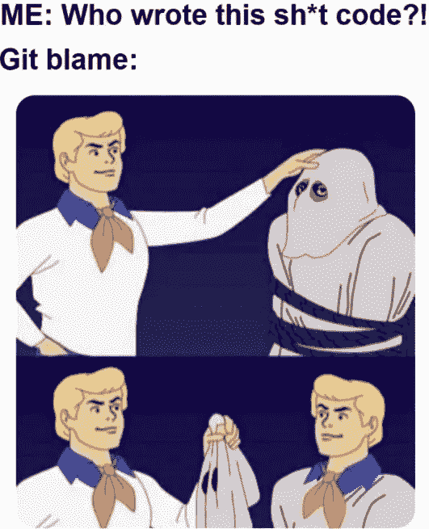

# 软件开发是如何工作的——总是责怪离开的开发人员

> 原文：<https://blog.devgenius.io/how-software-development-really-works-always-blame-the-developer-who-left-c27cd0060896?source=collection_archive---------1----------------------->

## 这并不是说开发人员偏执，人们真的出来指责他们

杰勒特

> 如果你从事软件开发，总会有人来找你。

优秀的开发人员知道如何避免在开发软件时出现的不可避免的指责，你把责任推到别人身上，尤其是那些已经离开的人。离开的开发者背上所有的骂名，这不是意外，这是基本的生存。

开发人员将会因为完全按照指定的方式创建错误的软件而受到指责！，bug，项目迟到，太技术化，不够技术化。

生存的关键是当音乐停止时不要被责备所困，最好的方法是责备一个不会争辩的人。

最应该受到责备的人是离开项目的开发人员。

# **已经走了的开发商**

所有开发人员和开发团队使用的技巧是将任何糟糕的代码或错误归咎于已经离开项目的开发人员。他们逃脱了，他们应该受到谴责，他们不在乎，因为他们不会回来了。

责备一个离开的开发者就像是一个白色的责备，它不会伤害任何人，而是让非开发者高兴。

> **开发者明白创建软件的成本是 bug、错误和问题。**

一个离开的开发人员，或者可以说是逃离的开发人员，会有一种又爱又恨的关系

一方面，他们是对留下来的开发者死心的叛徒。如果他们走进房间，我们会背对着他们(开玩笑)

一方面，我们羡慕那些从软件项目的仓鼠轮上跳下来的开发人员，他们逃离了疯狂。他们为了更好的生活去了天堂。(事实是，他们很快会加入其他地方一个同样疯狂的软件项目)

我倾向于认为离开的开发人员会走上与《肖申克的救赎》中安迪相似的道路

> 他爬过他的临时牢房隧道。之后，他设法用打雷的声音敲开了一根管子，以掩盖他敲击管子的声音。试了三次后，管子爆裂开了。安迪爬过 500 码的下水道，来到一条河里。吃了一顿冷玉米和头发上的垃圾后，他脱掉了囚犯的衣服，享受着自由，然后安迪在换上偷来的衣服前，用肥皂在河里清洗自己。安迪·杜弗兰

离开的开发人员给留下了一份丰厚的礼物，他们成为了项目中 bug、问题或任何垃圾的所有者。就像获得了一张免于牢狱之灾的通行证，在一段时间内，所有的责任都推给了离去的开发者。

*   客户——谁创造了这个 bug，太可怕了，任何人打开页面都能发现
*   开发者——那一定是安迪·杜弗兰，那个离开的开发者，他很糟糕

另一个讨论

*   客户—丢失的文档在哪里
*   开发者——这是安迪·杜弗兰的待办事项，他一定是什么也没做就离开了。

责怪离开的开发人员的好处是他们无法为自己辩护，也没有人能证明不是他们。

# **责备测试者**

开发人员讨厌测试他们自己的工作，因为测试很无聊，开发人员通常与系统管理员一起愉快地检查工作是否正常，测试就结束了。

当客户发现问题时，开发人员会责怪测试人员，他们的测试脚本没有覆盖所有场景。那些测试人员到底在做什么，而不是用不同的数据测试每个场景。开发商将会大张旗鼓地表演和跳舞，制造很多噪音，看起来非常失望。这是为了确保没有人质疑开发人员的单元测试或他们的测试。

# **要求和假设**

错误的一个常见原因是开发人员基于他们对需求的理解而做出的假设。开发人员应该在开始编码之前验证需求，澄清所有假设，不留任何模糊之处。这对于开发人员来说太慢太无聊了，所以他们给出了他们最好的猜测并开始编码。

这些需求被证明是一堆半吊子的废话，一个小孩子都能看出来是不正确的，开发者有麻烦了吗？

哦，不，他们不会，这是创造垃圾需求的顾问的问题，他们在想什么。开发人员不能期望做顾问、测试人员和项目经理的工作。

# **项目后期**

责怪项目经理和客户，永远不要责怪开发人员，他们只是在做他们被告知的事情:-)。

# **垃圾代码**

有时候，你会遇到一个开发人员，他面对的是一段糟糕的代码，糟糕透顶的代码，这是对所有开发人员的侮辱，给开发带来了坏名声。

这对开发商来说一定很可怕吧？

不，当你遇到糟糕的代码时，这很好，因为你可以用它来指责项目中以前的开发人员。陈述自从你到达现场后代码质量是如何真正提高的。

这是一个鼓舞士气的练习，让你感觉良好，但有时会适得其反。当你发现是你创造了让仓库臭气熏天的代码时，这真的会让你大吃一惊。

代码糟糕到让小孩子都哭了！

这是 LinkedIn[上的一条评论，图片显示我们多快就会忘记自己写的代码](https://www.linkedin.com/posts/savicianskas_programming-productdevelopment-engineering-activity-6821686170162929664-GR4D)

