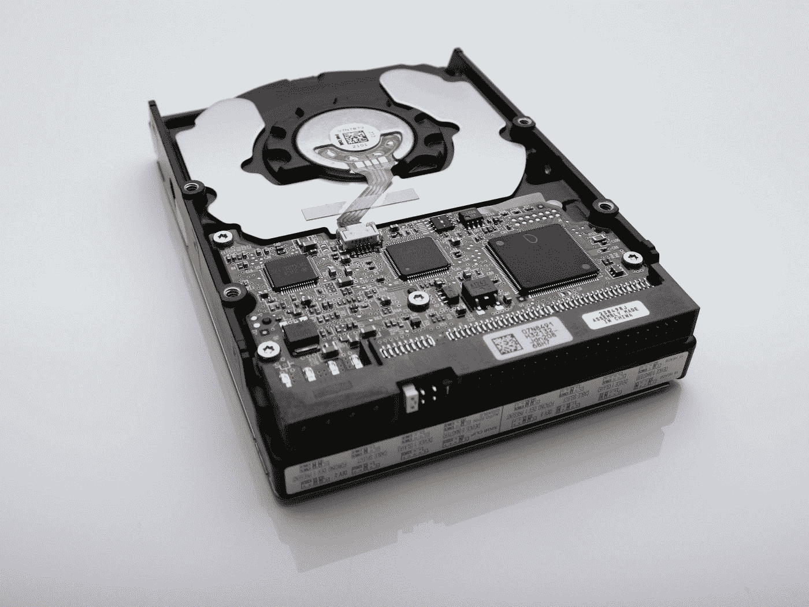

# 存储在 Prometheus 中是如何工作的，为什么这很重要？

> 原文：<https://blog.devgenius.io/how-storage-works-in-prometheus-and-why-is-this-important-1882c340fee2?source=collection_archive---------1----------------------->

## 了解 Prometheus 的基础，它是监控您的工作负载的绝佳解决方案，并将其用于您自己的利益。

文森特·博塔在 [Unsplash](https://unsplash.com?utm_source=medium&utm_medium=referral) 上拍摄的照片

Prometheus 是当今云架构中的关键系统之一。这是继 Kubernetes 之后，云计算原生计算基金会(CNCF)的第二个毕业项目，它是在 Kubernetes 上运行的大多数工作负载的卓越监控解决方案。

如果您已经使用过 Prometheus 一段时间，您会知道它依赖于时间序列数据库，并且它是关键元素之一。根据普罗米修斯官方网页上他们自己的话:

 [## 储存；储备

### Prometheus 包括一个本地磁盘时间序列数据库，但也可以选择与远程存储系统集成…

普罗米修斯](https://prometheus.io/docs/prometheus/latest/storage/) 

每个时间序列都由其度量名称和可选的键-值对(称为标签)唯一标识，该序列类似于关系模型中的表。在每个系列中，我们都有与元组相似的样本。每个样本都包含一个浮点值和一个毫秒精度的时间戳。

## 默认磁盘方法

默认情况下，Prometheus 使用本地存储方法将所有这些样本存储在磁盘上。这些数据分布在不同的文件和文件夹中，对不同的数据块进行分组。

因此，我们用文件夹来创建这些组，默认情况下，它们是一个两小时的块，可以包含一个或多个文件，具体取决于该时间段内接收的数据量，因为每个文件夹都包含该特定时间线的所有样本。

此外，每个文件夹还有某种元数据文件，帮助定位每个数据文件的指标。

当块结束时，文件以完整的方式保持持久，在此之前，它保留在内存中，并使用预写日志技术来恢复数据，以防 Prometheus 服务器崩溃。

因此，从高层次来看，Prometheus 服务器的数据目录的目录结构如下所示:

## 远程存储集成

默认的磁盘存储很好，但在可伸缩性和耐用性方面有一些限制，即使考虑到最新版本的 TSDB 的性能改进。因此，如果我们想探索存储这些数据的其他选项，Prometheus 提供了一种与远程存储位置集成的方法。

它提供了一个 API，允许将获取的样本写入远程 URL，同时能够读回该远程 URL 的样本数据，如下图所示:

与任何与 Prometheus 相关的东西一样，使用这种模式创建的适配器数量是巨大的，这可以在下面的详细链接中看到:

 [## 集成

### 除了客户端库和导出器以及相关的库，还有许多其他的通用集成…

普罗米修斯](https://prometheus.io/docs/operating/integrations/#remote-endpoints-and-storage) 

## 摘要

了解 Prometheus 的存储工作原理对于了解我们如何优化其使用以提高监控解决方案的性能并提供经济高效的部署至关重要。

在以下帖子中，我们将介绍如何优化该存储层的使用，确保只存储重要的指标和样本，以及如何分析哪些指标使用了大部分时间序列数据库，以便能够做出正确的决策，决定哪些指标应该丢弃，哪些应该保留。

所以，请继续关注下一篇文章，关于我们如何能和普罗米修斯一起过上更好的生活，而不是在尝试中死去。