# 卷积神经网络如何看待世界？

> 原文：<https://blog.devgenius.io/how-the-convolutional-neural-network-see-the-world-a36cd102e7c8?source=collection_archive---------4----------------------->

今天，许多最先进的神经网络对于开发人员来说很容易获得，但它实际上是如何工作的呢？我会拿一个 ResNet18 网络，它是 18 层深度残差神经网络，经过预先训练，可以对超过一百万张图像进行图像识别。通过一个简单的 Python 代码，我们将看到“引擎盖下”发生了什么。

# 例子

让我们考虑一个简单的例子，并尝试以编程方式确定该图像上显示的内容:

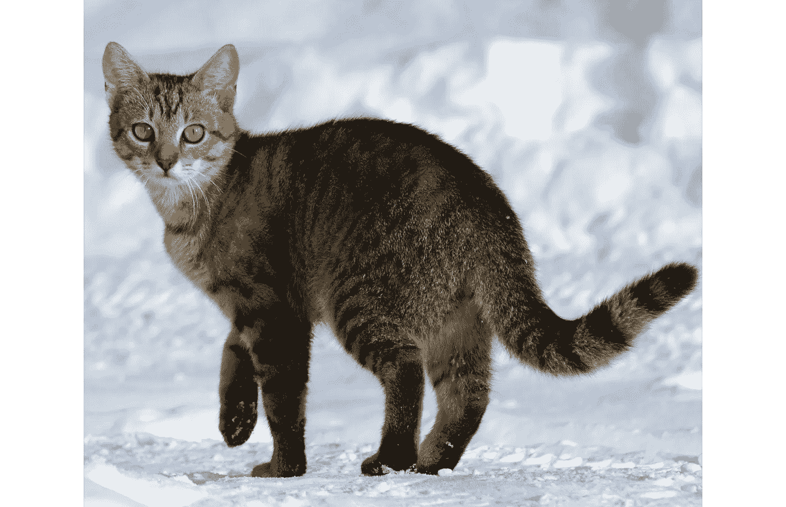

图片来源[https://en.wikipedia.org/wiki/Cat](https://en.wikipedia.org/wiki/Cat)

如果人类或老鼠需要逃离这只猫，这个任务显然很容易，但如果我们想在计算机上做同样的事情，将需要大量的计算。我将使用 [ResNet18 网络](https://pytorch.org/vision/main/models/generated/torchvision.models.resnet18.html)——预先训练的 PyTorch 模型是可用的，我们可以用大约 20 行 Python 代码处理这个图像:

```
import torch
from torchvision import models, transforms, utils
from PIL import Image # Load the image
image = Image.open('cat.jpg')
print("Image size:", image.size)# Prepare the image transform
transform = transforms.Compose([
    transforms.Resize((224, 224)),
    transforms.ToTensor()
])# Load the ResNet18 neural network
device = torch.device('cpu')
weights = models.ResNet18_Weights.DEFAULT
model = models.resnet18(weights=weights).to(device)
model.eval()# Apply transform
x = transform(image).unsqueeze(0)
print("In shape:", x.shape)
# Get the result
result = model(x)
print("Result shape:", result.shape)
class_id = result.squeeze(0).softmax(0).argmax().item()
category_name = weights.meta["categories"][class_id]
print("Name:", category_name)
```

让我们运行代码，看看它是如何工作的:

*   首先，我使用 [Python PIL](https://pillow.readthedocs.io/en/stable/) 库加载图像，在我的例子中，图像大小是 1106x908。然后我创建了 [PyTorch Transform](https://pytorch.org/vision/stable/transforms.html) 对象，按照神经网络的要求，它将图像转换为 224x224 PyTorch 张量。
*   我创建了 ResNet18 神经网络( *resnet18* 类足够智能，可以自动从云中下载预先训练好的神经网络权重)，并使用 [eval](https://pytorch.org/docs/stable/generated/torch.nn.Module.html#torch.nn.Module.eval) 方法，将这个网络从训练模式切换到评估模式。然后，我将图像转换为 224x224 RGB 张量，并应用 *unsqueeze* 方法，将该数组转换为批处理向量(Pytorch 实现针对批处理进行了优化，因此我们可以同时处理几个图像，但在我们的示例中，我们在一个批处理中只有一个图像，因此 *x.shape* 具有[1，3，224，224]维)。
*   然后我运行这个模型，作为输出，我得到了一个[1，1000]-形状向量，其中 1 是我的批处理的大小，1000 是 ImageNet 类别的数量，ResNet18 就是在这个类别上训练的。我用了一个*挤压(0)。softmax(0)* 将输出值转换为元素和等于 1.0 的归一化向量的方法。

这就是我们所需要的。输出向量中的最大值对应于 1000 个可能类别之一的最高概率。我们可以很容易地打印出这个向量，并看到这样的值: *0: 0.00000，…，281: 0.05865，282: 0.25574，283: 0.00104，284: 0.00169，285: 0.28217，286: 0.14241，287: 0.18773，288: 0.00213，289 对于提供的图像，最大值是第 285 位的 *0.28217* ，这给了我们标签名“埃及猫”(名字和 id 可以很容易地在网上找到)，另一个接近的对象是第 282 位的一只“虎猫”。我不是猫品种方面的专家，但对我来说，两个结果看起来都很准确，所以这个网络是有效的。显然没有必要手动进行这种搜索，在代码中我使用了 *argmax()。item()* 方法*，*其中给出了最大值，并且从“categories”元数据中我们可以很容易地得到合适的名称。*

如果我们想检测相机图像上猫的存在，并制作类似自动喂猫器的东西，可以在 Raspberry Pi 上运行这段代码。是文章的结尾吗？显然不是，有一些“魔法”在里面，我们得到了结果，但仍然不清楚它实际上是如何工作的。让我们更深入一层，看看内部数据流。

首先，让我们在 Python IDE 中点击“转到定义”或者打开 [resnet.py](https://github.com/pytorch/vision/blob/main/torchvision/models/resnet.py) source:

```
class ResNet(nn.Module):
  def __init__(...) -> None:
    super().__init__()
    self.inplanes = 64
    self.conv1 = nn.Conv2d(3, self.inplanes, kernel_size=7,
                           stride=2, padding=3, bias=False)
    self.bn1 = norm_layer(self.inplanes)
    self.relu = nn.ReLU(inplace=True)
    self.maxpool = nn.MaxPool2d(kernel_size=3, stride=2, padding=1)
    self.layer1 = self._make_layer(block, 64, layers[0])
    self.layer2 = self._make_layer(block, 128, layers[1], 
            stride=2, dilate=replace_stride_with_dilation[0])
    self.layer3 = self._make_layer(block, 256, layers[2], 
            stride=2, dilate=replace_stride_with_dilation[1])
    self.layer4 = self._make_layer(block, 512, layers[3], 
            stride=2, dilate=replace_stride_with_dilation[2])
    self.avgpool = nn.AdaptiveAvgPool2d((1, 1))
    self.fc = nn.Linear(512 * block.expansion, num_classes)
```

这些都是在 ResNet18 网络中呈现的层。让我们更详细地检查一下。

# 卷积层

许多图像处理网络以及 ResNet 都基于使用卷积层，因此了解其工作原理非常重要。卷积是将特定滤镜(内核)应用于图像层的数学运算。这个动画是使用 [GIF_convolutions](https://github.com/AxelThevenot/GIF_convolutions) 工具制作的:

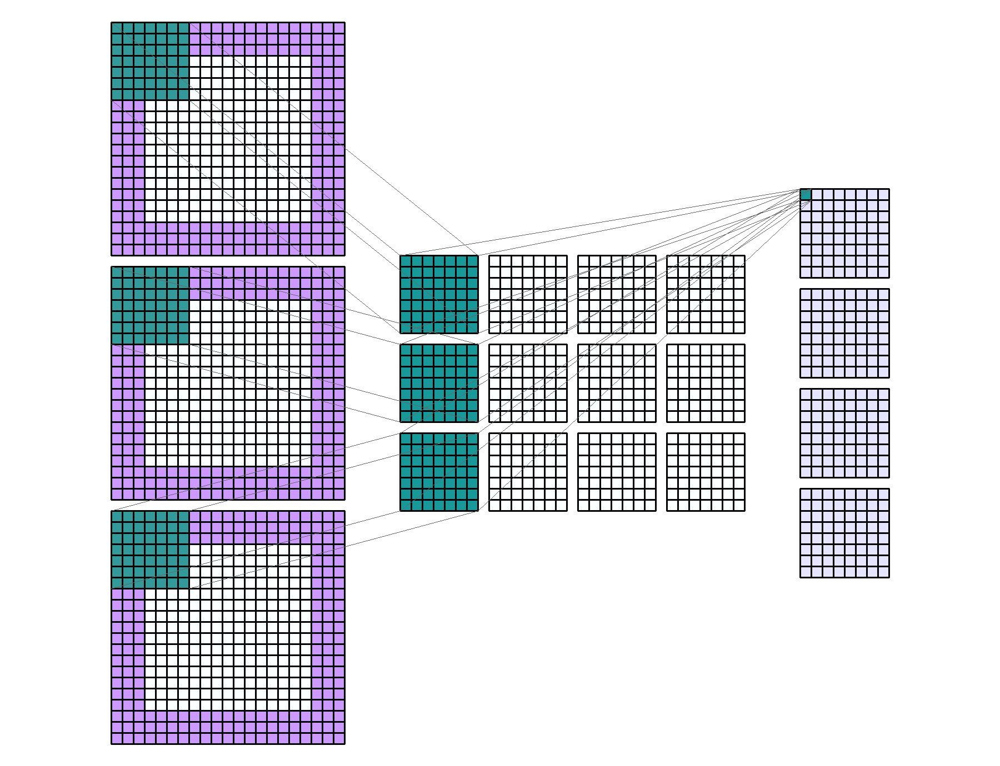

卷积层处理，作者图片

为了清晰起见，此动画被简化，这里我们有一个较小的输入大小(15x15 而不是 224x224)和只有 4 个输出通道(ResNet18 有 64 个通道)，但逻辑保持不变。卷积本身就是层和内核项的逐项相乘的总和:


卷积公式，来源[https://py torch . org/docs/stable/generated/torch . nn . conv2d . html](https://pytorch.org/docs/stable/generated/torch.nn.Conv2d.html)

# ResNet18 数据流

卷积层是许多神经网络的基本构建模块，现在我们可以理解 ResNet18 是如何工作的。但是首先，让我们制作一些可视化数据的助手:

```
import torchvision.transforms as T
import matplotlib.pyplot as pltdef show_grid(layer, s):
    # Show the layer data as a grid of size s=(w, h)
    images = []
    for p in range(s[0]*s[1]):
        images.append(layer[p])

    fig = plt.figure(figsize=(12, 12))
    transform = T.ToPILImage()
    grid = ImageGrid(fig, 111,  nrows_ncols=s, axes_pad=0.1,  )
    for ax, im in zip(grid, images):
        ax.imshow(transform(im))
    plt.show()def show_single_image(data):
    # Show single image "as is"
    transform = T.ToPILImage()
    img = transform(data)
    plt.imshow(img)
    plt.tick_params(axis='both',  which='both',
        bottom=False, top=False, left=False, right=False,
        labelbottom=False)
    plt.show()def show_kernels(layer):
    # Show convolution kernels
    kernels = layer.weight.detach().clone()
kernels = kernels - kernels.min()
    kernels = kernels / kernels.max()
filter_img = torchvision.utils.make_grid(kernels, nrow=8)
    plt.imshow(filter_img.permute(1, 2, 0))
    plt.show()
```

现在我们有了检查网络的所有工具。让我们检查一下 [resnet.py](https://github.com/pytorch/vision/blob/main/torchvision/models/resnet.py) 中的 *_forward_impl* 方法，它包含了 ResNet18 中的实际数据处理:

```
def _forward_impl(self, x: Tensor) -> Tensor:
x = self.conv1(x)
    x = self.bn1(x)
    x = self.relu(x)
    x = self.maxpool(x)

    x = self.layer1(x)
    x = self.layer2(x)
    x = self.layer3(x)
    x = self.layer4(x)

    x = self.avgpool(x)
    x = torch.flatten(x, 1)
    x = self.fc(x)
    return x
```

我们要做的，就是使用这些代码(每个开发人员都知道复制粘贴是重用代码最常见的方式；)并逐个调用内部方法。先说第一个。我们现在使用下面的代码代替前面代码片段中的代码行 *result = model(x)* :

```
model = models.resnet18(weights=weights).to(device)
model.eval()x = model.conv1(x)print("L0 Conv2d Output:", x.shape)show_grid(x[0], (8, 8))
```

我们可以看到，原始的 224x224 图像被转换为 64 个 112x112 图像，每个图像都使用不同的内核进行转换:

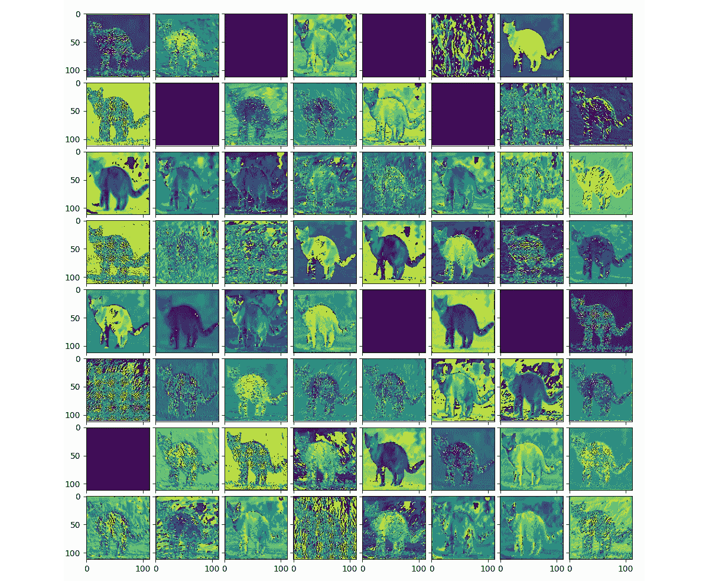

第一个 Conv2D 图层输出可视化，图像由作者提供

每个 64x64 通道实际上是单色的，这些“伪彩色”是通过 ToPILImage 变换添加的。而卷积核本身呢？我们也可以把它们形象化:

```
show_kernels(model.conv1)
```

结果很有趣，在这里我们可以看到不同的模式，这有助于网络提取图像的不同独特特征:

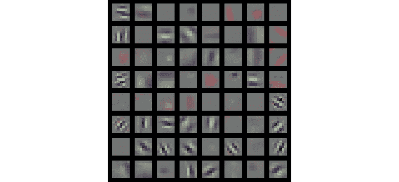

第一个 Conv2D 层内核可视化，图片由作者提供

让我们回到 *_forward_impl* 方法。接下来的两行调用了 [BatchNorm2d](https://pytorch.org/docs/stable/generated/torch.nn.BatchNorm2d.html) 和 [ReLU](https://pytorch.org/docs/stable/generated/torch.nn.ReLU.html) 类方法，它们对图像进行规范化并删除负值。让我们删除前面的 *show_grid* 调用，并在代码中添加 3 行新代码:

```
x = model.bn1(x)x = model.relu(x)
show_grid(x[0], (8, 8))
```

显然，输出尺寸保持不变，但我们可以看到，与上一个相比，猫的图像与背景分离得更好:

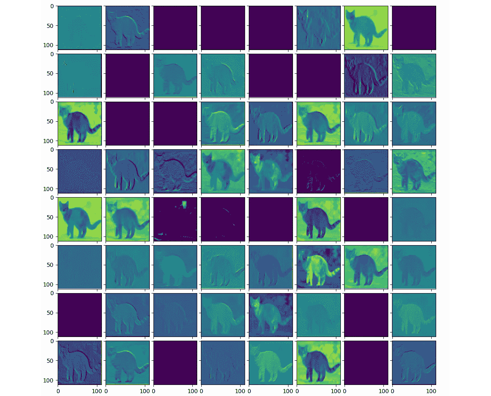

ReLu 层输出可视化，按作者排序的图像

接下来的转换更有趣。MaxPool2d 层正在将每张图像的尺寸从 112x112 缩小到 56x56 像素。然后，我们有 4 个层，它们有自己的卷积和内核，这使得图像的变换更加剧烈。我们可以通过检查 *print(model)* 输出获得更多细节，如下所示:

```
(layer1): Sequential(
    BasicBlock(
      Conv2d(64, 64, kernel_size=(3, 3), stride=(1, 1), 
             padding=(1, 1), bias=False)
      BatchNorm2d(64, eps=1e-05, momentum=0.1, 
             affine=True, track_running_stats=True)
      ReLU(inplace=True)
      Conv2d(64, 64, kernel_size=(3, 3), 
             stride=(1, 1), padding=(1, 1), bias=False)
      BatchNorm2d(64, eps=1e-05, momentum=0.1, 
             affine=True, track_running_stats=True)
    )
    BasicBlock(
      Conv2d(64, 64, kernel_size=(3, 3), stride=(1, 1), 
             padding=(1, 1), bias=False)
      BatchNorm2d(64, eps=1e-05, momentum=0.1, affine=True,
              track_running_stats=True)
      ReLU(inplace=True)
      Conv2d(64, 64, kernel_size=(3, 3), stride=(1, 1), 
           padding=(1, 1), bias=False)
      BatchNorm2d(64, eps=1e-05, momentum=0.1, 
           affine=True, track_running_stats=True)
    )
  )
```

正如我们所见，该层本身相当复杂，我们不打算检查每一步。让我们检查第 1 层的最终输出:

```
x = model.maxpool(x)
x = model.layer1(x) *show_grid(x[0], (8, 8))*
```

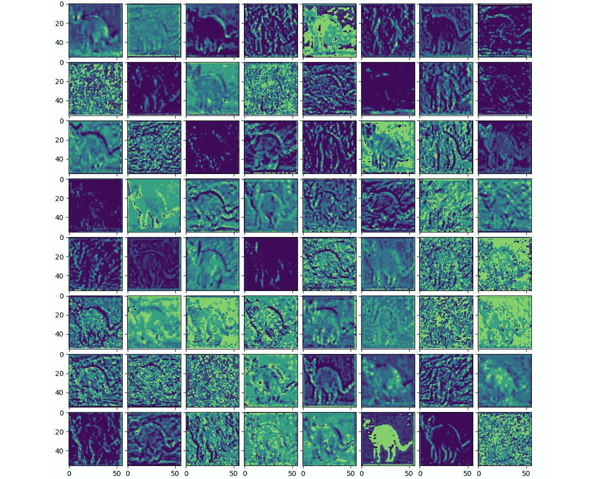

第 1 层输出可视化，按作者分类的图像

第 2 层后的图像:

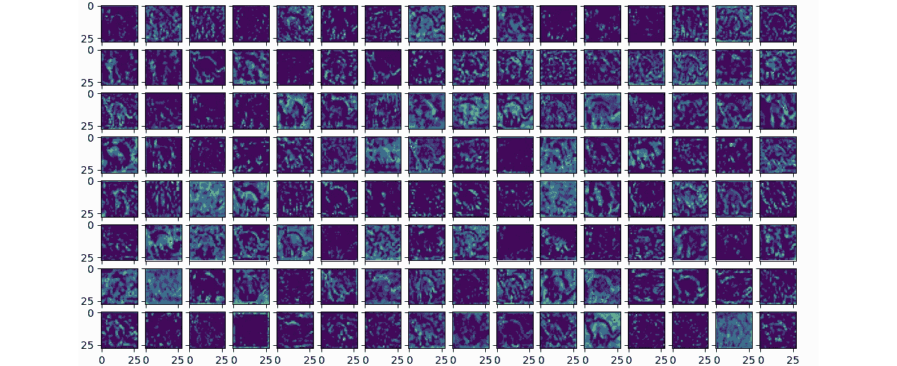

第 2 层输出可视化，按作者显示图像

在这一步，来自第一层输出的 64 个 56×56 的图像被转换成 128 个 28×28 的图像，看起来更像原始图片的“抽象”表示。

第 3 层之后的图像:输出是 256 个 14x14 的图像

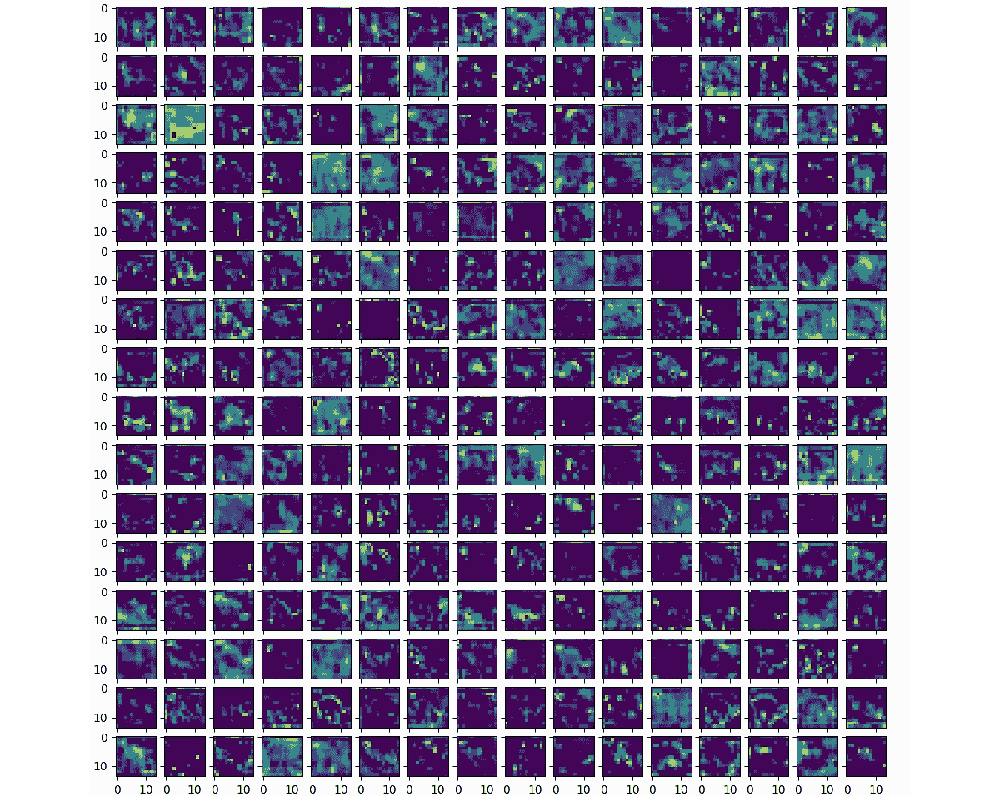

第 3 层输出可视化，按作者显示图像

第 4 层之后的图像:输出为 512 幅 7x7 图像

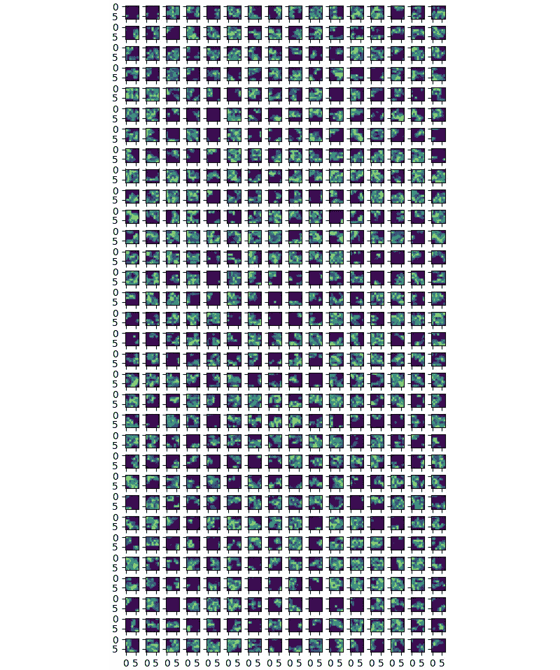

第 4 层输出可视化，按作者显示图像

正如我们所看到的，在第 3 步和第 4 步之后，图像对人类来说越来越难以理解，但从数学上来说，这些图案仍然代表了猫图像的最常见特征。之后，使用一个 [AdaptiveAvgPool2d](https://pytorch.org/docs/stable/generated/torch.nn.AdaptiveAvgPool2d.html) 类，将这些图像转换为*单点*，于是猫的原始图像经过所有卷积后就变成了只有一组 512 像素的图像。我们也可以把它形象化:

```
x = model.avgpool(x)show_single_image(x.reshape((32, 16)))
```

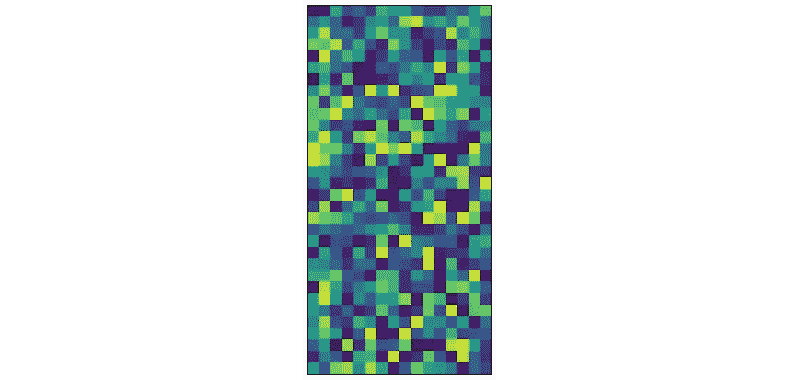

AvgPool2d 输出可视化，图片由作者提供

*model.avgpool* 输出是一组 512 像素的 1D，这里选择矩形只是因为它更适合屏幕尺寸。没人知道这是一只猫，但这实际上是这只猫的最终内部表现，由 ResNet18 神经网络制作。也许在我们人类的大脑中，我们有一些相似的东西，一种抽象的表达？因为当我们想到猫的时候，我们通常不会保留具体猫的任何微小细节，而只是有一个“大概”的想法。此外，在 50 年代和 60 年代，在真实大脑的视觉皮层中发现了类似卷积的结构,因此很有可能我们的大脑也有类似的神经元激活机制。

最后但同样重要的是，ResNet18 网络的输出是一个线性(完全连接)层，它将这 512 个值“映射”到 1000 个可能的类别中:

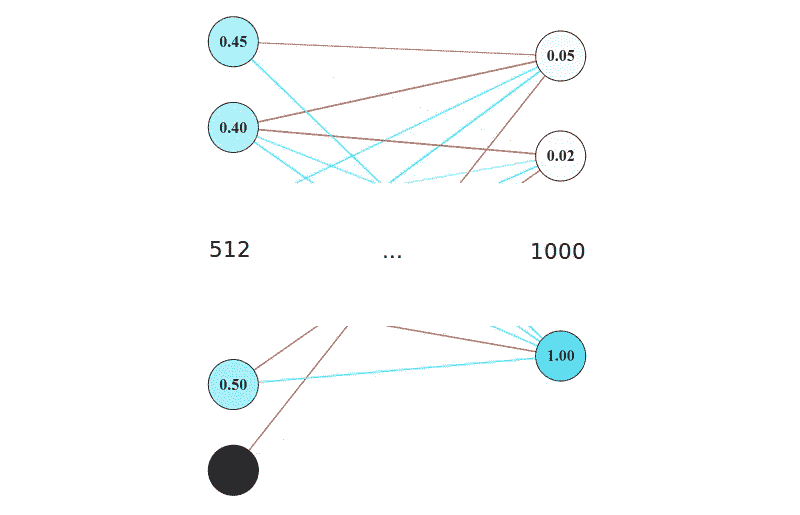

按作者输出线性图层、影像

如前所述，输出图层提供的最大值对应于训练网络时所依据的数据集中的特定标注。

# 结论

看到像 ResNet18 这样的神经网络如何在“引擎盖下”工作是很有趣的。通过一个简单的 Python 代码，可以看到正在发生的事情，并可视化每一步的数据。想到这样一个仅基于相对简单的数学运算的结构，可以被训练成从现实世界中识别非常复杂的图像，真是令人惊讶。

像往常一样，我建议读者自己做实验，这会让你更好地理解事物是如何工作的。

祝你好运，感谢你的阅读。