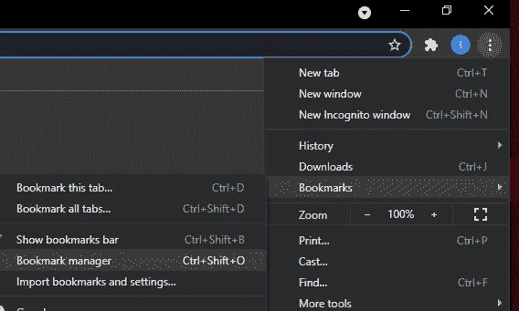
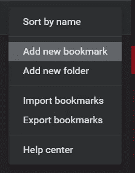
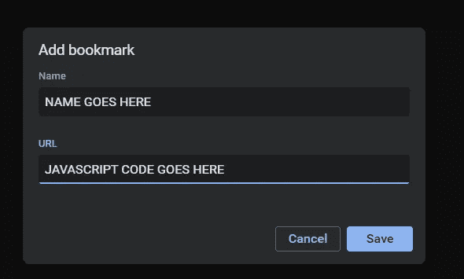

# 怎么了🦆我不是听说过书签吗！！！

> 原文：<https://blog.devgenius.io/how-the-did-i-not-hear-about-bookmarklets-288a983e28a?source=collection_archive---------1----------------------->

前几天我在一些论坛上冲浪，一个家伙正在为一些社交应用/游戏创建基本脚本，我注意到一个有趣的词“bookmarklet ”,我立即想到了一个普通的浏览器书签，但后来…我向下滚动，看到一些 javascript……哇😕

**谷歌时代**

所以我做了任何普通开发人员都会做的事情，并决定谷歌一下，在我惊讶不已之后，我回到 youtube，找到了一个关于它们的[的很棒的教程](https://www.youtube.com/watch?v=DloHqUfPbJc&t=878s)，我决定是时候写我自己的书签了，因为我脑子里突然有了很多想法

**那么到底什么是书签工具呢**🤔

*希望你们喜欢这篇文章中的表情符号* ☺️

所以我假设我们都知道什么是浏览器扩展，bookmarklet 是为你的浏览添加更多功能的一种非常简单的方式，因为它只是一个被点击的 javascript 文件——就像在任何书签中一样，会执行代码

**如何开始写自己的书签？**

要开始编写自己的 bookmarklets 来自动化天知道哪些任务和哪些网站，请打开您最喜欢的文本编辑器并粘贴以下代码

只是一个非常简单的 hello world 警报，我们马上就要讲到它了

我们的代码简单地构造了一个自调用函数，它基本上在文件运行时就运行，而不需要调用函数的传统方式

我们在开头添加了`javascript:`,因为它告诉浏览器以下内容

*这是一个书签，但我想让你帮我运行这段 javascript 代码，而不是导航到一个 URL*

是的，我们可以在地址栏中运行 javascript 代码，如果你不知道的话，只需简单地输入`javascript:`后跟任何有效的 javascript 语句，但问题是你需要将你的代码包装在一个函数中——常规的或匿名的，这样浏览器就知道它必须运行它，因为否则什么都不会发生

好的，那么我该如何运行它呢？

1.  Chrome 用户点击右上角的三个点->书签->书签管理器

2.从那里选择添加新书签，选择一个名称，然后为 URL 部分**复制粘贴来自你的文本编辑器的代码，并点击回车**

如果您已经启用了书签工具栏，您应该会在那里看到书签小程序

**更复杂的代码**

现在，您已经知道了用 javascript 运行书签工具的内容和方法，让我们来探索一下这些知识的威力，以及为什么使用这些书签工具很重要

Bookmarklets 在每个被调用的页面上执行:我发现这是一个非常有用的特性，因为它为如此多的项目想法和创意打开了大门

我知道你可能和我一样想知道，如果我想添加更复杂的代码，我是不是应该把它们都放在一行里？答案是肯定的，你真的不用担心

如果你从你的文本编辑器中复制粘贴，谷歌 Chrome 将处理转义字符,所以只需写一些代码，贴在那里，点击它；)

**打造有用的东西……..有希望地😄**

让我们构建一个书签小程序，您可以突出显示 select，然后一旦您单击书签小程序，它就会大声朗读出来😅

回到你的文本编辑器，这次把这个放进去😉

web APIs 不就是这么神奇吗😍，所以脚本首先获取用户高亮显示的文本，并将其保存到变量中

然后我们检查我们是否真的有一个文本，文本合成 API 非常简单，你只需要用`window.speechSynthesis`初始化它，然后你需要一个`speechSynthesis.Uterrance()`对象，我们将选择的文本传递给它

最后我们用`speechSynthesis`对象说出传递给那个`SpeechSynthesisUterrance`对象的话

现在你可以用这个书签工具给你读你选择的任何东西了！

**我如何分享这些信息？**

遗憾的是，分享一个书签并不是最直接的方式，尤其是对于不太懂技术的人来说，所以允许别人“安装”它们仍然有点低效，这就是为什么有一个东西叫做用户脚本，如果你们喜欢这个，我会在以后的博客中介绍它😃

**使用书签的利与弊**

*   一个巨大的优势在于它的可移植性，当然，如果应用了正确的逻辑，它可以在任何页面上快速执行
*   正如我上面提到的，与扩展不同，设置并开始使用它的工作要少得多
*   与扩展相比，它们在某种程度上实现了更好的安全性，因为代码只在调用一次后运行，而不像浏览器扩展中的服务工作者脚本那样容易被用于有害目的，因为它可以在后台运行
*   一个主要的缺点是它们不像扩展那样在后台运行，所以只有当书签被点击时它们才会“活过来”
*   不方便分享/分发
*   最后——对我来说这不是一个严重的问题，但是代码部分不是最优雅的，因为我们必须把所有的东西都放在一行中，但是不管怎样，多亏了 chrome 字符的转义😌

**结论**

Bookmarklets 是一个非常强大的工具，可以进一步控制你的浏览体验，想想它们带来的所有可能性

*   网页抓取
*   使用`prompt()`接收用户输入，然后用它做一些事情
*   自动点击
*   adblock

等等等等，简直要发疯了👀

非常感谢你们能走到这一步，我希望你们能像我在♥️一样学到一些东西