# DNS(域名系统)是如何工作的？

> 原文：<https://blog.devgenius.io/how-the-dns-domain-name-system-works-48de65270f8e?source=collection_archive---------0----------------------->

域名系统的内部运作

**数据中心的以太网电缆**

# 介绍

你有没有想过当你在浏览器中输入任何一个网址时，幕后会发生什么？每当我们键入一个网站地址，比如 www.google.com 的 T2，浏览器在几毫秒内就会给我们加载一个页面。浏览器执行多项任务，如网站 ip 地址查找、加密、响应解析等。最后，我们有了一个好看的网页，我们可以与之互动。

如果你使用的是优步、脸书或抖音等移动应用，你甚至不用输入网址。应用程序本身会处理所有事情，并处理每个用户请求。

任何客户端设备在访问网站之前的第一步都是 DNS 查找。DNS 是域名服务器，其工作是将网站名称转换为 IP 地址。这是最重要的组成部分，DNS 级别的中断会导致任何网站瘫痪。

在本文中，我们将深入探讨 DNS 的内部结构以及为什么需要它。我们将了解处理 DNS 查询所涉及的不同组件。此外，我们将了解流程中涉及的优化和漏洞。

# 为什么是域名服务器？

互联网上的每个网站都驻留在服务器上。你可以把每个网站想象成运行在互联网上百万台计算机中的一台上的应用程序。当你输入一个网站名，比如 www.google.com 的[，](http://www.google.com,)时，你的浏览器怎么知道要联系哪台电脑呢？电脑只处理 1 和 0，对网站名称没有任何概念。

**电脑只懂 1 和 0**

每台托管网站的计算机都由 IP 地址唯一标识。类似于我们有一个家庭地址，每个网站也驻留在一台有 IP 地址的计算机上。就像一栋建筑可以有多个公寓一样，一台电脑可以托管多个网站。

对于任何连接到网络服务器的设备，它必须知道托管它的计算机的 IP 地址。有两种类型的 IP 地址 IPV4 和 IPV6。IPV4 地址的格式为 10.45.0.98、10.32.64.32。2405:200:1602::312c:8220 是 IPV6 地址。我们很难记住 IP 地址。此外，网站可以从一台计算机移动到另一台计算机。在这种情况下，网站的 IP 地址会改变。

我们记不住人们的电话号码，所以我们把它们存储在日记或手机通讯录中。同样的原则也适用于网站。DNS 就像所有网站的 IP 地址主管。当在浏览器中输入新的 url 时，浏览器会联系 DNS 以解析 IP 地址，然后启动与网站的通信。

# 域名系统是做什么的？

DNS 是一组负责存储互联网上每个网站的 IP 地址的实体。任何实体都可以在任何网站上执行查找并获得其 IP 地址。让我们打开一个新的浏览器选项卡，并启动开发人员工具。我访问了网站[www.facebook.com](http://www.facebook.com)，以下是网络中*计时*部分的详细信息:-

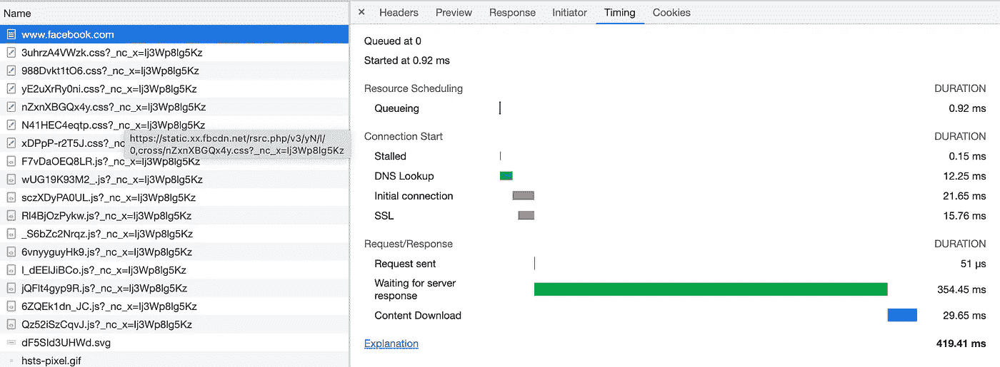

**加载网站所需的时间**

正如所观察到的，有一段 DNS 查找花费了 ***12.25 毫秒*** 来完成。加载网站的总时间为 ***419.41 毫秒*** 。

现在，让我们看看这个服务器的 IP 地址。标题部分将显示该网站的 IP 地址。DNS 查找返回了网站的 IPV6，我们的浏览器向同一服务器发送了一个请求。

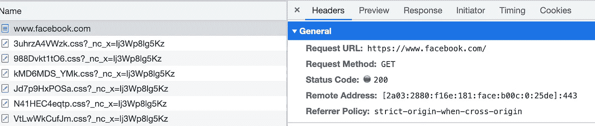

**远程地址是网站**的 IP 地址

有一个名为`***nslookup***`的命令行工具可以帮助你找到任何网站的 IP 地址。让我们试着在`[www.google.com](http://www.twitter.com.)`网站上表演一个`***nslookup***`[。](http://www.twitter.com.)

**nslookup on**[**www.google.com**](http://www.google.com)的结果

上图显示了在`[www.google.com](http://www.google.com.)`T30 上完成`***nslookup***`的结果。如果您在浏览器中使用上述 IP 地址，您将被重定向到 google。

如下图所示，我在浏览器的地址栏中输入 IP 地址，它将我重定向到`[www.google.com](http://www.google.com.)` [。](http://www.google.com.)

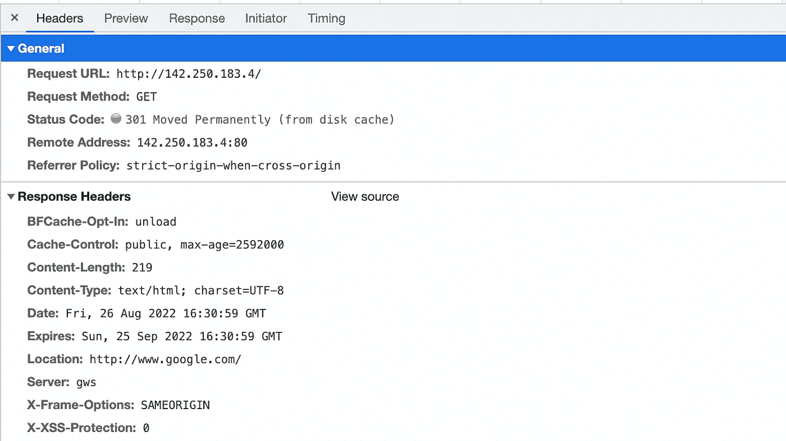

**http 重定向到 www.google.com**

# DNS 的重要性

DNS 设计得非常好，它对最终用户隐藏了很多复杂性。如果 DNS 停止工作，您将无法访问任何网站。

微软经历了一次中断，因为它的 DNS 服务器被查询淹没，没有响应。它冲击了微软的大部分产品，如 Xbox、OneNote、OneDrive、Dynamics 365 等。

2021 年 10 月，脸书(Meta)发生停电，导致 Instagram、脸书和 WhatsApp 近 6 个小时不可用。停电期间，脸书损失了近 1.6 亿美元。这解释了 DNS 在互联网上扮演的重要角色。

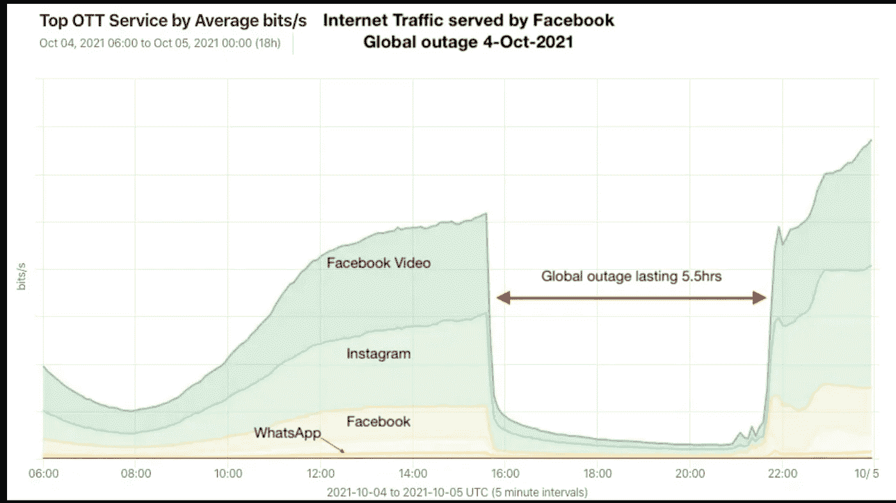

# **DNS 查找是如何工作的？**

到目前为止，我们已经知道 DNS 就像是世界上所有有效网站的目录。你可能会想，一台计算机就足以容纳所有这些信息。但 DNS 的情况并非如此。现在让我们了解一下 DNS 的内部工作原理。

如果一台服务器存储所有网站的地图，会发生什么？每秒钟都有数万亿个客户端发送的请求。一台服务器无法处理这么多请求。它将成为瓶颈和单点故障。因此，该系统由分布在全球各地的不同组件组成。

DNS 系统由多个组件组成。以下是所涉及的不同组成部分

*   DNS 解析器
*   根服务器
*   TLD(顶级域名)服务器
*   权威名称服务器

让我们理解请求处理流程，并深入研究每个组件。

## DNS 解析器

当您第一次在浏览器中键入 url 时，浏览器不知道该网站的 IP 地址。浏览器首先联系 DNS 解析器。解析器由互联网服务提供商(ISP)管理。

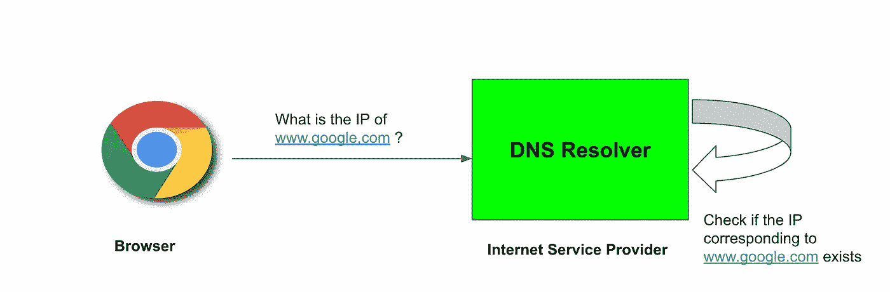

**浏览器向 DNS 解析器发送请求**

解析器检查它是否具有对应于该网站的 IP 地址。如果是，那么它将相同的内容返回给客户机(浏览器)。如果解析器找不到 IP 地址，它会向 DNS 根服务器发送一个请求。

## 根服务器

在了解根服务器之前，我们先做一个快速实验。你可以在任何已知的网站上添加一个点(。)到底。例如:如果网站是`[**www.gmail.com**](http://www.gmail.com,)` [，](http://www.gmail.com,)那么它将是`**www.gmail.com.**`。

现在，在浏览器的地址栏中输入这个网站(附加点)。你的浏览器会带你去那个网站，就像没有附加点一样。如果用任何其他字符如`+`、`[`、`]`等替换点号，请求将会失败。

**浏览器无法打开我的博客，我的博客最后有一个`'**

一个网站的 URL 由多个部分组成，由一个`.`分隔。DNS 系统是以层级的形式组织的。`.`(圆点)出现在顶部，顶级域名如`com`、`org`、`edu`、`gov`等为其子域名。每个顶级域名指的是实际的网站，如`[www.wikepedia.org](http://www.wikepedia.org,)` [、](http://www.wikepedia.org,) `[www.google.com](http://www.google.com,)` [、](http://www.google.com,)等。每个网站可以定义自己的域，例如:-网站`medium.com`有`animeshgaitonde.medium.com`作为子域。

下图解释了层次结构。

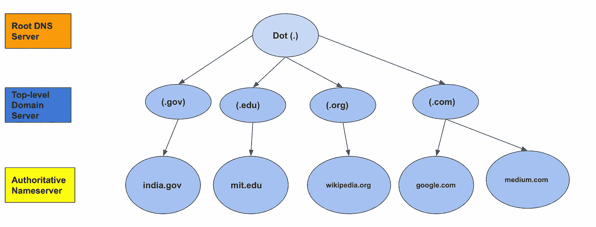

**DNS 层级**

根服务器出现在顶部，负责标识顶级域(TLD)服务器。因此，如果您发送一个针对`[www.wikepedia.org](http://www.wikepedia.org)`的 dns 查找查询，在这种情况下，顶级域是`.org`。因此，根服务器现在将向顶级域服务器发送查询以解析 IP 地址。

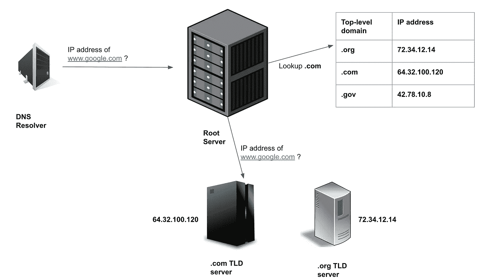

**处理 DNS 查询的根服务器**

有 13 个不同的根 DNS IP 地址。根 DNS 服务器由不同的组织管理，如马里兰大学、VeriSign、NASA 等。在幕后，有近 1000 个不同的根服务器来确保高可用性和冗余性。服务器遍布全球。由于 IPV4 地址的原始限制，他们只为根 DNS 服务器分配了 13 个不同的 IP。

## 顶级域服务器

顶级域名服务器管理和存储对每个网站的实际名称服务器的引用。一旦根服务器识别出顶级域服务器，它就发送一个 dns 查询。

顶级域名现在查找 url 的下一部分。在每个服务器上，url 以从右到左的方式被遍历。因此，如果网站是`[www.google.com](http://www.google.com,)`，那么顶级域名服务器将试图找到存储`google.com`的服务器。存储网站到其 IP 地址的实际映射的服务器被称为权威名称服务器。

一旦获得权威名称服务器的 IP 地址，TLD 就将请求委托给它。

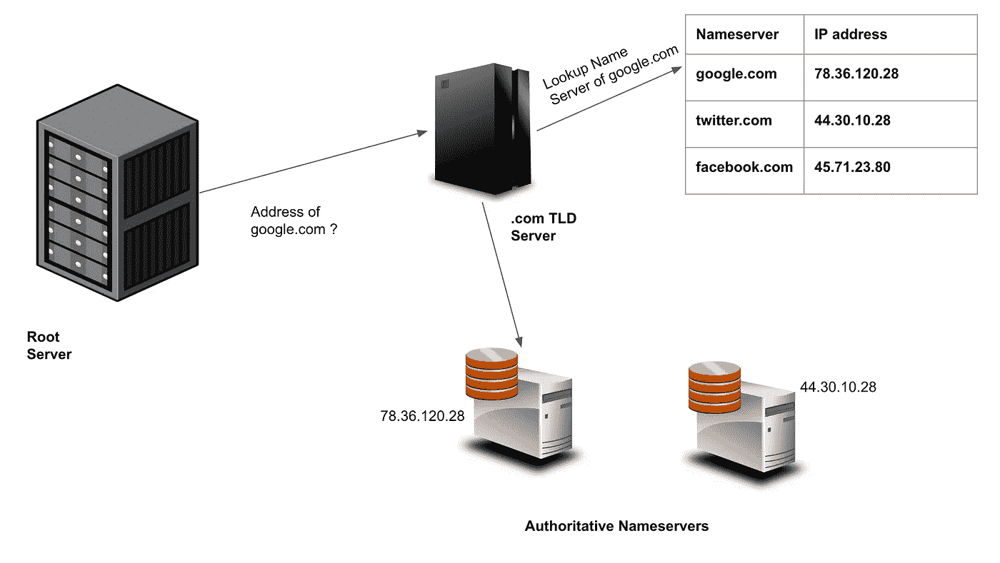

**TLD 服务器解析域名服务器**

现在，你可能会问 TLD 服务器是如何了解权威域名服务器的。这发生在域名注册期间。有一些被称为域名注册商的实体将这些信息发布到每个 TLD 服务器上，并使网站可用。

## 权威名称服务器

最后，请求到达权威的名称服务器。然后，名称服务器检查网站名称与其 IP 地址之间的映射是否存在。

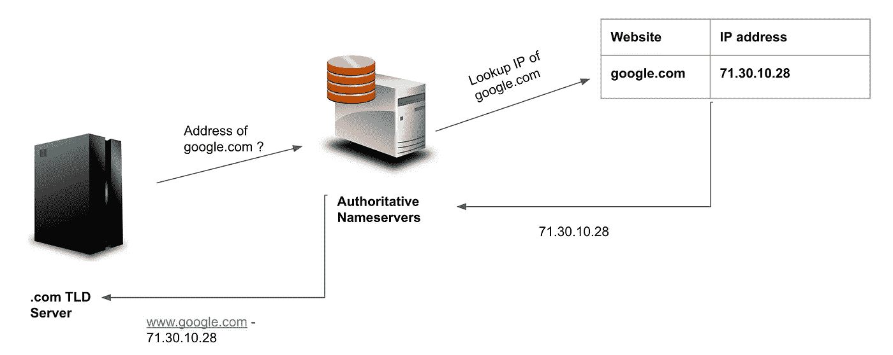

**域名服务器返回网站 IP 地址**

如果是的话，那么同样的信息被传递回客户端。然后，客户端使用 IP 地址，并向托管网站的服务器发送请求。

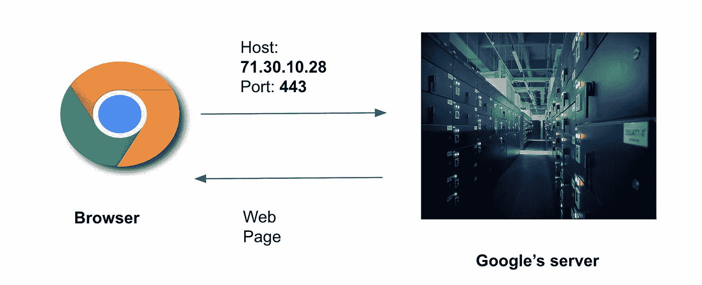

**浏览器访问网站**

如果网站不存在，那么它不会返回任何地址。客户将无法访问该网站。如果浏览器无法获得网站的 IP 地址，它会显示以下错误。

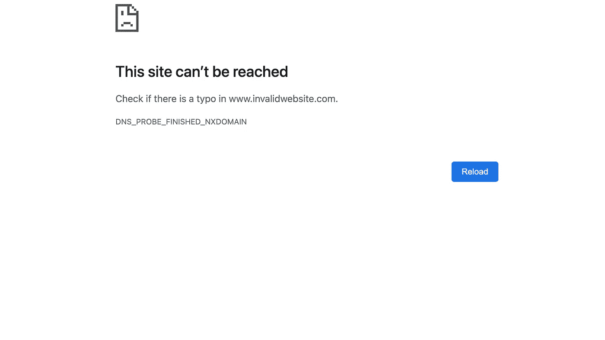

**进入**[**www.invalidwebsite.com**](http://www.invalidwebsite.com)

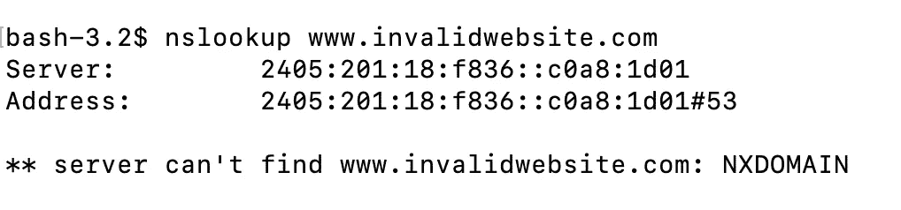

**nslookup on**[**www.invalidwebsite.com**](http://www.invalidwebsite.com)

同样，`nslookup`也返回类似的结果，其无法获得给定网站的 IP 地址。

# DNS 查询的类型

有两种类型的 DNS 查询—递归和迭代。

## 递归 DNS 查询

我们在上一节中看到了这种类型的查询。第一个请求发送到 DNS 解析器。如果 DNS 解析器找不到映射，它会将请求发送到根服务器。此外，根服务器将查询发送到 TLD 服务器。这种情况一直持续到请求到达最终的权威名称服务器。

递归 DNS 查询的工作原理如下图所示。

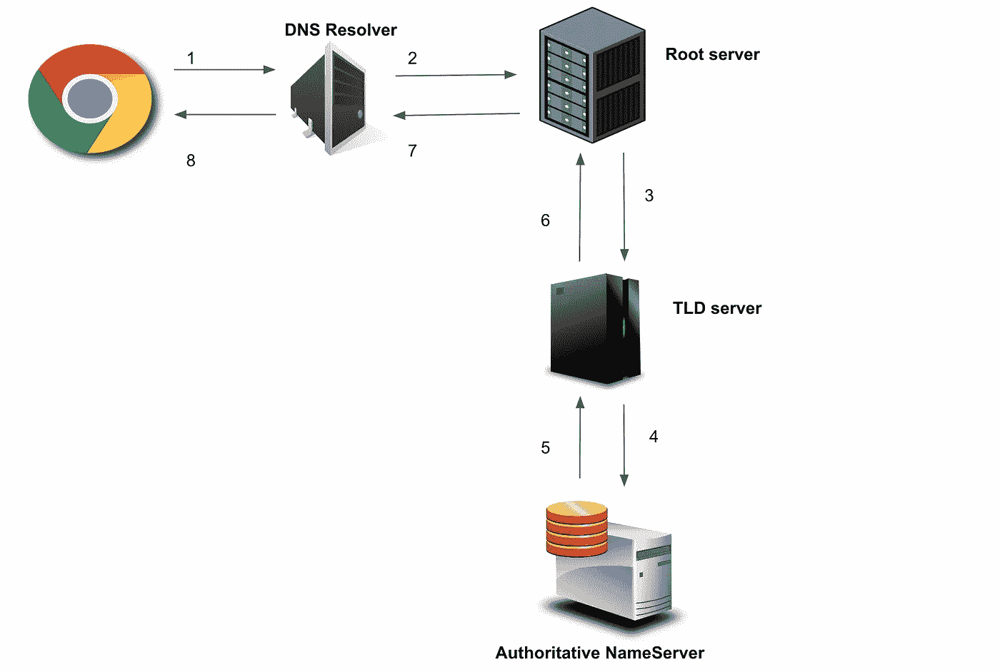

递归 DNS 查询

响应从权威的名称服务器开始传递，直到到达客户端。因此，每个组件负责将请求转发给后续组件。递归 DNS 查询比迭代查询更快。

## 迭代 DNS 查询

在这种类型中，DNS 解析器首先向根服务器发送请求。然后根服务器回复 TLD 服务器的信息。解析器然后查询 TLD 服务器。此外，TLD 服务器会将权威名称服务器返回给解析器。最后，解析器将联系权威的名称服务器

下图说明了迭代 DNS 查询的工作原理。

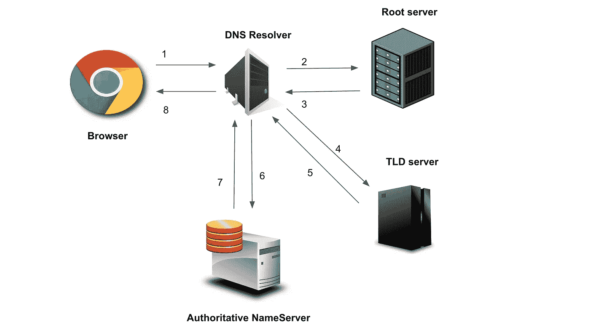

**迭代 DNS 查询**

在迭代 DNS 查询中，DNS 解析器主动参与向每个 DNS 组件发送请求。与递归查询不同，DNS 组件之间没有交互。每个组件只是将下一个组件的地址发送给解析器。由于多次来回通信，这些类型的查询需要较长的时间。

# 优化 DNS 查找查询

我们在其中一幅图中看到，DNS 查找时间为 12.25 毫秒。这因每个网站而异，取决于互联网流量和地区。由于 http 是无状态的，浏览器每次访问新页面时都必须向服务器发送 http 请求。

浏览器是否会对您在网站上访问的每个页面执行 DNS 查找？想象一下，如果它每次访问网站资源时都执行 DNS 查找，会发生什么。

缺点是访问任何页面时会有 10-20 毫秒的额外延迟。此外，DNS 服务器会被请求淹没。此外，还会增加处理不断增加的负载的成本。

为了克服这一点，缓存被广泛用于 DNS 查找工作流中。缓存在多个地方被利用。在执行成功的查找时，浏览器缓存 IP 地址并设置 TTL(例如- 24hr)。添加由客户端设备的操作系统维护的类似条目。

构成 DNS 系统的组件也缓存查询的结果。如果没有过期，每个组件都返回缓存的条目。如果服务器在其缓存中没有找到条目，它将发送请求到下一个服务器(递归 DNS 查询)。

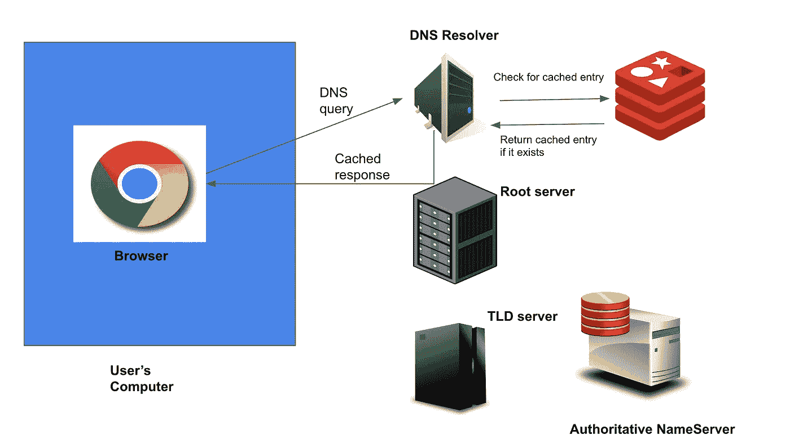

**缓存 DNS 记录**

增加缓存，加快 DNS 查找过程。当一个网站第一次上线时，只有第一个用户会观察到访问它的延迟。对于其他用户，根服务器将返回缓存的结果，从而改善页面加载时间。

# 什么是 DNS 缓存中毒？

我们现在将了解 DNS 查找过程中涉及哪些漏洞。DNS 缓存加快了所有查找查询的速度。然而，在现有的设计中有一些缺点。

假设我是一个黑客，发起了一个恶意网站。该网站将映射到一些 IP 地址，如:**116.243.41.130**。假设`[www.google.com](http://www.google.com)`的 IP 地址是**118.45.54.23**。如果用户访问谷歌，那么所有的 DNS 组件将缓存 IP 地址**118.45.54.23**。如果我改变 DNS 解析器的缓存，将`[www.google.com](http://www.google.com)`的 IP 地址修改为**116.243.41.130**(恶意的一个)会怎么样？

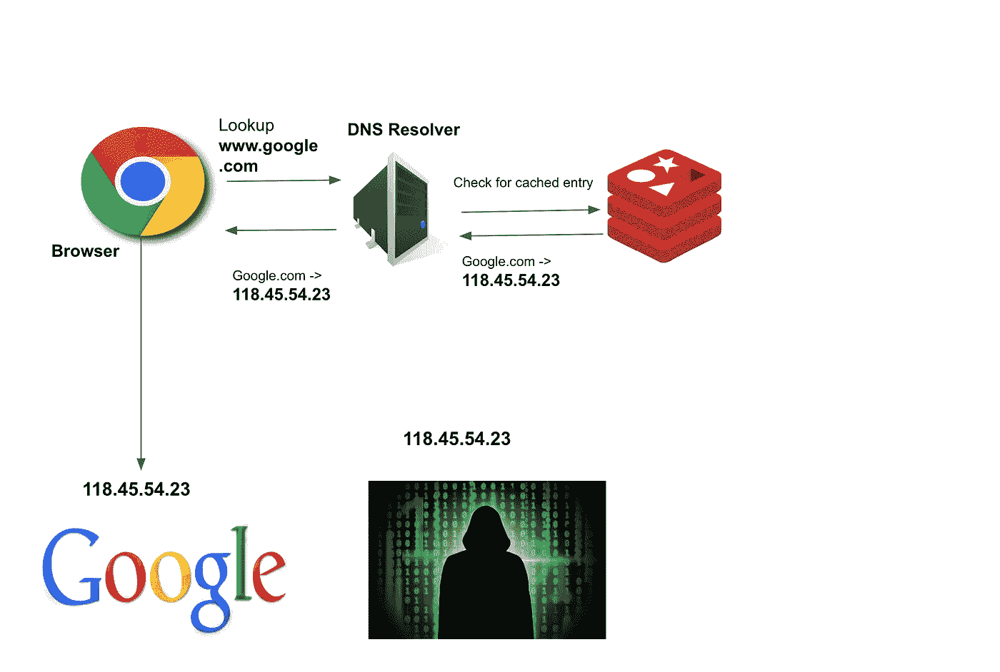

**DNS 正常工作**

在浏览器中输入 google 的新用户将被定向到恶意网站。对于新用户，浏览器和操作系统缓存查找将失败。该请求将到达 DNS 解析器，解析器将返回更新的 DNS 条目。现在，让我们来了解一下黑客是如何改变这个条目的。

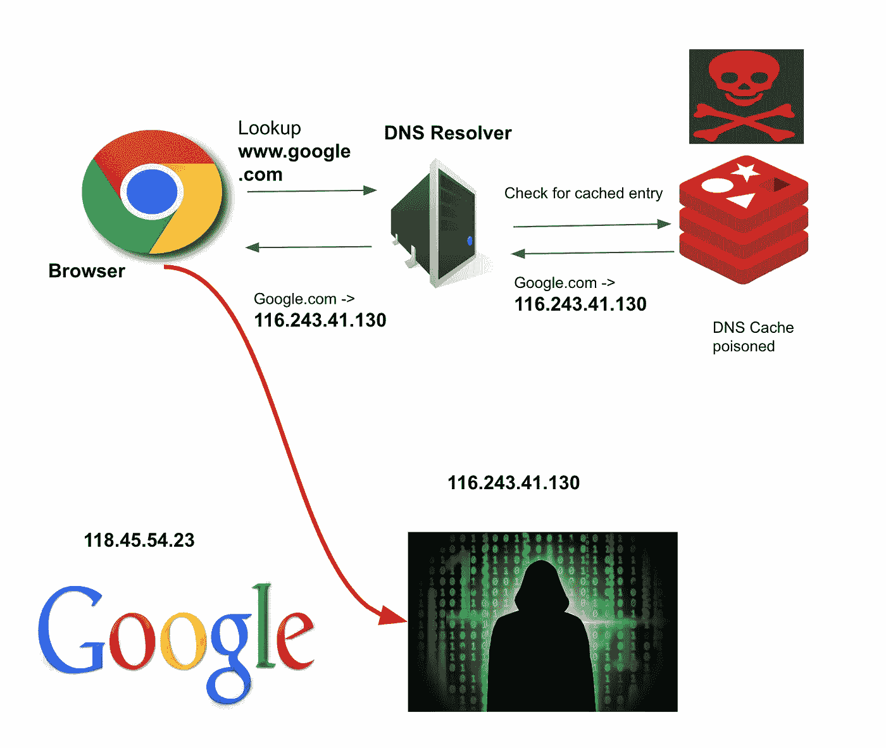

**DNS 缓存中毒**

DNS 组件遵循特定的通信协议。它们使用 UDP 协议发送请求和处理响应。UDP 不是面向连接的，也没有像 TCP 那样的握手。

客户端向服务器发送包含`Source IP`、`Source Port`、`Destination IP`、`Destination Port`的 UDP 数据报。服务器会在`Destination IP`和`Destination Port`中设置客户端的 IP &端口。设备`A`和`B`之间的 UDP 通信如下图所示。

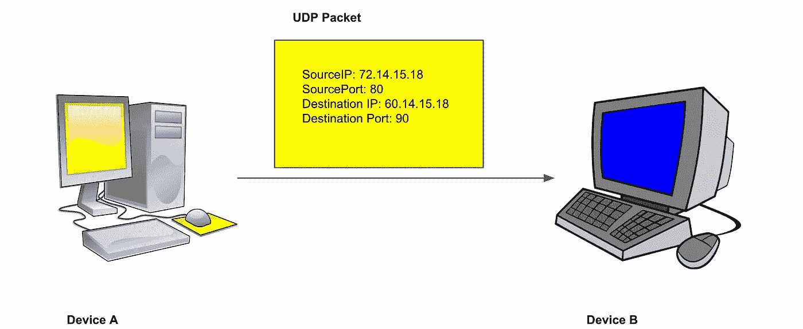

两台设备之间的 UDP 通信

我们可以引入一个新的实体`C`(恶意实体)，它会欺骗`B`的 IP 地址、&端口，并将数据包发送到`A`。设备`A`将假设数据包来自`B`。DNS 缓存中毒使用相同的概念。恶意用户假冒权威名称服务器的 IP 地址，并将数据包发送到 DNS 解析器。

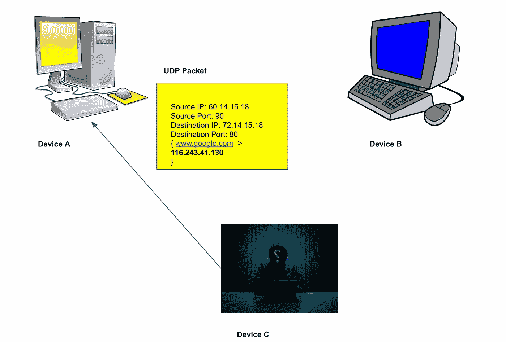

解析器中添加了不正确的映射，用户可能会被重定向到恶意网站。由于通信发生在几毫秒之内，攻击的机会就少了。此外，欺骗是困难的，因为`Source Port`可以变化。攻击者必须暴力破解所有端口，并发送不同的响应数据包。

# 结论

DNS 就像是互联网上所有网站的目录。它是一个由多个服务器组成的全球分布式系统。DNS 解析器可以使用递归或迭代查询来执行 DNS 查找。

DNS 系统使用缓存来优化查找调用。缓存是在整个堆栈的多个位置完成的。网站地址可能会被欺骗，DNS 缓存可能会中毒。在缓存中毒的情况下，用户可能会被重定向到恶意网站。

# 参考资料:-

*   [Cloudflare DNS](https://www.cloudflare.com/dns/#:~:text=Fast%2C%20Secure%2C%20and%20Resilient%20DNS&text=Cloudflare%20DNS%20is%20an%20enterprise,in%20DDoS%20mitigation%20and%20DNSSEC)
*   [DNS 缓存中毒](https://www.cloudflare.com/learning/dns/dns-cache-poisoning/)
*   [AWS DNS](https://aws.amazon.com/route53/what-is-dns/#:~:text=The%20Internet's%20DNS%20system%20works,These%20requests%20are%20called%20queries.)
*   [图像的上闪](https://unsplash.com/)
*   [DNS 工作](https://www.youtube.com/watch?v=tgWx81_NGcg&t=1713s&ab_channel=HusseinNasser)