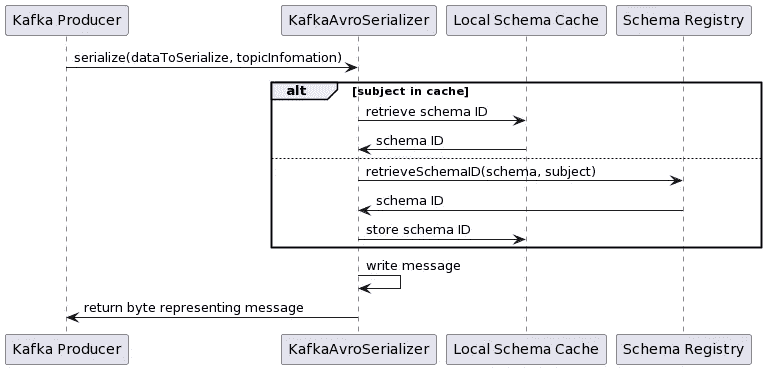
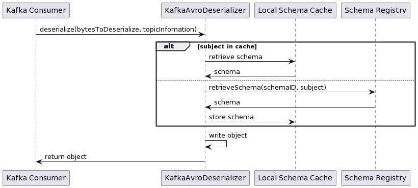

# Kafka Avro 串行器如何工作

> 原文：<https://blog.devgenius.io/how-the-kafka-avro-serialization-works-581abf7f3959?source=collection_archive---------3----------------------->

威廉·冈克尔在 [Unsplash](https://unsplash.com?utm_source=medium&utm_medium=referral) 上拍摄的照片

在[之前的一篇文章](https://medium.com/codex/understanding-avro-compatibility-e2f9afa48dd1)中，我们讨论了 [Avro 数据序列化系统](https://avro.apache.org/)可以促进的不同级别的兼容性。理解不同的选项有助于我们在模式演化的灵活性和数据的兼容性之间做出正确的权衡。为了充分实现这种兼容性在反序列化时给你带来的模式演化好处，你需要知道在编写 Avro 数据时使用的模式。有许多方法可以实现这一点，但 Kafka 社区中最常用的一种方法是使用合流模式注册表。让我们深入了解这是如何实现的，并在此过程中了解 Kafka 中的序列化/反序列化，Avro 如何表示数据，以及融合模式注册表如何工作。

理解 Avro 数据如何通过 Kafka 发送的第一步是理解任何数据如何在 Kafka 内部发送。 [Kafka](https://kafka.apache.org/) 是一个高性能的事件流媒体平台。卡夫卡能这么快在我看来的原因之一就是它非常善于理解自己的势力范围从哪里开始，到哪里结束。卡夫卡的核心是一个主题的概念。主题是只附加日志的命名抽象。您将记录附加到这个日志中，主题的使用者可以从日志中读取。构成记录的东西与卡夫卡无关，它所处理的只是原始字节。这是我们序列化之旅的起点。当使用 Kafka producer 时，您需要提供的一件事情是一个可以接收一段数据并将其转换为字节数组的类。在主题的消费端，您需要提供一个类，该类可以接受该字节数组并生成一个运行时可以理解的对象。一个非常简单但功能强大的模式。

我们有了一个良好的开端。Kafka 需要一个可以在数据和字节之间转换的系统，Avro 的主要功能就是做到这一点。如果你不想阅读输入到 Kafka 中的数据，我们就不必走得更远。首先，你要把你想发送的对象放到 Kafka 上，通过 Avro 序列化器，然后继续发送。然而，这不是很有用，我们仍然需要能够读取数据，如上所述，如果我们想在 Avro 中读取数据，我们需要知道用于写入数据的模式。让我们考虑一些选择。

第一种方法是始终使用相同的模式，并将其放在生产者和消费者代码中。这无疑是简单的，但它不允许任何模式演变，这是限制性的。考虑到这一点，我们可以选择将模式与每条消息一起发送。同样，这也是可行的，但是效率极低，并且首先会抵消使用像 Avro 这样的快速协议的大部分好处。我们也不会经常改变模式，而是用相同的模式发送很多很多消息，所以我们希望能够跳过重传。我们可以选择向生产者和消费者提供模式的所有版本，这样他们就有了所有可能的选项，而不需要在每条消息中都重新传输它们。这为我们节省了重新传输的时间，但是它引入了一个问题:当序列化一个特定的记录时，消费者如何知道使用了哪个版本的模式。它还存在需要同时更新生产者和消费者的问题，这是不切实际的。

这些选项都不能让我们得到我们想要的，但是最后一个选项离我们的最终目的地不远了。这就是模式注册中心的用武之地。模式注册中心的目的是成为模式的权威来源。虽然生产者和消费者可以并且很可能将他们自己的本地模式版本作为他们的可执行文件的一部分，但是模式注册中心是一种公共语言，生产者和消费者可以通过它在彼此之间发布、检索和检查模式。在高层次上，模式注册中心只是作为引用和存储模式的存储库。因此，这解决了让消费者访问生产者使用的模式而不直接将其传递给消费者的问题，但我们仍然需要知道使用哪个版本的模式。

为了解决知道使用哪个模式的问题，我们需要主要回答两个问题。我应该使用什么样的模式以及该模式的什么版本。为了解决使用什么模式的问题，汇合模式注册中心引入了主题的概念。一个主题代表一个模式可以发展的范围。一个主题的名字可以有多种来源，但最常见的是主题命名策略。顾名思义，TopicNameStrategy 根据要发送的 Kafka 主题的名称构建主题名称。除此之外，它还在主题名称的末尾添加了“-value”或“-key”，因为 Kafka 记录的键和值可以有不同的模式。根据主题的性质，我们可以知道引用哪个模式。

至于哪个版本的模式用于任何特定的消息，这在技术上可以从一个消息改变到另一个消息。模式注册表将保存所有版本，因此可以提供所有版本，但它不了解 Kafka 或其交易。为了解决这个问题，KafkaAvroSerializer 只需在每条消息的开头写入数据。这听起来类似于我们上面拒绝的解决方案，即简单地通过每条消息传递模式，但是它使用的数据要少得多。模式注册中心的每个模式版本都有一个整数标识符，这个标识符用来告诉使用方使用哪个模式进行反序列化。在字节级别，这是它的结构。消息的第一个字节是一个[魔法字节](https://en.wikipedia.org/wiki/List_of_file_signatures)，将此标记为 Avro 序列化消息。为了节省空间，这个神奇的字节是全零的单个字节(0x0)，如果在消息的开头没有这个字节，KafkaAvroDeserializer 将拒绝读取消息。接下来是四个字节的整数，它是正在使用的模式注册表中的模式 ID。此后，输出定期序列化的 Avro 数据。这意味着在 Kafka 上发送的每条消息“浪费”了 5 个字节(或者 10 个字节，如果键和值都使用 Avro 的话)。这在我看来是一个非常合理的权衡。

现在让我们把它们放在一起。第一步，我们要求卡夫卡制作人制作一个主题信息。然后，它将提供给生产者的数据传递给 KafkaAvroSerializer。序列化程序接收数据、主题名称策略和有关消息的信息，并确定主题。也许我们正在发送一个关于“test-avro”主题的消息，并且我们正在序列化它的值。如果我们使用 TopicNameStrategy，我们会以“test-avro-value”作为我们的主题。然后，序列化程序查询它所拥有的本地缓存，以确定它是否已经知道该模式的模式 ID。如果它不在缓存中，那么我们将模式和主题一起发送到模式注册中心，并查询以找到模式 ID。如果您愿意，也可以在此步骤中配置为注册一个模式。模式 ID 被返回并被缓存，此时生产者将不再需要去模式注册中心获取 ID，直到缓存被清空。然后，生产者通过设置神奇字节和模式 ID 开始编写消息。之后，它照常序列化数据，并将这些字节放在模式 ID 字节之后。串行化器可以将数据传递回发送消息的 Kafka。

[生产者序列图](//www.plantuml.com/plantuml/png/XP3DJiCm48JlVefLJgrKNY07L4Gl4HmGvGMspZOO73lQtHILfmVouwIH8cxsQ6RyZVUYoDhMtZJ8wgnhC2Wq7ClM4WCAP4zu_aHu6QJinYZ43htxdbiVBXoFIL_pFw9zfoxq72rwEFvUQuHEliqmLKwKhvrviBqEMWPcPBsxdxNdqtbJekBRHBG3ZOspHJZ76jN5i3Ne5QGzVP1LS07i7uEPJKlL2Jm79cL75mBfYOg3MOvR4YKZULdqfv5JSR-qE6pwt6uat9hHk_h0V-oYaMdE4yhLI0vVx9IW9X6ibjZZvtVOBGSuNPM0gM4I2kf2bO9x2cLR-ny0)

在接收端，很多都是相似的。反串行化器基于与上述相同的信息来确定主题。然后，它确保幻字节存在，并检索模式 ID。然后，它检查其本地缓存，以确定是否已经从模式注册中心获取了该模式。如果没有，它从注册中心请求该模式，并将其存储在缓存中。然后，它获取现在已经从模式注册表中检索到的写者模式和本地拥有的读者模式，并向这两者提供来自消息的剩余数据。Avro 然后遍历数据并反序列化它。然后，对象从反序列化器返回，Kafka 消费客户端将它提供给调用者。

[解串器顺序图](//www.plantuml.com/plantuml/png/XP51Skem38RtFeKcAvZXNO356pgmOTfLsmi88rgtZfsHP3hqzAKcCOcpwDBAz__wDDc88cjglUcGrLdNOL2mCKXgYG45caSyVI9i-r4p0Oyan0wz-nx33sUEk_AbpjpdMxJlb6DFqQA7b-kpHSZZQORfpOdo9SCzzjpF6Z35zz__YT9w_5eSBahoEZPRWSREsNqunHRLnR0qw1Ka7Jx8AhW0zjV5Z5hoZkg4DJ0fEpeJI7Op5J3twZdoCcilnzvhRnSlRg7zRZKOBit0rXkWhFZJNJHo4QTmh1DrxnSx9OXPOCQMFv7b4uS1t5oRK-j_0000)

使用 KafkaAvroSerializer 需要知道这是如何工作的吗？一点也不。这个系统做了很多对你来说不可见的工作，“只是工作”。也就是说，我认为了解这些内部机制是非常有价值的。首先，调试变得容易多了。我有无数次让我的反序列化器抱怨有一个丢失的神奇字节。在理解这一点之前，这个错误更令人困惑。我感觉自己真正研究对象的那一天，是我第一次一步一步阅读这些代码，理解它们的用途，以及它们对我有多大用处的那一天。我也曾有人抱怨说，他们不明白为什么在使用 KafkaAvroSerailizer 时需要提供正在生成的主题(当您在 KafkaProducer 中使用它时不需要，但是如果“原始”使用，这就变得很明显)。一旦你理解了确定主题需要做什么，需求来自哪里就变得很明显了。在我看来，理解事物如何运作并培养机械同情心在发展的所有方面都是一种超级力量。