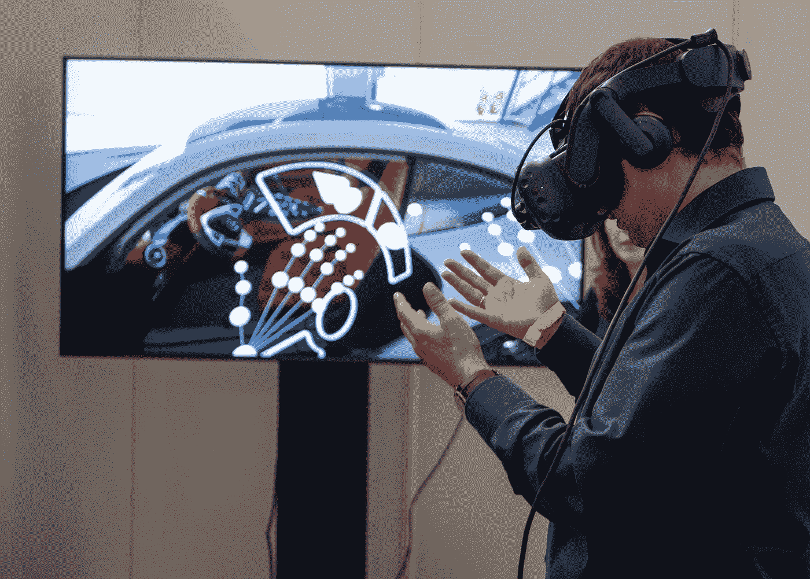

# 元宇宙将如何改变 IT 行业？

> 原文：<https://blog.devgenius.io/how-the-metaverse-will-transform-the-it-industry-8372ba29d82d?source=collection_archive---------7----------------------->

从信息技术的角度来看，你想知道在未来 5 到 10 年内，哪些领域、技术或行业会创造出大部分的工作岗位吗？答案就在这里。

照片由 [XR Expo](https://unsplash.com/@xrexpo?utm_source=medium&utm_medium=referral) 在 [Unsplash](https://unsplash.com?utm_source=medium&utm_medium=referral) 拍摄

大家好，今天，我将根据我所阅读的研究，准确地告诉你们在未来的 5 到 10 年内，工作岗位将如何以及在哪里增加，所以如果你想要一个稳定的职业生涯，一个仍然相关和受欢迎的职位，那么这就是你想要读到最后的文章。

据[**NASSCOM**](https://www.business-standard.com/article/economy-policy/it-industry-on-the-road-to-becoming-350-bn-in-revenue-terms-by-2026-122021501389_1.html#:~:text=5%20per%20cent%20%2D%2D%20the,14%20per%20cent%2C%20Nasscom%20said.)***(一家行业组织)*预测，目前全球 2270 亿美元的 it 业务预计到 2026 年将攀升至 3500 亿美元，这表明该业务将在未来五年内从 270 亿美元增长至 3500 亿美元，增幅为 50%。这意味着信息技术服务部门将产生许多新的就业机会。**

## **现在，这些工作会从哪里来呢？**

**元宇宙将占这一业务的 8%到 10%。这就是为什么马克·扎克伯格被指定为 Meta 的脸书，现在一切都面向元宇宙。因此，元宇宙是下一个大事件。今天，我们许多人都在玩 3D 游戏，如增强现实、虚拟现实和 3D 游戏。但是，在未来，就游戏性而言，它将不再是 3D 的，它将显著扩展，以便人们能够购物。购物将发生在 3D 世界，银行将会发生，工业将会在整个元宇宙运作。**

**根据脸书的说法，元宇宙将是一个人们可以通过加密货币联系的领域。他们将购买土地、艺术品，并在元宇宙参与学习，因此所有这些都将在元宇宙进行。**

## **专家关于元宇宙的一些事实和预测**

*   **根据 Gartner 的数据，到 2026 年，25%的互联网用户将使用元宇宙购物、学习和社交。因此，元宇宙将在接下来的几年里一飞冲天。**
*   **据 [**彭博**](https://www.bloomberg.com/professional/blog/metaverse-may-be-800-billion-market-next-tech-platform/) 预测，到 2024 年全球元宇宙收入将达到 8000 亿左右。**
*   **[**高盛**](https://news.bitcoin.com/goldman-sachs-metaverse-8-trillion-opportunity/#:~:text=%248%20Trillion%20Opportunity-,Global%20investment%20bank%20Goldman%20Sachs%20has%20predicted%20that%20the%20metaverse,the%20metaverse%20and%20web%203.0.%E2%80%9D) 将其视为 8 万亿机会。**
*   **普华永道预计，到 2030 年，元宇宙生态系统的价值将达到 1.5 万亿美元。这有点保守，但这是他们的预测。**
*   **[**摩根大通**](https://gadgets360.com/cryptocurrency/news/jp-morgan-decentraland-lounge-metaverse-web3-first-bank-metanomics-jamie-dimon-2771686) 已经在分散地推出了他们的 Onyx Lounge，这是一个元宇宙平台。最近刚刚发生在 2 月 17 日。**
*   **[**脸书**](https://www.bbc.com/news/world-europe-58949867#:~:text=Facebook%20is%20planning%20to%20hire,leading%20voice%20on%20the%20concept.) 正在欧洲招聘大约一万名与元宇宙相关的工作人员。**
*   **像可口可乐、耐克、亚马逊这样的全球性公司已经在元宇宙做了一些尝试。**

**因此，尽管所有这些现在看起来像是投机小说，但如果你正确理解生态系统，你会意识到 5G 已经到来。因此，将消除与基础设施相关的困难。因此，这个系统，或者说作为一个生态系统的互联网，准备接受这一切。**

## **现在，谁会受益？**

**将从中获利的公司是专业化公司，它们大多是具有元宇宙能力的初创公司。因此，他们将受益匪浅，他们将获得许多项目和大量工作，但埃森哲、TCS、Wipro 和 Infosys 等公司也可能受益匪浅，因为它们处于服务市场，但它们将需要实际重新培训员工。**

## **所需技能**

**员工必须具备在元宇宙工作所需的所有才能，例如增强现实、虚拟现实、混合现实、人工智能、数据分析技能和机器学习。所有这些在未来都非常重要，众所周知，会有对 3D 设计师的需求。因此，如果你是一名 3D 设计师，这是一个好消息。将需要内容创作者或创意开发者，以及内容作者。将会有很多对区块链开发者的需求，因为所有这些实际上都将在区块链主干网上工作。**

**所以，先生们，这些是你们以后要学的技能。所以，在未来的五到十年，我们将见证一个转变，如果你真的致力于此，你将获得这些技能。所以，不管你现在的能力如何，如果你开始努力学习这些技能，你将更有可能在不远的将来获得更好的角色、更新鲜的角色、更大的角色或其他工作。**

> **感谢阅读！**