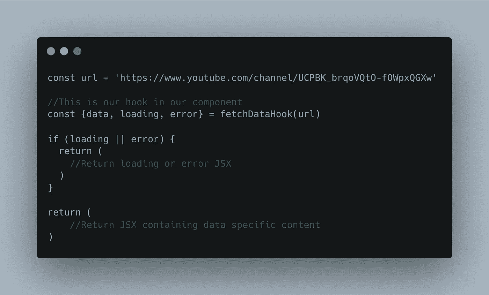
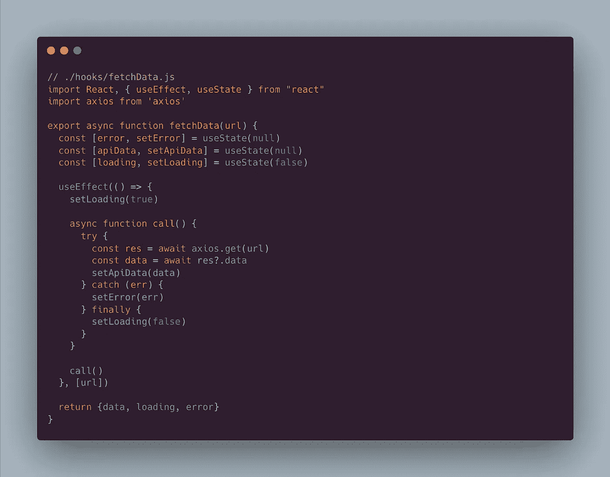
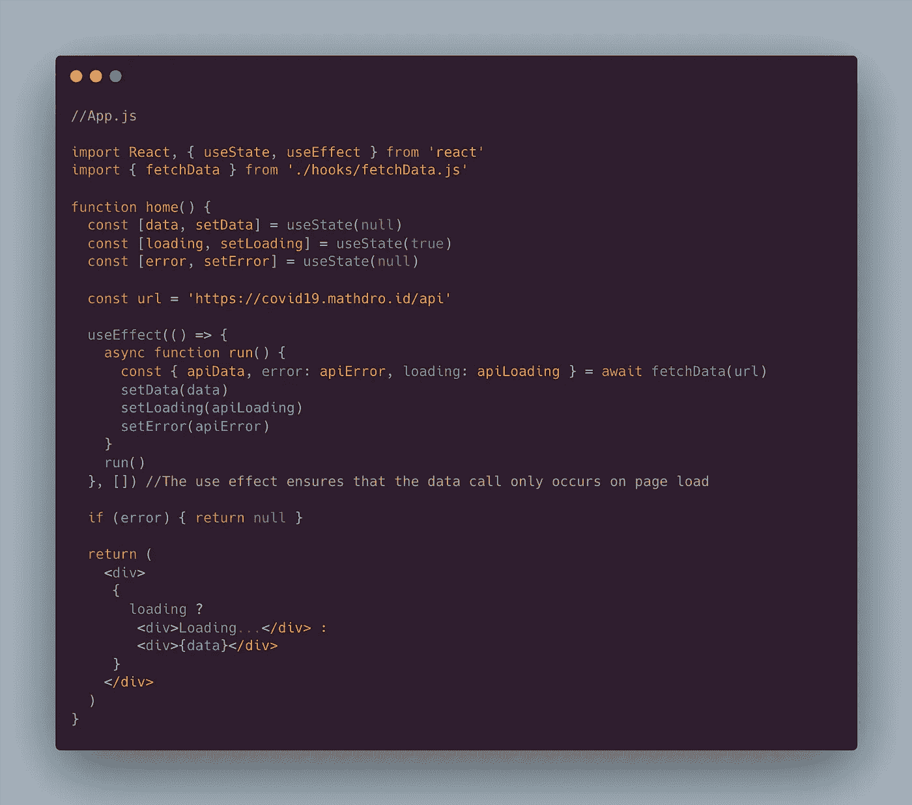
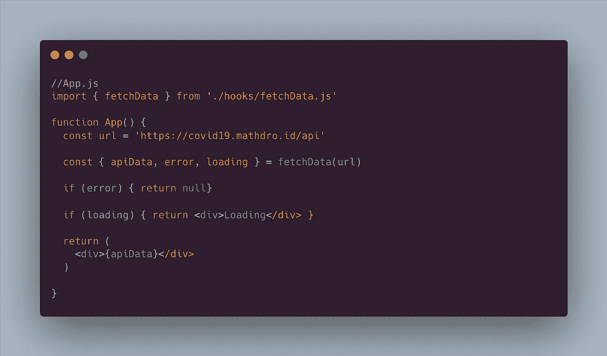

# 专业人士如何获取数据|反应精通

> 原文：<https://blog.devgenius.io/how-the-pros-fetch-data-react-mastery-63b14e6795df?source=collection_archive---------1----------------------->

答案是，用 React 钩子。简单，时尚，一个伟大的整体技能添加到您的反应武器库。在本指南中，我们将构建一个 React 挂钩来获取一些我们希望向用户显示的数据。

首先，让我们考虑一下数据获取调用的基本构件。首先，我们显然需要数据。很好。其次，由于数据获取是一个异步过程，我们将需要某种形式的加载状态。最后，一些错误处理将是惊人的，以防硬件中的任何错误。这可能会导致类似如下的挂钩调用:



在组件中使用我们的自定义钩子。

# 设计挂钩

首先，让我们了解一下 React 钩子应该如何工作。对于我们的数据获取示例，我们将调用一个 API，这是一个异步的过程；也许我们希望有条件地在页面上呈现结果。我们的获取将使用 Axios NPM 库来处理。为了处理这个过程，我们将在源文件夹中名为“hooks”的子目录中创建一个名为“fetchData.js”的文件。

fetchData 函数接收一个 url 作为参数，函数中的 useEffect 监听 url 中的更改。当 url 改变时，它在 useEffect 中运行一个异步函数，更新并返回数据，将错误状态加载到负责调用的组件中。



。/hooks/fetchData.js

# 最终实施

现在，我们可以将函数导入到组件中:

```
import { fetchData } from './hooks/fetchData.js'
```

我们的成品可能看起来有点像下面这样:



数据呼叫最佳实践！

或者如果我们想要一个更简单的实现:



速记数据提取。

# 结论

就这样，您创建了自己的自定义 React 钩子，它非常灵活地获取数据并提供加载和错误处理。