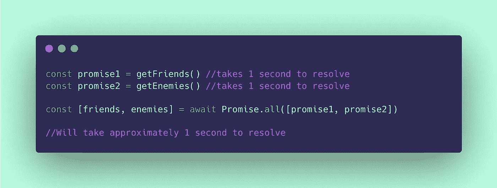
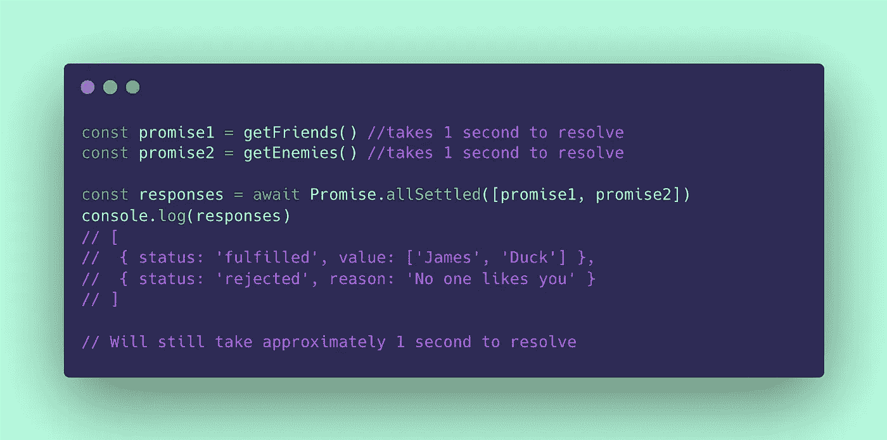

# 专业人士如何处理 JavaScript 承诺

> 原文：<https://blog.devgenius.io/how-the-pros-handle-javascript-promises-6d00184bc275?source=collection_archive---------0----------------------->

## JavaScript 承诺的最佳实践

JavaScript 承诺的故事从理解 JavaScript 语言的两个核心概念开始；事件循环&单线程。

JavaScript 是一种单线程语言，这意味着 JavaScript 脚本只能以单一的顺序方式执行命令或代码行；一个接一个，一个接一个。我们不能让两个真正同步的进程同时执行。

这些单线程进程发生在 JavaScript 的事件循环中。事件循环包含所有这些按照编码顺序排列的单线程进程，当我们遍历事件循环时，这些进程会相应地执行。这种集体行为表现为“**同步**行为；就像模拟滴答声在 3pm 标记上滴答一样，只有在它在 2pm 标记上滴答之后。

# 承诺

然而，承诺是不同步的。因此它们不符合事件循环的规范，而是被归类为“**异步**事件”。API 调用就是一个例子。您或您的代码可能向特定的 API 发出数据请求，这个发送请求和接收数据的过程可能需要不同的时间。这可能会对您的代码产生非标准的行为影响；例如，您可能在代码中定义了一个同步计算，它依赖于从 API 接收的信息。因此，我们创造了术语' ***Promise*** '，因为我们的顺序代码的同步事件循环将这种异步行为解读为信息承诺(或特定结果)。

# 我们如何处理承诺？

当我们的事件循环执行遇到一个承诺时，异步行为/方法/函数从我们的同步事件循环中分离出来，它位于一个等待队列中，等待承诺被解决和实现。对这一功能的警告是，我们需要为我们的代码提供一些额外的指令，说明在存在异步的情况下如何表现。

我们有一些方法可以做到这一点。在本例中，我们有两个异步调用，一个获取朋友列表，另一个获取敌人列表:

每个异步调用需要 1 秒钟来解决。

如果我们使用标准的 async/await 语法来解析这两个承诺，我们的代码将被迫暂停，直到信息的每个*承诺*按顺序被解析；我们在**系列**中解决它们。这在技术上保持了我们代码的顺序性，我们预计总执行时间为 2 秒；第一次拍摄 1 秒，第二次拍摄 1 秒。

如果我们只发出一两个获取请求，或者一个承诺依赖于另一个的结果，这是可以接受的。然而，一旦我们有成千上万个调用，我们可能需要更聪明地处理我们的承诺，否则我们将永远等待我们的代码执行。

## Promise.all()简介

`Promise.all()`接受一个参数，该参数是我们等待解析的所有承诺的数组，并在**并行**中解析所有承诺:

我们不是等待每个承诺的解析值，而是将承诺本身赋给一个变量。

这里需要注意的是，我已经移除了`getFriends()` & `getEnemies()`方法调用前面的‘await’关键字。因此，我们没有将从承诺中解析出的*值赋给变量，而是将实际的承诺本身赋给变量。然后我们“等待”响应`Promise.all()`，将两个承诺的信息作为参数传递给方法。然后,`Promise.all()`方法发出两个异步请求，一个紧接着一个，而不必在发送下一个调用之前等待任何一方的响应；本质上，异步调用是在**并行**中进行的。我们的同步代码的剩余部分仍然被迫等待两个承诺的解析(它们分别被分配给在`Promise.all()`之前声明的变量名)，以确保我们的代码仍然没有丢失任何信息。因此，这将把异步行为的总时间减少到*几乎*与解决时间最长的承诺的持续时间相匹配(加上一个极小的量)。这使得看起来好像两个承诺都是以多线程的方式解决的，好像我们有两个事件循环同时发生。差不多，但不完全是。*

一个更好的类比是想象你正在邮寄一些婚礼请柬；你需要所有的回复才能举行婚礼。在第一种情况下，您发送一个邀请，等待响应，然后发送下一个。五十个人，每人一周的时间来回复，一共 50 周(差不多一年)，才能得到所有的回复。有了`Promise.all()`，我们在同一天(并行地)发出所有的邀请，我们在一周之交把它们全部收回，然后第二天举行婚礼。无限快！

## 堕落与承诺. allSettled()

如果一个客人没有回应怎么办？嗯，不幸的是，我们的`Promise.all()`行为并不十分理解它的错误处理能力。幸运的是，它的基因优越的表亲，`Promise.allSettled()`，可以帮助我们摆脱困境。`Promise.allSettled()`将每个解析的承诺作为对象返回，而不仅仅是返回值本身。该对象仍然包含返回值，但它还包含一个响应状态，该状态可能在“已完成”或“已拒绝”之间变化(如果是，还有一个原因)。

异步承诺调用的错误处理。

就这样，您现在已经准备好开始探索异步编程的狂野、古怪和怪异的世界了！