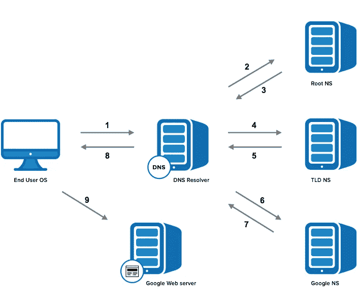
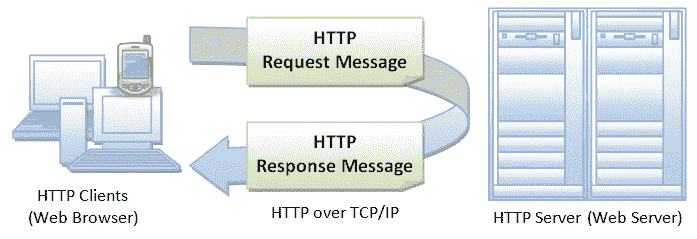
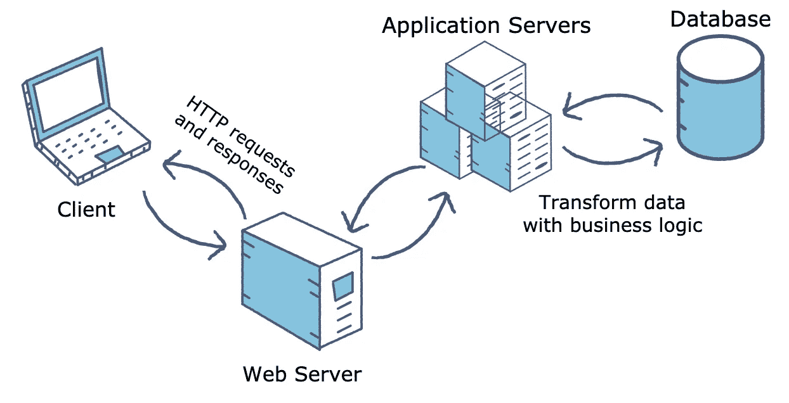
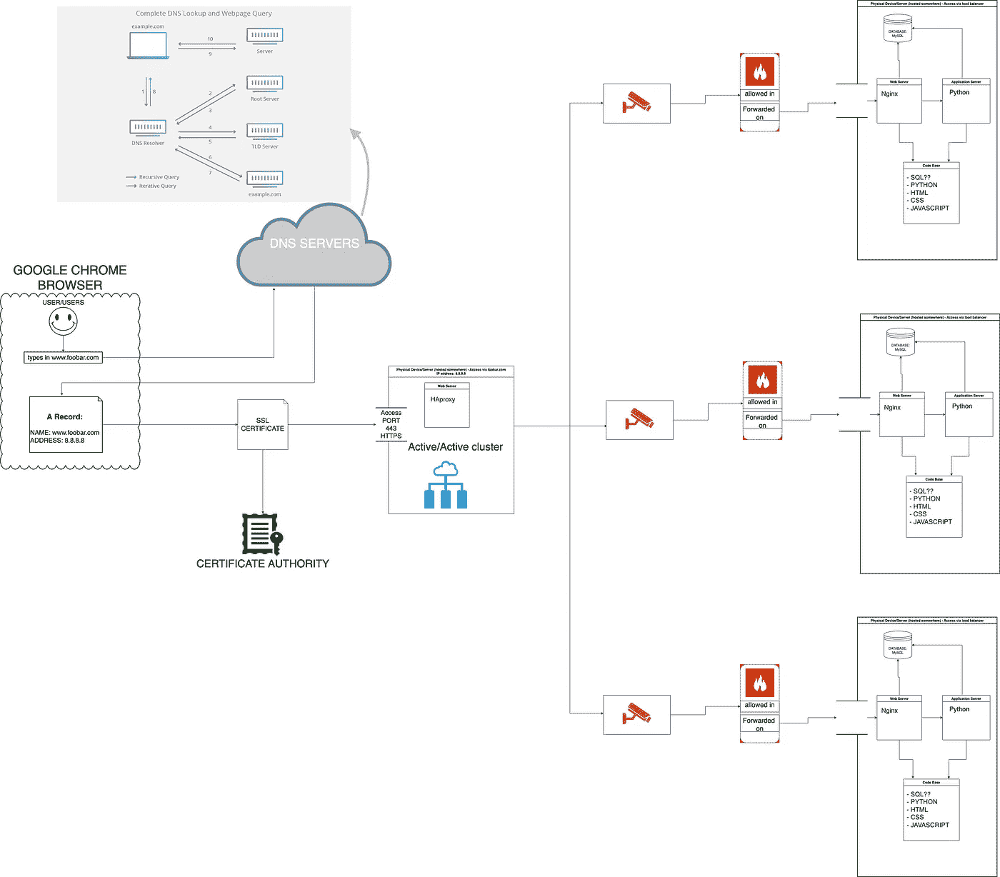

# 网络是如何工作的

> 原文：<https://blog.devgenius.io/how-the-web-works-ab1130b470f7?source=collection_archive---------2----------------------->

`What happens when you type *google.com* in your browser and press Enter?`

好奇的年轻蓝色虎斑猫缅因猫站在桌子前的椅子上，拿着笔记本电脑看着屏幕浏览互联网——图片来源[尼尔斯·雅可比](https://www.dreamstime.com/furryfritz_info)

我们知道，当我们按下键盘上的 Enter 键后，一个网页只需要几秒钟就会出现，但是你知道实际上发生了什么吗？

对于许多类型的软件工程职位来说，这是一个经典且仍被广泛使用的面试问题。即使您不是软件工程师或 web 开发人员，您可能仍然会受益，或者只是好奇，想知道我们的浏览器幕后发生了什么，以及信息是如何通过互联网传输的。在这篇博文中，我将简要概述这一过程，涵盖广泛的主题，如: **DNS 请求、TCP/IP、负载平衡器、防火墙、SSL、HTTP/HTTPS、Web 和应用服务器以及数据库。**让我们开始吧！

# 什么是服务器？

让我们从本文中经常出现的一个重要术语开始:服务器。

> 在计算领域，**服务器**是一种计算机硬件或软件(计算机程序)，为其他程序或设备提供功能，称为“客户端”。这种体系结构被称为客户机-服务器模型。—维基百科

## 客户机-服务器模式

**客户端**通常是请求信息的“东西”。通常，客户端是网络用户的互联网连接设备，如连接到 Wi-Fi 或移动网络的电脑、笔记本电脑或手机，以及这些设备或浏览器上可用的网络访问软件，如 Google Chrome、Firefox、Safari。在我们的例子中，客户端实际上是浏览器和我们用来输入 www.google.com 的设备

**服务器**是向客户端发送或*提供*信息的“东西”。他们储存网页、网站或应用程序。在我们的例子中，它是 google 服务器。

当客户端设备想要访问网页时，它从服务器请求网页的副本，该副本然后被下载到客户端以在用户的网络浏览器中显示。

# 互联网的电话簿

当我们在浏览器中键入网站名称或地址，或者更专业地称为 URL，https://www.google.com 并按 Enter 键时，浏览器做的第一件事就是将 URL 分解成碎片，为此我们需要域名系统(DNS)服务器！但是首先…

## 什么是网址？

URL 代表统一资源定位器，用于访问网站。URL 有几个部分:协议、主机名、端口、路径和文件名等等。在这篇博文中，我们将看看协议和主机名。在[https://www.google.com](http://www.google.com,)的情况下:https 是**协议**(稍后将详细介绍)，而[www.google.com](http://www.google.com)是**主机名**，它可以是一个域，就像本例中一样，也可以是一个 IP 地址。

## 域名服务器(Domain Name Server)

把域名系统(DNS)想象成互联网的电话簿！DNS 服务器是一种应用服务器，它将人类容易理解的域名转换成机器可读的 IP 地址。连接到互联网的每台设备都有一个唯一的 IP 地址，其他机器可以用它来查找设备。

> *“当客户端需要系统地址时，它会向 DNS 服务器发送一个包含所需资源名称的 DNS 请求。DNS 服务器使用其名称表中的必要 IP 地址进行响应。——*[www.paessler.com](https://www.paessler.com/it-explained/server)

这个被称为 **DNS 解析或 DNS 查找**的过程包含 4 个步骤(和服务器)来加载网页:

1.  **DNS recursor** is 是第一站。它是一种服务器，设计用于通过应用程序(如 web 浏览器)接收来自客户端的查询。如果该服务器已经将 IP 地址存储在缓存中，它将简单地将其返回。否则，它将负责通过向根 DNS 服务器发送查询来发出额外的请求。
2.  **根服务器**或根名称服务器没有关于主机名的信息，但是它有在哪里可以找到它的信息，所以它会将请求提交给适当的 TLD 服务器。
3.  **TLD (** 顶级域名)是搜索特定 IP 地址的下一步，它托管主机名的最后一部分。在 google.com，TLD 的服务器是“com”。然后，请求被发送到权威的名称服务器。
4.  权威域名服务器是域名服务器查询的最后一站。如果该服务器可以访问所请求的记录，它会将所请求的主机名的 IP 地址返回给发出初始请求的 DNS 递归程序，否则它会发送一个错误消息，说明找不到该记录。

图示了 DNS 解析中涉及的所有步骤。来源:[https://www.catchpoint.com/blog/domain-name-to-ip-address](https://www.catchpoint.com/blog/domain-name-to-ip-address)

# 互联网协议套件

最后，浏览器知道在哪里可以找到 www.google.com，现在是时候建立连接，访问请求的网站了。浏览器使用互联网协议来建立这样的连接。

互联网协议套件又名 TCP/IP (TCP 代表传输控制协议)是用于许多类型的 HTTP 请求的最常见的协议。它是一组控制通过互联网或本地网络发送的数据格式的规则，例如发送电子邮件、流式视频或连接到网站。

# **交通与安全控制**

一旦建立了 TCP 连接，就该开始传输数据了！但没那么快，首先我们需要一些流量控制——满足负载平衡器…

**像 HAProxy 这样的负载平衡器**是一种帮助处理更多网络流量和避免停机的服务器。负载平衡器接收来自互联网的流量，然后将它分布在多个服务器上，以避免任何特定服务器因过多请求而过载。负载平衡器对于像 google.com 这样流量很大的网站来说是必不可少的！但是有人能进去吗？让我们问问防火墙…

**防火墙**，一种软件或硬件设备，用于阻止对私有网络的未经授权的访问。它在安全的内部网络和最易受攻击的网络(如互联网)之间充当屏障。是否允许流量的决定基于一组自定义的安全规则，例如对请求的 IP 地址、请求的数量和频率或请求的内容类型的限制。负载平衡器充当防火墙。但是，您可以安装单独的防火墙以获得额外的安全性和保护，并避免 SPOF(单点故障)。

## 加密套接字协议层

安全性是当今数字世界的关键，因此我们使用安全套接字层(SSL)采取了额外的安全措施。

> SSL 是一种用于服务器和 web 浏览器的协议，它确保在两者之间传递的数据是私有的。这是通过使用 SSL 证书实现的，SSL 证书是一种小型数据文件，它以加密方式在 web 服务器和浏览器之间建立加密链接。这种链接确保了在 web 服务器和浏览器之间传递的所有数据都是保密的。—[blog.hubspot.com](https://blog.hubspot.com/)

SSL 在交换信用卡信息或其他私人敏感信息时特别有用，因为如果有人在窃听，就不可能破译这些信息。

如何知道网站是否在使用 SSL 证书？很简单，只要看看网址，如果你看到挂锁和 https://而不是 http，那么你的隐私是安全的。但是什么是 http/https 呢？

# **HTTP/HTTPS**

## 这是什么？

HTTP 代表超文本传输协议，可能是万维网使用的最流行的应用协议。它被我们的浏览器和网络服务器用来通信。它是一种无状态、基于文本的协议。

说明客户端如何通过 HTTP 请求和响应与服务器通信的图片。来源:[www3 . NTU . edu . SG/home/ehchua/programming/web programming/HTTP _ basics . html](https://www3.ntu.edu.sg/home/ehchua/programming/webprogramming/HTTP_Basics.html)

它是这样工作的:HTTP 客户端或 web 浏览器向 HTTP 服务器或 web 服务器发送请求消息。反过来，服务器返回响应消息*。*注意，HTTP 是拉协议，客户端从服务器拉信息而不是服务器推信息给客户端。

HTTPS 的工作原理和 HTTP 一样，只是更安全。额外的字母 S 代表安全性，如前所述，这意味着它使用的是 SSL 证书。

## HTTP 请求和响应状态代码

HTTP 请求可以有一系列不同的方法。

*   GET 用于从 web 服务器获取数据。
*   POST 用于从 web 服务器发送数据。
*   PUT 用于从 web 服务器更新数据
*   DELETE 用于从 web 服务器上删除数据

HTTP 请求总是会返回一个响应，至少带有指示请求是否成功的状态代码。一些最流行的状态代码是:

1.  信息响应(`100`–`199`)
2.  成功响应(`200`–`299`)
3.  重定向消息(`300`–`399`)
4.  客户端错误响应(`400`–`499`)
5.  服务器错误响应(`500`–`599`)

# **网络和应用服务器**

**web 服务器**是计算机软件和底层硬件，它通过 HTTP/HTTPS 接受请求，并提供静态内容，如简单的 HTML 页面、图像或纯文本文件，换句话说就是不变的内容。web 服务器的工作是找到与所请求的网站地址相对应的内容，并将其作为 HTTP/HTTPS 响应。web 服务器的例子有 Nginx 或 Apache。

然而，大多数网站并不只有静态内容。恰恰相反，大多数网络应用依赖于动态内容，即不断变化的内容。这意味着，例如，它可以与网站互动，将信息保存到网站中，使用用户名和密码登录等等。为此，我们需要应用服务器！

一个**应用服务器**是一个软件程序，负责操作应用程序、与数据库服务器通信、管理用户信息等等。它与 web 服务器一起工作，并且能够使用来自 web 服务器的静态内容为动态应用程序提供服务。

# **数据库**

客户机-服务器计算环境中的另一个关键组件是数据库服务器，它由运行数据库的硬件和软件组成。**数据库**是数据的集合，数据库服务器是与数据库交互并在其中检索、添加、修改数据的程序。两个主要的数据库是关系数据库和非关系数据库。PostgreSQL、MySQL、SQLite、MariaDB 是一些最流行的关系数据库。

下图说明了 web 服务器、应用服务器和数据库是如何协同工作的。

该图展示了 web 服务器、应用程序服务器和数据库如何协同工作。来源:[https://more equal animals . com/posts/区块链是更好的应用服务器和数据库](https://moreequalanimals.com/posts/blockchain-is-better-application-server-and-database)

# **结论**

上面提到的所有这些步骤都发生在我们按下键盘上的回车键的几毫秒内，甚至在我们注意到它们之前。为了直观地总结这个过程，我创建了下面这个图表。

创建图表来总结当您在浏览器中键入 URL 并按 enter 时发生的整个过程。

我希望您现在对在浏览器中键入 URL 并按回车键会发生什么有了更好的理解和评价！

如果你有任何问题、评论或者只是想打个招呼，请在 LinkedIn 上联系我或者在 Medium 上关注我。

*保持快乐，继续编码！*👩🏻‍💻

## 参考资料和其他有用的资源

[https://www3 . NTU . edu . SG/home/ehchua/programming/web programming/HTTP _ basics . html](https://www3.ntu.edu.sg/home/ehchua/programming/webprogramming/HTTP_Basics.html)

 [## PRTG 免费提供服务器和主机监控工具

### 有许多类型的服务器都执行不同的功能。许多网络包含一个或多个常见的…

www.paessler.com](https://www.paessler.com/it-explained/server)  [## Web 服务器与应用服务器

### 贡献者:教育性答案团队

www.educative.io](https://www.educative.io/answers/web-server-vs-application-server)  [## 什么是传输控制协议 TCP/IP 模型？

### 什么是 TCP？TCP 代表传输控制协议，这是一种通信标准，使应用程序…

www.fortinet.com](https://www.fortinet.com/resources/cyberglossary/tcp-ip) 

[https://www.cloudflare.com/en-gb/learning/dns/what-is-dns/](https://www.cloudflare.com/en-gb/learning/dns/what-is-dns/)

 [## HTTP 响应状态代码- HTTP | MDN

### 这个临时响应表明客户端应该继续请求或者忽略响应，如果请求…

developer.mozilla.org](https://developer.mozilla.org/en-US/docs/Web/HTTP/Status)  [## 互联网是如何工作的？

### 2002 Rus Shuler @ Pomeroy IT 解决方案，版权所有简介从哪里开始？互联网地址协议…

web.stanford.edu](https://web.stanford.edu/class/msande91si/www-spr04/readings/week1/InternetWhitepaper.htm)