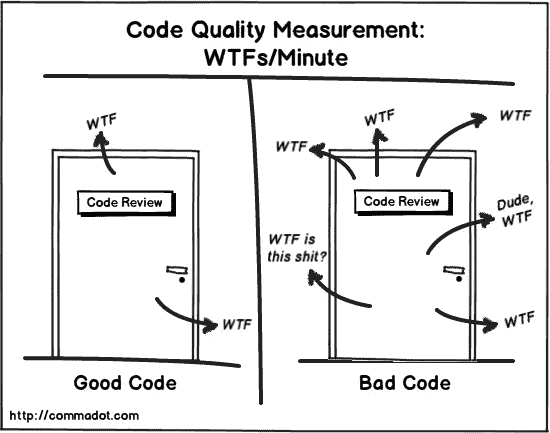

# 这些代码评审礼仪如何塑造你的团队文化

> 原文：<https://blog.devgenius.io/how-these-code-review-etiquettes-can-shape-your-team-culture-d420a241990f?source=collection_archive---------4----------------------->

## 意图和行动

(在 Gumroad 上的 Tech: The Missing Guid e 中获取完整版本的[代码审查！)](https://gracehuang.gumroad.com/l/codereviews/)

你曾经因为你的代码被审查而感到气馁吗？你有没有在审查别人的代码时感到缺乏自信？如果你对代码评审过程有特定的负面情绪，也许是时候看看你团队中的人是如何进行代码评审的了。

特别是在一个在工程上严格分级的公司，这创造了一个权力等级，代码审查可能是一个消极攻击的工具，破坏人们并最终伤害团队士气。另一方面，如果团队中的每个人都有积极的态度并坚持礼仪，代码评审可以成为培养整体技术技能和加强团队的有力工具。

# 代码评审的目标

为什么软件工程师要在代码出货前做代码评审？显而易见的原因如下

1.  捕捉明显的逻辑错误
2.  确保测试充分，包括单元测试、集成测试、手动测试等。
3.  指出不一致的代码风格

代码审查也没有那么明显的理由——

1.  为过去关于特定代码变更的决策提供文档，尤其是对于代码库的新手。
2.  工程师制定编码决策的沟通工具。(但是，不是设计决策)
3.  一个鼓励人们互相学习的论坛

许多在线资源和您工作中的资源可以帮助我们实现*明显的目标*。在这篇文章中，我将谈论工程师如何实现代码评审的那些*不太明显的目标*。

# 善意

良好的态度指导我们的行为。这是一个好的开始。

## 对代码要挑剔，但对人要有耐心

很多年前，我有幸与亚马逊的一位高级首席工程师共事。当我们讨论设计问题时，他从来没有在我看来傲慢自大，炫耀他的水平，或贬低我的想法。他是我见过的最有耐心的工程师。当我说出我的想法时，他总是在倾听、思考和讨论。当我的想法好的时候，他总是毫不犹豫地称赞我。这一年来，我意识到一个工程师的成熟不仅是由技术才能和经验来衡量的，也是由工程师如何与其他人合作来衡量的。

然而，入门级工程师和实习生往往是无情的代码审查评论的目标。这些工程师刚从大学毕业，没有或仅有有限的行业经验。他们的代码可能不容易立即满足生产标准。他们的第一次代码评审经常是那些潜在的被批评轰炸的。更有经验的工程师倾向于在第一次代码评审时留下超过 50 条评论。我在各种工作场所多次看到或听到这种情况。在代码评审之后，他们现在知道编码的最佳实践了吗？是的。他们对完成某件事感觉良好吗？大概不会。当人们在整个团队面前到处指出不好的做法和错误时，这是令人尴尬的。

**对于新工程师来说，*他们不知道自己不知道的事情*。**我已经学会了和他们坐下来，对前一两个代码评审进行面对面的评审。

## 公平包容所有不同的人群

韦恩州立大学的研究人员在[的一项同性和跨性别互动研究](https://arxiv.org/pdf/1812.05560.pdf)中发现，女性工程师较少给男性同事写负面评论，但 6 个项目中有 3 个项目的男性工程师不仅对女性同事持批评态度，还拒绝给予积极鼓励。他们还发现男性更频繁地使用咒骂或贬低女性的词语。

在另一项研究中，在分析了 Github 的近 140 万用户后，美国研究人员发现，女性建议的代码更改比男性建议的代码更改获得了更高的支持率——但前提是他们的性别无法识别。

不同水平的工程师也有类似的偏见。有趣的是，我见过工程师们采纳建议或者回应评论，如果评审员水平更高的话。如果这个评论者比作者高，她的评论被假定为好或更好。另一方面，如果评论者的级别比作者低，她的评论就被认为不那么重要。

对于初级工程师，我鼓励他们审查高级工程师的代码，因为人类会犯错误，就这么简单。对细节的关注不需要 10 年以上的经验，而是一双专注的眼睛和一颗好奇的心。

不管审稿人比我水平高还是低，我总是认真对待。我读了每一个字，并回复他们。我的评审人员花时间评审我的代码，我的回复至少是尊重他们的时间。

## 保持谦逊和感激

代码评审中激烈的争论经常来自自我。当一个自我与另一个自我发生冲突时，防御性就来了。

例如，初级工程师可以指出高级工程师遗漏了一个单元测试用例。这位高级工程师想，“嗯，你怎么敢拿这个指着我？你知道多少？”高级工程师开始付诸行动，或者忽视这个建议。当涉及情感时，它会阻止工程师客观和批判地思考评论是否有效。

在你的评论被提交之前，回顾一下评论，看看是否显示了自我。有什么语言可以解释为“你必须听我的”，“我是最好的”，“我有权力”，或者“你做的不好”。

> **善意的**是不够的**。**他们**‘**从来没有在**汤里放**或**洋葱**。——索恩亚·莱维恩。****

# **行动中的礼仪**

**语言很容易被误解。好的意图可能会以坏的结果告终。如果你不知道如何开始，这里有一些策略。练习并慢慢观察代码审查动态的变化。**

## **作为一名评论家**

****从“*我们”*开始，慎用“*你”*。**除非您单独工作，否则代码库始终由团队共同拥有。任何代码更改都不是我自己的决定，而是团队共同决定的反映。这就是为什么我们有代码审查。使用 *We* 表示我们是一个团队。**

**好吧-**

> **"您应该在这里添加更多的测试用例."**

**更好-**

> **"我们可以为这种方法增加更多的测试."
> “为该方法增加更多的测试用例会有所帮助。”**

****以问题或建议的形式提出评论，而不是陈述。**一个问题或一个建议欢迎一次谈话，而不是听起来像是你已经做出的决定。如果你提出一个问题，球在作者的法庭上考虑这是否是一个好问题。作者需要思考如何通过一个批判性的思考过程来回答这个问题。如果这个问题是*是*，你们俩就在同一页上。如果*不是*，作者需要拿出充分的理由来支持它。**

**好吧-**

> **"在这里添加更多的测试用例."**

**更好-**

> **“我建议为这个方法添加更多的测试用例”。
> “我们应该为这种方法增加更多的测试吗？”**

****被忽视审稿人语音支持。**初级工程师或新员工在审核高级工程师的代码时经常面临这一挑战。他们需要勇气来复习，但有时他们会担心自己的评论是否有效。有时，当代码审查结束时，他们的评论没有被提及，他们会对未来的代码审查感到沮丧。**

**如果你注意到另一个评论者的评论很好，但被作者遗漏了，优雅地喊出来吧。这表明了对其他工程师的支持，鼓励他们更多地发表意见，同时也提醒作者这些评论的重要性。**

**示例-**

> **关于在这里使用 val，Sarah 提出了一个很好的观点。我们能不能也更新一下这个？**

**我的一个美好回忆——我加入了一家新公司，开始在其他工程师的代码评审上留下评论。我的评论没有被提及，但是有一次一位工程师最后指出了这一点**

**“格雷斯提出了一个很好的观点。请回应格蕾丝的评论”。**

**我觉得我的声音被听到，被放大了。从那以后，我受到启发，去关注那些被边缘化的评论者，为他们做担保。**

**为了确保每个人都意识到这一点，我所在的一个团队将这一点发挥到了极致——“不留下任何评论”，这意味着作者有责任在代码提交之前回答任何评论，即使在这个代码更改列表已经获得关键的 ship-it 签收之后。**

## **作为一名作家**

****确认好评。慷慨的赞美。这鼓励了评论者继续提供好的评论，也显示了你的理解在同一水平上，这是一个自信的提升。****

**即使对于那些在代码审查中表现出消极攻击性的审查者来说，你的赞赏也显示了他们的成熟，并帮助他们感受到一种伙伴关系。**

**示例-**

> **接得好！我很欣赏这种对细节的关注。谢谢！
> 好标注！我会在这里更新。
> 我喜欢你指出的这个角度。但是，这不适用于此用例，因为…**

****尽可能地澄清线下的评论，然后总结决定。**有时候，代码评审上一个非常长的澄清链看起来像是在争论，尽管事实上，它只不过是澄清一些细节。让它看起来像争论的是，评审者可能认为作者不同意，并试图通过在整个团队面前问很多问题来挑战和为难评审者。来回问答链也效率不高。一个电话或一个私人渠道的闲聊可以迅速解决问题。稍后，在你们双方达成一致后，用一个评论来更新，以便团队能够看到。**

**好吧-**

> **你什么意思？能澄清一下吗？**

**更好-**

> **莎拉和我讨论了离线。这是我们决定要做的…**

****不同意敞开大门。通常你可能不同意评审者提出的变更。表达你那样做的原因，如果她仍然不同意，也欢迎评论者聊天。提供的原因表明你考虑了这个评论，并对它进行了批判性的思考。开放聊天为更多讨论提供了机会。****

**好吧-**

> **“我觉得没必要。”**

**更好-**

> **“在这种情况下，我认为没有必要进行额外的检查，因为…如果我错过了什么，我很乐意聊天。”**

**有人可能会说，“这些礼仪是出于过度思考”。我相信同一个团队的人对我们的行为有不同的敏感度。这些礼仪鼓励我们体贴和关心他人。**

**有人可能会说，“如果我过度思考我的评论，它会让我慢下来”。是的，开始会的。一旦它成为一种习惯，它不会让你慢下来，而是让代码审查过程变得高效，因为人们会更快地协调一致并共同做出决定。**

**毒性会传染。善良也是会传染的。做第一个善良、正念的人，让它传播给身边的人。对人要有信心，人是会变的。**

***感谢您阅读这篇文章！如果你有任何问题，请在下面留言。***

***如果你喜欢这篇文章，这里还有一些你可能喜欢的文章-***

** [## 确定编码面试的心理框架的六个步骤

### 深呼吸。这会有用的。

graceshao.medium.com](https://graceshao.medium.com/six-steps-of-mental-framework-to-nail-a-coding-interview-3a27810f3e22)  [## 编写软件技术设计文档的实用指南

### 迭代期权分析方法

medium.com](https://medium.com/swlh/a-practical-guide-to-writing-a-software-technical-design-document-c6f4d865ccff)**