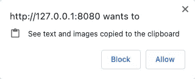

# 如何在 JavaScript 中访问剪贴板

> 原文：<https://blog.devgenius.io/how-to-access-clipboard-in-javascript-2f7f9739742?source=collection_archive---------10----------------------->

## 如何在浏览器或 Node.js 中实现


在 [Unsplash](https://unsplash.com?utm_source=medium&utm_medium=referral) 上由 [micheile dot com](https://unsplash.com/@micheile?utm_source=medium&utm_medium=referral) 拍摄的照片

在[现代浏览器](https://caniuse.com/?search=Clipboard)中，我们可以使用剪贴板 API。

将指定内容写入剪贴板:

```
async function copy(text) {
  await navigator.clipboard.writeText(text);
}
```

读取剪贴板的内容:

```
async function paste() {
  return navigator.clipboard.readText();
}
```

简单的权利，但要注意它只能在安全的上下文中使用，即本地服务或 HTTPS 服务。访问剪贴板时，浏览器还会弹出一个确认框:



除此之外，如果有兼容性要求，需要使用已经弃用的`[Document.execCommand()](https://developer.mozilla.org/en-US/docs/Web/API/Document/execCommand)` API，实现过程相对复杂。这是一些像`[copy-to-clipboard](https://github.com/sudodoki/copy-to-clipboard/blob/master/index.js#L18)`这样的第三方库所做的。

接下来我们来说说如何在 Node.js 中访问剪贴板，我们可以使用子进程调用系统命令来实现。三个主要系统(Windows、Mac 或 Linux)有不同的命令，我将在本文中介绍:

[](https://levelup.gitconnected.com/how-to-access-the-system-clipboard-copy-paste-from-the-command-line-c8615d510ae2) [## 如何从命令行访问系统剪贴板(复制/粘贴)

### 在 Windows，Mac，或者 Linux 上怎么做？

levelup.gitconnected.com](https://levelup.gitconnected.com/how-to-access-the-system-clipboard-copy-paste-from-the-command-line-c8615d510ae2) 

别忘了我们需要判断当前环境是在哪个系统的入口文件中，我们可以用`node:process`来做一个简单的判断:

```
const process = require('node:process');console.log(process.platform);
```

`process.platform`的值是 Mac 的`darwin`；`win32`用于 Windows`linux`针对 Linux。但是如果程序运行在 Linux 的 Windows 子系统中，我们也得到了`linux`，这就成问题了，我们可以用`is-wsl`库来区分。更详细的代码:

```
const process = require('node:process');
const isWSL = require('is-wsl');const platform = (() => {
  switch (process.platform) {
    case 'darwin':
      return 'Mac';
    case 'win32':
      return 'Windows';
    case 'linux':
      if (isWSL) {
        return 'Windows';
      }
      return 'Linux';
    default:
      return '';
  }
})();console.log('platform: ', platform);
```

知道了运行平台，就可以使用 Node.js 中的[子进程](https://nodejs.org/api/child_process.html)来执行相应的命令。正如我在[中提到的，如果没有找到这些命令，你可能需要重新安装或者使用一些回退。](https://levelup.gitconnected.com/how-to-access-the-system-clipboard-copy-paste-from-the-command-line-c8615d510ae2)

*感谢阅读。如果你喜欢这样的故事，想支持我，请考虑成为* [*中等会员*](https://medium.com/@islizeqiang/membership) *。每月 5 美元，你可以无限制地访问媒体内容。如果你通过* [*我的链接*](https://medium.com/@islizeqiang/membership) *报名，我会得到一点佣金。*

你的支持对我来说非常重要——谢谢。