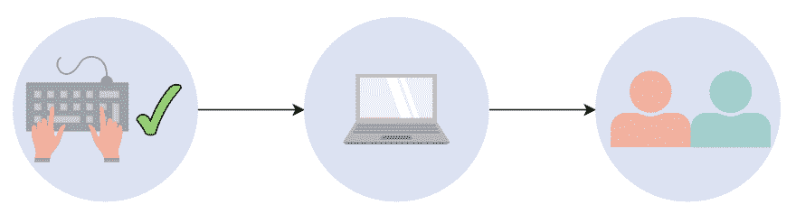
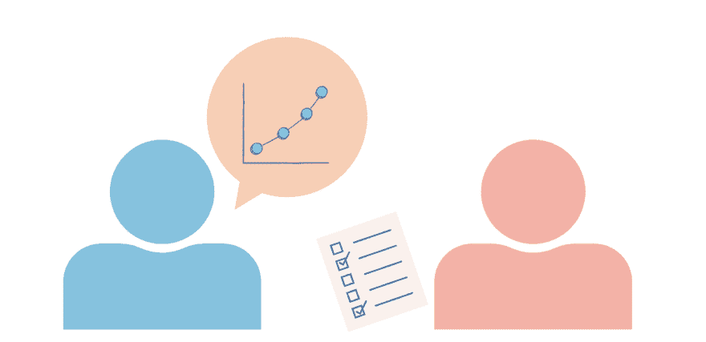

# 如何赢得脸书数据科学家面试

> 原文：<https://blog.devgenius.io/how-to-ace-the-facebook-data-scientist-interview-402a0cd9a763?source=collection_archive---------1----------------------->

图片来源:作者

脸书是许多数据科学家的梦想公司。然而，许多人对脸书数据科学家独特的商业面试流程和角色感到措手不及。

今天，我们将向您展示可以期待什么，并帮助您练习在脸书数据科学面试中获得高分所需的数据科学面试问题。

下面是我们今天要讲的内容:

*   脸书大学的数据科学
*   数据科学面试流程
*   技术屏幕
*   现场采访
*   如何准备你的面试

# 脸书大学的数据科学

数据科学家是脸书的一个高级职位，主要关注业务问题，而不是工程。你的工作重点是产品和市场分析，以帮助脸书做出数据驱动的商业决策。这使得脸书的数据科学工作是产品数据分析师和数据科学家的独特混合体。

**您的日常职责包括:**

*   利用产品和市场趋势寻找增长机会，设定适当的团队目标，并指导产品开发以满足新兴需求。
*   保持良好的产品意识，了解用户需求如何发展。
*   作为业务和工程团队之间的媒介，影响新功能和未来的营销。
*   利用脸书庞大的数据集生成建议的下一步行动，并创建平易近人的视觉效果，将这些传达给高管。
*   基于统计显著性、地理区域、偏倚、目标人群和积极结果的可能性对数据进行分析和加权。

这些独特的挑战将让你接触到各种数据的实际应用，有助于快速提升你的简历和职业生涯。根据 Glassdoor 的数据，该职位也是脸书非执行职位中起薪最高的职位之一，起薪从**12 万美元到**19 万美元不等。

## 应用要求

脸书正在寻找兼具计算机科学和商业分析背景的候选人。

*   精通 Python 或 Java
*   具有人工智能和机器学习算法设计的经验
*   计算机科学、数学或其他相关技术领域的学士学位(或相关训练营)
*   在数据仓库领域有 2 年以上的经验
*   2 年以上编写 SQL 查询语句的经验
*   2 年以上的模式设计经验
*   2 年以上的 OOP 编程语言经验
*   2 年以上 ETL 设计经验
*   2 年以上使用 MapReduce 或 MPP 系统的经验
*   在产品/市场数据中识别可交付成果、差距和不一致性的经验
*   有与内部客户交流数据的经验

图片来源:作者

# 数据科学面试流程

脸书数据科学家面试有 **3 个部分**:初始电话筛选、技术筛选和现场面试。

在各个阶段，脸书面试官将测试你处理问题时的思维方式。展现你强大的解决问题的能力，并表现出你对可能出现的障碍的考虑是至关重要的。

面试官会倾听你的解决方案和流程是如何针对可扩展性进行优化的。与许多其他科技公司相比，脸书收集大量数据，因此他们对你处理大数据和大型结构化数据库的能力特别感兴趣。

最后，面试官希望看到你从**产品的角度来处理问题，而不仅仅是从工程的角度。这意味着关注建议的实际应用，*“我们可以使用什么指标来衡量用户参与度”*，而不是像“我们如何更有效地存储数据”这样的技术方面。**

这些技术方面仍然值得一提，但你的优先事项应该始终与角色的业务/产品重点相匹配。

## 初步筛选

通过 LinkedIn 或电子邮件进行设置，初步筛选是与招聘人员进行 30 分钟的电话面试，讨论脸书、你想要的职位/团队，并表明你对脸书提供的独特的以商业为重点的数据科学职位感兴趣。

在这里你可以听到更多关于这个角色的信息，并决定它是否适合你。

图片来源:作者

# 技术屏幕

这是另一个虚拟筛选，测试您的产品意识和 SQL 技术技能。

## 产品感

产品感知部分是对脸书大学一名现任数据科学家的视频采访，旨在评估你处理和解决问题的能力。

找到正确的解决方案不如有效分解问题、考虑所有影响因素、**提出行动方案**(不仅仅是数据发现)重要。

准备这一部分时，练习:

*   解构大问题的根源并理解其背景
*   自信清晰地解释你的发现和建议的行动方案
*   为你的发现提出一个假设，并解释是什么让你得出这个结论
*   将数据发现转化为可行的建议
*   作为寻求改进产品的人，而不仅仅是用户，参与脸书产品

以下是你可能会遇到的一些问题:

*   你会如何设计一个实验来评估新产品的性能？
*   你如何衡量产品不同部分的成功，比如脸书直播和客户广告？
*   您如何使用当前和过去的数据来预测用户将来想要的功能？
*   你将如何准备参加新产品发布会？

## 技术的

在这一部分，你将有一个数据集和两个问题需要在 20 分钟内用代码解决(每个问题 10 分钟)。

您必须使用名为 Coderpad 的代码编辑器在 SQL 或 Pandas 代码中解决这两个问题。然而， **SQL 是首选**，因为它是脸书数据科学工具的标准。

> *你将无法执行你的代码，所以练习 SQL 语法以确保最小的语法错误。*

除了编写每个解决方案的代码，您还必须解释每个解决方案的应用和缺点。与亚马逊等其他大型数据科学公司相比，脸书正在寻找具有出色沟通技能的数据科学家。

例如，您可能会收到两个包含某个脸书小组活动信息的表:一个使用日志，其中包含去年每个人在该页面上花费的时间；另一个表，其中包含每个成员的姓名、出生日期、职业和家乡。

**然后你会被要求创建 SQL 程序来查找:**

*   在这一组中，不同年龄的人用法有何不同？
*   什么职业在周五和周六的使用差异最大？
*   哪个因素似乎与使用联系最紧密？
*   有百分之多少的用户在生日那天访问该群

图片来源:作者

# 现场采访

面试的最后阶段是一个 2.5 小时的系列面试，地点在西雅图的门洛帕克或纽约脸书校区。共有 4 个不同的 30 分钟访谈，每个涵盖不同的案例研究。还有 30-40 分钟的午餐休息时间，与当前的数据科学家讨论角色。

你有 30 分钟的时间回答每个问题:

*   1 个 SQL 技术问题
*   1 个产品解释问题
*   1 道定量分析题
*   1 道应用数据题

**SQL 技术问题**在格式上类似于技术筛选问题；您将收到一个数据集，并被要求使用 SQL 解决问题。然而，这个 SQL 问题往往比技术筛选中的问题更难，解决方案也更长。

**产品解释问题**要求您用目标 KPI 和如何实施 a/b 测试等细节来衡量产品性能。您可能会被要求走一遍，或者您可能需要创建一个高层次的实施计划。

> *这方面的一个示例问题是:*
> 
> *“您如何衡量* X *新功能的性能？”*

**定量分析题**是统计学基础题，测试你是否了解统计数据分析的基础知识。许多候选人发现这是面试中最容易的部分，因为这只是你没有忘记基本原则的一个基线。

这方面的示例问题如下:

*   什么是贝叶斯定理，你什么时候会用到它？
*   什么是假设检验？
*   什么是 p 值，在上下文中如何解读？
*   在线性回归的上下文中列出关于数据的假设。
*   你将如何向你的产品经理解释概率的应用？

**应用数据问题**要求您考虑一个高层次的解决方案。你要概述你的过程，列出你所有的假设，描述可能的缺点和你如何为它们做准备，并解释你如何得出结论。面试官会在这个过程中问一些后续问题，看看你对这个解决方案的思考有多深入。

本部分的问题有意宽泛，例如:

*   在脸书，人们和他们的兄弟姐妹互动多了还是少了？
*   你如何衡量互动？
*   你如何确定人们是否是兄弟姐妹？
*   脸书如何利用这些信息？

**或**

*   活动如何随季节变化？您正在关注哪个/哪些地区？你认为一条评论比一个赞更有价值吗？
*   你会用什么因素来区分用户？
*   脸书如何利用这些信息？

在其中两次采访之间，您将有机会与一位现任数据科学家进行一次 30-40 分钟的非正式采访，询问他们的日常职责、挑战以及您感兴趣的任何其他问题。

这本质上是一次行为面试，看看你是否有适合这家公司的心态和激情。问他们一些有见地的问题，表明你正在考虑这份工作，把你的魅力提升到 11！

一些好的问题包括:

*   你职业生涯中最困难的项目是什么，你是如何解决的？
*   成为脸书数据科学家有什么独特的好处？
*   当你开始在脸书工作时，你希望你有什么建议？
*   你最喜欢脸书的哪一部电影，为什么喜欢？

# 如何准备你的面试

当你接近面试时，记住:

1.  面试的一部分失败并不意味着你不会得到这份工作，保持自信。
2.  招聘人员在评估你的态度和友好程度的同时也在评估你的技能，别忘了你的行为面试技巧。
3.  重温你的机器学习、SQL 查询基础知识和统计学基础知识，确保你不会犯任何可以避免的错误。

为这次面试做准备的最好方法就是**动手练习**。继续做那些练习题，你一定会得到这份工作的！

*快乐学习！*