# 如何激活并获得适用于您网站的 PositiveSSL 证书

> 原文：<https://blog.devgenius.io/how-to-activate-and-get-your-positivessl-certificate-on-namecheap-for-your-website-33059d717354?source=collection_archive---------3----------------------->

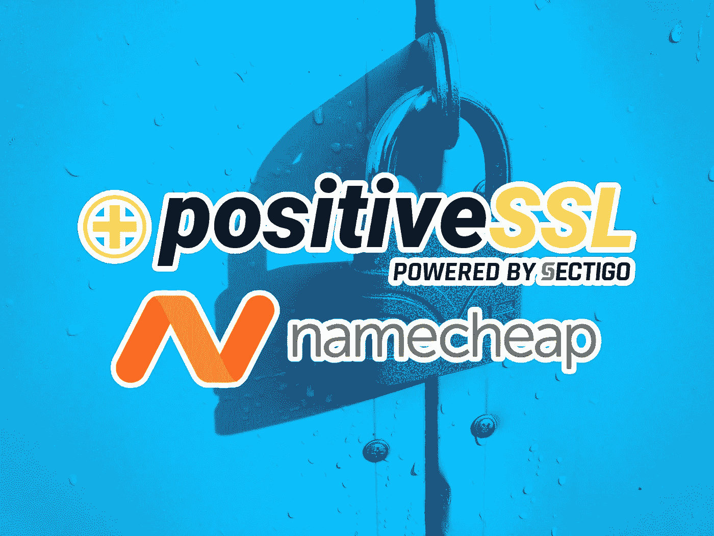

[马克西姆·日古列夫](https://unsplash.com/@jemjoyrussia?utm_source=unsplash&utm_medium=referral&utm_content=creditCopyText)在 [Unsplash](https://unsplash.com/s/photos/lock?utm_source=unsplash&utm_medium=referral&utm_content=creditCopyText) 上的原图；Sectigo 和 Namecheap 的 logosTremaine Eto 的插图。

如果你想在你的网站上添加 SSL——简单来说，就是在访问者的浏览器中设置一个漂亮的锁图标，并让你的 URL 以`https`开头——那么 Comodo PositiveSSL 是市场上领先的解决方案之一。

一年的价格是 8.88 美元；如果您承诺支付四年，这种年费率会随着您预先支付的每一年逐渐降低到 5.88 美元/年。

在本文中，一旦您支付了 PositiveSSL 证书并结账，我将介绍这个过程；我最近为我的个人网站[https://tremaineeto.com](https://tremaineeto.com)做了这个，所以它在我的脑海中相当新鲜。

# 在您的帐户中找到它

首先，登录你的廉价账户，然后进入`Product List`，点击`SSL Certificates`。

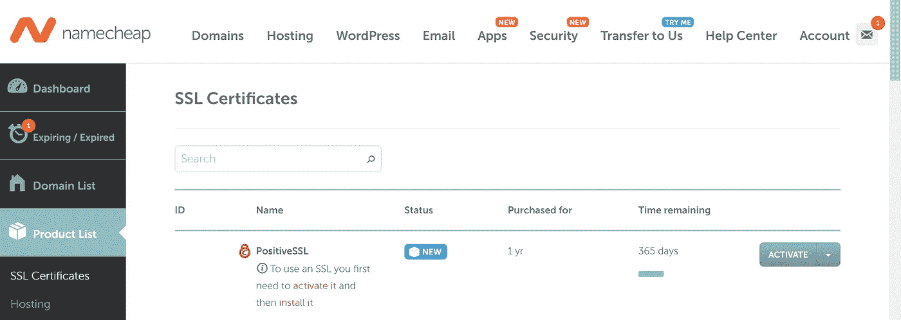

此时，您会想要点击`ACTIVATE`。

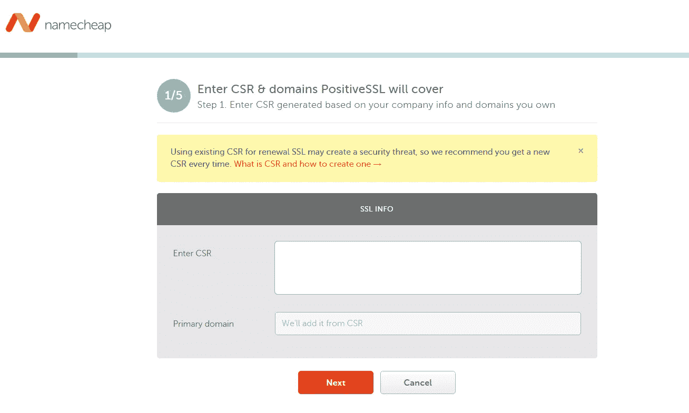

你会遇到这第一步；要了解更多信息，我认为点击“什么是企业社会责任以及如何创建企业社会责任”的橙色链接是一个不错的主意。

不过，本质上，我建议您使用本文提到的这个 [CSR 生成器](https://decoder.link/csr_generator/\)。

通过链接获得 CSR 后，将 CSR 文本复制并粘贴到上面的表格中。如果您正确填写了 CSR 生成器，主域应该会自动填入您的域名。然后，点击`Next`。

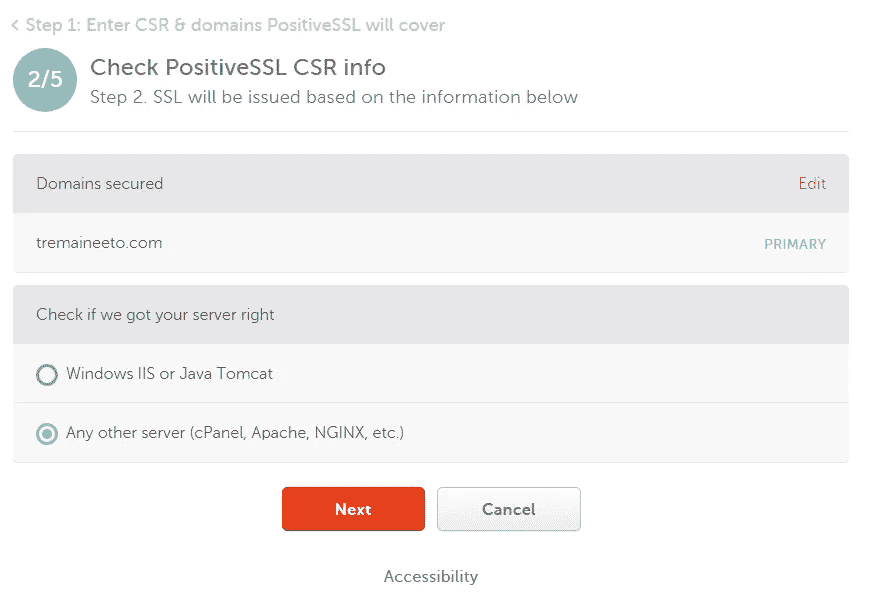

你会在顶部看到你的域名，然后你必须确认你使用的是哪种服务器。在我的例子中，我知道我没有使用 Windows IIS 或 Java Tomcat，所以我离开`Any Other server (cPanel, Apache, NGINX, etc.) selected`。然后，点击`Next`。你会看到这个:

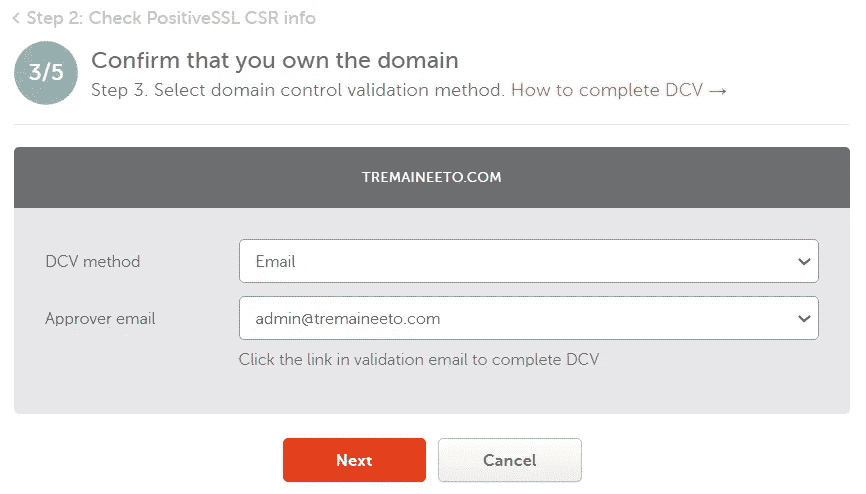

您现在有两种可能性，我将在接下来的两个部分中介绍。当你继续阅读时，问问你自己标题中的问题。

# 您的网站上是否设置了此审批者电子邮件？

## 不，我不知道

所以也许你不确定我在说什么，或者你已经知道你没有设置好。如果你不知道什么是审批人邮件，那就是 Namecheap 将发送确认邮件的邮件，而且在它工作的时候，你不能随便放任何邮件进去；相反，你必须把它发送到你的域名上的特定电子邮件，这样他们就知道是你，并且和它联系在一起。

要设置一个账户，让我们回到我们的廉价账户，然后点击左侧工具栏中的`Domain List`。

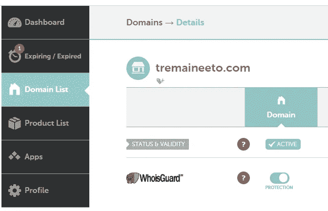

向下滚动到显示`REDIRECT EMAIL`的部分。

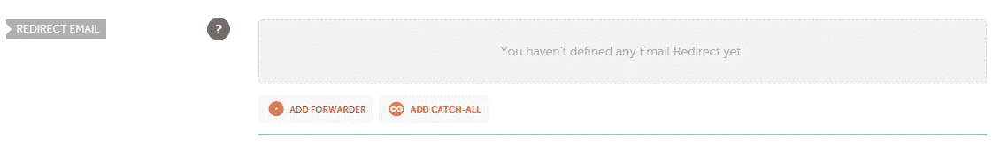

在这里，点击红色加号和写着`ADD FORWARDER`的链接。

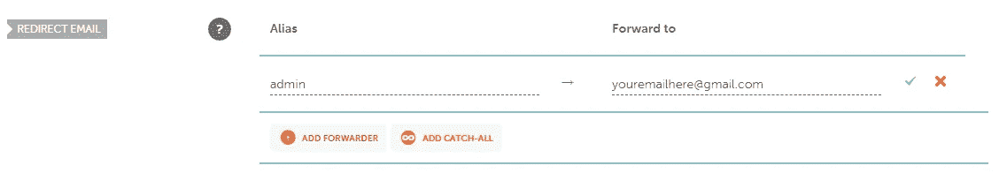

对于`Alias`部分，输入`admin`，然后转发到你已经设置好的邮箱。例如，这可以是你自己的个人电子邮件。然后，单击绿色复选标记。

现在，很遗憾，我们不得不等待。为什么？根据 Namecheap 的[关于邮件转发的帮助文章](https://www.namecheap.com/support/knowledgebase/article.aspx/308/2214/how-to-set-up-free-email-forwarding/)，

> "请等待**大约一个小时**，以便新创建的邮箱在转发邮件服务器上完成设置。激活您的设置后，您将能够测试您的邮件服务。

去做点别的事情放松一下。大约一个小时后，试着给`admin@yourdomain.com`发送一封电子邮件，看看它是否会转发到你设置的个人邮箱。如果是这样，那么回到你的名字廉价 SSL 设置并点击`Next`。

然后，进入下一部分:“是的，我愿意”。

## 是的，我有

无论您已经设置了审批者电子邮件，还是只设置了它，您现在都可以继续进行第 4 步(共 5 步)了。在这里，您实际上可以指定您希望 SSL 文件发送到哪个电子邮件。

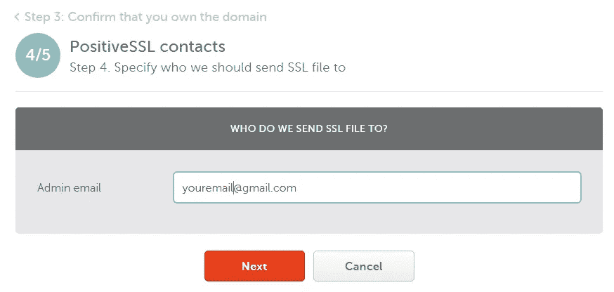

点击`Next`，然后您应该通过`Sectigo Certification Authority`将 SSL 文件发送到管理员的电子邮件地址。

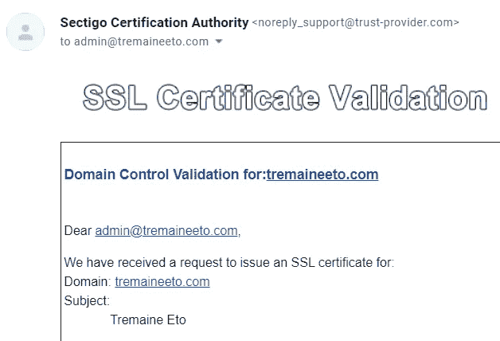

按照电子邮件的说明，在外部站点中复制并粘贴域控制验证代码(确保是正确的代码:[https://secure.trust-provider.com/](https://secure.trust-provider.com/))，您最终会得到以下消息:

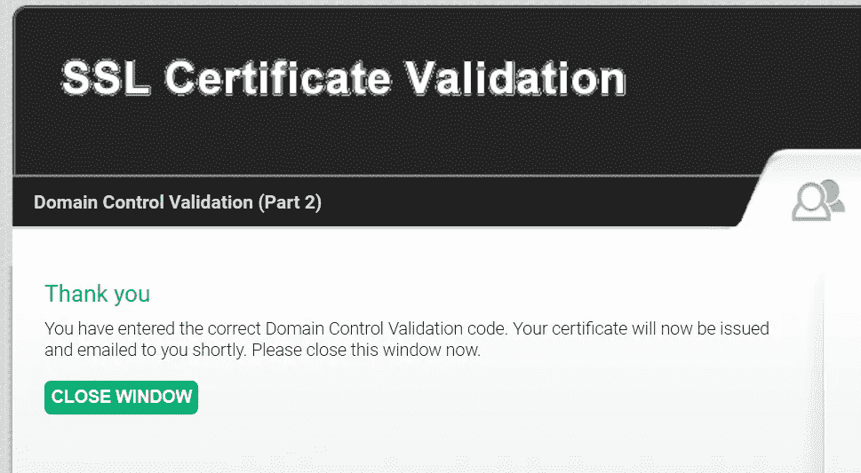

然后，等待你的 PositiveSSL 证书出现在你的电子邮件中。在里面，你会发现:

*   你的 PositiveSSL 证书(一个`.crt`文件)
*   您的 Apache“捆绑”文件(一个`.ca-bundle`文件)

这些应该在电子邮件附件的`.zip`文件中。

就是这样！现在，您已经有了来自 CSR 生成器的 CSR、PositiveSSL 证书和 CA bundle 文件，您需要将这些文件提供给服务器，以便为您的网站设置 SSL 和 HTTPS。

在以后的文章中，我将详细介绍如何在不同的服务器上实现这一点，但是现在我建议您查看您的服务器文档，因为每个服务器的文档都略有不同。

 [## 通过我的推荐链接加入媒体

### 作为一个媒体会员，你的会员费的一部分会给你阅读的作家，你可以完全接触到每一个故事…

tremaineeto.medium.com](https://tremaineeto.medium.com/membership)