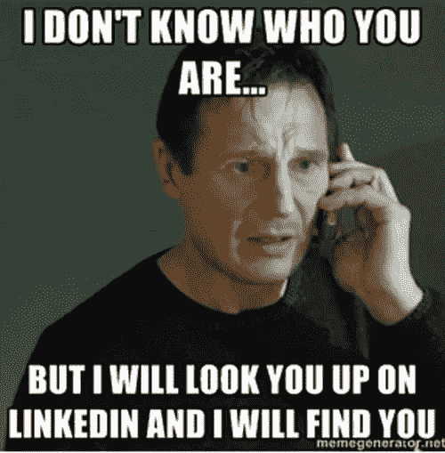

# 实际上如何建立关系网？

> 原文：<https://blog.devgenius.io/how-to-actually-network-8e538002fc54?source=collection_archive---------19----------------------->

社交活动？LinkedIn？建立强大网络的秘诀是什么？大家讨论一下！

我们都被告知人际关系网的重要性。我听说过各种各样的说法:“在大学里建立关系网很重要”、“一定要建立关系网”、“关系网是关键”，以及各种各样强调关系网重要性的说法。但是我在想，没有人真正教过我*如何*联网。我知道人际关系很重要，但是…我如何才能成功呢？我实际上如何着手建立我的人际网络？

让我们来分析一下如何在现实生活中有效地交际！

> 免责声明:本文所有观点均为:观点。我的大部分信息来自我在自己的经历、朋友的经历以及互联网上的文章、视频或书籍中看到的真实世界的例子。让我们开始吧…

议程如下:

*   网络神话
*   我为什么要建立关系网？
*   什么是网络？
*   如何在生活中实现网络化？
*   总结和结论

# 网络神话

1.  **社交是你在固定时间点**做的事情。—不要把建立关系网看作是只在特定时间发生的固定活动。例如，“我将在下午 5 点上网。”→不要这样想。
2.  参加社交活动是你建立关系网的方式。——参加社交活动不是你的社交方式。通常，你们都是为了同一件事:与你们都想从中获得某些东西的人建立表层联系。
3.  **人际关系网是在你需要的时候与某人快速建立关系**——当你想在 X 公司得到一份工作时，不要很快与在那里工作的人交朋友并要求推荐。
4.  **社交不是在 LinkedIn 上“联系”的简单动作**——虽然 LinkedIn 是一个很好的工具，但简单地与他人联系不是我所说的社交。

# 我为什么要建立关系网？

我的职业是软件工程师，我认为这可以让我逃避我的软技能，在最近的实习后，我很快意识到，不，软技能是这份工作不可或缺的一部分。我深信，学习如何有效地建立人际关系网是任何职业、工作或人生阶段与人交往的关键。

以下是你应该学习如何交际的 5 个理由:

1.  **你的人脉=你的净资产**——人们做事是因为喜欢你，而不一定*是因为你有最好的产品*。当然，在初级工作中，你的技能很重要。但是如果你想爬上公司的阶梯，更多的是你的社交能力，而不是你的技能。你有技能是理所当然的。
2.  你是你周围五个人的反映，你做出的简单选择在很大程度上决定了你是谁。听的音乐，看的视频，身边的人。
3.  **责任**——当人类只对自己负责时，他们做得不好。但是当我们是一个更大的群体的一部分时，我们可能会被很大程度地影响以某种方式表现。朋友们互相承担责任，坚持到底并取得胜利。
4.  **知识、成长和更多**——不仅知识和成长会变得很平常，你还能获得你从未接触过的新技能和工具。
5.  **它教你销售** —生活中的一切都是销售。当你去面试为什么他们应该雇用你时，你是在推销自己。雇主在向公司推销你为什么应该为他们工作。我们说服我们的孩子为什么他们应该在学校表现良好。我们向我们的伴侣推销我们自己，告诉他们为什么他们应该选择我们。

照片由[S O C I A L C U T](https://unsplash.com/@socialcut?utm_source=unsplash&utm_medium=referral&utm_content=creditCopyText)在 [Unsplash](https://unsplash.com/s/photos/networking?utm_source=unsplash&utm_medium=referral&utm_content=creditCopyText) 上拍摄

# 什么是网络？

让我们来定义什么是网络，因为它不是 LinkedIn 连接。

网络是一系列与人的真实关系，无论是在什么平台上(在你的电话联系人、LinkedIn 或其他平台上)，都与你的前进方向一致，你已经增加了价值。

因此，当我们说我们在建立关系网时，我们不是在做一件神奇的任务，我们只是在与人们建立真实的关系，并尽可能地为他们增加价值。

> 人脉不是你能得到什么，而是你能给予什么。

我什么时候知道我有一个强大的网络？无论如何，这都不是一个详尽的列表，但这里有一个强大的网络的一些方面…

*   **问责**。你接受过建设性的批评吗？你是攻击这个人还是评估这个信息并把它应用到需要应用的地方？
*   **鼓励**。人们会庆祝你的胜利吗？人们和你想去的方向一样吗？
*   **知识/学问**。你的人际网络教会了你什么？你最近学到了什么新概念/新技术。
*   **不同的经历/背景/思维方式**。每个人的想法都完全一样吗？还是有人会在对话中带来不同的观点？

# 如何在生活中实现网络化？

## a)成为最好的自己

这是有效建立关系网最重要的一步。

你试过从空杯子里倒东西吗？什么都没出来。但是当你从一个满满的杯子里倒酒时，有太多的价值会溢出来！

所以换句话说…先倒满你的杯子。

空杯。src: [这里](https://www.tiffanydesousamachado.com/blog/empty-cup)

这里有 5 件事可以帮助你:

1.  **性格**——你的价值观、原则和道德观是什么？如果你没有立场，你会爱上任何东西。
2.  **90%的交流是非语言的**——发型、服装、气味、衣服、锻炼、肢体语言。
3.  **技能和项目** —你的主要手艺是什么？你正在成为什么方面的大师？你目前正在学习什么新技能？
4.  **目标和愿景** —你的长期目标和愿景是什么。(详见:[此处](https://www.youtube.com/watch?v=d93SGaf82OM&list=PLAl0gPKnL3V8s7dPXoo07mYnuErhWVk8b&index=1))
5.  做一个创造者——你有可以教给世界的东西！你学到了什么可以和别人分享的东西？《出埃及记》我在我的大学班级里，我的同学有一个棘手的重复作业，我为这个作业创建了一个指导文档，许多同学都使用它。

> 把 80%的时间花在步骤 A 上，剩下的步骤会自然而然地完成。

[天线](https://unsplash.com/@antenna?utm_source=unsplash&utm_medium=referral&utm_content=creditCopyText)在 [Unsplash](https://unsplash.com/s/photos/networking?utm_source=unsplash&utm_medium=referral&utm_content=creditCopyText) 上拍照

## b)首先为他人增加价值

给别人增加价值听起来违背直觉。人脉对我来说不应该是一项资产吗？

大多数人进入社交网络是为了看他们能从别人那里得到什么，而不是他们能给予什么。这自然会让你与众不同。它还能让你学会如何为他人创造价值，让别人记住你是一个真正关心他人成功的人。

价值观不仅仅意味着金钱。它可能意味着你的专业知识、时间、资源或人脉。

这里有 4 件事可以帮助你:

1.  **出门要有心。** —酒吧、健身房、会议、黑客马拉松、体育赛事、餐馆。长得好看，态度好，对认识新朋友持开放态度。因为你太专注于步骤 A，和你走同一方向的人会暴露自己。
2.  志愿服务——无论是你的时间、金钱、资源还是专业知识，志愿服务首先会给别人增加价值。
3.  **为他人创造一些东西** —向他人展示价值。或许可以在上创建教程。帮你的同学拿个博士。如果你真的擅长某件事，创建一个资源来帮助别人。
4.  **“先给别人增加价值”的心态**——价值可能会因你周围发生的事情而有所不同。这没关系。永远要有这样的心态，不要从一段关系中索取，而是要想出你能为这段关系付出什么，让它变得更牢固。

> *人们会更加努力地为你奋斗。因为你首先对他们感兴趣，所以当你需要帮助时，他们会对你的成功有强烈的既得利益。*

## c)培养关系

我们可能都有几个月甚至几年没联系的联系人。我们在某个场合和一个人有过一次交流，然后几个月过去了，我们再也没有和他们说过一句话。

保持和培养你已经建立的关系是至关重要的，否则这种关系将会变得很糟糕(混乱)。这需要一个积极的、有意识的努力，并且会让你与他人建立良好的关系。

这里有 4 个小贴士可以帮助你:

1.  删除联系人列表——你应该与手机中保存的每一个联系人保持联系。
2.  **分配给培养的时间**——每天花 30 分钟给 5 个人发短信/打电话，询问他们过得怎么样，是否需要什么(想想提供价值的方法)。
3.  **LinkedIn 人脉**——每两周在 LinkedIn 上挑选 5 个人，检查他们的个人资料，并与他们展开对话，真正对他们的旅程和成功感兴趣。问他们一个问题。
4.  **建立强大的人际网络**——现在是时候开始建立强大的人际网络了！与这个人分享知识，鼓励他们，并征求他们对 x 的反馈。

> 这确保你的脸和名字不仅会被记住，还会与积极的态度和价值观联系在一起。

# 总结和结论

人际网络是与人们建立真实的关系，并尽可能地为他们增加价值。

实施网络有三个步骤:

a)成为最好版本的自己。

b)先给别人增值。

c)培养关系。

所有这三个步骤都是相互依赖的。如果你对一段关系一无所有，你就无法培养这段关系。你必须首先给别人增加价值，但是如果你什么都不能提供，你就不能创造价值。

> *人脉关系的时候，可能会收到一时的好效果。但是*伟大的*结果是在 5-10 年后出现的……当你在酒吧认识的那个人，你为他增加了价值，他的一个朋友恰好在几年后有一个职位空缺，并且被推荐*你的*名字作为这个机会的完美人选。*

感谢你的阅读，我希望你已经得到了一些价值(附:我写这篇文章是为了提醒自己如何有效地建立关系网，我们都在一起)！如果你做到了这一步，让我们在 LinkedIn[https://www.linkedin.com/in/payton-d-78a7a2171/](https://www.linkedin.com/in/payton-d-78a7a2171/)上联系吧！

如果你想要更多的结帐这个伟大的渠道大部分的想法来自:【https://www.youtube.com/c/AfterHourswAntonDaniels/videos 