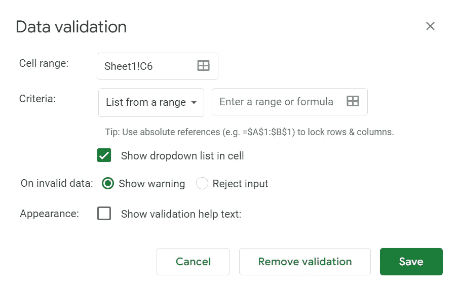
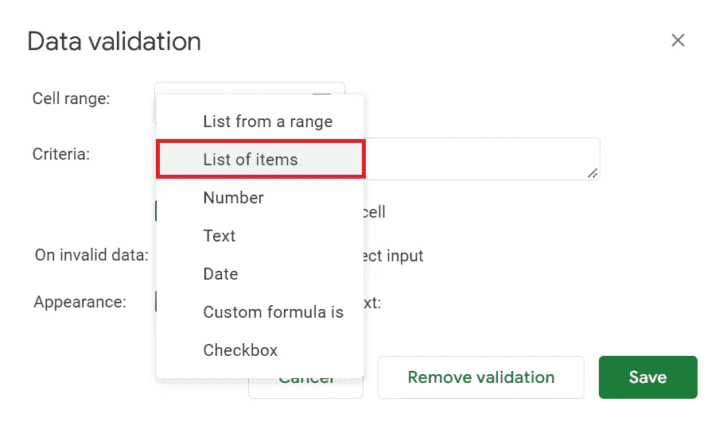
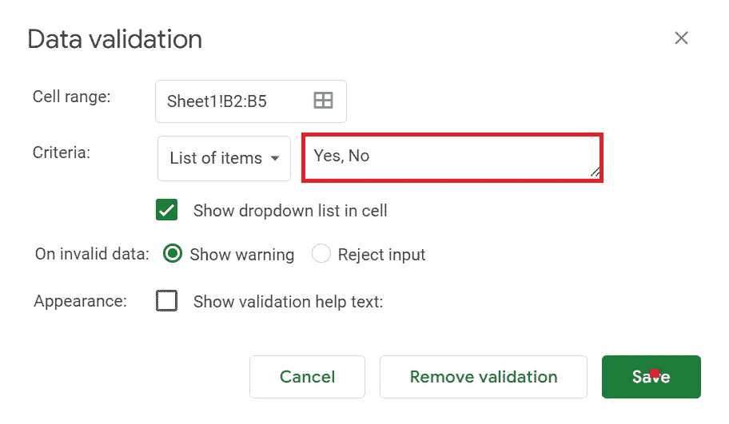
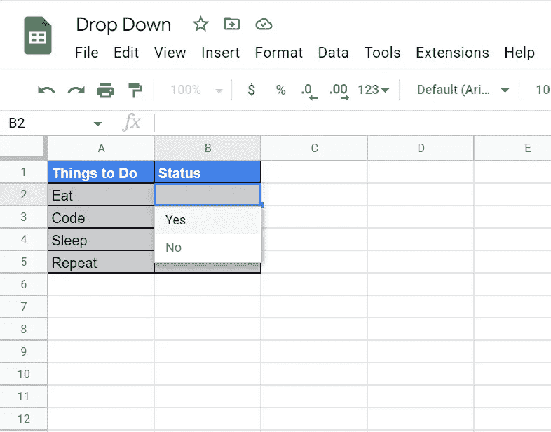

# 如何在 Google Sheets 中添加下拉菜单

> 原文：<https://blog.devgenius.io/how-to-add-a-drop-down-menu-in-google-sheets-5d3fff1f7cb8?source=collection_archive---------21----------------------->

## 不要再写手工的物品清单了，用下拉菜单就行了，没那么难。

在 [Unsplash](https://unsplash.com/s/photos/list?utm_source=unsplash&utm_medium=referral&utm_content=creditCopyText) 上由[Paico official](https://unsplash.com/@paicooficial?utm_source=unsplash&utm_medium=referral&utm_content=creditCopyText)拍摄的照片

# 介绍

在本教程中，我们将看到一个简单的方法来添加一个下拉菜单到谷歌表。你可能知道，添加下拉菜单有很多不同的方法，但这是最简单的方法之一。这里我们将重点介绍" ***数据验证*** "及其选项添加下拉菜单。让我们开始吧。

# 问题陈述

在单个单元格中添加太多内容或者使用多个单元格来保存相似的数据会消耗大量的时间和空间。但是只需添加一个简单的下拉菜单，我们就可以解决这个问题，现在可以在一个单元格中创建多个条目列表。这种解决方案使工作表看起来简单、易于滚动、整洁。

# 数据有效性

在 Google Sheets 中验证数据是一个工具，它允许您根据您添加的规则限制我们可以在单元格、行或列中输入的信息。现在，您可以转到 criteria 选项，并选择显示“ ***项目列表*** ”的选项。

**Google Sheets 中的数据验证**

# 项目清单

顾名思义，它帮助您以基于列表的方式添加项目的数量，如下所示。

**数据验证—标准—项目列表**

选择项目列表后，您需要在下拉菜单中添加您需要的内容。我指的是如下图所示的**内容**。

**添加下拉菜单内容**

> ***注意*** —下拉菜单的内容应该始终用逗号(，)隔开。另外，不要忘记选择**在单元格**中显示下拉列表。

# 结果

通过将条目列表添加到单元格中，数据验证的结果会为您提供一个漂亮的下拉菜单，如下所示。您可以根据需要自定义列表。玩吧，让我知道。

**下拉菜单与项目列表**

# 结论

这就是如何轻松地将下拉菜单添加到工作表中。感谢您花时间阅读我的文章。如果你有其他方法在评论区添加下拉菜单，请告诉我。请继续关注更多科技文章的更新。再次感谢你。祝您愉快！