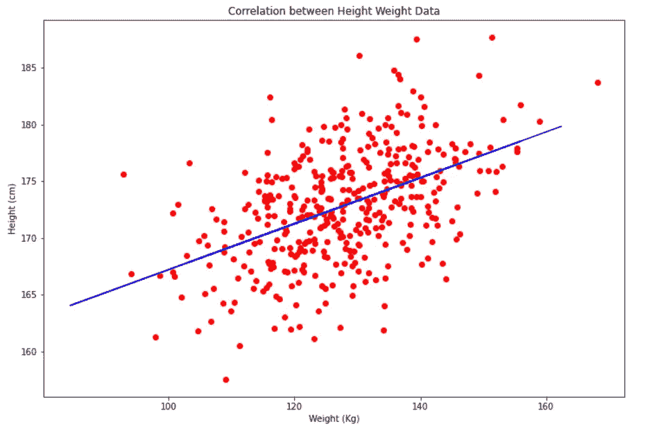
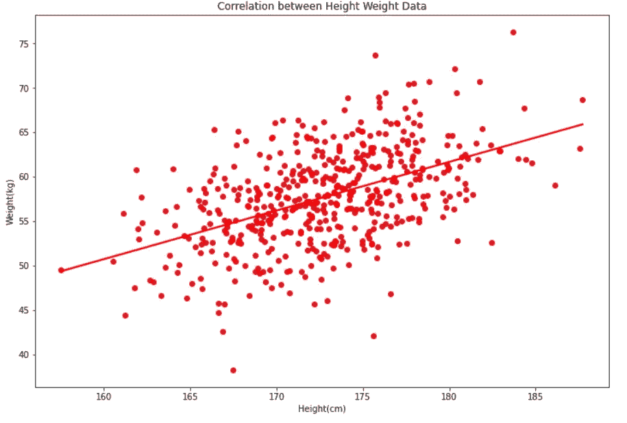

# 如何在散点图中添加拟合线？

> 原文：<https://blog.devgenius.io/how-to-add-a-fitted-line-in-scatter-plot-30ae01c62a82?source=collection_archive---------11----------------------->

> 水平:“初学者”，语言:“Python”，数据可视化

**什么是数据可视化？**

鉴于业务部门现在通过数据分析积累了如此多的信息，我们需要一种机制来可视化这些数据，以便进行分析。数据可视化通过地图或图形向我们展示可视化的环境，帮助我们理解信息的含义。因此，在庞大的数据集中更容易发现趋势、模式和异常值，因为这些数据更容易被人脑理解。


由[卢克·切瑟](https://unsplash.com/@lukechesser?utm_source=medium&utm_medium=referral)在 [Unsplash](https://unsplash.com?utm_source=medium&utm_medium=referral) 上拍摄的照片

**为什么我们需要使用情节？**

图形和图表是极好的视觉辅助工具，因为它们使信息易于获取和快速理解。当数据显示为图表而不是表格时，通常会更容易理解，因为图表有助于显示模式或比较。Python 和它的库支持各种各样的绘图类型，但是我解释的是散点图。

**散点图**

散点图用于确定两个变量之间是否有关系或相关性，散点图使用点来显示这种联系。要创建散点图，请使用 matplotlib 库中的 scatter()方法。变量之间的关系以及一个变量的变化如何影响另一个变量经常用散点图来表示。

我们可以使用 python 中的两个库来绘制散点图:

**Matplotlib**

为了更好地理解这些概念，我使用了 Kaggle 数据集“SOCR-身高体重”。对于 matplotlib，首先我从 py plot“import matplotlib . py plot as PLT”导入了[**matplotlib**](https://matplotlib.org/stable/plot_types/basic/scatter_plot.html#sphx-glr-plot-types-basic-scatter-plot-py)**。**

```
#convert height into cm and weight into kg
data["Height(cm)"] = data["Height(Inches)"] * 2.54
data["Weight(kg)"] = data["Weight(Pounds)"] * 0.45359237
```

**在处理数据集时，我们总是需要进行数据清理和预处理，例如转换成数值、NaN 值和不同的缩放参数。这里我把它们分别换算成 cm 和 kg。**

```
#convert the data frame into a Numpy array
Height = data[“Height(cm)”].values
Weight = data[“Weight(kg)”].values#reshape
new_weight = weight.reshape(-1,1)
```

**对于线性回归，要获得数据帧的 Numpy 数组表示(。价值观)。我使用了“整形”，否则你会得到这种类型的错误后，分裂数据集“提高值错误(“x 和 y 必须是相同的大小”)**

```
x_train, x_test, y_train, y_test = train_test_split(new_weight, Height, train_size=0.8)lm = LinearRegression()         #creating LinearRegression model
lm.fit(x_train, y_train)        #train the model using training data 
y_predict = lm.predict(x_test)  # get the regression line
```

**借助 train_test_split 将数据集拆分为训练和测试。train_size 为 0.8 意味着您的数据分为 80%的训练数据和 20%的测试数据。对于这个散点图，我们使用的是线性回归，我们必须拟合 x_train 和 y_train。在 predict 函数的帮助下，我们预测 x_test 的百分比。**

```
plt.figure(figsize=(12, 8))
**plt.scatter(x_train, y_train, color='red')**   #for scatter plot
**plt.plot(x_test,y_predict, color='blue')**     #for fitted line
plt.xlabel("Weight (Kg)")
plt.ylabel("Height (cm)")
plt.title("Correlation between Height Weight Data")
plt.plot
```

**在 figsize 的帮助下，我们可以增加图形的大小。为了绘制散点图，我只使用散点图，对于拟合线使用绘图(蓝色)。**

****

****Seaborn****

**为了使用 seaborn，我将 seaborn 库导入为“将 seaborn 导入为 sns”。在 seaborn，我们不需要像 matplotlib 那样写那么多代码。很简单，对吧？**

```
# using seaborn librabiry.
fig = plt.subplots(figsize = (12,8))#Scatter plotting for Height and Weight. 
sns.scatterplot(data=data,x= "Height(cm)", y = "Weight(kg)")#Putting a regression line. 
sns.regplot(data=data,x= "Height(cm)", y = "Weight(kg)", ci=None)
```

**对于不断增加的绘图大小，我使用 figsize 作为 matplotlib。用 sns 恰到好处的一句话“[](https://seaborn.pydata.org/generated/seaborn.scatterplot.html)**”然后提你的数据框名称，在那之后是 x 轴和 y 轴名称(输入变量)。别忘了用" "。****

****对于拟合线，[**regplot**](https://seaborn.pydata.org/generated/seaborn.regplot.html)**可用于绘制数据和线性回归模型拟合。如果您想在此图中看到置信区间，则删除 ci=None。******

************

********结论:********

1.  ****身高和体重松散地 [**正相关**](https://www.j-pcs.org/viewimage.asp?img=JPractCardiovascSci_2018_4_2_116_240962_f1.jpg) 。****

****2.中量级可能显示出更多的身高差异，但这也可能是因为中量级有更多的可用数据点。****

****3.除了身高，还有各种各样的额外特征影响体重。****

******有用链接******

****整个项目的代码可以通过下面的链接在我的 GitHub 账户上查看。****

****[https://github . com/Shravantisy/Project _ 7 _ Linear _ Regression/blob/master/Height _ weight . ipynb](https://github.com/Shravantisy/Project_7_Linear_Regression/blob/master/Height_weight.ipynb)****