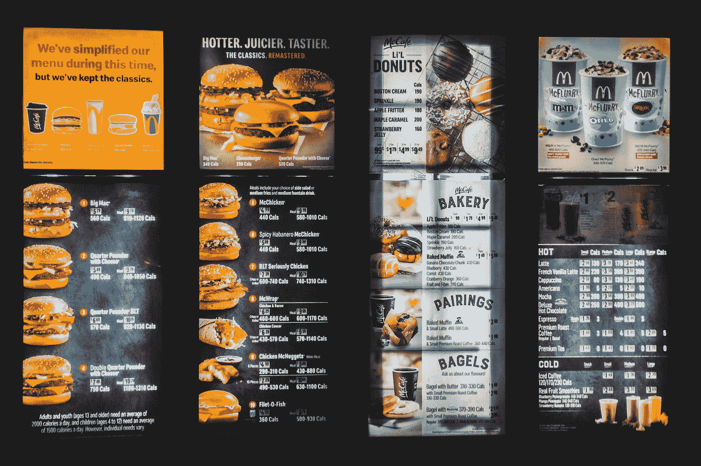

# 如何用 Vue 3 添加带有活动项目高亮的菜单？

> 原文：<https://blog.devgenius.io/how-to-add-a-menu-with-active-item-highlighting-with-vue-3-7cb40809a5f?source=collection_archive---------4----------------------->



埃里克·麦克林在 [Unsplash](https://unsplash.com?utm_source=medium&utm_medium=referral) 上拍摄的照片

有时，我们希望添加一个菜单，在我们的 Vue 3 应用程序中突出显示活动菜单项。

在本文中，我们将看看如何用 Vue 3 添加一个带有活动项目高亮的菜单。

# 添加带有活动项目突出显示的菜单

为了在我们的 Vue 3 应用程序中添加一个带有活动项目高亮显示的菜单，我们可以监听`mouseenter`和`mouseleave`事件。

当发出`mouseenter`事件时，我们给悬停在上面的项目添加高亮。

当发出`mouseleave`事件时，我们清除所有项目上的高亮显示。

为此，我们写道:

```
<template>
  <ul>
    <li
      :class="{ hovered: hoveredItem === 'apple' }"
      @mouseenter="hoveredItem = 'apple'"
      @mouseleave="resetHover()"
    >
      apple
    </li>
    <li
      :class="{ hovered: hoveredItem === 'orange' }"
      @mouseenter="hoveredItem = 'orange'"
      @mouseleave="resetHover()"
    >
      orange
    </li>
    <li
      :class="{ hovered: hoveredItem === 'grape' }"
      @mouseenter="hoveredItem = 'grape'"
      @mouseleave="resetHover()"
    >
      grape
    </li>
    <li
      :class="{ hovered: hoveredItem === 'pear' }"
      @mouseenter="hoveredItem = 'pear'"
      @mouseleave="resetHover()"
    >
      pear
    </li>
    <li
      :class="{ hovered: hoveredItem === 'banana' }"
      @mouseenter="hoveredItem = 'banana'"
      @mouseleave="resetHover()"
    >
      banana
    </li>
  </ul>
</template><script>
export default {
  name: "App",
  data() {
    return {
      hoveredItem: "",
    };
  },
  methods: {
    resetHover() {
      this.hoveredItem = "";
    },
  },
};
</script><style scoped>
.hovered {
  color: red;
}
</style>
```

我们有动态应用了`hovered`类的`li`元素。

当`hoveredItem`的值与`mouseenter`事件处理程序中设置的值相同时，我们应用该类。

当鼠标离开一个项目时，我们调用`resetHover`方法将`hoveredItem`重置为空字符串。

我们有`hoveredItem` reactive 属性来跟踪哪个项目被高亮显示。

我们有一个`.hovered`类，它将`color`设置为`red`来添加高亮显示。

现在，当我们将鼠标悬停在某个项目上时，我们应该会看到鼠标悬停的项目变成红色。

当鼠标离开项目时，项目会变回黑色。

# 结论

我们可以用 Vue 3 轻松地添加一个带有活动项目高亮显示的菜单。

为此，我们只需监听`mouseenter`和`mouseleave`事件，并相应地应用该类来添加高亮显示。