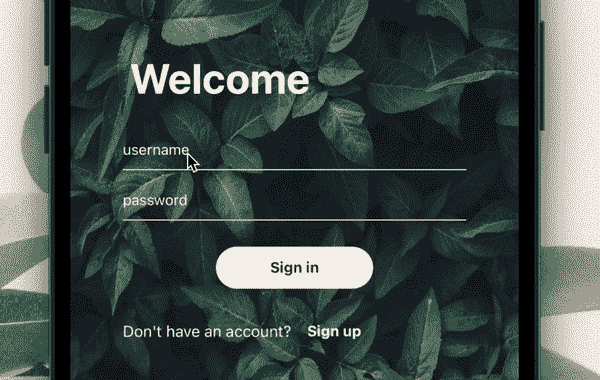
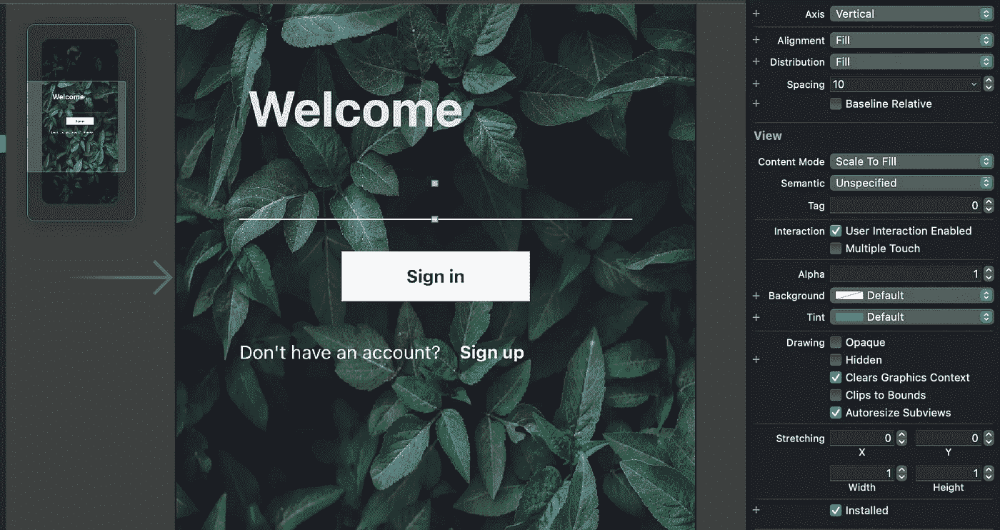
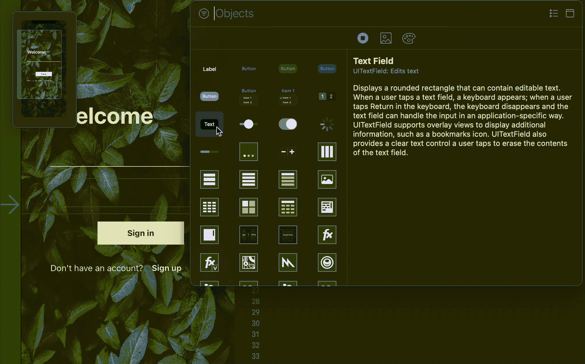
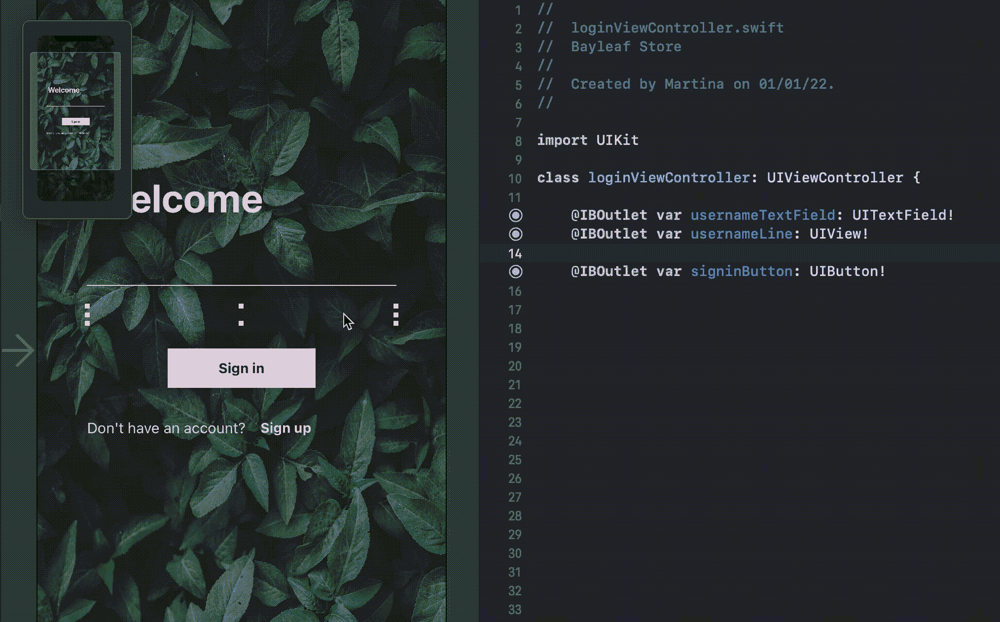
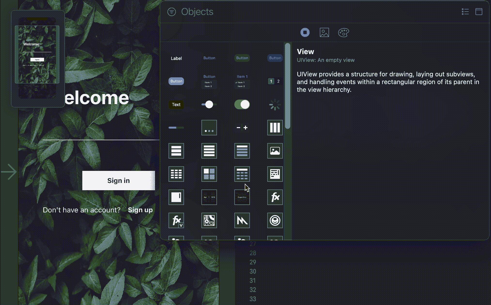
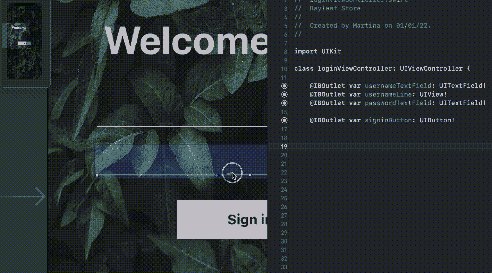
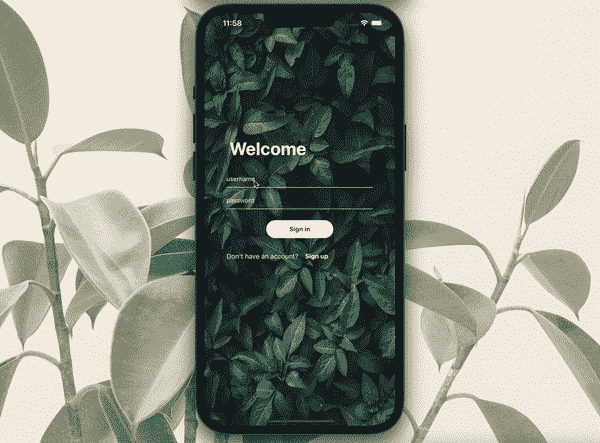

# 如何使用 Swift 在您的 iOS 应用程序中添加漂亮的 UITextField 动画

> 原文：<https://blog.devgenius.io/how-to-add-a-nice-uitextfield-animation-to-your-ios-app-using-swift-7aea90d120ad?source=collection_archive---------6----------------------->

## 在你的应用中设计类似 dribbble 的用户界面！



您的文本字段从未如此引人注目。

还有谁厌倦了圆角的方形文本字段？我知道我是。我正在为我的第一个应用程序 [Rivyou](https://apps.apple.com/us/app/rivyou/id1538283181) 编写代码，这时我意识到苹果的文本字段默认设计不适合我。

但是……有什么选择呢？边缘粗糙的长方形？恶，那是设计的对立面。没有边框的文本字段？有意思，但是太空洞了。那么，在无边框文本字段下加一行怎么样？现在我们正在谈话！

只需几行代码，你就可以让你的文本字段看起来一样漂亮，让你的应用程序设计吸引用户！请继续阅读，在您的项目中实现这一点！

# 步骤 1:创建线条

我们需要做的是在下面添加一个`UITextField`和一个`UIView`,高度设为 1，使其看起来像一条线。

虽然你可以用很多不同的方法来做到这一点，但我最喜欢的方法是在视图中添加一个垂直的`UIStackView`。我已经为我的`usernameTextField`添加了一个:



下面我再补充一个。就像上面的一样，它的间距设置为 10，分布设置为“填充”。然后，我将添加两个元素:

*   **UITextField**

添加一个`UITextField`到你的垂直堆栈视图，并确保将其边框样式设置为“无”。



将文本字段连接到您的类，并将其命名为。



*   **ui 视图**

然后，在`UITextField`的正下方添加一个`UIView`，并确保将其高度设置为 1(或您喜欢的行高)。



确保将行视图连接到您的类，并根据它引用的文本字段来命名它。



# 第二步:把它连接到你的班级

使用`lazy var`创建一个文本字段数组，其中包含您刚刚创建的所有文本字段:

```
lazy var textFields = [usernameTextField, passwordTextField]
```

给你的类添加一个扩展来实现`UITextFieldDelegate`。这将允许您使用`textFieldDidBeginEditing`功能并使用`switch`方法，我们将能够确定哪一行将执行动画:

在`viewDidLoad()`中，确保将每个文本字段的代理设置为 self。在多个文本字段的情况下，实现这一点的最简单方法是使用我们之前创建的数组`textFields`使用`for...in`方法:

# 第三步:添加动画

现在我们需要做的就是添加动画代码:

瞧！构建您的应用程序，如果您做的一切都是正确的，您应该得到类似于以下内容的内容:



在 GitHub 上找到完整代码！

你喜欢这个教程吗？它和你的项目合作得好吗？请在下面的评论中告诉我你的反馈！

关注我……
❤️[YouTube](https://www.youtube.com/channel/UC5hqYiHxie458KSO1PAnA8Q)t5】💖[滴水不漏](https://dribbble.com/margelss)
💜[insta gram](https://www.instagram.com/itsmargels/)💙[ko-fi](https://ko-fi.com/margelss)t14】🖤[github](https://github.com/Margels)