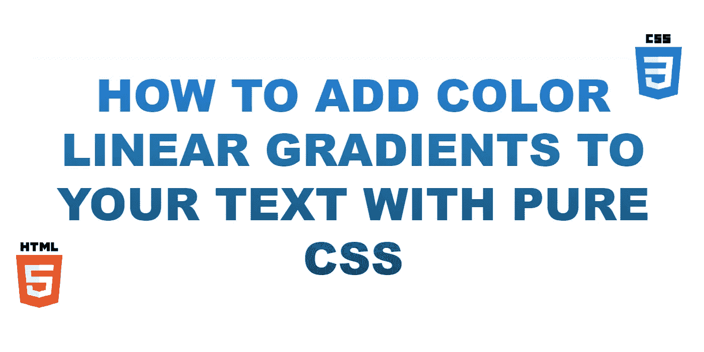

# 如何给你的文本添加一个纯 HTML 和 CSS 的双色线性渐变

> 原文：<https://blog.devgenius.io/how-to-add-a-pure-html-and-css-two-color-linear-gradient-to-your-text-47d8e69e2544?source=collection_archive---------5----------------------->



我经常想从我的纯 CSS 技巧中得到的一个文本效果是添加好看的颜色渐变的能力。

如果做得很有品味，它会看起来时尚而专业——更不用说吸引用户的注意力了。

在这篇文章中，我将向你展示如何做一个简单的双色线性渐变并分解它的不同部分。

# CSS


```
.linear-gradient {
    font-size: 72px;
    background: -webkit-linear-gradient(purple, red);
    -webkit-background-clip: text;
    -webkit-text-fill-color: transparent;
}
```

这个很简单:从紫色到红色的双色线性渐变(我试图选择一个看起来有点像 Instagram 配色方案的双色渐变)。让我们来分解 CSS。

标签用特定的渐变填充整个 CSS 元素。因此，如果你将这个 CSS 类应用于一个 div，那么整个 div*将会被渐变方案着色。*

因此，我使用`**-webkit-background-clip**`来剪切掉*和*背景的文本。为了让背景显示出来，必须将`**-webkit-text-fill-color**`设置为`transparent`；否则，文本的固有`**color**` 将优先。

你也会从我的例子中注意到，梯度是从上到下的。这是默认的。你也可以做不同的方向。只需用以下通用格式替换`background`标签:

*   底部:`background: -webkit-linear-gradient(bottom, purple, red);`


*   左:`background: -webkit-linear-gradient(left, purple, red);`


*   右:`background: -webkit-linear-gradient(left, purple, red);`


# HTML

只需将 CSS 类应用于您拥有的任何 HTML 元素。在这个例子中，我们有一个`div`。

```
<div class="linear-gradient">
   Hello World!
</div>
```

[](https://tremaineeto.medium.com/membership) [## 通过我的推荐链接加入媒体

### 作为一个媒体会员，你的会员费的一部分会给你阅读的作家，你可以完全接触到每一个故事…

tremaineeto.medium.com](https://tremaineeto.medium.com/membership)