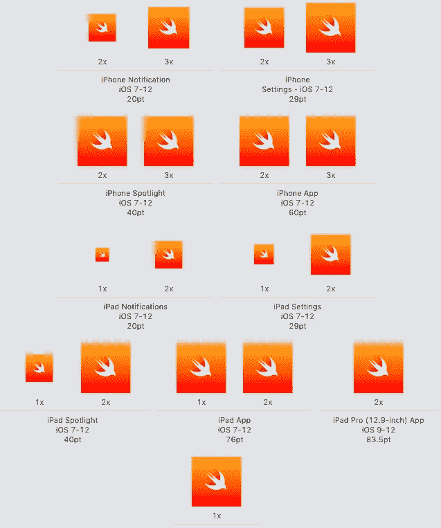

# 如何为使用 Swift 或 React Native 构建的 iOS 应用程序添加图标

> 原文：<https://blog.devgenius.io/how-to-add-an-icon-for-an-ios-app-built-using-swift-or-react-native-202337bc4df7?source=collection_archive---------9----------------------->

为了开始学习本教程，你需要有一个 iOS 应用程序。如果没有 app 可以看看我之前的 [*中故事*](https://medium.com/macoclock/creating-a-simple-browser-for-ios-using-wkwebview-with-swift-95688acd04b9) *或者* [*DEV 社区视频*](https://dev.to/mmafrar/creating-a-simple-browser-for-ios-2b3) *。否则你可以简单地做一个*[*https://github.com/mmafrar/swift-ios-wkwebview-demo*](https://github.com/mmafrar/swift-ios-wkwebview-demo)*的 git 克隆。希望你现在有一个应用程序来开始，让我们开始吧。*

照片由[威廉·胡克](https://unsplash.com/@williamtm?utm_source=medium&utm_medium=referral)在 [Unsplash](https://unsplash.com?utm_source=medium&utm_medium=referral) 拍摄

如果你曾经尝试在 Android 或 iOS 应用程序上更改图标，你可能知道我们必须以多种分辨率提交图标。所以现在我们面临一些平面设计工作。我们是不是要跳进 Adobe Illustrator 这样的软件里，导出一个多种分辨率的图像？

在我们的例子中，由于我们正在学习移动应用程序开发，我们已经有了一些很酷的工具来使我们的生活变得更容易。在 Mac 上进入 **App Store** ，搜索 [**图标集创建者**](https://apps.apple.com/lk/app/icon-set-creator/id939343785?mt=12) **。**这个工具可以让我们快速地为你为苹果生态系统构建的应用创建图标资产。

App Store 上的图标集创建者

一旦你完成了安装，打开应用程序，你会看到下面的屏幕。您将被要求提供至少 **1024 x 1024 像素**分辨率的图像。确保选择 iOS 作为左下角的**平台**。

图标集创建者

提供图像后，按 **Go** ，系统会提示您选择保存生成的图标资产的目录。一旦完成，你会得到这样的结果。

生成的图标资产

现在在你的 Mac 上进入 Xcode**打开你正在做的 iOS 项目**。在你的左侧窗格中点击 **Assets.xcassets** (对于 React Native 这应该是 Images.xcassets)并点击文件 AppIcon。您将看到图标资产的空占位符。

带有空占位符的 AppIcon

现在，您需要将相关图像从生成的文件夹中拖放到 Xcode 项目中适当的占位符中。比方说， **iPhone 通知 iOS 7–12 20pt 2x**相关图片的占位符是名为【app-icon-20@2x.png】T2 的图片。同样的，iPad spot light iOS 7–12 40pt 1x 也是 app-icon-40.png**。当所有的占位符都填充了如下图所示的图像时，这就完成了。**

****

**用生成的图标资源填充的 AppIcon 占位符**

**在这之后，你可以继续构建你的应用程序。我将在我的 iPhone X 模拟器中运行它，它显示如下。**

****

**模拟器中带有新图标的应用程序**