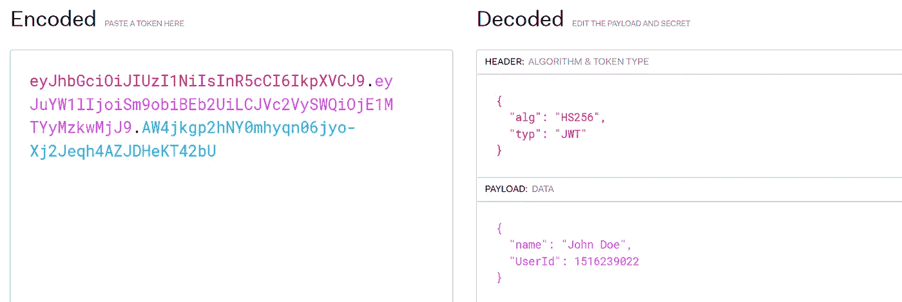

# 如何向 React 应用程序添加身份验证

> 原文：<https://blog.devgenius.io/how-to-add-authentication-to-a-react-app-26865ecaca4b?source=collection_archive---------0----------------------->

了解 React 应用程序中身份验证的工作方式


照片由[飞:D](https://unsplash.com/@flyd2069?utm_source=medium&utm_medium=referral) 在 [Unsplash](https://unsplash.com?utm_source=medium&utm_medium=referral)

安全性是应用程序的重要组成部分。当开发一个应用程序时，你不希望未经授权/未经认证的人访问你的网站页面。在本文中，我们将讨论如何在 React 应用程序中实现身份验证(登录、注册和注销)

# 了解 JWT

在开始前端部分之前，让我们了解当用户提交登录/注册表单时，后端发生了什么。

在登录请求发送到后端 API 后，我们的凭据得到验证，在成功登录后，我们会收到一个带有用户 ID 和加密令牌的响应，这个令牌就是我们所说的 JSON Web 令牌，通过它我们可以向后端 API 发送请求以访问受保护的路由，然后服务器解密令牌，比较用户 ID 是否有效，并发送一个响应。

> JWT 中的信息是使用秘密或公共/私人密钥对进行数字签名的。



你可以在 https://jwt.io/[的](https://jwt.io/)阅读更多关于 JWT 的信息

# 基本授权功能

让我们创建一个自定义挂钩，为我们提供用户详细信息和身份验证方法——登录、注册和注销

成功登录和注册后，我们会收到一个令牌，然后将它存储在用户对象中。这个令牌稍后将用于头中受保护的 API 请求。

对于数据持久性，添加一个本地存储自定义挂钩

```
const [user, setUser] = useLocalStorage("user", null);
```

# 授权上下文

要使用户在应用程序中全局可用，请添加上下文。我们创建了一个上下文，它使用了上面的定制钩子，并将它包装在根组件周围，以使所有的方法和状态对应用程序全局可用

如果您不知道如何设置上下文，请阅读我以前关于上下文的文章，这篇文章提供了设置上下文的一步一步的方法

[](https://ashutosh-kumar.medium.com/understand-react-context-with-examples-b66b9161d9de) [## 通过例子理解反应上下文

### 使用 React 中的上下文创建地址管理 React 应用程序

ashutosh-kumar.medium.com](https://ashutosh-kumar.medium.com/understand-react-context-with-examples-b66b9161d9de) 

**步骤 1:** 创建授权上下文

```
const AuthContext = createContext()
```

**步骤 2:** 通过抽象 useContext 钩子来设置消费者

```
const useAuthContext = () => useContext(AuthContext)
```

**步骤 3:** 使用高阶组件设置提供程序，现在我们使用我们创建的自定义钩子，并将其添加到提供程序中，如下所示

```
const AuthProvider = ({children}) => { const auth = useAuth() return <AuthContext.Provider value={auth}> {children} </AuthContext.Provider>}
```

**步骤 4:** 将提供者包装在根组件周围，使其对所有组件都是全局可用的

```
<Authprovider>
  <App />
</AuthProvider>
```

最终的代码将如下所示

# 需要授权组件来保护路由

在 Web 应用程序中，路由可以分为两种类型:公共路由和受保护路由，受保护路由需要对用户进行身份验证才能访问，而公共路由不具备任何此类条件

我们如何设置一个条件来检查一个用户是否被认证？

它就像放置一个 if 条件并返回组件或重定向到登录一样简单，如下所示

```
const user = AuthContext()if(user){
// Return Component
}
else{
// Navigate to Login
}
```

但是我不希望将这个条件写在每个需要认证的组件中，因此我使用了一个更高阶的组件——require auth，它将一个组件作为输入，并返回一个受保护的组件

例如，有一个用户配置文件组件需要对用户进行身份验证，然后我们如下所示包装该组件:

```
<Route path='/profile' element={<RequireAuth><UserProfile /></RequireAuth>} />
```

# 登录后重定向

登录后如何重定向用户？在许多网站上，我们看到当一个未经认证的用户试图登录时，我们将他们重定向到登录页面，但是在登录完成后，我们如何重定向回同一页面呢？

在我们的应用程序中，到目前为止，当一个未经验证的用户试图访问一个受保护的页面时，我们会将他们重定向到登录页面，但在他/她成功登录后，接下来会发生什么呢？

还记得我们让 AuthContext 环绕根组件，这使得 AuthContext 中的任何状态更改都会重新呈现整个应用程序组件，因此当用户登录时，用户状态会发生更改，所以我们只需在登录功能中的状态发生更改后将用户导航回来。

> “但是，如果我告诉你我有更好的解决方案，而不是导航到该页面，会怎么样呢”

首先，我们更新 Require Auth 来存储导航状态下的当前路径，如下所示

现在我们需要一种方法来获取包含路径的状态，这是 react-router-dom 在 useLocation 函数的帮助下完成的。

> 当组件使用更新的用户值重新呈现时，我们使用 Navigate 组件将用户从登录页面重定向到使用 react-router-dom 中的 useLocation 挂钩存储在状态中的路径，如下所示

***这就完成了我们 Web App 的认证特性。谢谢你一直读到最后，我希望这篇文章是有帮助的。请关注我，获取更多此类文章！***

# 参考

[](https://jwt.io/introduction#:~:text=This%20information%20can%20be%20verified,will%20focus%20on%20signed%20tokens) [## JWT。IO - JSON Web 令牌简介

### 新:免费获得 JWT 手册，深入学习 jwt！JSON Web Token (JWT)是一个开放标准(RFC 7519 ),它…

jwt.io](https://jwt.io/introduction#:~:text=This%20information%20can%20be%20verified,will%20focus%20on%20signed%20tokens) [](https://usehooks.com/useLocalStorage/) [## 使用位置存储

### 将状态同步到本地存储，以便在页面刷新过程中保持状态。用法类似于 useState，除了我们传入…

usehooks.com](https://usehooks.com/useLocalStorage/)