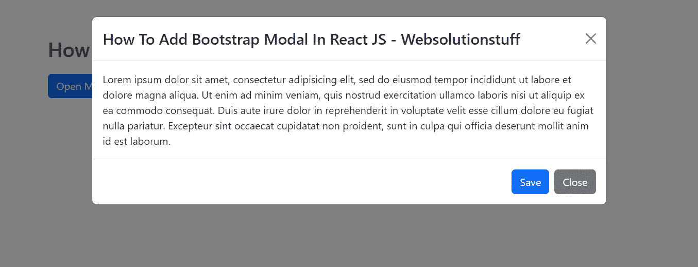

# 如何在 React JS 中添加引导模式

> 原文：<https://blog.devgenius.io/how-to-add-bootstrap-modal-in-react-js-3f93363a295a?source=collection_archive---------13----------------------->

在本文中，我们将看到如何在 react js 中添加一个引导模型。在本例中，我们将使用引导模式和按钮组件，还将使用 react-bootstrap 库。您还可以学习如何在 react js 中创建一个模态弹出窗口。

对于 react modal 弹出示例，我们将使用 npm 安装 react-bootstrap，并使用 modal 类创建一个模型，然后在 react js 应用程序中启动该模型。

所以，让我们来看看如何在 react js 中使用引导模态，以及在点击按钮时弹出 react 模态。

**安装 react-bootstrap**

在这一步中，我们将使用 npm 安装引导。因此，让我们按照下面的命令，并安装引导。

```
npm install react-bootstrap bootstrap
```

成功安装 bootstrap 后，我们需要在 **src/index.js** 文件中导入 bootstrap CSS。

**src/索引. js**

```
import React from 'react';
import ReactDOM from 'react-dom';
import App from './App';
import 'bootstrap/dist/css/bootstrap.css';

ReactDOM.render(
  <React.StrictMode>
    <App />
  </React.StrictMode>,
  document.getElementById('root')
);
serviceWorker.unregister();
```

**阅读另:** [**如何在 React JS**](https://websolutionstuff.com/post/how-to-install-bootstrap-in-react-js) 中安装引导程序】

**创建引导模式弹出菜单**

现在，我们将创建一个引导模型。因此，在 **app.js** 文件中添加以下代码。

**src/App.js**

```
import React, {useState} from 'react';
import { Button, Modal } from 'react-bootstrap';
import "./styles.css";function App() {
  const [show, setShow] = useState(false);

  const handleClose = () => setShow(false);
  const handleShow = () => setShow(true);

  return (
    <div className="container">
      <h2>How To Add Bootstrap Modal In React JS - Websolutionstuff</h2>

      <Button variant="primary" onClick={handleShow}>
        Open Model
      </Button>

      <Modal size="lg" show={show} onHide={handleClose}>
        <Modal.Header closeButton>
          <Modal.Title>How To Add Bootstrap Modal In React JS - Websolutionstuff</Modal.Title>
        </Modal.Header>
        <Modal.Body>
          Lorem ipsum dolor sit amet, consectetur adipisicing elit, sed do eiusmod
          tempor incididunt ut labore et dolore magna aliqua. Ut enim ad minim veniam,
          quis nostrud exercitation ullamco laboris nisi ut aliquip ex ea commodo
          consequat. Duis aute irure dolor in reprehenderit in voluptate velit esse
          cillum dolore eu fugiat nulla pariatur. Excepteur sint occaecat cupidatat non
          proident, sunt in culpa qui officia deserunt mollit anim id est laborum.
        </Modal.Body>
        <Modal.Footer>         
          <Button variant="primary" onClick={handleClose}>
            Save
          </Button>
          <Button variant="secondary" onClick={handleClose}>
            Close
          </Button>
        </Modal.Footer>
      </Modal>
    </div>
  );
}

export default App;
```

**添加 CSS**

在这一步中，我们将向 styles.css 文件中添加 CSS

```
.App {
  font-family: sans-serif;
  text-align: center;
}
h2{
  margin-bottom: 20px;
  margin-top: 60px;
}
```

**阅读也:** [**如何在 React JS 中验证表单**](https://websolutionstuff.com/post/how-to-validate-form-in-react-js)

**输出:**



你可能也会喜欢:

*   **阅读也:** [**如何在 Laravel 9**](https://websolutionstuff.com/post/how-to-install-react-in-laravel-9) 中安装 React
*   **读也:**[**Bootstrap datetime picker 示例**](https://websolutionstuff.com/post/bootstrap-datetimepicker-example)
*   **阅读还:** [**如何在 Laravel**](https://websolutionstuff.com/post/how-to-add-bootstrap-modal-in-laravel) 中添加自举模态
*   **阅读另:** [**如何在 React JS**](https://websolutionstuff.com/post/how-to-copy-text-to-clipboard-in-react-js) 中将文本复制到剪贴板

如果这篇文章有帮助，请点击拍手👏下面的按钮。几次以示支持。⬇⬇