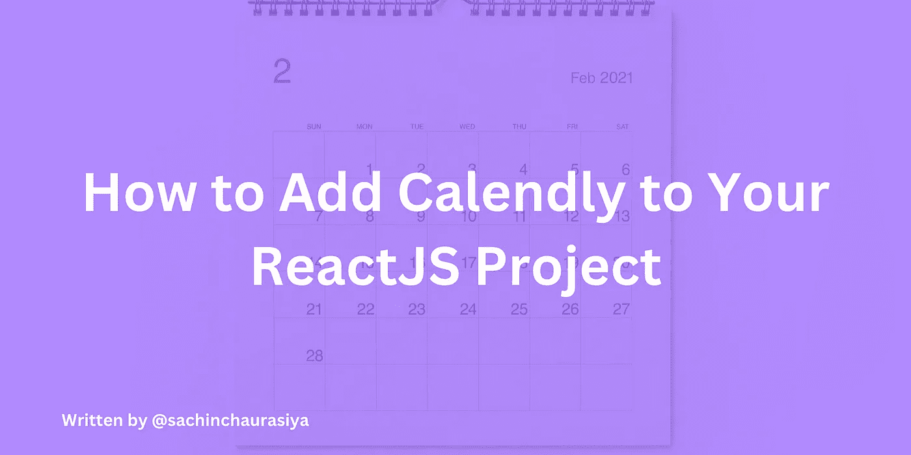
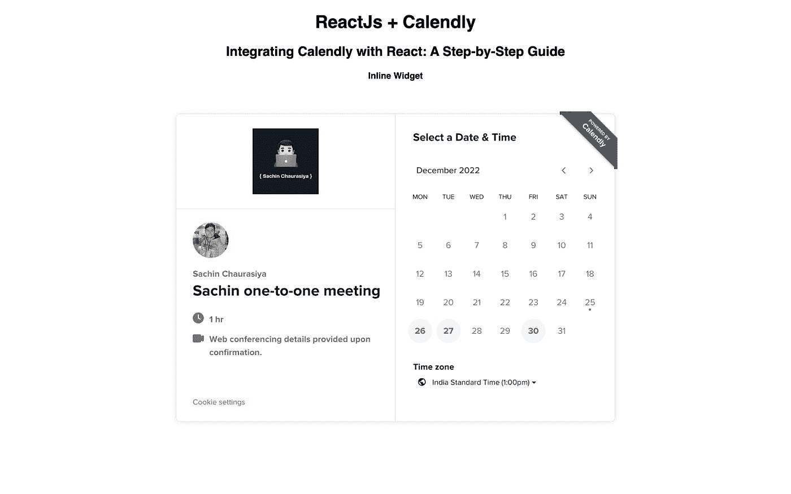
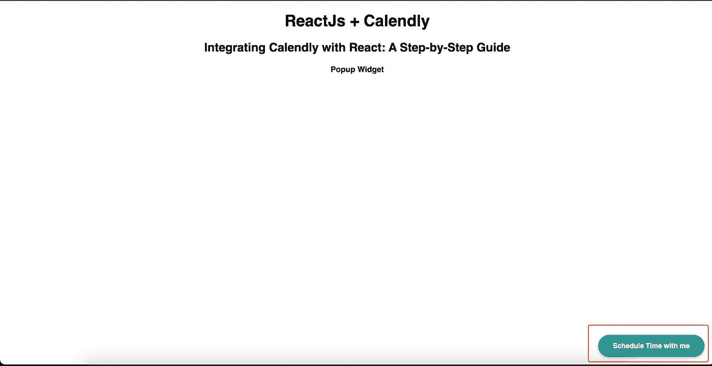
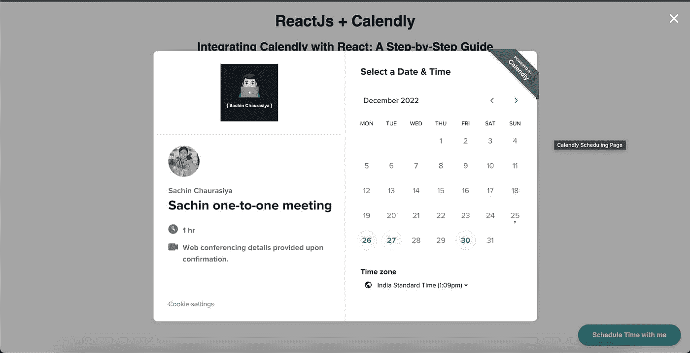

# 如何将日历添加到您的 ReactJS 项目

> 原文：<https://blog.devgenius.io/how-to-add-calendly-to-your-reactjs-project-8a3a08d21b19?source=collection_archive---------12----------------------->



如何将日历添加到您的 ReactJS 项目

# 什么是日历🤔

[Calendly](https://calendly.com/) 是一款日程安排和约会安排软件，帮助个人和组织安排和管理与客户和同事的约会和会议。

它允许用户创建可与其他人共享的可定制的日程安排链接，允许他们在对双方都合适的时间轻松地安排与用户的约会或会议。

Calendly 与各种日历和电子邮件平台集成，包括谷歌日历、Outlook 和 Office 365，并提供自动电子邮件和日历事件通知等功能，以及设置定期约会和会议的能力。

Calendly 对许多专业人士都很有用，包括顾问、销售人员、教练和治疗师，因为它有助于简化日程安排过程，减少协调约会所花费的时间。

# 如何将日历与 ReactJs 集成👨🏻‍💻

如果您正在处理一个 ReactJS 项目，并且想要将 Calendly 合并到您的项目中，您可以使用`react-calendly`库。

以下是将 Calendly 添加到 ReactJS 项目的步骤:

*   使用 npm 或纱线安装`react-calendly`:

```
npm install react-calendly 
#OR
yarn add react-calendly
```

*   向 ReactJs 应用程序添加 calendly 小部件。

Calendly 提供了 2 个小部件选项供您选择，您可以选择想要在您的项目中使用哪个 Calendly 小部件。

让我们一个一个来看。

# InlineWidget

这个小部件直接在页面上显示日程表。

```
import React from 'react';
import { InlineWidget } from 'react-calendly';

const InlineComponent = () => {
  return (
    <div className="inline-widget">
      <InlineWidget url="https://calendly.com/your-calendly-url" />
    </div>
  );
};

export default InlineComponent;
```

> *确保将* `[*https://calendly.com/your-calendly-url*](https://calendly.com/your-calendly-url)` *替换为你日历日程的实际网址。*



(可选)还可以通过将 styles 对象传递给 InlineWidget 组件来自定义 Calendly 小部件的外观。styles 对象应该包含 camelCase 中的 CSS 属性和值，例如宽度和高度。

# PopupWidget

这个小部件在一个弹出窗口中显示日程表。

```
import React from 'react';
import { PopupWidget } from 'react-calendly';

const PopupComponent = () => {
  return (
    <div className="popup-widget">
      <PopupWidget
        url="https://calendly.com/your-calendly-url" 
        rootElement={document.getElementById('root')}
        text="Schedule Time with me"
        textColor="#ffffff"
        color="#319795"
      />
    </div>
  );
};

export default PopupComponent;
```

`PopupWidget`接受 rootElement 属性来指定要呈现弹出窗口的根元素。也接受`textColor`、`color`、`text`等造型道具。

一旦你将这个组件添加到你的应用程序中，它将呈现带有文本`Schedule Time with me`的弹出按钮



点击按钮，它将打开弹出模式与您的日历页面如下。



# 监听小部件中的事件👂

您还可以使用`useCalendlyEventListener`钩子来监听 Calendly 小部件中的事件，比如当用户安排约会或取消约会时。

要使用钩子，从`react-calendly`导入它，并将其添加到您的组件中，如下所示:

```
import React from 'react';
import { InlineWidget, useCalendlyEventListener } from 'react-calendly';

const InlineComponent = () => {

useCalendlyEventListener({
    onEventScheduled: (e) => console.log(e.data.payload)
  });

  return (
    <div className="inline-widget">
      <InlineWidget url="https://calendly.com/your-calendly-url" />
    </div>
  );
};

export default InlineComponent;
```

在上面的组件中，我们正在收听`schedule`事件。因此，当用户安排一个事件时，你可以收听并做一些事情。

# 结论📝

这就是使用`react-calendly`将 Calendly 添加到 ReactJS 项目中所需要做的全部工作！无论你是想在页面上直接显示日历表单，还是在弹出窗口中显示，或者使用可定制的按钮，`react-calendly`库都能满足你。您还可以使用 useCalendlyEventListener 挂钩来侦听事件并根据它们采取行动。

这个话题到此为止。感谢您的阅读。

如果你觉得这篇文章有用，请考虑喜欢并与他人分享。如有疑问，欢迎评论，我会尽力回应。

# ✨资源

*   [日历反应](https://www.npmjs.com/package/react-calendly)
*   [代码沙盒示例](https://codesandbox.io/s/reactjs-calendly-p22qts?file=/src/Widgets/InlineComponent.jsx:182-272)

# 与我联系👋

*   [领英](https://www.linkedin.com/in/sachin-chaurasiya)
*   [推特](https://twitter.com/sachindotcom)

*原发布于*[*https://blog . sachinchaurasiya . dev*](https://blog.sachinchaurasiya.dev/how-to-add-calendly-to-your-reactjs-project)*。*