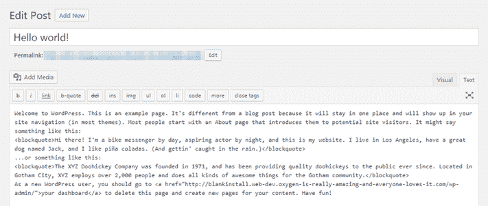
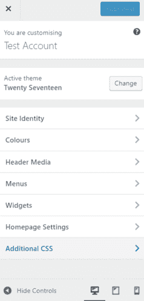
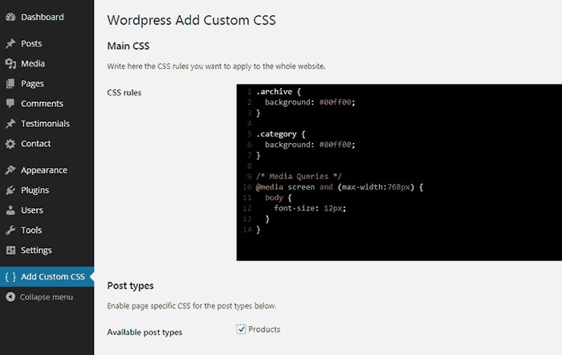
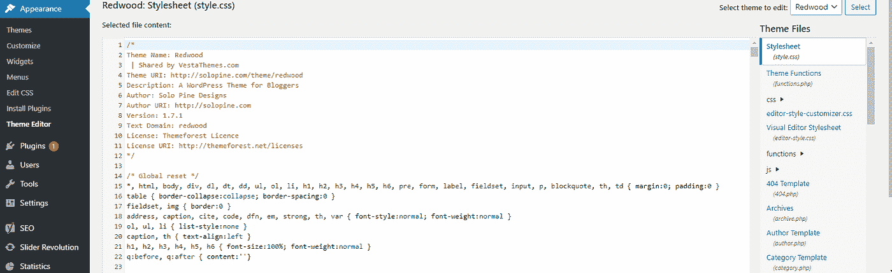

# 如何在 WordPress 中添加自定义 CSS

> 原文：<https://blog.devgenius.io/how-to-add-custom-css-in-wordpress-9be13e58dafa?source=collection_archive---------3----------------------->

WordPress 是世界上最大的平台之一，可以帮助你相当快速地建立一个网站或博客。它提供了多种工具和特性供您使用。一些功能包括一个插件架构和一个模板系统，更大程度上被称为主题。然而，这些主题可能不太适合你，这就是为什么 WordPress 允许你添加定制的 CSS 代码来调整外观。

照片由[帕特里克·福尔](https://unsplash.com/@patrickian4?utm_source=medium&utm_medium=referral)在 [Unsplash](https://unsplash.com?utm_source=medium&utm_medium=referral) 拍摄

# WordPress 简介

有一些精彩的插件和主题供你选择，最棒的是它们是免费的。嗯，至少在很大程度上，因为很明显，如果你想要一些插件或主题的“专业”或“完整”版本，你必须购买它。也就是说，即使使用免费软件，你也可以做得很好，只是要学会如何最大限度地使用它们。

你不需要成为一个网站开发者，甚至不需要知道如何用这个平台来创建一个网站，因为它使用起来非常简单。最初的目的是让世界上的每个人都可以使用博客和创建网站。

然而，不要把这种简单误认为弱点，因为有超过**6000 万**的网站在使用它。WordPress 最初是作为一个博客系统创建的，但已经发展到支持其他类型的网络内容，包括更传统的邮件列表和论坛、媒体画廊、会员网站、学习管理系统(LMS)和在线商店。

WordPress 是最流行的内容管理系统解决方案之一。它能让你创建一个吸引人的网站，即使对初学者来说也是如此。但是如果你有经验并且想自己做一些改变，你可以通过添加自定义 CSS 来实现。

这是对你的网站外观进行重大改变的最简单的方法之一。无论你的主题有多好，你仍然需要一些细微的改变，这可以通过 CSS 来实现。对你的网站外观完全满意是非常重要的。

# 什么是 CSS，它是如何工作的？

在继续谈论 **CSS** 之前，我们必须了解一些关于你的网站的事情。HTML 或超文本标记语言是创建 WordPress 网站的主要语言。它告诉浏览器文本的哪一部分是标题或主体段落等。

检查这一点的一个简单方法是，当写一篇新文章时，在编辑器中按下 text 标签，文本将显示其 HTML 代码。在那里你会看到你写在来自 HTML 语言的不同标签中的文本。你可以直接自己修改它们，这样做工作量很大，一般不推荐，或者你可以使用另一种编程语言，比如 CSS，让这些修改变得非常容易。

CSS 或**层叠样式表**是一种样式表语言，可以修改网站基本结构的外观。它允许您为 HTML 标签分配不同的属性，如大小、颜色、布局和显示。您可以使用几行 CSS 代码更改网站上所有标题的颜色和大小，而无需修改内容的 HTML 代码。这样你就不需要手动改变标签中的值，只需要给一个 CSS 代码分配一个值就可以了。

它们像这样分开，以保持结构和风格的分离，这有助于您控制外观，并在需要时轻松进行更改。你也可以在没有 HTML 知识的情况下添加和编辑 CSS 代码，即使知道它在这个过程中有帮助。例如，你可以使用一段现成的代码，它能做你所需要的事情，你只需要根据你的代码修改它，它就完成了。

# **在 WordPress 中添加 CSS 的三种方法:**

## ***1。使用主题定制***

主题定制器这是给你的网站添加 CSS 的最简单的方法之一。安装后，它将出现在您的仪表板的专用部分。无论你使用什么主题，你都可以通过内置的主题定制器来添加和编辑 CSS。导航到仪表板上的**外观- >定制**非常简单，向下滚动到底部，您会看到**附加 CSS** 。

通过点击它，您将打开一个内置工具，允许您在其中添加任何 CSS 代码。它非常容易使用，只需点击一下就可以从移动视图切换到桌面视图。

## **②*。使用插件***

用插件添加 CSS 可能被认为是最简单的方法。让我们看看这个插件**‘WP 添加自定义 CSS’**以及这么做有多简单。这个插件允许你添加自定义的 CSS 代码到整个网站，单个的文章，页面和自定义的文章类型。

您可以从**“添加自定义 CSS”**设置页面编辑主样式表。该插件还在编辑区域创建了一个新的**‘自定义 CSS’**框，为特定的文章、页面和自定义文章类型添加自定义 CSS。

## ***3。使用主题样式表*和**

style.css 是每个 WordPress 主题都需要的样式表文件。它控制演示文稿的视觉设计和网站页面的布局。你可以在这里做一些改变，但是这需要你有一定的经验。

记得在编辑代码之前备份您的工作。你在这里所做的改变会影响你的主题的代码，这可能会导致你无意中做了一些事情，彻底破坏了主题。这就是为什么对于初学者来说这不是一个推荐的添加 CSS 的方法。这不是将 CSS 代码添加到网站的最简单的方法，但绝对是一个强大的方法。

你可以从你的 WordPress 仪表盘上点击**外观- >编辑器**来轻松开始。在那里，您将希望打开 style.css 文件，该文件在默认情况下应该已经打开。这是您的主题样式表，其中包含了您可以更改的所有内容。您可以使用搜索功能来更容易地找到您正在查看的内容，因为通常有太多的代码会让我们这些最优秀的人不知所措。

# **最后的想法**

虽然为你的网站找到合适的主题很重要，但是根据你的喜好定制主题就更好了。可能会有一些微小的变化需要发生，以使您的满意度达到最高，在我看来，这就是 CSS 带来的好处。

编辑和修复哪怕是最小的东西的能力会对网站的观感产生巨大的影响。如果你，它的主人，不是 100%满意，那么想象一下读者会怎么想。学习在 WordPress 中有效地使用 CSS 可能需要一点时间，但是它将为你提供对你的站点的外观和布局的无与伦比的控制。