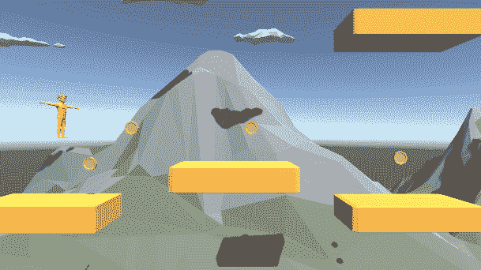
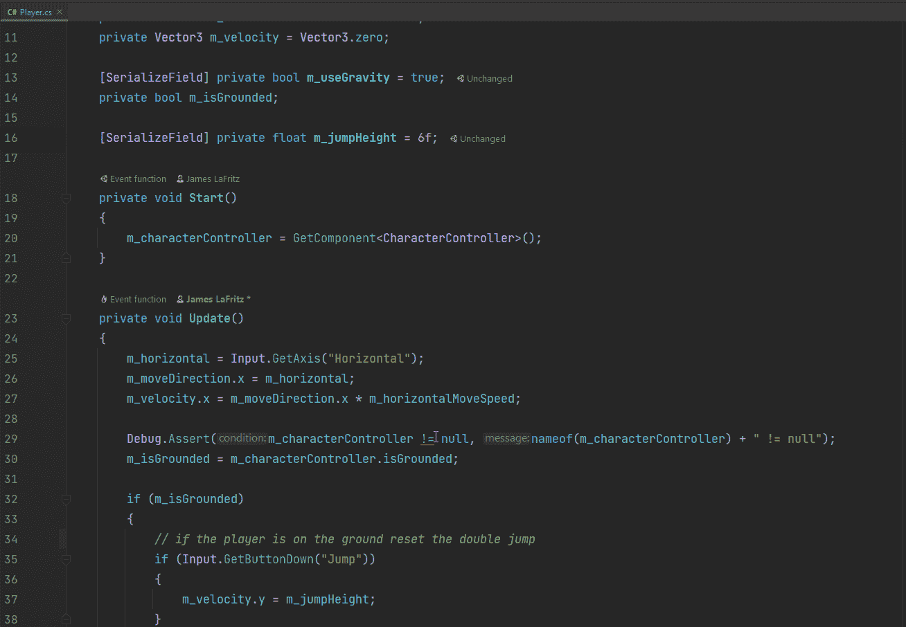
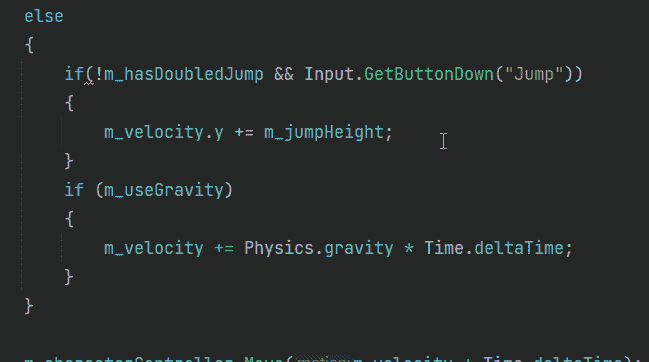
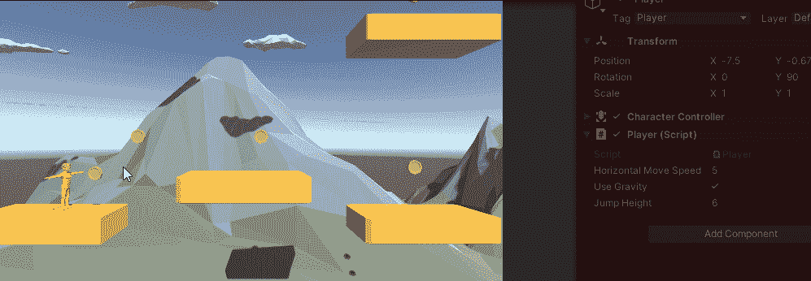

# 如何在你的游戏中加入双跳

> 原文：<https://blog.devgenius.io/how-to-add-double-jump-to-your-game-a9ae11b7df5e?source=collection_archive---------4----------------------->

## 在空中时只增加一次跳跃

现在我已经让我的玩家在游戏中移动了，我可以从一个平台移动到另一个平台，是时候实现双跳了。我确实需要一个到达更高平台的方法。

我需要一种方法来知道玩家是否已经执行了双跳。

如果玩家被禁足，我将双跳设置为假。

如果玩家不在地面上。如果玩家没有加倍跳跃，并且按下了跳跃按钮，那么我就在速度上加上跳跃高度。

我差点忘了确保将 has double jump 设置为 true。

我现在可以到达更高的平台。我不得不把运动员的跳跃高度从 6.5 改为 6.5。

