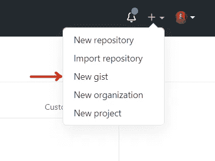
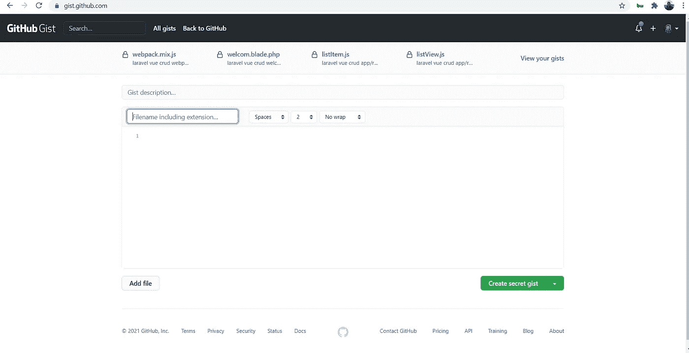
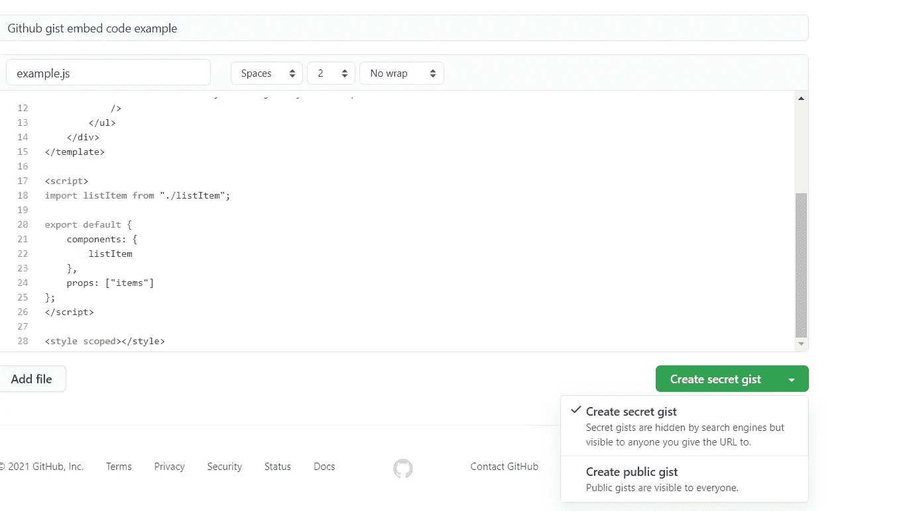
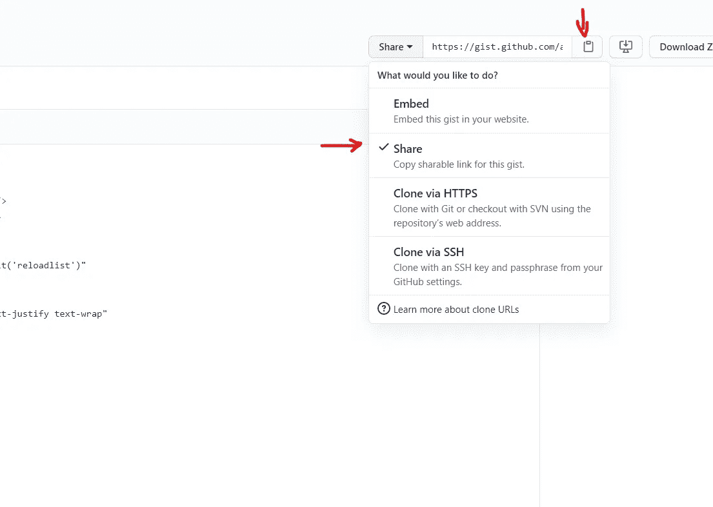
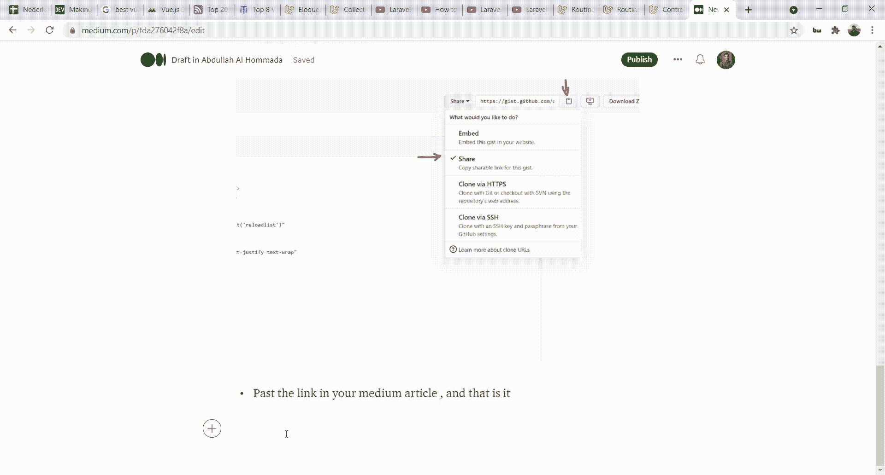

# 如何在介质中添加(嵌入)代码，使用 GitHub Gist。

> 原文：<https://blog.devgenius.io/how-to-add-embed-code-in-medium-using-github-gist-646f5e2dcab1?source=collection_archive---------1----------------------->

在媒体平台中添加或嵌入代码的方法有很多，比如:

直接嵌入介质，使用 carbon.now.sh，CodePen，Repl.it，Glitch，CodeSandbox，JSFiddle 嵌入。

但对我来说，最喜欢的还是使用 GitHub Gist 嵌入，方法如下:

*   如果您有 GitHub 帐户，请登录，如果没有，请创建一个。
*   在右上角点击+图标，然后点击新要点。

现在你可以看到一个新的空的要点是开放的

*   将您的代码粘贴到主体中，并添加您想要的任何名称。

## 不要忘记给名字添加一个扩展名，这样你的代码就有了某种风格，比如:。php。js。py …..

*   通过点击右下角的创建秘密要点来保存你的代码要点。

你可以从下拉菜单中看到有两个选择，你可以让你的要点保密或公开，你可以选择你想要的，不要担心保密不会阻止你嵌入或分享你的代码，你会看到在下一步。

*   你可以通过点击下拉列表中的嵌入来共享这个代码，在代码体的右上方，选择共享。并复制代码链接。

*   将链接粘贴到你的文章中，然后按回车键，就这样，你就得到你的代码了。

感谢阅读:)

如果你有兴趣阅读更多关于不同主题的内容，请访问我的博客:[https://aalhommada.com/blog](https://aalhommada.com/blog)