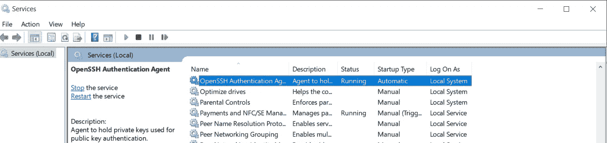

# 如何在 Windows 中永久添加私有 SSH 密钥(针对 Git)

> 原文：<https://blog.devgenius.io/how-to-add-private-ssh-key-permanently-in-windows-c9647ebfca3e?source=collection_archive---------7----------------------->

所以你不需要每次都重新输入密码


蒂埃拉·马洛卡在 [Unsplash](https://unsplash.com?utm_source=medium&utm_medium=referral) 上拍摄的照片

曾经偶然发现像[这样的文章](https://support.atlassian.com/bitbucket-cloud/docs/set-up-an-ssh-key/)或[这样的文章](https://docs.github.com/en/authentication/connecting-to-github-with-ssh/generating-a-new-ssh-key-and-adding-it-to-the-ssh-agent)或任何其他的文章来为 ssh-agent 添加 SSH 密钥吗？大多数指南中经常提到的添加密钥的步骤是:

```
$ eval $(ssh-agent)

$ ssh-add ~/.ssh/id_rsa
```

但是这只适用于您当前的 git 会话。对于每个新会话，您需要再次添加密钥或再次输入密码。真麻烦。

有一个解决方法，就是在每次启动 git bash 会话时启动 ssh-agent。Github 甚至有一个关于这个的文档。但这也是一个麻烦。

这确实应该是一个简单的过程，但 Windows 不同意。这是 Mac 提供更优越的开发环境的(许多)时代之一。
叹息。

# 方式

OpenSSH 从 Windows 10 (build 1809)开始就包含了。我们还有 Windows 凭据管理器来自动管理密码。所以我们应该向那个方向前进，而不是为已经有很多变通方法的“Git for Windows”做变通。

但在此之前，请确保:

1.  git 版本是 2.10.0 或更高版本，以支持我们将使用的新 ssh 配置。
2.  Windows 的 OpenSSH 客户端版本至少为 7.2，以支持 RSA SHA-2 算法(如果可能，更新至 8.x 或最新版本)。
    您可以按照[微软官方指南](https://learn.microsoft.com/en-us/windows-server/administration/openssh/openssh_install_firstuse)安装或重新安装最新版本。
3.  OpenSSH 身份验证代理服务正在运行，并设置为自动启动。
    运行“services.msc”。



接下来要做的事情很简单:**设置 git 来使用 Windows OpenSSH 客户端二进制文件**。您可以通过运行以下命令来设置它:

```
git config --global core.sshCommand "C:/Windows/System32/ssh.exe"
```

或者修改您的全局 git 配置" ~/。gitconfig "或" %USERPROFILE%/"gitconfig "，通过添加“sshCommand”配置:

```
[core]
  sshCommand = 'C:/Windows/System32/ssh.exe'
```

运行“ssh-add -l”。确保它不显示以下消息:

```
ssh-add -l
Could not open a connection to your authentication agent.
```

如果在响应中没有看到您的密钥，请再次添加您的密钥，这一次直接使用 ssh-add，而不启动 ssh-agent。

```
$ ssh-add ~/.ssh/id_rsa
Enter passphrase for /c/Users/{username}/.ssh/id_rsa:
Identity added: /c/Users/{username}/.ssh/id_rsa ()
```

然后重试 git 命令，如果需要，重新启动 cmd/git bash。现在，您应该能够在 cmd、powershell 或 git bash 中轻松地在 Windows 中使用 git over SSH 了。

# 但是，

上面的步骤对我不起作用，因为我仍然在旧版本的 OpenSSH 上。我无法通过 Windows Apps GUI 或 PowerShell 升级我的 Windows OpenSSH 客户端版本，它在提升的 PowerShell 上抛出了类似这样的模糊错误:

```
Add-WindowsCapability : Add-WindowsCapability failed. Error code = 0x800f0954
At line:1 char:1
+ Add-WindowsCapability -Online -Name OpenSSH.Client~~~~0.0.1.0
+ ~~~~~~~~~~~~~~~~~~~~~~~~~~~~~~~~~~~~~~~~~~~~~~~~~~~~~~~~~~~~~
    + CategoryInfo          : NotSpecified: (:) [Add-WindowsCapability], COMException
    + FullyQualifiedErrorId : Microsoft.Dism.Commands.AddWindowsCapabilityCommand
```

更新 Windows 也不起作用。像许多其他 Windows 指南一样，尝试在线搜索修复也不起作用。这时我意识到问题真的出在 Windows 上，他们自己管理的软件是多么不稳定。所以我尝试手动安装 OpenSSH 客户端，不再通过 Windows GUI 或 PowerShell。这样更简单，也很管用。

快速搜索向我介绍了这个奇妙的知识库:

[](https://github.com/PowerShell/Win32-OpenSSH) [## GitHub-PowerShell/Win32-OpenSSH:OpenSSH 的 Win32 端口

### 截至 2016 年 11 月 1 日,“Windows for OpenSSH”的积极开发工作正在…

github.com](https://github.com/PowerShell/Win32-OpenSSH) 

他们维护并提供了一个安装程序和一个关于如何在你的 Windows 上安装 OpenSSH 客户端的完整文档。Windows installer 的美好时光。

所以，如果你对在 Windows 上永久添加私有 SSH 密钥失去希望，我的最后一个建议是:

1.  在您的 Windows 上卸载 OpenSSH 客户端功能
2.  [下载。Win32-OpenSSH 客户端最新版本的 MSI](https://github.com/PowerShell/Win32-OpenSSH/tags)
3.  将 Win32-OpenSSH 客户端
    例如`cd`安装到下载目录，然后运行
    `msiexec /i OpenSSH-Win32-v8.9.1.0.msi ADDLOCAL=Client`
    确保 OpenSSH 身份验证代理服务正在运行并设置为自动启动。
4.  将您的私钥添加到 ssh-agent
    中，例如从 git bash: `ssh-add ~/.ssh/id_rsa` ，或者从 cmd: `ssh-add %USERPROFILE%/.ssh/id_rsa`
5.  或者，如果您还使用 SCP 和 SFTP，您可以将安装目录添加到 PATH 环境变量中。在我的系统中，它安装在“C:\Program Files (x86)\OpenSSH”上。
6.  最后，**设置 git 使用 Win32-OpenSSH 客户端** **二进制**。

运行此命令

```
git config --global core.sshCommand "C:/Windows/System32/ssh.exe"
```

或者将这个“sshCommand”添加到您的全局。gitconfig(添加在“核心”配置下):

```
[core]
  sshCommand = 'C:/Windows/System32/ssh.exe'
```

瞧，您的密钥和密码将存储在 Windows 凭据管理器中。`ssh-add -l`应该给你加身份指纹。您无需在多个会话中再次输入任何密码。

生成和添加一个新的私有 SSH 密钥现在最多只需要 2 个命令。从一开始就应该这么简单，真的。

参考资料:

1.  [https://support . atlassian . com/bit bucket-cloud/docs/set-up-an-ssh-key/](https://support.atlassian.com/bitbucket-cloud/docs/set-up-an-ssh-key/)
2.  [https://github . com/PowerShell/Win32-OpenSSH/wiki/Install-Win32-OpenSSH-Using-MSI](https://github.com/PowerShell/Win32-OpenSSH/wiki/Install-Win32-OpenSSH-Using-MSI)
3.  [https://docs . github . com/en/authentic ation/connecting-to-github-with-ssh/generating-a-new-ssh-key-and-add-it-the-ssh-agent](https://docs.github.com/en/authentication/connecting-to-github-with-ssh/generating-a-new-ssh-key-and-adding-it-to-the-ssh-agent)
4.  [https://docs . github . com/en/authentic ation/connecting-to-github-with-ssh/work-with-ssh-key-pass phrases # auto-launching-ssh-agent-on-git-for-windows](https://docs.github.com/en/authentication/connecting-to-github-with-ssh/working-with-ssh-key-passphrases#auto-launching-ssh-agent-on-git-for-windows)
5.  [https://learn . Microsoft . com/en-us/windows-server/administration/OpenSSH/OpenSSH _ install _ first use？tabs=powershell](https://learn.microsoft.com/en-us/windows-server/administration/openssh/openssh_install_firstuse?tabs=powershell)
6.  [https://github . com/PowerShell/Win32-OpenSSH/wiki/Install-Win32-OpenSSH-Using-MSI](https://github.com/PowerShell/Win32-OpenSSH/wiki/Install-Win32-OpenSSH-Using-MSI)