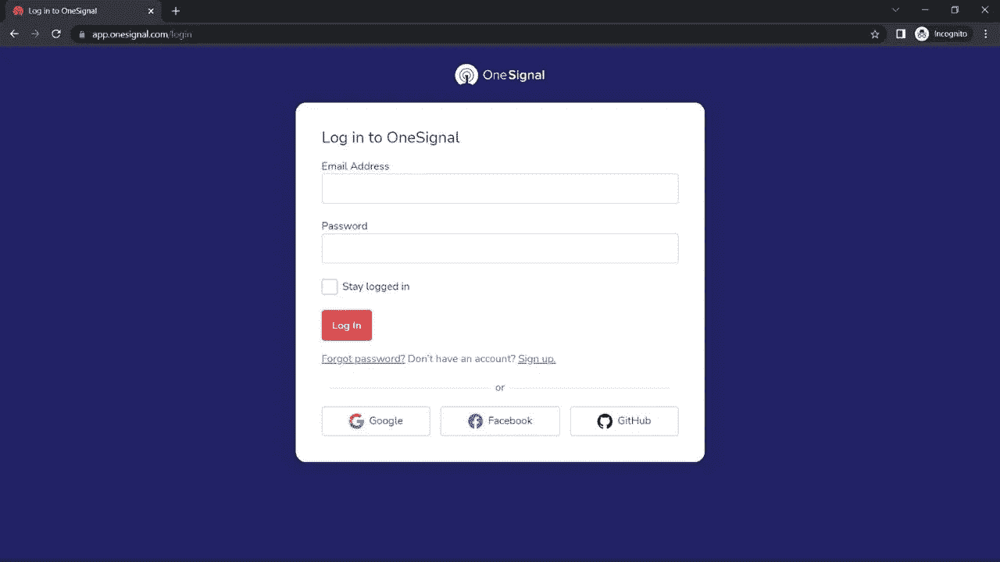
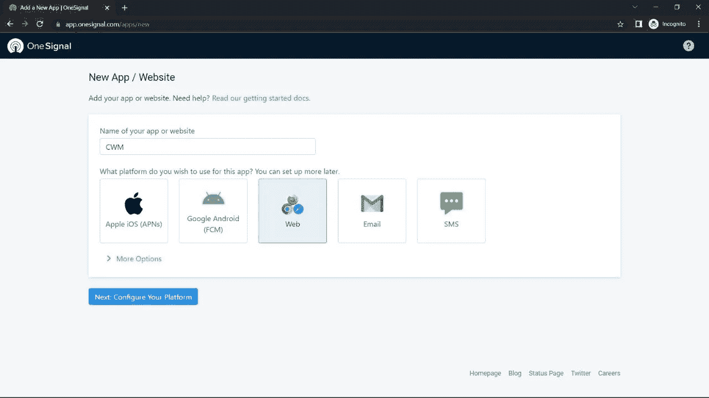
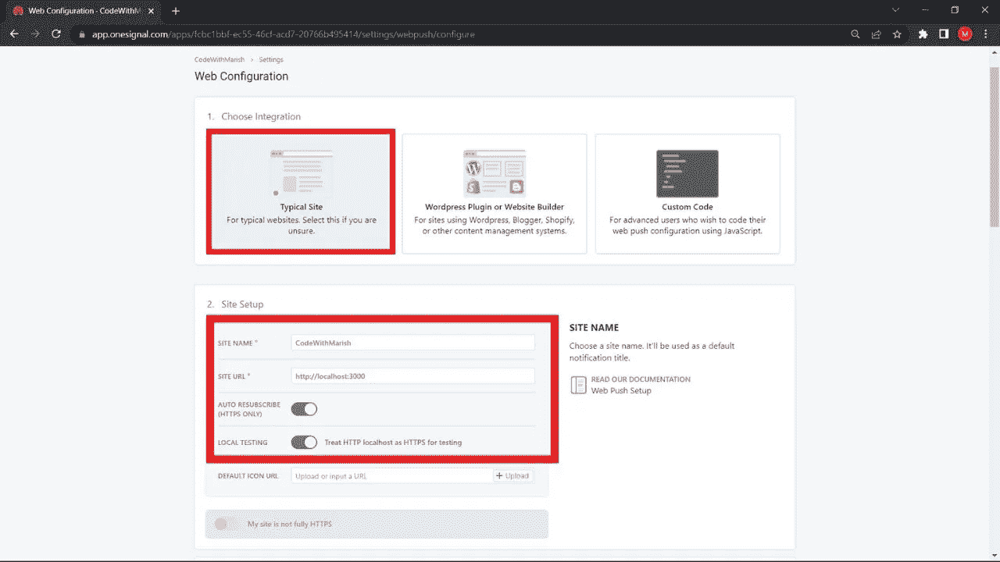
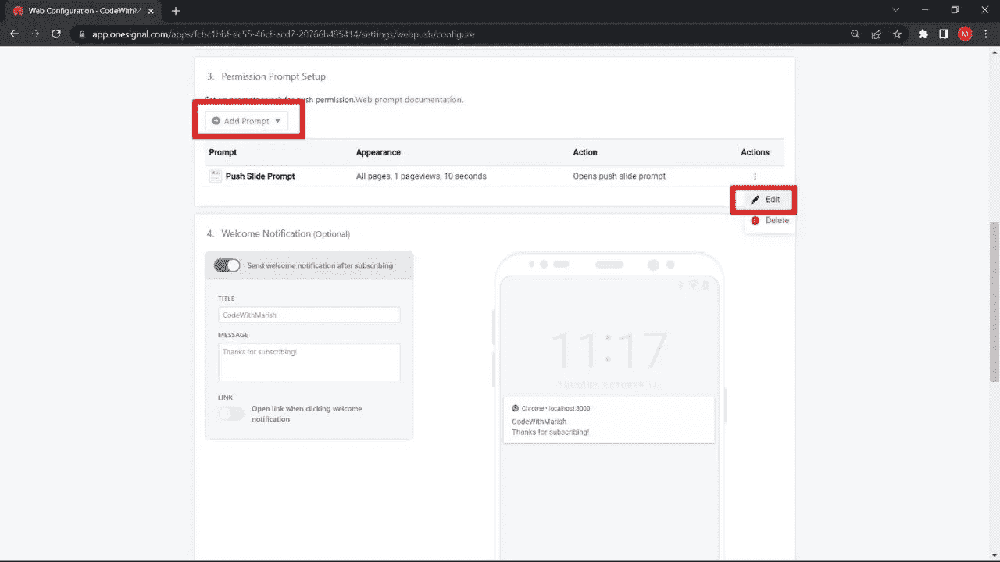
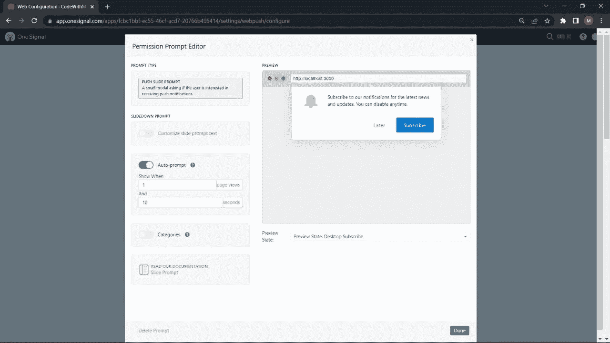
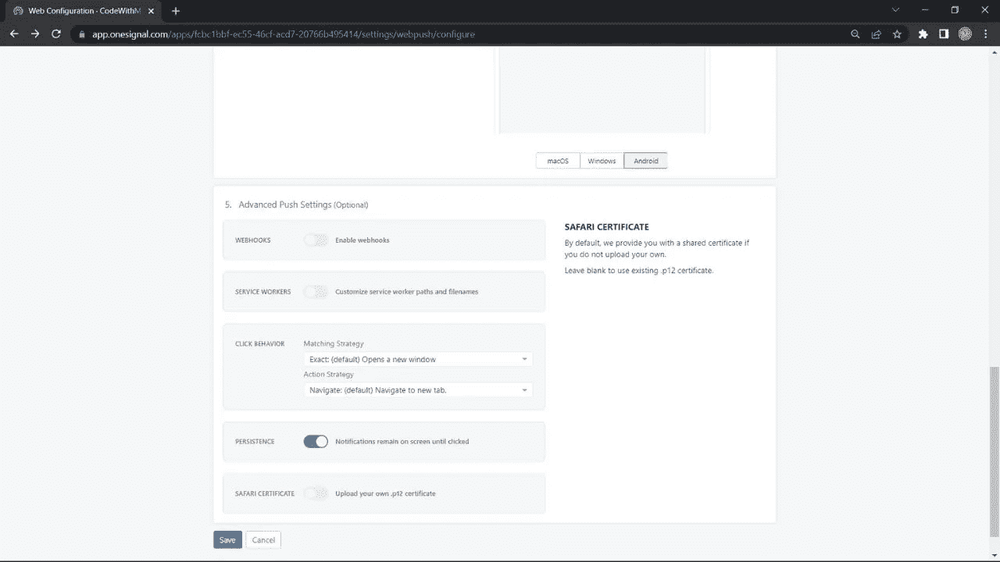
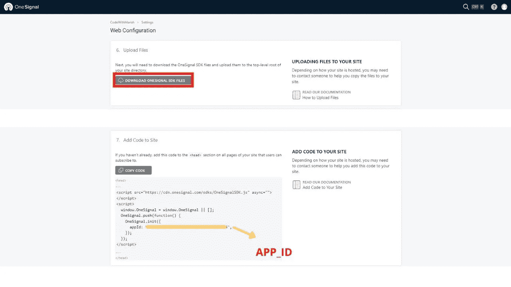
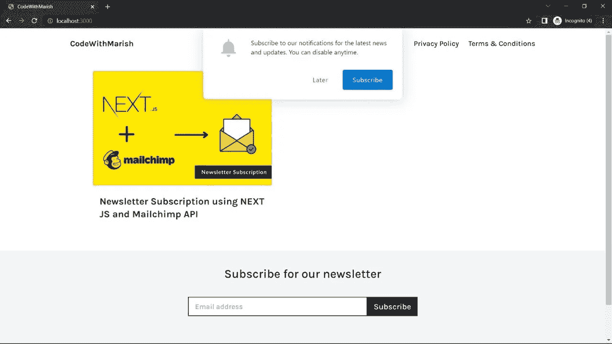
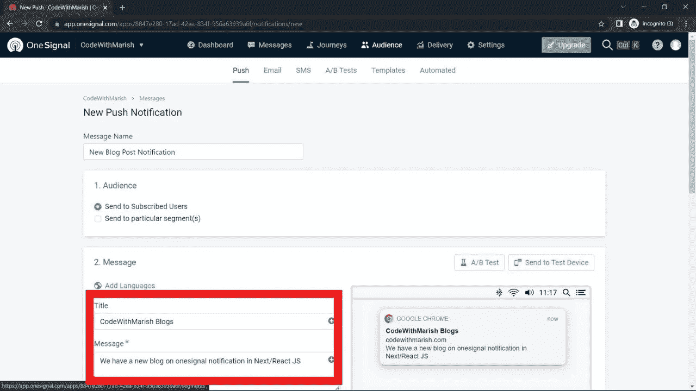
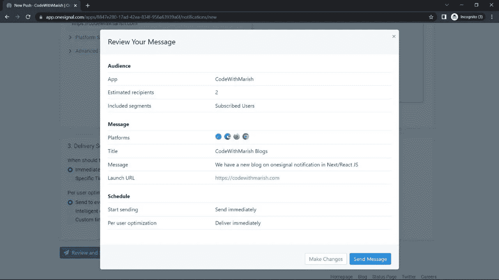

# 如何在 Next/React JS App 中添加推送通知？

> 原文：<https://blog.devgenius.io/how-to-add-push-notification-in-a-next-react-js-app-d8878e5e9c29?source=collection_archive---------3----------------------->

朋友们好，今天在这篇文章中，我们将看到如何用 React/NextJS 应用程序设置一个信号推送通知。网络推送通知是提高用户参与度、产品发布、优惠和销售等的最佳渠道。与电子邮件等传统渠道不同，网络推送通知可以快速通知用户，并为您的网站带来流量。因此，我将展示我如何在我的网站 codewithmarish.com 集成一个信号推送通知，这是建立在下一个 JS 上的，可选地，我还会提到 React JS 应用程序的步骤，因为这些步骤非常相似。让我们开始吧。

# 步骤 1 —单信号设置

首次注册 OneSignal 账户



指定应用程序名称并选择应用程序类型，我将选择“Web”



选择 Integration 作为“典型站点”,在 site setup 下指定您的“站点标题”和“站点 Url ”,现在指定 localhost 进行测试。打开本地测试



现在设置您的权限提示设置，您可以编辑或添加新的权限提示。配置权限提示。



点击保存，将打开下一步



现在下载 OneSignal SDK 文件，它将是一个 zip 文件，并将其解压缩到您的根文件夹中。在 React/Next JS 中，将这个下载的文件放在 public 文件夹中。



复制此应用 id，它将在项目设置中使用。

# 步骤 2 —下一个 JS 设置

打开 pages 文件夹下的 _app.js 并添加以下代码。此代码将有助于初始化一个信号。如果你遇到类似“窗口未定义”的错误，那么确保你有这个条件。所以它会在页面完全加载后初始化一个信号。

```
useEffect(() => {
    if (typeof window !== undefined) {
      window.OneSignal = window.OneSignal || [];
      OneSignal.push(function () {
        OneSignal.init({
          appId: "YOUR_ONE_SIGNAL_ID",
          notifyButton: {
            enable: true,
          },
        });
      });
    } return () => {
      window.OneSignal = undefined;
    };
  }, []);
```

在 pages 目录下创建一个名为 _document.js 的新文件，用下面的代码加载 OneSignalSdk.js。当你想要定制 & 的时候使用 This _document.js，更多细节你可以参考下一个 js 文档。

【https://nextjs.org/docs/advanced-features/custom-document 

```
import { Html, Head, Main, NextScript } from "next/document";
export default function Document() {
  return (
    <Html lang="en">
      <Head>
        <script
          async
          src="https://cdn.onesignal.com/sdks/OneSignalSDK.js"
        ></script>
      </Head>
      <body>
        <Main />
        <NextScript />
      </body>
    </Html>
  );
}
```

在命令行中使用 npm run dev 在浏览器中运行应用程序。如果一切都设置正确，那么你应该收到如下滑块要求订阅。确保您订阅了测试。



现在我们将寻找 React JS 项目的步骤

# 步骤 2 —反应 JS 设置

打开公共文件夹下的 index.html，在 head 标签中添加以下代码

```
<script async src="https://cdn.onesignal.com/sdks/OneSignalSDK.js"
></script>
```

使用以下命令安装 react-onesignal 包

`npm i react-onesignal`

现在打开 App.js，从 react-onesignal 导入 OneSignal，并放置下面的代码来初始化 onesignal。

```
import OneSignal from 'react-onesignal';
.....
...
..
useEffect(() => { OneSignal.init({
     appId: "YOUR-APP-ID-HERE"
   });
}, []);
```

并使用 npm start 启动您的项目

# 步骤 3 —测试

要立即测试，请转到您的 onesignal 帐户的“消息”选项卡，创建一条新的推送消息。填写我们的消息名称、标题、消息等。

(注意:确保您已经订阅了通知)。此外，您可以检查“受众标签”中的订户列表，只需确认订户是否大于零。



完成后，点击审查并发送。



现在，如果您点击发送消息，您将会收到来自浏览器的推送通知。

朋友们，这篇文章到此为止，如果你觉得这篇文章有帮助，请最大限度地分享，感谢阅读😊敬请关注。

另外，不要忘记订阅我们的 youtube 频道 codewithmarish，了解所有与网络开发相关的挑战

[https://www.youtube.com/channel/UCkPYmdVz8aGRH6qCdKMRYpA](https://www.youtube.com/channel/UCkPYmdVz8aGRH6qCdKMRYpA)

如果你在任何一个步骤中遇到困难，你也可以参考信号文档

https://documentation.onesignal.com/docs