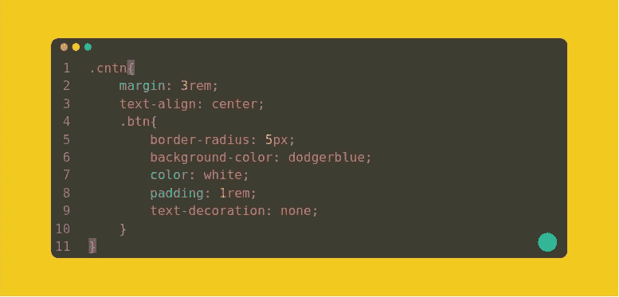
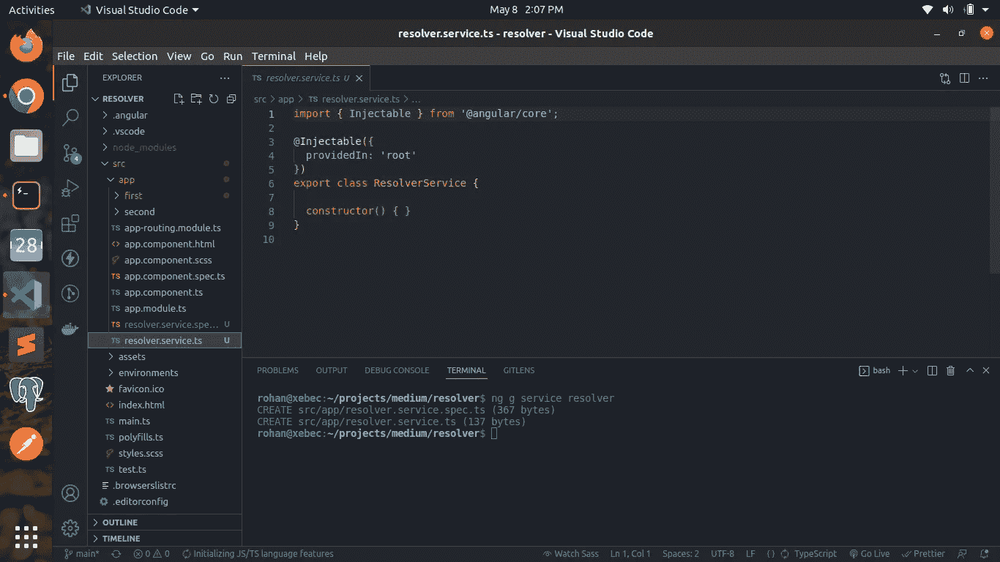

# 如何在角度中添加旋转变压器

> 原文：<https://blog.devgenius.io/how-to-add-resolver-in-angular-7ca343f51452?source=collection_archive---------6----------------------->

导航是影响 web 应用程序用户体验的一个重要方面。Resolver 就是这样一个工具，当用户从一条路线导航到另一条路线时，它通过预取一些数据来帮助我们改进导航。它可以被定义为通过在用户导航到特定组件之前加载数据来增强用户体验的平滑方法。在本文中，我们将了解如何在 angular 中添加旋变器。angular 的基础知识有助于更好地理解代码。

本杰明·达达在 [Unsplash](https://unsplash.com/s/photos/webpage?utm_source=unsplash&utm_medium=referral&utm_content=creditCopyText) 上拍摄的照片

首先，我们将创建一个角度应用程序。

创建新的角度应用程序

现在，我们将创建两条路线和两个要在这些路线上渲染的组件。让我们创建名为“第一”和“第二”的组件。

创建“第一个”组件

创建“第二个”组件

现在我们将添加路线。“第一个”组件将在“/”路线上呈现，而“第二个”组件将在“/第二个”路线上呈现。

在“app-routing.module.ts”中，我们这样声明我们的路由。

app-routing.module.ts

在我们的“第一”页上，我们只需有一个按钮将用户重定向到“第二”页。

我们的“first.component.html”:

first.component.html

让我们给我们的按钮添加一些样式。

第一.组件. scss

现在，我们到了主要部分。我们将添加一个服务，作为我们的“/秒”路由的解析器。首先，我们需要创建一个服务。

resolver.service.ts

正如你所注意到的，这个服务已经使用了一个“injectable()”装饰器，我们不需要将这个服务作为对“app.module.ts”的依赖来注入。现在，我们的 resolverService 将实现“@angular/router”中的 Resolve 接口，我们还将“route”传递给 Resolve 方法，因为在大多数情况下，我们可能需要使用 route 中的一些参数从数据库中获取数据，例如订单 id 或用户 id。我们的解析器将简单地返回一个“hello world！”字符串。

resolver.service.ts

现在，我们需要告诉我们的 app-routing.module.ts 使用此服务作为我们的“/second”路由的解析器，并将此服务返回的任何内容保存为一个键-值对，我们可以从“second”组件中的激活路由(激活路由出现在 angular/route 中，并提供对与组件关联的路由信息的访问)中获取该对。

app-routing.module.ts

现在我们都设置好了，让我们移动到第二个组件来获取解析器发送给我们的内容。我们将订阅激活路由中存在的数据，并从那里取出我们的“msg ”,它包含我们的解析器发送的内容。

第二组件

您可以注意到，我们正在使用 ngOnInit()，它是一个生命周期挂钩，类似于 React 的 componentDidMount()并在控制台中打印接收到的数据。让我们看看实际情况。

第一页

第二页

一旦我们的内容被加载，我们就在控制台中打印我们的数据。给定一个简单的字符串是非常少量的数据，我们不需要使用解析器来获取它。但是，如果我们需要为一个页面获取大量数据，并且不希望在数据加载之前将用户重定向到该页面，解析器可能会帮助我们。

源代码:[https://github.com/Xebec19/fluffy-dollop](https://github.com/Xebec19/fluffy-dollop)