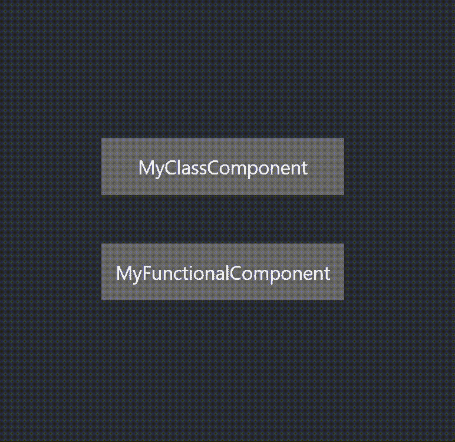

# 如何使用 AOS 向反应堆添加滚动动画

> 原文：<https://blog.devgenius.io/how-to-add-scrolling-animations-to-reactjs-by-using-aos-cefa020a1604?source=collection_archive---------1----------------------->


如何使用 AOS 向反应堆添加滚动动画

大家好，今天我将向大家展示如何在 react 应用程序中添加滚动动画。当然，如果你已经尝试过，你可以找到各种各样的包和 CSS 选项。我也尝试了不同的技术，AOS 软件包是我发现的最好的软件包之一，我想最好和你分享一下。那么，让我们深入今天的内容。

# 步骤 01:使用软件包管理器安装 AOS

**使用国家预防机制**

```
**npm install --save aos@next**
```

**使用纱线**

```
**yarn add aos@next**
```

# 步骤 02:将脚本和样式导入组件

```
**import AOS from 'aos';****import 'aos/dist/aos.css';**
```

# 步骤 03:初始化 AOS

让我们看看如何在函数和类组件中初始化 AOS。

**对于功能组件:**

**对于类组件:**

# **步骤 04:使用 *data-aos 属性*** 为元素添加动画

```
**<div data-aos=”fade-up”> ..........  </div>**
```

这是我在两个组件中的最终代码。

**功能组件:**

**类组件:**

出于演示目的，我将这两个组件导入到 app.js 文件中，在这里您可以看到我的 app.js 和最终演示中的最终代码。



最终演示

酷，我们做到了！！！

我希望你能从这篇文章中得到一些重要的东西，我会很快从另一篇有趣的文章中找到你。

感谢你阅读♥️.

**请点击此处了解更多信息。**

 [## 美国歌剧协会(American Opera Society)

### 使用 CSS3 在卷轴库上制作 AOS 动画

michalsnik.github.io](https://michalsnik.github.io/aos/) [](https://www.buymeacoffee.com/wanuja18)

给我买杯咖啡