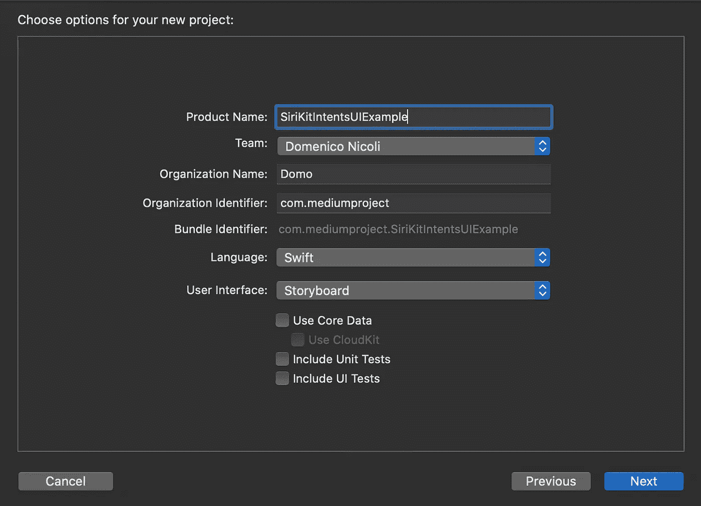
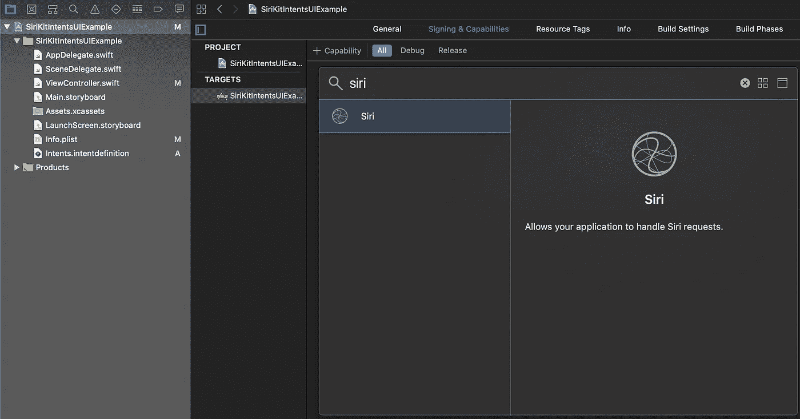
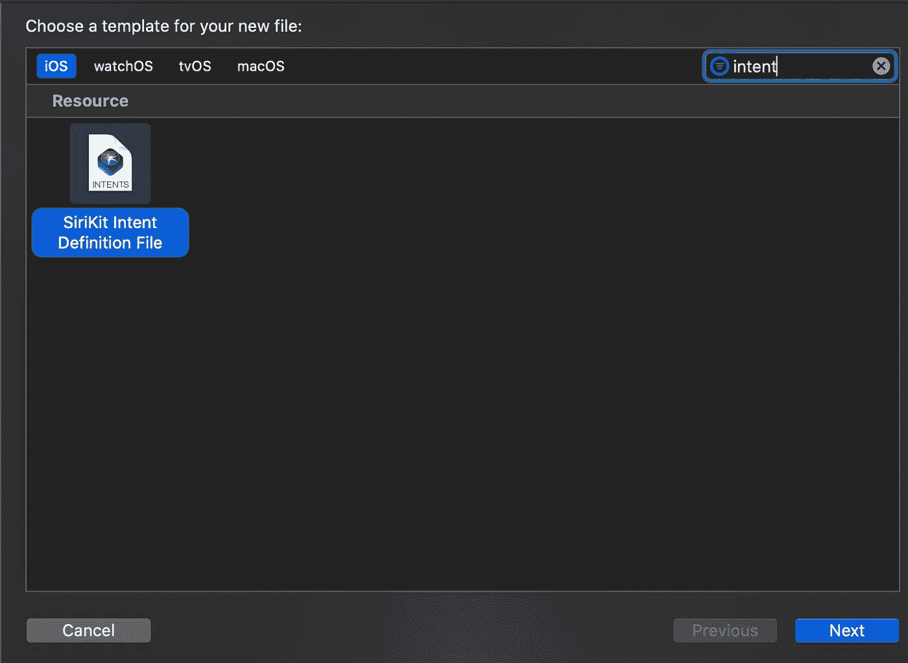
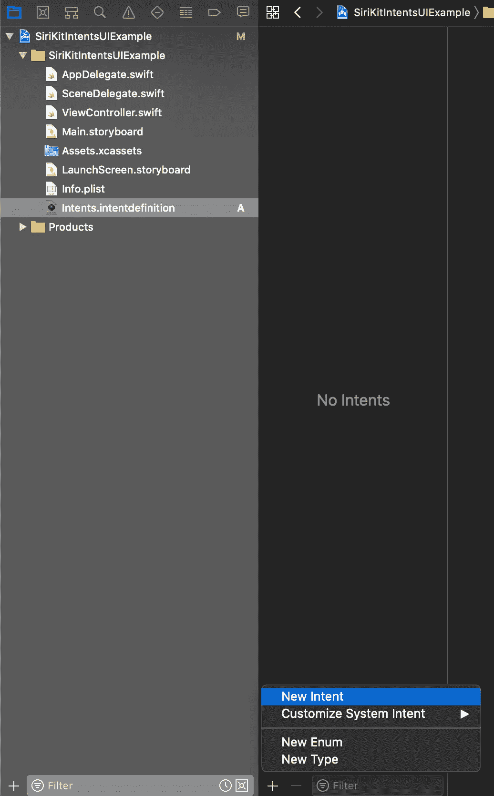
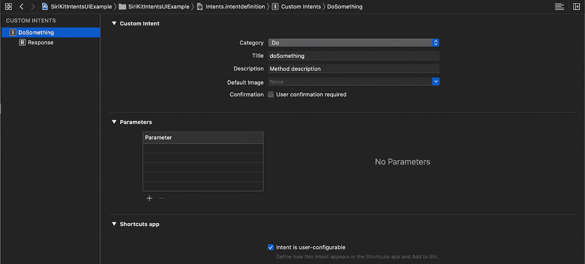
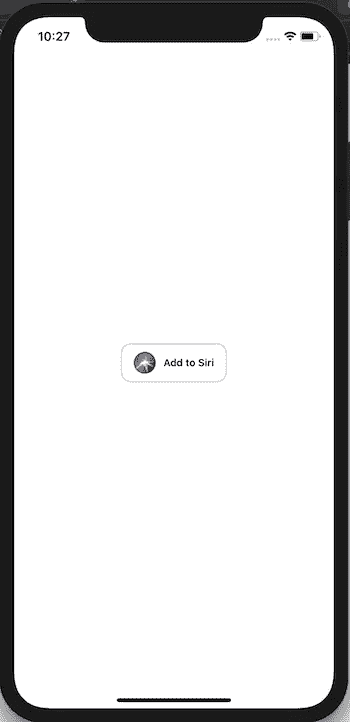
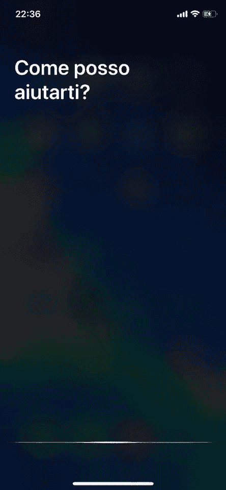
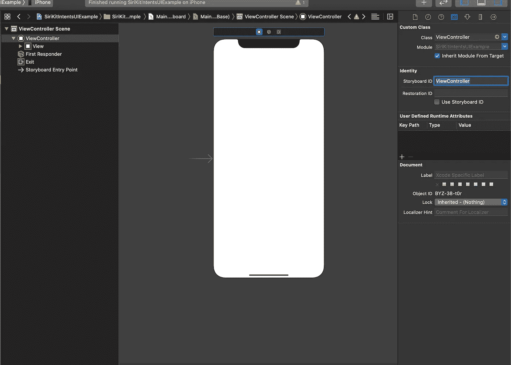
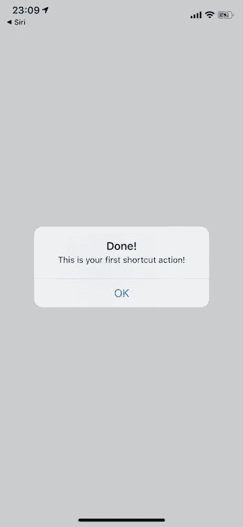

# 如何在 Swift 的应用程序中添加 Siri 快捷方式

> 原文：<https://blog.devgenius.io/how-to-add-siri-shortcuts-in-your-app-in-swift-7afb61934c4e?source=collection_archive---------0----------------------->

## 在你的应用中实现 Siri 快捷方式比你想象的要容易


照片由[émile Perron](https://unsplash.com/@emilep?utm_source=medium&utm_medium=referral)在 [Unsplash](https://unsplash.com?utm_source=medium&utm_medium=referral) 上拍摄

随着 iOS 12 的发布，苹果允许开发者创建可以与 Siri 一起使用的自定义意图。这项新功能让开发人员可以在应用程序中创建自定义操作，无需打开应用程序就可以用 Siri 触发。

在今天的教程中，你将学习如何使用一个简单的快捷键，当 Siri 调用它时，它会执行一个动作。

# 入门指南

首先，打开 [Xcode](https://developer.apple.com/xcode/) 并创建一个新项目。选择单视图应用程序。



转到您的目标设置、签名和功能，并添加 Siri。



现在右键单击项目文件夹，然后单击新建文件。然后，过滤*意图*并点击“下一步”以创建一个 SiriKit 意图定义文件，我们将在接下来的步骤中很快用到它。



# 履行

我们开始创造一个新的意图。选择 intents 文件，点击屏幕底部的+,然后选择 New Intent。



现在为意图设置标题和描述*并保存。*



继续您的`ViewController`并添加以下代码:

```
import UIKit
import IntentsUI

class ViewController: UIViewController {

    override func viewDidLoad() {
        super.viewDidLoad()
        // Do any additional setup after loading the view.
        addSiriButton(to: self.view)
    }

    func addSiriButton(to view: UIView) {
    if #available(iOS 12.0, *) {
        let button = INUIAddVoiceShortcutButton(style: .whiteOutline)
            button.shortcut = INShortcut(intent: intent )
            button.delegate = self
            button.translatesAutoresizingMaskIntoConstraints = false
            view.addSubview(button)
            view.centerXAnchor.constraint(equalTo: button.centerXAnchor).isActive = true
            view.centerYAnchor.constraint(equalTo: button.centerYAnchor).isActive = true
        }

    }

    func showMessage() {
        let alert = UIAlertController(title: "Done!", message: "This is your first shortcut action!", preferredStyle: UIAlertController.Style.alert)
        alert.addAction(UIAlertAction(title: "OK", style: .default, handler: nil))
        self.present(alert, animated: true, completion: nil)
    }

}

extension ViewController {
    @available(iOS 12.0, *)
    public var intent: DoSomethingIntent {
        let testIntent = DoSomethingIntent()
        testIntent.suggestedInvocationPhrase = "Test command"
        return testIntent
    }
}

extension ViewController: INUIAddVoiceShortcutButtonDelegate {
    @available(iOS 12.0, *)
    func present(_ addVoiceShortcutViewController: INUIAddVoiceShortcutViewController, for addVoiceShortcutButton: INUIAddVoiceShortcutButton) {
        addVoiceShortcutViewController.delegate = self
        addVoiceShortcutViewController.modalPresentationStyle = .formSheet
        present(addVoiceShortcutViewController, animated: true, completion: nil)
    }

    @available(iOS 12.0, *)
    func present(_ editVoiceShortcutViewController: INUIEditVoiceShortcutViewController, for addVoiceShortcutButton: INUIAddVoiceShortcutButton) {
        editVoiceShortcutViewController.delegate = self
        editVoiceShortcutViewController.modalPresentationStyle = .formSheet
        present(editVoiceShortcutViewController, animated: true, completion: nil)
    }

}

extension ViewController: INUIAddVoiceShortcutViewControllerDelegate {
    @available(iOS 12.0, *)
    func addVoiceShortcutViewController(_ controller: INUIAddVoiceShortcutViewController, didFinishWith voiceShortcut: INVoiceShortcut?, error: Error?) {
        controller.dismiss(animated: true, completion: nil)
    }

    @available(iOS 12.0, *)
    func addVoiceShortcutViewControllerDidCancel(_ controller: INUIAddVoiceShortcutViewController) {
        controller.dismiss(animated: true, completion: nil)
    }

}

extension ViewController: INUIEditVoiceShortcutViewControllerDelegate {
    @available(iOS 12.0, *)
    func editVoiceShortcutViewController(_ controller: INUIEditVoiceShortcutViewController, didUpdate voiceShortcut: INVoiceShortcut?, error: Error?) {
        controller.dismiss(animated: true, completion: nil)
    }

    @available(iOS 12.0, *)
    func editVoiceShortcutViewController(_ controller: INUIEditVoiceShortcutViewController, didDeleteVoiceShortcutWithIdentifier deletedVoiceShortcutIdentifier: UUID) {
        controller.dismiss(animated: true, completion: nil)
    }

    @available(iOS 12.0, *)
    func editVoiceShortcutViewControllerDidCancel(_ controller: INUIEditVoiceShortcutViewController) {
        controller.dismiss(animated: true, completion: nil)
    }
}
```

现在，如果你运行应用程序，你应该有一个空白的屏幕，中间有一个按钮，可以将我们刚刚创建的快捷方式添加到 Siri 中。您可以点击按钮，使用默认文本或设置新的文本来触发快捷方式。

现在，如果你触发 Siri 并说出选择的命令，你的应用程序将自动打开！



现在，当我们对 Siri 说出命令时，我们的应用程序就会打开，但我们必须做什么才能将这个短语链接到我们应用程序中的特定操作？

首先，转到`Main.storyboard`并在 StoryboardID 属性上设置 ViewController。



现在在`SceneDelegate.swift`(iOS 13 上)或者`AppDelegate.swift`(iOS 13 之前)上，复制以下代码(这是针对`SceneDelegate`的版本，但是在`AppDelegate`上添加的方法真的很类似):

```
func scene(_ scene: UIScene, continue userActivity: NSUserActivity) {
        if let _ = userActivity.interaction?.intent as? DoSomethingIntent {

            if let windowScene = scene as? UIWindowScene {
                self.window = UIWindow(windowScene: windowScene)
                let storyboard = UIStoryboard(name: "Main", bundle: nil)
                let initialViewController = storyboard.instantiateViewController(withIdentifier: "ViewController") as! ViewController
                self.window!.rootViewController = initialViewController
                self.window!.makeKeyAndVisible()
                initialViewController.showMessage()
            }
        }
    }
```

# 试验

最后，你已经准备好测试你的应用了！告诉 Siri 你的命令，结果应该是这样的:

[](https://www.buymeacoffee.com/nicolidomenico)

# 完整代码

你可以在 [GitHub](https://github.com/domeniconicoli/SiriKitIntentsUIExample) 上找到完整代码。

感谢您的阅读。如果你有任何问题或建议，请在评论中告诉我。