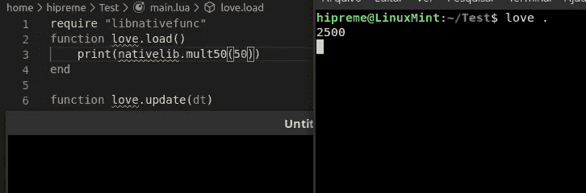

# 如何在 Lua 中添加你的 C 库

> 原文：<https://blog.devgenius.io/how-to-add-your-c-library-in-lua-46fd246f0fa8?source=collection_archive---------3----------------------->

## 如何将你的 C 库与 Lua 集成的基本例子


由 [Austin Distel](https://unsplash.com/@austindistel?utm_source=medium&utm_medium=referral) 在 [Unsplash](https://unsplash.com?utm_source=medium&utm_medium=referral) 上拍摄

大家好，我在用 love 开发一个 C 库时遇到了一些麻烦，所以我想归档一下如何做:这个教程主要是为 Linux 制作的，但是来自 windows 的有经验的用户会明白该怎么做

首先，如果您在 linux 环境下工作，您将希望安装 Lua(您可能只从 love 使用它)，但它不应该是任何版本，它必须是与**Love 11.3**一起使用的 Lua 版本，即**Lua 5.1**，因此在您的终端中执行以下命令

```
sudo apt-get install lua5.1-dev
```

使用这个版本是很重要的，正如我所读到的，我觉得 Lua 改变了你在每个版本中导出 C 函数的方式

该命令将安装在您的/usr/include/lua5.1 Lua 头文件中，以便使用 c。

现在，为了编译 C，您必须安装 gcc 命令，这样做就像在终端`shsudo apt-get install gcc` 中调用一样简单。之后，您将需要创建您的 C 文件，其中包含要导出的函数，所以我们称它为 nativefunc.c

创建文件后，您需要在 C 代码中导入两个主库，lua 库和 lua 辅助库:

```
#include <lua.h>
#include <lauxlib.h>
```

[本教程的可选读物](在编写更复杂的函数时，您将需要它)之后，您将需要研究 lua.org 网站的第 26 到 28 章的一些规范:[https://www.lua.org/pil/contents.html](https://www.lua.org/pil/contents.html)

# 要阅读的章节

*   26= >从 Lua 调用 C
*   27= >编写 C 函数的技巧
*   28 =中的用户定义类型

读完之后，你就有了编写复杂的 C 函数所需的大部分内容，接下来，让我们创建你的第一个 C 导出函数:每个导出的函数都必须遵循下面的原型:`typedef int (*lua_CFunction) (lua_State *L)`

也就是说:定义一个函数，它的返回类型是**int**，收到的参数是* *lua_State* L**，那么，看看它是怎么定义的:

```
static int l_mult50(lua_State* L)
```

正如你所看到的，这里有一些常见的做法:首先，通常函数被声明为静态函数，在 C 语言中，这意味着你的函数在外部是不可见的，l_ 通常被用来表示这个函数在库上。

要获取函数中的参数，您必须获取它的索引，每个参数函数都从 1 开始，因此示例如下:

```
double number = lua_tonumber(L, 1);
```

当你从你的 Lua 脚本中调用这个函数时，它将接收传递的数字作为第一个参数，但是这是类型不安全的，如果你想在传递错误消息时得到著名的错误消息，你需要把它转换为:

```
double number = luaL_checknumber(L, 1)
```

其中一些检查很容易记住

# Checktype 函数

*   luaL_checkstring，
*   luaL_checknumber，
*   luaL_checkint，
*   luaL_checkany

现在，您可以对参数做任何您想做的事情了，如简单示例所示，让我们将它乘以 50

```
number*= 50;
```

(number = number * 50 的缩写)之后，我们会想把它返回给 Lua 中的某个变量，那么我们该怎么做呢？你需要调用 lua_push [数据](https://github.com/MrcSnm/How-to-add-your-C-Library-in-Lua/blob/master/value)，最常见的查找使用有:

# 推动价值函数

*   lua_pushnumber，
*   lua_pushboolean，
*   lua_pushstring，
*   lua _ pushcfunction，
*   lua_pushnil，
*   lua_pushvalue

在我们的例子中，我们返回一个数字，所以:

```
lua_pushnumber(L, number);
```

在那之后，我们需要从我们的函数返回，但是有一件重要的事情:我们的函数必须返回我们推送了多少个值，在我们的例子中，我们必须`return 1` 在你返回 x 和 y 的例子中，你会返回 2，(因为你需要推送数字 x 和 y)

所以，我们完成的函数看起来像这样:

```
static int l_mult50(lua_State* L)
{
    double number = luaL_checknumber(L, 1);
    lua_pushnumber(L, number*50);
    return 1;
}
```

之后，Lua 将需要命名函数以及在哪里找到它，这部分对于在 Lua 中执行它是极其重要的。你需要创建另一个前缀为 luaopen_ 的函数，在这个前缀之后，你需要输入将要导入到你的游戏中的文件名，在我们的例子中，它将被命名为 libnativefunc.so(在 Windows 情况下为 dll)，最终的名字将是 luaopen_libnativefunc 我使用 lib 作为文件前缀，因为以 _lib_ 开始你的库名是一个好习惯，所以让我们开始定义这个函数

```
int luaopen_libnativefunc(lua_State* L)
```

现在我们需要定义我们的 lib 将在 Lua 中实现什么函数，为此我们需要定义一个 C Struct 数组，它被定义为:

```
static const struct luaL_Reg nativeFuncLib []
```

luaL_Reg 是一个由 Lua 定义的结构，它有一个名称和一个函数，所以继续使用这种类型很重要，为了定义它，我们将使用数组填充运算符:

```
static const struct luaL_Reg nativeFuncLib [] =
{
    {"mult50", l_mult50}, //Your function name, and the function reference after
    {NULL, NULL}
}
```

正如你所看到的，我们的 lib 中注册的函数必须总是以{NULL，NULL}结尾，这意味着它已经完成了整个数组的迭代，如果不这样做，将会产生下面的错误分段错误(核心转储)。这是一个默认的 C 错误消息，当你的迭代器超出数组长度之后，在同一个函数中，你将需要在 Lua 中注册你的 lib，这是我在试图找到要使用的正确的迭代器时出现最多错误的地方:

```
luaL_register(L, "nativelib", nativeFuncLib)
```

nativelib 是保存库函数的全局变量，它被定义为一种 Lua 回调表:nativelib ["mult50"](https://github.com/MrcSnm/How-to-add-your-C-Library-in-Lua/blob/master) ，这就是它的工作方式，要完成它，只需返回 1，现在我将所有代码放在这里以便于下面的操作:

```
#include <lua.h>
#include <lauxlib.h>static int l_mult50(lua_State* L)
{
    double number = luaL_checknumber(L, 1);
    lua_pushnumber(L, number*50);
    return 1;
}int luaopen_libnativefunc(lua_State* L)
{
    static const struct luaL_Reg nativeFuncLib [] =
    {
         {"mult50", l_mult50}, //Your function name, and the function reference after
         {NULL, NULL}
    };
    luaL_register(L, "nativelib", nativeFuncLib);
    return 1;
}
```

这就是我们完成的 nativefunc.c 文件。之后，为了在我们的 Lua 代码中使用它，我们需要将它编译为一个共享对象，通常称为 library。所以还是。dll 文件，我们需要用新的 gcc 命令来编译它

```
gcc -I/usr/include/lua5.1 nativefunc.c -c -fPIC
```

这段代码将编译我们的代码而不链接它，它将输出一个名为“nativefunc.o”的文件，现在我们将使用它:

```
gcc nativefunc.o -shared -o libnativefunc.so
```

(转换一下。所以在。在这之后，你将最终生成你将在 Lua 中导入的文件，有两种通用的方法，一种更简单，灵活性更差，另一种是 anthonym:

休闲小站

```
require "libnativefunc"
```

更难的方法

```
lib = package.loadlib("./libnativefunc.so", "luaopen_libnativefunc")
lib();
--Shorter Version - package.loadlib("./libnativefunc.so", "luaopen_libnativefunc")()
```

所以，基本上，比较难和比较容易的方法的区别在于，在比较难的方法中，你定义哪个函数注册了你的库，之后，你就可以调用你自己的函数了

```
print(nativelib.mult50(50))
```



结果呢