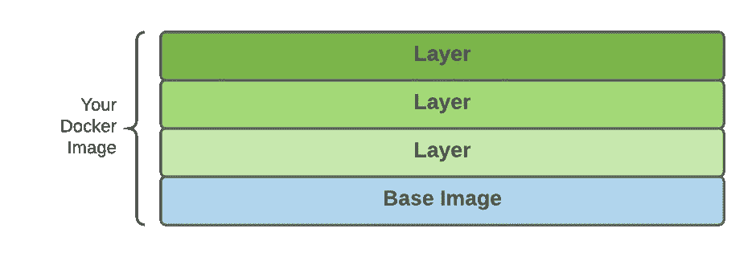
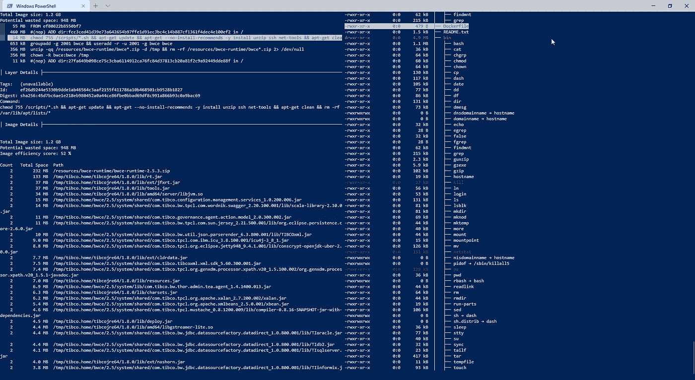
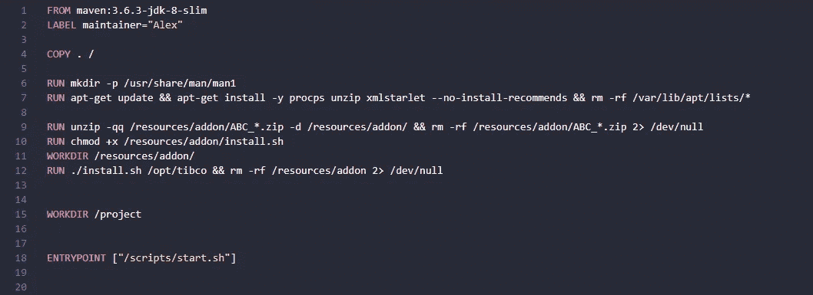
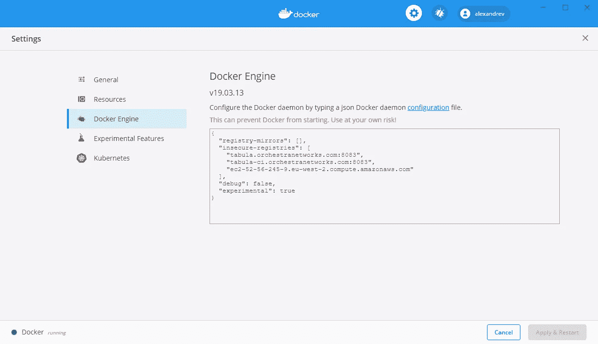

# 如何分析和改善你的 docker 图片的尺寸？

> 原文：<https://blog.devgenius.io/how-to-analyze-and-improve-the-size-of-your-docker-images-54effa56f488?source=collection_archive---------0----------------------->

## 了解如何提高 Docker 图像的大小，以便在您的组织内获得更好的体验并节省成本。


查尔斯·德鲁维奥在 [Unsplash](https://unsplash.com?utm_source=medium&utm_medium=referral) 上拍摄的照片

集装箱化是新的常态。我们都知道这一点。公司软件的所有新版本和所有开源项目都包含了使用 docker 映像运行软件的选项。

或许你已经在基于你自己构建的 docker 映像进行测试，甚至在生产工作负载中运行了。如果是这样的话，你可能知道当你在做这种工作时最大的挑战之一:*如何优化你生成的图像的尺寸？*

docker 图像如此之大的主要原因之一是因为它们是按照分层概念构建的。这意味着每个图像都是作为层的添加而创建的，每个层都与 docker 文件中的不同命令相关联。



Docker 图像如何合成的图形说明。

# 使用 dive 分析图像的大小

[*dive*](https://github.com/wagoodman/dive) 是一个开源项目，它提供了 docker 图像组成的详细视图。它是一个命令行界面应用程序，可以很好地查看图层的内容，如下图所示:



BusinessWorks 容器版映像的执行

该工具遵循 n-curses 接口(如果你还记得在图形用户界面出现之前工具是怎样的；看起来应该很熟悉)并且具有以下主要特征:

*   该工具将在屏幕的左上角提供图层列表以及与每个图层相关的大小。
*   提供有关图像效率(百分比值)的常规统计数据、浪费大小的潜在视图以及图像的总大小。
*   对于所选的每个层，您可以在文件系统上获得该视图的视图，其中包含每个文件夹大小的数据。
*   此外，还要查看更大的元素以及这些对象的复制数量。

现在，您有了一个工具，它将首先帮助您了解映像是如何构建的，并获得您为改进该大小所做的每项调整的性能数据。所以，我们先从招数说起。

# 1.-清洁你的形象！

这是显而易见的，但这并不意味着它不重要。通常，当您创建 Docker 映像时，您遵循相同的模式:

*   您声明了一个可以利用的基本映像。
*   您添加资源来完成一些工作。
*   你做一些工作。

通常，我们会忘记一个额外的步骤:当不再需要时，清理添加的资源！因此，确保删除我们不再需要的每个文件是很重要的。

这也适用于其他组件，如 apt 缓存，当我们安装我们需要的新包或任何临时文件夹时，我们需要执行安装或构建映像的一些工作。

# 2.-注意创建 docker 文件的方式

正如我们已经提到的，我们在 docker 文件中声明的每个命令都会生成一个新层。因此，非常小心 docker 文件中的行是很重要的。即使这是对 docker 文件可读性的一种折衷，尝试在同一个 RUN 原语中合并命令以确保我们不会创建额外的层也是很重要的。



带有合并命令的 docker 文件示例

您还可以使用 Docker linters，如 [Hadolint](https://github.com/hadolint/hadolint) ，这将有助于您解决这个问题以及其他在创建 Docker 文件时应该避免的反模式。

# 3.-去码头建造-壁球

Docker 引擎的最新版本提供了一个新的选项，当您构建映像时，可以使用中间层的最小尺寸*挤压*进行创建，这可以作为 Docker 文件创建过程的一部分来创建。

这很有效，当你在构建你的图像时提供了一个新的标志。所以，与其这样做:

```
docker build -t <your-image-name>:<tag> <Dockerfile location>
```

您应该使用一个附加标志:

```
docker build --squash -t <your-image-name>:<tag> <Dockerfile location>
```

为了能够使用这个选项，您应该在 Docker 引擎上启用实验特性。为此，您需要在 daemon.json 文件中启用它并重启引擎。如果您使用的是 Docker for Windows 或 Docker for Mac，您可以使用如下所示的用户界面:



# 摘要

这些调整将帮助您使 Docker 图像更薄，推拉过程更愉快，同时，甚至在您选择的存储库中存储图像方面节省一些资金。不仅仅是对你，也是对其他许多可以利用你正在做的工作的人。所以想想你自己，也想想社区。