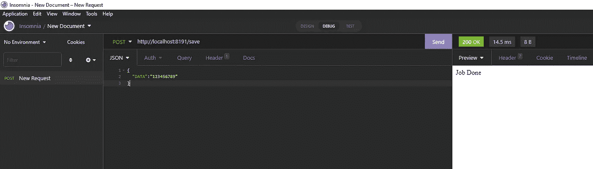
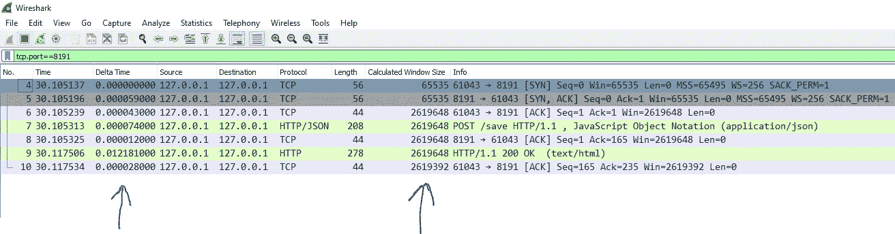
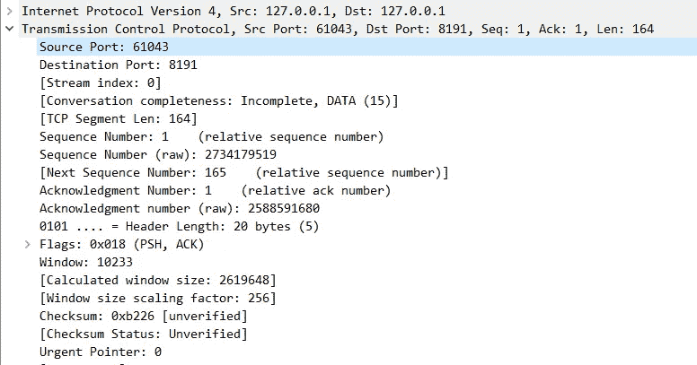
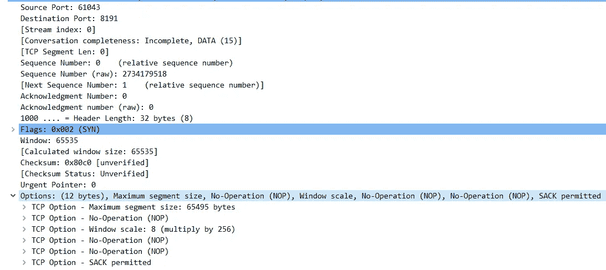
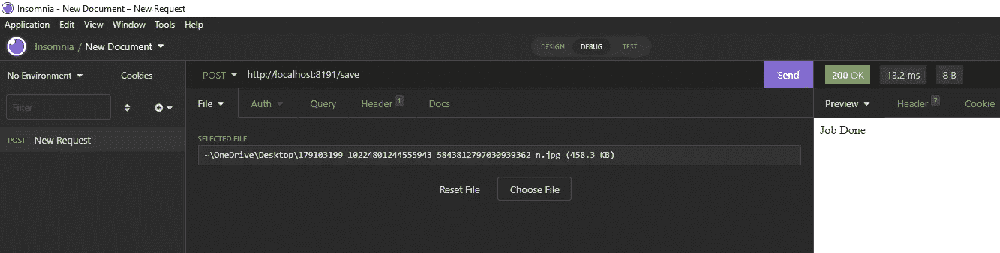
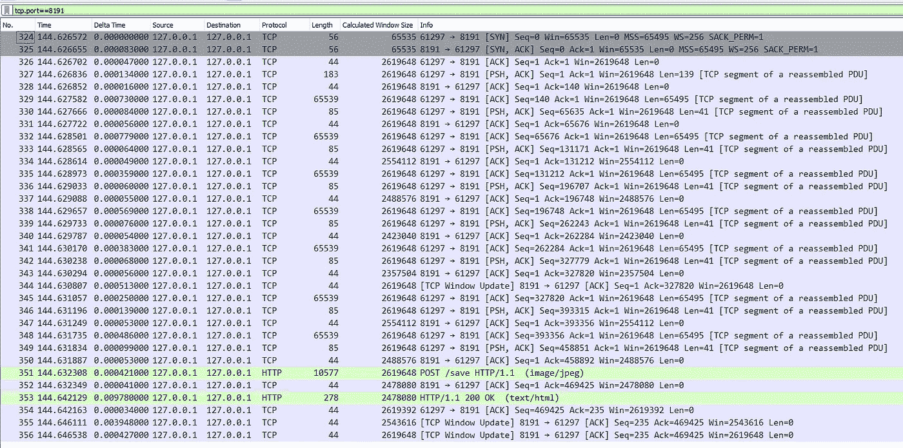

# 如何分析慢速后端的 TCP 转储(使用 Wireshark 演示)

> 原文：<https://blog.devgenius.io/how-to-analyze-tcp-dump-for-slow-backends-demo-using-wireshark-1a350379115f?source=collection_archive---------6----------------------->

读者们好，

大多数遇到问题的开发人员都说系统很慢，或者有时很慢。但是开发商并不是唯一对这个问题负责的人。网络参与、机器参与、基础设施参与和许多其他因素都涉及到这里。但是开发人员承担了责任，因为我们是开发这些系统的人。

在这个演示中，我使用了我在以前的文章中包含的代码片段([https://blog . dev genius . io/software-engineer-must-know-about-http-keep-alive-demo-using-wireshark-8bb 2803 eecf 3](/software-engineer-must-know-about-http-keep-alive-demo-using-wireshark-8bb2803eecf3))。我对代码做了小的修改。以下快照如下。我在这里使用了 post 而不是 get。

在下面的快照中，我使用名为失眠症的应用程序向后端发送大文件和小文本。

一旦您运行服务器，并从失眠发送初始交易，让我们检查 Wireshark。

在这里，我们可以看到最初的连接已经完成，如前 3 行所示。通常的 TCP 三次握手。此外，我还添加了两个额外的列，称为**、**和**、【计算窗口大小】。**

在上面的第 3 行快照中，有一个叫做窗口大小的东西。在这里是***‘Win = 2619648’。*** 初始初始要求 **窗口大小为 65535。**简单来说，窗口大小意味着我们得到的最大接收缓冲区大小。如果是客户端则客户端接收缓冲区，如果是服务器则服务器接收缓冲区大小。

如果我们选择 7 号线。如果我们仔细观察，

从客户端到服务器。显示窗口是 10233。如果我们得到最初的一个窗口大小，它表示 65535。这 65535 字节意味着一个巨大的数字。如果我们上传或下载 2gb 的文件，想象一下，我们发送 65535 字节，然后确认，我们再次发送 65535 字节，然后确认，一次又一次，它将永远需要下载。因为它非常慢。

随着协议或网络的发展，当我们试图处理大文件时，我们希望有更多的空间。所以他们所做的是

当我们转到选项时，有一个名为窗口缩放的标志。窗口缩放意味着 8，这是 2⁸，是 256。这意味着虽然我们的谈判是 65535，但我可以接受 256 倍。

如果您在 Wireshark snap 中检查一些数据包，如第 7 行。我们看不到窗口缩放选项。因为这只发生在握手过程中。如果分析我们的缓慢，我们需要确保我们捕获同步同步 ACK ACK 数据包。因为我们需要确保带宽得到充分利用。

让我们上传一个大文件，看看发生了什么

因此上传文件大小为 458kb。点击发送上传文件后

正常的 3 次握手连接发生在前 3 行。如果我们仔细观察第 333 到 343 行，窗口大小 2619648 逐渐下降。同样，344 行得出的值是 2619648，这非常重要。

当我们处理计算出的缓冲窗口大小时，这意味着服务器会打开一定大小的窗口。

例如，服务器说我的尺寸是 100，所以客户端向服务器发送 100 尺寸的数据。现在服务器有 100 个。但是这里的服务器有一些其他的应用程序在运行。因为服务器只是第 7 层中的一个协议和应用程序，所以应用程序向客户端发送信息，客户端将信息发送给服务器。因此服务器上的应用程序从缓冲区中获取它。当客户端向服务器发送 100，服务器向客户端返回 ACK 时。同时，运行在服务器上的应用程序消耗了缓冲区中的 90%。还剩 10 个。再一次，服务器会要求客户机为 90 以保持缓冲区大小。
现在客户端发送 90，服务器应用消费 70。服务器再次向客户端询问 70。所以我们可以看到这一直在下降。

> 下一次接受=全尺寸(-)保留在缓冲区中

所以这个问题的出现是由于持续下降和它的命中率为零。这是我们需要小心的事情。因为虽然我们在高速服务器应用程序中传输数据，但是在第 7 层的应用程序并不以同样的速度消耗数据。

由于某种原因，如果它达到零，现在它被称为零窗口情况。因此，服务器告诉客户端，缓冲区中的所有空间都已满，客户端需要等待。假设 1 秒钟后，服务器说窗口更新 30 大小，服务器要求客户端发送 30。我们可以看到有一个滞后，因为零乘零窗口有一个滞后。
如果你发现你的系统很慢，你看到零窗口包，那么你需要解决这个问题。

如果我们仔细检查前 3 行中的 3 次握手，如果我们查看 Delta 时间列响应或 RTT 在毫秒内出现。如果这里有延迟，我们必须查看。因为将数据包发送到服务器，然后从服务器返回，我们需要这么多时间。所以每次握手花的时间。

问题是，如果服务器发送 100 个字节，其中 SYN 为 1。客户端必须确认 101 字节，这是服务器清空发送缓冲区直到数据进入服务器发送缓冲区的时间。如果服务器需要时间来响应，这意味着服务器 ACK 变慢，意味着服务器需要在发送缓冲区中保存更多的数据而不清除，即使它发送了它。由于服务器发送缓冲区已满，下一个到达服务器的数据无法放入。所以现在传输很慢。

有一种东西叫 TCP 重传。让我们以前一个案例为例。服务器发送 100 字节，但是客户端没有向服务器确认。所以服务器在等待。当服务器超时触发但客户端向服务器发送 ACK 时，服务器再次向客户端发送相同的 SEQ 和 ACK。如果你看到连接很慢，你可以看到服务器向客户端发送多次重新传输。

参考:

[https://youtu.be/Ca9ZRyzeauo](https://youtu.be/Ca9ZRyzeauo)