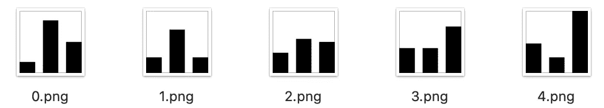
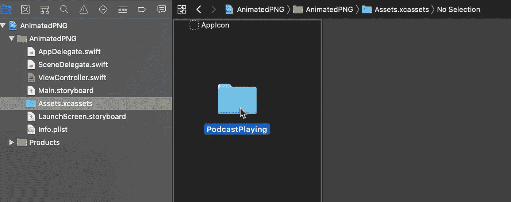
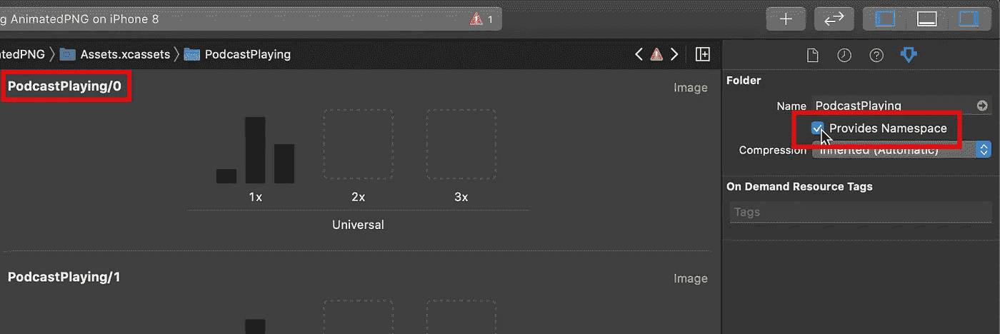
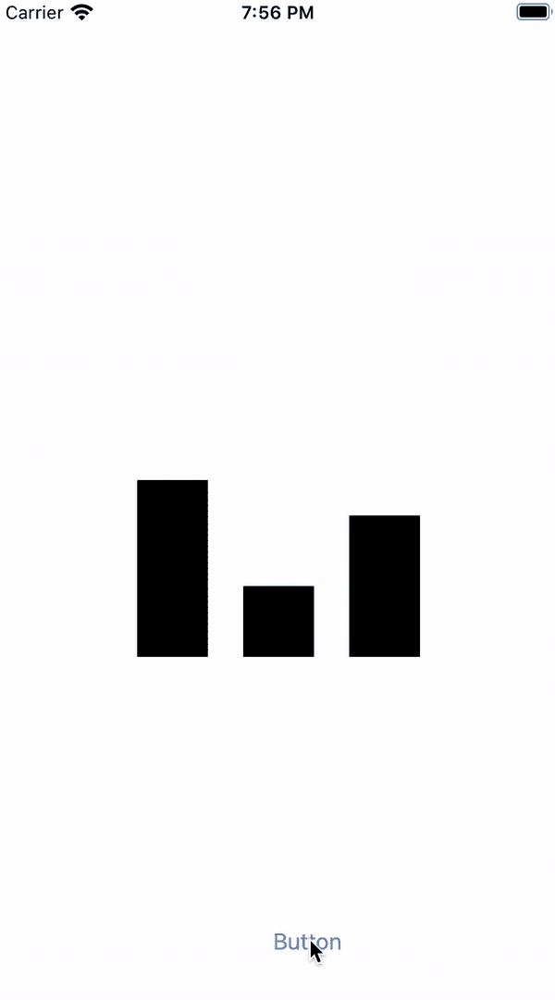
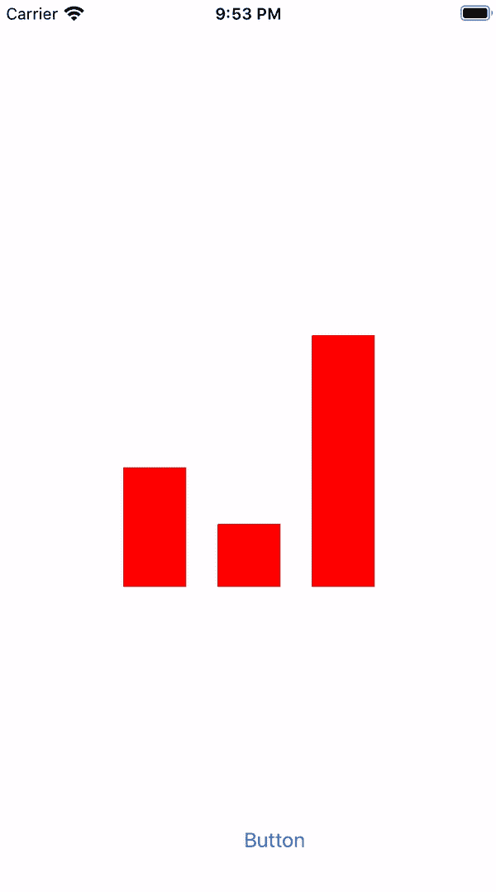
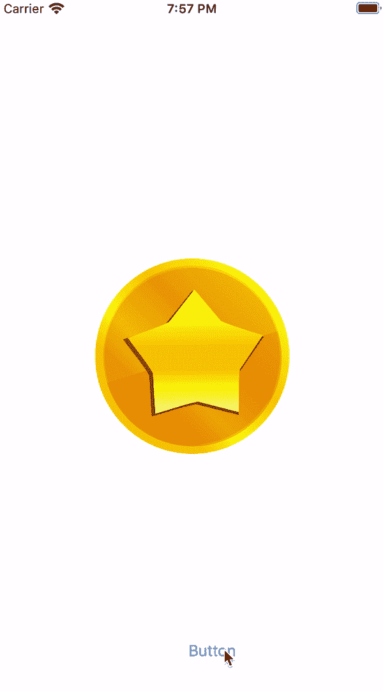
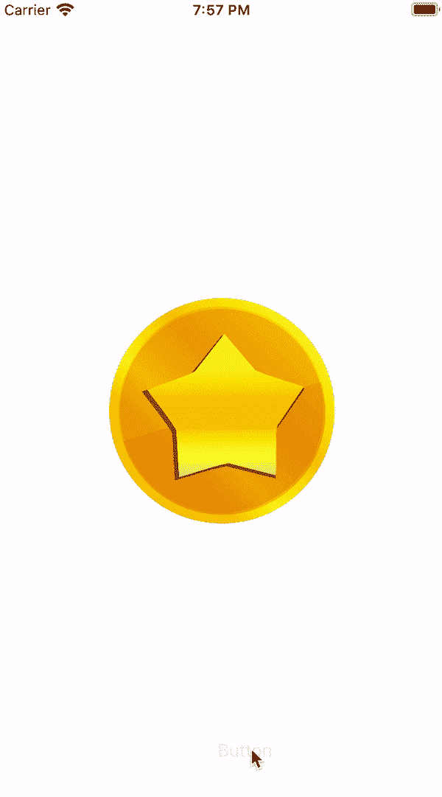

# 如何在 Swift——iOS Swift 指南中制作图像动画

> 原文：<https://blog.devgenius.io/how-to-animate-your-images-in-swift-ios-swift-guide-64de30ea616b?source=collection_archive---------1----------------------->

## SWIFT 编程

## 使用 UIImage 和 UIImageView 创建动画图像的 5 个步骤

UIKit 提供了一个很棒的内置特性，可以用几行代码显示动画图像。它允许为许多不同的用例创建动画，从加载动画，到发光物品，旋转物品，等等。

这里有 5 个步骤来创建你自己的基于图像的动画并添加到你的应用中。让我们开始吧。

# 1.为您的动画创建一组图像

第一步，创建你的动画并导出它，一个图像一个图像，在一个目录中。请确保从`**0**`(例如`**0.png**`)开始，用一个数字来命名每个图像文件，以指示其在动画中的位置。

在本文中，我将使用一个示例动画作为例子:假设这是一个播客播放器，我需要一个动画来指示当前播放的曲目。

示例动画图像

如果您自己制作动画图像，您可以创建多个图像来表示动画的不同状态。

下面是一个动画旋转硬币的例子。正如你所看到的，你可以模拟一个完整的 360 度旋转动画，只有 6 个不同的图像。假设持续时间足够短(在这种情况下不到一秒)，即使有几个图像，它看起来也像一个平滑的动画。

示例动画图像

# 2.将您的图像添加到 xcassets 文件夹

一旦您有了包含所有图像的文件夹，请转到 Xcode，选择您的项目资源目录，然后拖放动画文件夹。

Xcode —添加资产

为了确保一切井然有序，启用`**"Provide Namespace"**`选项。这将使您可以从`**"FolderName/ImageName"**`而不是`**"ImageName"**`访问 swift 文件中的资产。

Xcode —资产配置

# 3.创建自动图像加载器

现在，是时候在代码中加载动画的所有图像了。

让我们创建一个`**animatedImages**`函数，它将动画的名称(对应于我们在上一步中在 xcassets 文件中创建的文件夹的名称)作为参数，并返回一个图像数组。

为了避免检查有多少图像是动画的一部分，让我们从`**0**`开始迭代，同时可以用生成的名称加载一个图像。

这样，动画的所有图像都将被加载，不管它有多少图像，也不用指定要加载的图像数。

# 4.配置 ImageView 以运行动画

我们有自己的图像加载器，所以最后一步是将这些图像设置到我们的`**imageView**`，并配置动画。

`**UIImageView**`具有内置动画功能，可定制以下属性:

*   **动画时长:** `**animationDuration**`

持续时间以秒为单位，表示显示所有图像需要多少时间。因此，如果我在一个动画中有`**10 images**`和`**0.5 second**`的持续时间，动画的每个图像将保持`**0.5/10 second**`。默认值为`**0**`，并使图像视图使用等于图像数量乘以`**1/30 second**`的持续时间。

*   **动画的重复次数:** `**animationRepeatCount**`

该属性允许您指定动画重复播放的次数。值`**0**`使动画无限期运行。

另外，不要忘记用动画的第一个图像设置`**image**`属性，否则，如果动画没有运行，什么也不会显示。

音乐播放动画

# 5.替代实现

我们在上面看到了一个使用 **UIImageView** 的实现，带有一些基本的定制。`**UIImage**`类还包括一个内置特性，允许我们创建动画`**UIImage**`对象，仍然基于多个`**UIImage**`的数组。

这个实现的一个优点是它允许在动画图像上使用`**tintColor**`属性。使用与前面相同的示例，我们现在可以为模板动画图像设置自定义色调:

除了淡色之外，这种方法还允许你在动画上使用一些高级的`**UIImage**`功能，比如拉伸。

有关动画图像的更多信息，您可以查看与 [UIImage 动画](https://developer.apple.com/documentation/uikit/uiimage/1624149-animatedimage)和 [UIImageView 动画](https://developer.apple.com/documentation/uikit/uiimageview/1621068-animationimages)相关的 Apple 文档。

旋转和发光硬币动画

# 概述

动画图像是向您的应用程序添加新的循环动画的绝佳机会。这个 UIKit 内置特性可以用来轻松创建各种动画:加载动画，发光物品，旋转物品，滚动骰子，等等。

**下面是给你的应用添加动画图像的 5 个步骤:**

1.  为您的动画创建一组图像
2.  将您的图像添加到 xcassets 文件夹
3.  创建自动图像加载器
4.  配置 ImageView 以运行动画
5.  替代实现

# 您可能也会喜欢这些文章:

 [## 如何在 Swift 中创建高级阴影— iOS Swift 指南

### 为应用程序创建美丽阴影的 5 种方法

medium.com](https://medium.com/swlh/how-to-create-advanced-shadows-in-swift-ios-swift-guide-9d2844b653f8)  [## 如何使用 CAGradientLayer 在 Swift 中创建自定义渐变— iOS Swift 指南

### 为你的应用程序创建美丽渐变的 5 个步骤

medium.com](https://medium.com/swlh/how-to-create-a-custom-gradient-in-swift-with-cagradientlayer-ios-swift-guide-190941cb3db2)  [## 如何在您的 iOS 应用程序中使用 SF 符号——iOS Swift 指南

### SF Symbols 4:超过 4000 个高质量图标，旨在与您的应用程序无缝集成

bmontag.medium.com](https://bmontag.medium.com/how-to-use-sf-symbols-in-your-ios-app-ios-swift-guide-2e81ade5f69e)