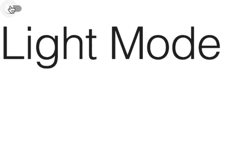

# 如何使用 Material-UI 应用黑暗模式

> 原文：<https://blog.devgenius.io/how-to-apply-dark-mode-using-material-ui-18de9d095d9a?source=collection_archive---------0----------------------->

## 只需一个开关，即可将 React 应用程序从亮模式切换到暗模式


照片由 [sebastiaan stam](https://unsplash.com/@sebastiaanstam?utm_source=medium&utm_medium=referral) 在 [Unsplash](https://unsplash.com?utm_source=medium&utm_medium=referral) 上拍摄

深色模式是在深色背景上显示浅色文本的内容用户界面。据说它有助于减轻眼睛疲劳，甚至可以延长智能手机的电池寿命。我是黑暗模式的忠实粉丝，尽可能使用它。

如果你想了解更多为什么它受欢迎，看看下面的视频。

在本文中，我将教你如何使用 Material-UI 在 React 应用程序中实现黑暗模式。我们将构建一个简单的应用程序，如下所示。



# 入门指南

如果你是第一次使用 Material-UI，看看下面的文章就可以开始了。我们将使用一些相同的概念来创建这个应用程序中的黑暗模式主题。

[](https://medium.com/swlh/create-a-customized-color-theme-in-material-ui-7205163e541f) [## 在材质界面中创建自定义的颜色主题

### 为下一个 React 项目定制颜色主题很容易

medium.com](https://medium.com/swlh/create-a-customized-color-theme-in-material-ui-7205163e541f) 

在我们的示例中，我们将使用一个 create-react-app 应用程序。在你设置好一个基本的应用程序后，清理`src`文件夹，只包含一个`App.js`和`index.js`文件。那是我们将使用的全部。然后在您的项目中，安装 Material-UI 核心包。

```
// with npm
npm install @material-ui/core// with yarn
yarn add @material-ui/core
```

# 设置我们的应用程序

在我们的例子中，我们将显示一个开关按钮和一个排版组件，它告诉我们是处于亮模式还是暗模式。

首先，我们需要从 React 导入`useState`钩子，并从 Material-UI 核心包中导入以下内容。

```
import React, { useState } from 'react';
import { Paper, Switch, Typography, createMuiTheme, ThemeProvider, CssBaseline } from '@material-ui/core';
```

让我们首先使用`useState`钩子创建一个`darkMode`状态。

```
const [darkMode, setDarkMode] = useState(false);
```

在`App.js`文件返回语句中，添加以下代码。

```
<Paper style={{ height: '100vh' }}>
  <Switch checked={darkMode} onChange={() => setDarkMode(!darkMode)} />
  <Typography variant="h1">
    {darkMode ? 'Dark Mode' : 'Light Mode'}
  </Typography>
</Paper>
```

首先，我们将整个应用程序包装在一个`Paper`组件中，并赋予其高度`100vh`。这是为了确保黑暗模式主题将在我们的应用程序中工作。然后我们添加一个`Switch`组件，它将在改变时将`darkMode`切换为真或假。最后，我们展示了一个`Typography`组件，它将根据`darkMode`变量的状态显示文本，“暗模式”或“亮模式”。

提示:如果您想重置样式并删除边距，您可以在`Paper`组件上方添加一个`CssBaseline`。

# 使用材质的黑暗模式-用户界面

根据他们的[文档](https://material-ui.com/customization/palette/#dark-mode)，*“Material-UI 有两种调色板类型，亮(默认)和暗。可以通过设置* `*type: 'dark'*` *使主题变暗。虽然这只是单个属性值的更改，但在内部它会修改几个调色板值。”*

在下图中，你可以看到版式、按钮、背景和分隔线将如何变化，这取决于调色板的类型。


[https://material-ui.com/customization/palette/#dark-mode](https://material-ui.com/customization/palette/#dark-mode)

为了设置应用程序的调色板类型，我们将使用 Material-UI 核心包中的`createMuiTheme`函数和`ThemeProvider`。

从下面的代码中可以看出，调色板类型将被设置为“暗”或“亮”，这取决于变量`darkMode`的状态。

```
const theme = createMuiTheme({
  palette: {
    type: darkMode ? 'dark' : 'light',
  },
});
```

然后，我们将使用`ThemeProvider`包装我们的应用程序，并将主题作为道具传递。最终的`App.js`文件将如下所示。

# 结论

感谢阅读！Material-UI 是我最喜欢的 React 应用程序样式库之一。他们的文档非常好，入门也很容易。我希望这篇文章对你在应用程序中应用黑暗模式主题有所帮助。