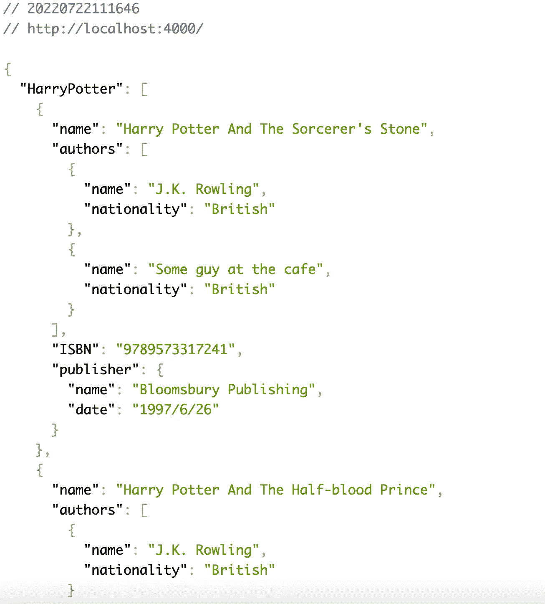
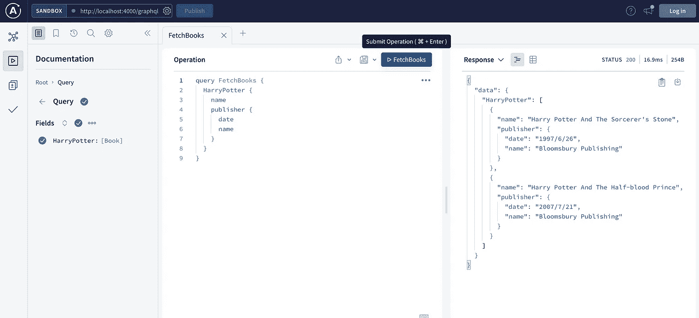
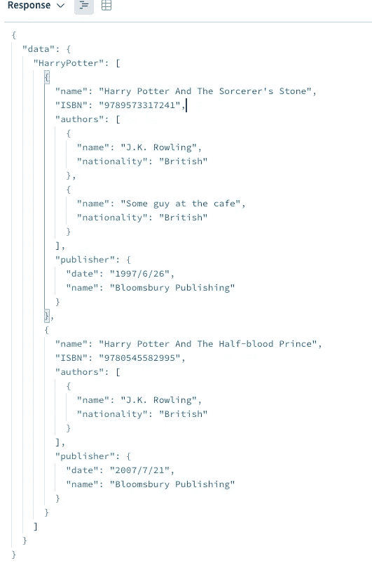

# 如何在节点应用中将 Redis 缓存应用到 GraphQL 中

> 原文：<https://blog.devgenius.io/how-to-apply-redis-cache-to-graphql-in-node-application-407c57fc9ab8?source=collection_archive---------3----------------------->

# TL；速度三角形定位法(dead reckoning)

这篇文章的灵感来自于 [rediQLess](https://github.com/oslabs-beta/rediQLess) 。基于它的想法，我开发了一个简单的节点应用程序，并将其集成到 GraphQL 和 Apollo Server 中。

如果你对我的工作和开源贡献感兴趣，请访问这个项目的 GitHub，并留下你遇到的任何问题。非常感谢社区！

# 催单

在本文中，我不打算解释关于 GraphQL 和 Apollo 服务器设置的细节。网上有很多很棒的教程，强烈推荐你先看看。

# 介绍

GraphQL 的本质解决了 RESTFul APIs 的某些缺点，因此近年来它在许多科技公司中变得流行。

然而，在我们开始学习之前，我们不应该忽视它的高学习曲线和性能问题。

今天，我将使用 ExpressJS 和 Apollo Server 发送一个简单的 GraphQL 查询，然后使用 Redis 缓存该查询的结果。

# 磨快你的工具

这是我的工作环境:

1.  节点 v17.0.1
2.  npm 版本 8.1.0
3.  采用 macOS v11.6 和英特尔 x86 CPU 的 MacBook Pro

*MacBook Pro 比较棘手，因为它可能使用 ARM 或 x86，在编译时会导致一些问题。

并安装了最新的依赖项。详情请看我的`apollo-server-example/package-json`。

# 项目设置

运行`git clone https://github.com/IMingGarson/rediQLess.git`并运行`npm install`，然后 cd 进入`apollo-server-example`文件夹并再次运行`npm install`来安装所有需要的依赖项。

一旦完成，运行`apollo-server-example`文件夹中的`npm start`来启动一个 nodemon，你可以在`http://localhost:4000`和`[http://localhost:4000/graphql](http://localhost:4000/graphql.)`中查看你的结果。执行此操作时，请确保您的环境兼容。

# 路线说明

在 Apollo Server 中，根路由`/`默认用于 GraphQL playground。但是因为我想集成 ExpressJS，所以我保存了`/`用于端点发送 GraphQL 请求，而`/graphql`用于实际的 GraphQL 平台。

一旦运行，您将在`/`中看到 JSON 响应:

这是 JSON 查看器 UI。

还有`/graphql`里的 GraphQL 游乐场:

这是一个阿波罗服务器用户界面。

# 快速模式概述

我为 GraphQL 创建了一个简单的`books`数据结构。假设一个`book`有`title`、`ISBN`、`author(s)`、`publisher`等属性。

为了更好地理解这些属性和一本书之间的关系，让我们尝试这样的查询:

我们会看到这样的结果:

# 将结果存储在 Redis 中

在开始之前，让我们考虑 RESTful APIs 如何与 Redis 一起工作。

假设我们有一个 API 端点`[https://demo.com/api/getAllBooks](https://demo.com/api/getAllBooks.)`。假设**从特定的表中获取所有图书数据**。

我们可以很容易地将从数据库中检索到的数据存储在 Redis 中。当下一次发送相同的请求时，我们可以简单地返回缓存的结果，而无需连接到数据库。

这个案例怎么样:`[https://demo.com/api/getAllBooks?author_id=1](https://demo.com/api/getAllBooks?author_id=1.)`。假设**从一个特定的表中获取作者 1** 写的所有书籍。

原始缓存似乎无效，因为**作者 1 的书可能只是所有书的子集**，所以我们不能返回整个缓存数据，即使端点看起来几乎相同。

现在考虑 GraphQL，它同样很棘手。下面的查询与前面的有什么不同？

唯一的区别是:这里省略了`ISBN`字段。

现在我们意识到一个微小的变化可以改变我们获取数据的方式。实际上，对于 RESTful APIs，我们可以在 Redis 中为每个作者创建一个条目，其中键是作者的 id，值是该作者写的书。

这个想法也可以应用于 GraphQL 查询，但是要复杂得多。

# 查询结构— AST

分解 GraphQL 查询是繁重的。一个查询可能包含字段、嵌套查询和附加扩充。幸运的是，有一些方便的工具可以将查询字符串转换成 AST，供我们使用。

AST，即抽象语法树，是一种人类可读的结构化对象，从 GraphQL 查询字符串派生而来。[模式的 graph QL AST—Dawn](https://www.youtube.com/watch?v=sbOe6fU0SCI&ab_channel=Contentful)对 AST 有深入的解释。

# 制造键值结构

一旦我们有了 AST，让我们关注它的每一个`name.value`字段。这些字段表示我们在查询字符串中指定的内容。只要我们能够获得我们想要的字段，我们就可以创建缓存键。

让我们回到`FetchBooks`查询。从它的 AST 中，我们可以获得作为主标识符的`HarryPotter`，并将其连接到它的字段，在本例中是:`ISBN`、`name`、`authors`和`publisher`。

因此，我们可以有多个键，例如，如果用分号连接和分隔，`HarryPotter:ISBN`、`HarryPotter:name`和`HarryPotter:authors`…等。

即使`authors`和`publisher`是嵌套查询，它仍然适用。我们可以递归地分解这些查询，并为每个条目创建多个键。比如`HarryPotter:authors:name`或者`HarryPotter:publisher:date`等等。

一旦完成了键，我们就可以相应地将值存储在 Redis 中。

# Mjolnir，值得吗？

说实话，我对这个过程有疑问。虽然它确实解决了我的问题，但它似乎不是最佳选择。

为了遍历我们想要的字段，在这个过程中不可避免地要创建大量的键。随着查询变得越来越大、越来越复杂，这肯定会带来麻烦。

我想举一个例子来证明我的论点。假设作者 1 写了书 1。

如果我们获取第一本书及其作者，我们可以有这样的键`FetchBook:1`，`FetchBook:1:authors:1:name`。See 每个字段创建额外的键，这取决于我们在主查询和嵌套查询中需要多少个字段。

另外，GraphQL 描述了一个到另一个的关系，所以缓存键是不可互换的。例如，如果我们查询作者 1 的所有书籍，我们可以有像`FetchAuthor:1`、`FetchAuthor:1:books:1:title`这样的关键字。

我的观点是，第一本书的数据可以在`FetchBook:1`和`FetchAuthor:1:books:1`中缓存。这样，我们必须创建两个不同的键来存储相同的数据(或者几乎相同，唯一的区别是我们在这些查询中要求的字段数量)。

# 坚持住，回头看

RESTful APIs 也有同样的困境吗？嗯，不太一样。

传统上，我们可以用键`RESTfulBook:1`存储第一本书的数据，而用键`RESTfulAuthor:1`创作第一本书的数据。

如果我们需要来自书籍或作者的任何字段，我们可以发送请求分别从这些键获取数据。

然而，这就出现了**取多**的问题。这是另一个故事了。

# 结论

我没有偏见。RESTful APIs 和 GraphQL 各有利弊，因为为项目选择合适的工具总是很重要的。

我们怎么做呢？只要看看他们的优点和缺点，看看他们是否适合你的系统，优雅地解决你的问题。通过更仔细的检查和实验，我们总能找到更好的解决方案来满足我们的需求。

但是，这篇文章只是我对 GraphQL 的看法。如果我犯了一些错误，请留下评论来纠正我。

最后，我真诚地希望，通过这个项目和我的一些经验，我可以让您对 GraphQL 及其本质有一些深入的了解。

就是这样，编码快乐！

# 未来的工作

1.  支持查询的附加属性，如变量、分页和限制及其缓存。
2.  为不同的查询添加自定义的 Redis 缓存过期时间。
3.  优化并简化解析 GraphQL 查询和键创建的过程。

# 参考

1.  [阿波罗服务器官方文档](https://www.apollographql.com/docs/apollo-server/getting-started/)
2.  [无信誉 GitHub](https://github.com/oslabs-beta/rediQLess)
3.  [node-redis](https://github.com/redis/node-redis)
4.  [图表 AST —模式的黎明](https://www.youtube.com/watch?v=sbOe6fU0SCI&ab_channel=Contentful)