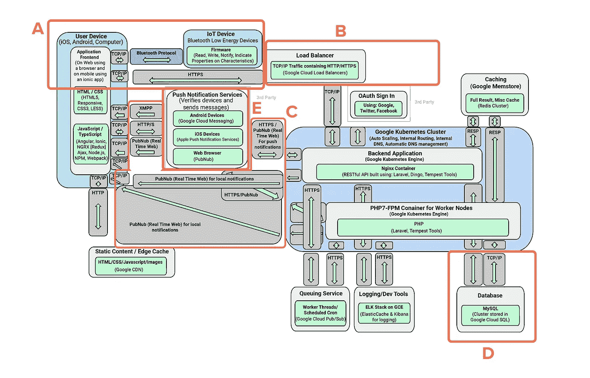
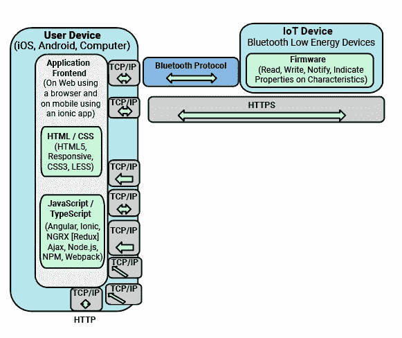
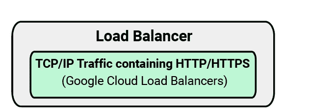
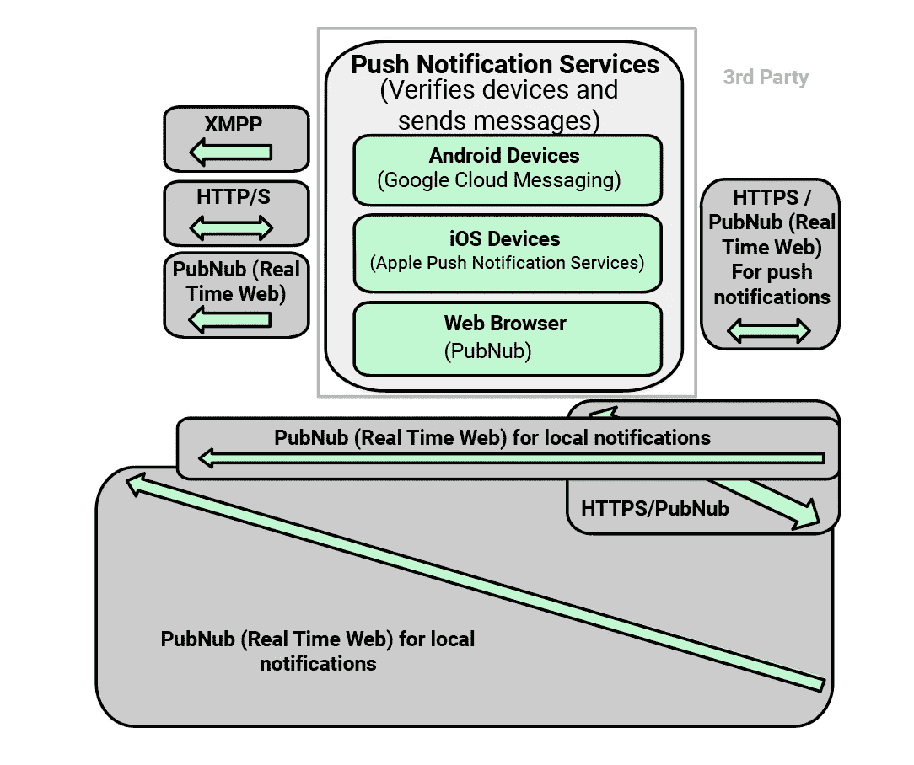
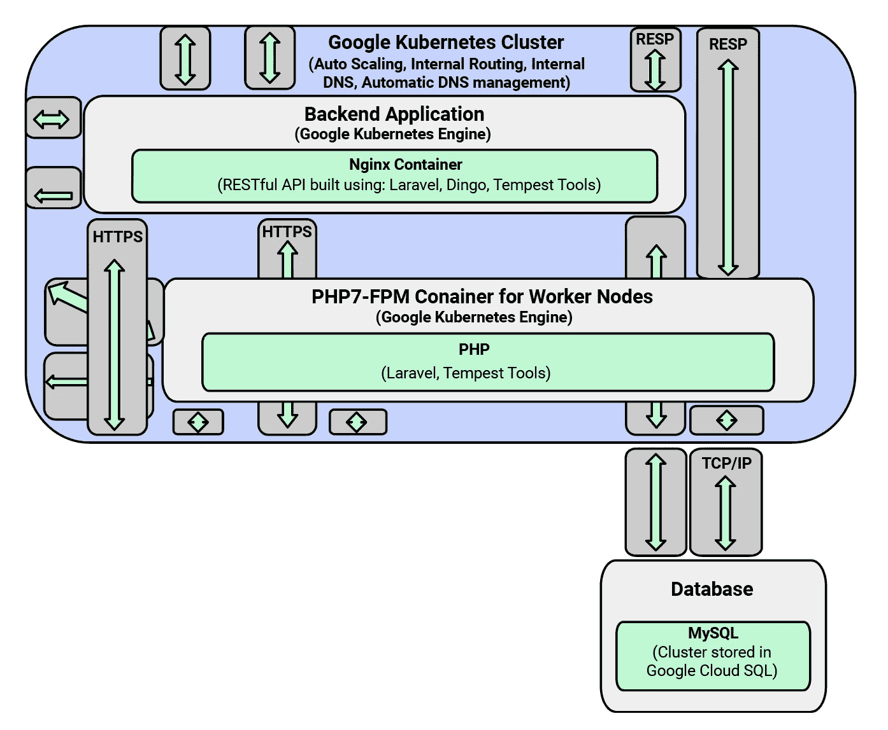
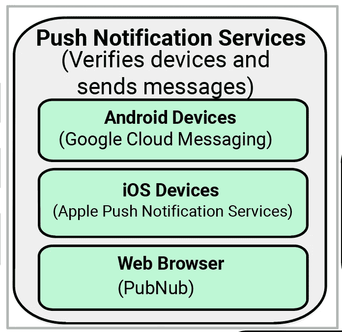

# 如何设计基于 IOT 的应用程序

> 原文：<https://blog.devgenius.io/how-to-architect-iot-based-applications-e5b94ac5d1f?source=collection_archive---------8----------------------->

# 为物联网(IoT)设计产品从根本上不同于为 web 或移动设备设计产品。

在 [Tempest House](https://www.tempest.house/) ，我们已经构建了几十个高质量、可扩展的应用，包括物联网和其他应用。从这些丰富的经验中，我们总结出了构建物联网产品的 7 个技巧(最后还有一个架构示例):

# 1.预计会有大量数据

物联网产品创造了[海量数据](https://blogs.cisco.com/datacenter/internet-of-things-iot-data-continues-to-explode-exponentially-who-is-using-that-data-and-how)。组织数据的方法有很多，最佳设计必然会因具体情况而异。然而，我们选择设计的过程是相对一致的:

首先，我们问:

*   对数据有什么要求？
*   什么需要传递给服务器？

然后，我们与固件架构师密切合作，询问如下问题:

*   他们应该如何组织他们的数据？
*   我们需要多大的速度？(例如，如果理想的格式对于管道来说太大，我们将需要一种简化的方式来传递数据。)

最后，我们编写转换器，将数据转换成我们需要传递给服务器的内容。

一旦有人了解了他们的需求，他们就可以设计出一个甚至可以承受大量数据需求的结构。**在设计这个结构时，最重要的部分是在数据传输架构师、web 架构师和有能力的固件团队之间有清晰的沟通。**

# 2.高质量的固件物有所值

虽然高质量的固件会显著提高设备的功能和可靠性，但低质量的固件会引发各种各样的问题。

高质量的固件是什么样子的？

*   一切都可以读/写。
*   通知写得清晰、有效、高效。
*   所有的安全验证都由移动应用和设备适当地处理。
*   应用程序可以全面了解设备(这对于解决问题和错误尤为重要)。

如何识别低质量的固件？

结构混乱(通常是由于计划不周)。

# 3.沟通是关键

**由于连接是物联网产品的基础，来自物联网设备的通信至关重要。**出于这个原因，我们在我们的标准工具包中构建了一个消息队列，它会一直发送消息，直到收到消息。这个使用 [Redux](https://redux.js.org/) 构建的队列还允许我们标记优先级，以便根据需要动态地重新排序队列，并为失败的请求设置应急措施。因为沟通是如此重要，所以确保每条信息到达预期目的地是非常关键的。

# 4.认识物联网独特的安全威胁

由于物联网设备的连接性和漏洞越来越多，它们具有独特的、更高的危险。 **要消除这些漏洞，遵循行业标准的安全实践将会帮助您走得更远。**这三项实践尤其重要:

## 1.在后端和传递数据时都要加密数据。

有一些[数据加密的最佳实践](https://blog.syncsort.com/2018/09/data-availability/data-encryption-101-guide-best-practices/)…但是大多数人并没有使用它们。然而，如果使用得当，黑客在无法完全访问您的系统的情况下，几乎不可能解密您的数据。

## 2.使用令牌进行身份验证。

在 Tempest House，我们存储加密令牌，以确保我们的前端与我们的后端进行正确的身份验证。就我个人而言，我喜欢 Ionic Identity Vault，因为它可以防止黑客从我们的移动设备上获取令牌。虽然这种安全措施会额外增加一些成本，但在避免违规方面却是无价的。

## 3.与一家公司合作测试你的安全性。

归根结底，我们的安全专家无法独自向客户提供我们推荐的每一项服务。我们为客户构建安全软件，但我们也建议我们的合作公司之一 [EdgeScan](https://www.edgescan.com/) 提供手动和自动渗透测试。他们会检查我们所有的端点，并在发现问题时进一步探查。作为额外的好处，当设备/服务通过测试时，他们会提供安全认证。

# 5.考虑合规性…否则后果不堪设想。

虽然合规性不仅仅是物联网相关的话题，但设备之间增加的通信确实使其变得更加复杂。

GDPR 是目前最复杂的合规问题。每当我们设计一些东西的时候，我们都会走一遍 GDPR 需求的个人清单。这是一份很长的多页文件，但无疑值得花时间。**如果来自欧盟的任何人使用您的应用程序，而您没有遵守 GDPR 的规定，您可能需要承担高达贵公司全球收入 4%的责任** [**。**](https://www.csoonline.com/article/3234685/gdpr-fines-how-much-will-non-compliance-cost-you.html)

# 6.构建可扩展性。

可扩展的产品是公司成功的关键。这对物联网设备来说更加重要，因为[它们的大部分价值来自联网。](https://www.mckinsey.com/~/media/McKinsey/Business%20Functions/McKinsey%20Digital/Our%20Insights/The%20Internet%20of%20Things%20The%20value%20of%20digitizing%20the%20physical%20world/The-Internet-of-things-Mapping-the-value-beyond-the-hype.ashx)

对于可扩展的后端，我们经常使用我们内部开发的 [Tempest 工具、](https://www.tempest.house/tempest-tools/)。它有许多内置功能，可以快速构建后端。

对于一些高负载项目，我们喜欢将 Tempest 工具与已经扩展的后端结合起来，如 [Express](https://expressjs.com/) 或 [Lumen。](https://lumen.laravel.com/)我们确定哪些请求提供大量负载，并使用带有[瘦端点](https://en.wikipedia.org/wiki/Thin_client)的[微服务架构](https://en.wikipedia.org/wiki/Microservices)来平衡负载。

除了以上选项，我们还有开发人员可以用所有流行的编码语言和框架创建后端。我们很清楚使用每一种工具的利弊，所以我们总是会为这项工作推荐最好的工具集。

# 7.考虑应用程序的混合方法

在构建应用程序时，我们更喜欢混合方法(即在应用程序中运行 JavaScript 的虚拟浏览器)。由于 JavaScript 开发人员很多，这种方法允许简单且廉价的开发。它还使每个开发人员的工作可移植，因为相同的代码可以在 Android、iOS 和 web 上工作，只需很少的更改。

这种混合方法确实有其缺点。一些活动——尤其是处理器密集型的活动——在虚拟浏览器中运行太慢。对于这些处理器密集型的情况，我们使用插件架构师来编写本地代码。这是一个大多数公司都不熟悉的技巧，但它允许我们优化电池和 CPU 的使用。

# 示例架构

下面是 Tempest House 通常如何使用混合应用来设计物联网产品:

A.)我们在一个移动应用程序中运行一个虚拟浏览器，该应用程序使用[蓝牙低能耗](https://en.wikipedia.org/wiki/Bluetooth_Low_Energy)与物联网设备来回连接，使用一个在移动设备上本地运行的插件。

B.)在设备与我们的服务器通信之后，我们的负载平衡器找到合适的节点来处理它。

C.)该节点通过 HTTP 或实时消息传递传递响应。(我们喜欢使用 [Pubnub](https://www.pubnub.com/) ，因为它易于设置，节省时间，并且工作可靠，开发成本低)。

D.)后端节点还与缓存和数据库(SQL 或 NoSQL)通信。

E.)此外，如果我们需要向移动设备发送推送通知，我们会通过苹果/安卓消息服务发送。

# 前进

虽然这些提示和例子是我们可以在这里轻松分享的，但它远不是我们所知道的一切。构建物联网产品是一项复杂的工作。

如果你喜欢 IOT，请联系[风暴屋](https://www.tempest.house)的专家！

‍

*原载于*[*https://www . tempest . house*](https://www.tempest.house/blog-posts/how-to-architect-iot-based-apps)*。*