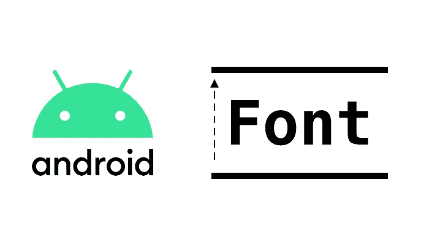
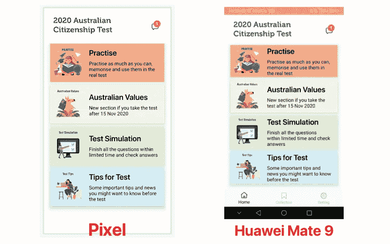
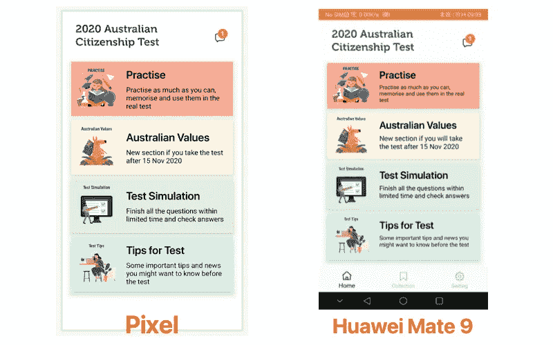

# 如何在 Android 中自动调整文本大小

> 原文：<https://blog.devgenius.io/how-to-auto-just-text-size-in-android-7f5aee37c7f3?source=collection_archive---------4----------------------->



大多数情况下，我们可以将文本显示如下:

```
<TextView
    android:id="@+id/text_question_no"
    android:layout_width="wrap_content"
    android:layout_height="wrap_content"
    android:paddingLeft="10dp"
    android:text="some text"
    android:fontFamily="@font/museo700regular"
    android:textColor="@color/colorSlangBlack"
    android:gravity="center_vertical|left"
    android:textSize="22sp" 
/>
```

`TextView`也会根据文本内容长度自动调整大小。然而，有时我们希望`TextView`是一个固定的区域，文本大小可以根据屏幕的大小来调整。

主屏幕上的 4 个部分显示了一个例子:



正如你所看到的，Pixel 和华为 Mate 9 上的文本显示有点不同。这在其他一些屏幕上可能会更糟。有什么方法可以让我们自动调整不同屏幕上的文本吗？答案是肯定的，有两种方法可以做到这一点。我们可以使用:

*   **textviewcompt:**官方组件来自安卓，但`minSDK should ≥ 26`的**。**
*   **AppCompatTextView** 兼容所有 SDK。有关更多详细信息，请参见以下代码。

# 布局示例:

```
<androidx.appcompat.widget.AppCompatTextView
    android:id="@+id/text_question_no"
    android:layout_width="wrap_content"
    android:layout_height="wrap_content"
    android:paddingLeft="10dp"
    android:text="some text"
    android:fontFamily="@font/museo700regular"
    android:textColor="@color/colorSlangBlack"
    android:gravity="center_vertical|left"
        app:autoSizeMaxTextSize="22sp"
    app:autoSizeMinTextSize="18sp"
    app:autoSizeTextType="uniform"
/>
```

更改后，布局:



瓦拉~如果你喜欢这个故事，请👏👏👏，我会继续分享更多教程。

# 参考

[https://needone.app/how-to-auto-just-text-size-in-android/](https://needone.app/how-to-auto-just-text-size-in-android/)

*原载于 2020 年 10 月 10 日*[*https://needone . app*](https://needone.app/how-to-auto-just-text-size-in-android/)*。*